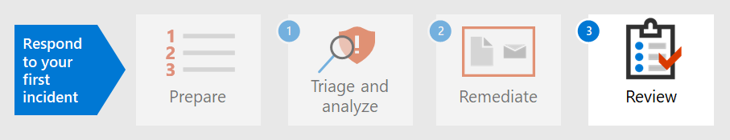

# 步驟 2.Step 2. 修正第一個事件Remediate your first incident

[!INCLUDE [Microsoft 365 Defender rebranding](../includes/microsoft-defender.md)]

**適用於：****Applies to:**
- Microsoft 365 DefenderMicrosoft 365 Defender

Microsoft 365Defender 不僅提供偵測和分析功能，還提供惡意程式碼的包容和 eradication。Microsoft 365 Defender not only provides detection and analysis capabilities but also provides containment and eradication of malware. 包容包含減少攻擊影響的步驟，eradication 可確保從網路中移除攻擊者活動的所有痕跡。Containment includes steps to reduce the impact of the attack while eradication ensures all traces of attacker activity are removed from the network.  Microsoft 365Defender 提供數項修復動作，可根據您的作業系統和攻擊類型設定為[自動修復](m365d-autoir.md)。Microsoft 365 Defender offers several remediation actions which can be configured to [auto-remediate](m365d-autoir.md) depending on your operating system and the attack type.

Microsoft 365Defender 提供數種修正動作，讓分析員可以手動啟動。Microsoft 365 Defender offers several remediation actions that analysts can manually initiate. 動作分為兩類、裝置上的動作和檔案的動作。Actions are separated into two categories, Actions on devices and Actions on files. 某些動作可用於立即停止威脅，其他動作可協助進行進一步的鑒證分析。Some actions can be used to immediately stop the threat while other actions assist in further forensic analysis.

## 裝置上的動作Actions on devices

- **隔離裝置** -此活動會立即封鎖所有網路流量 (internet 和內部) ，以將惡意程式碼傳播降至最低，並允許分析員繼續進行分析，而不會有惡意參與者能夠繼續攻擊。**Isolate the device** - This activity immediately blocks all network traffic (internet and internal) to minimize the spread of malware and allow analysts to continue analysis without a malicious actor being able to continue an attack. 唯一允許的連線是 Microsoft Defender for Identity service cloud，所以 Microsoft Defender 身分識別可以繼續監視裝置。The only connection allowed is to the Microsoft Defender for Identity service cloud so Microsoft Defender for Identity can continue to monitor the device. 
- **限制應用程式執行** -若要限制應用程式的執行，請套用程式碼完整性原則，僅允許檔案以 Microsoft 發行的憑證簽署時執行。**Restrict app execution** - To restrict an application from running, a code integrity policy is applied that only allows files to run if they are signed by a Microsoft-issued certificate. 這種限制方式可協助防止攻擊者控制已受損的裝置，並進一步執行惡意活動。This method of restriction can help prevent an attacker from controlling compromised devices and performing further malicious activities.
- **執行防病毒掃描**-Microsoft Defender 防毒軟體掃描可與其他防病毒解決方案一起執行，不論是否為使用中的防病毒解決方案。**Run Antivirus scan** - A Microsoft Defender Antivirus scan can run alongside other antivirus solutions, whether Defender Antivirus is the active antivirus solution or not. 若其他防病毒廠商產品為主要 endpoint protection 解決方案，您可以在被動模式中執行 Defender 防毒軟體。If another antivirus vendor product is the primary endpoint protection solution, you can run Defender Antivirus in Passive mode.
- **啟動自動調查** -您可以在裝置上啟動新的一般用途自動調查。**Initiate automated investigation** - You can start a new general purpose automated investigation on the device. 在執行調查時，系統會將從裝置產生的任何其他警示新增至進行中的自動調查，直到完成調查為止。While an investigation is running, any other alert generated from the device will be added to an ongoing automated investigation until that investigation is completed. 此外，如果在其他裝置上看到相同威脅，就會將這些裝置新增至調查。In addition, if the same threat is seen on other devices, those devices are added to the investigation.
- **啟動 live response** -live response 是一種可讓您透過遠端命令介面連線立即存取裝置的功能。**Initiate live response** - Live response is a capability that gives you instantaneous access to a device by using a remote shell connection. 這可讓您執行深入調查工作，並立即採取回應動作，及時包含識別威脅。This gives you the ability to do in-depth investigative work and take immediate response actions to promptly contain identified threats in real time. Live response 的設計目的是讓您可以收集法律調查資料、執行腳本、傳送可疑實體以進行分析、修正威脅，以及主動搜尋新興威脅。Live response is designed to enhance investigations by enabling you to collect forensic data, run scripts, send suspicious entities for analysis, remediate threats, and proactively hunt for emerging threats.
- **收集調查套件** -在調查或回應過程中，您可以從裝置收集調查套件。**Collect investigation package** - As part of the investigation or response process, you can collect an investigation package from a device. 透過收集調查套件，您可以識別目前的裝置狀態，並進一步瞭解攻擊者所使用的工具和技術。By collecting the investigation package, you can identify the current state of the device and further understand the tools and techniques used by the attacker. 
- **請參閱威脅專家** (在裝置和檔案) 上的兩個動作皆可使用。您可以參閱 Microsoft 威脅專家，以取得更深入瞭解可能已遭破壞的裝置或裝置。**Consult a threat expert** (available in both Actions on devices and files) - You can consult a Microsoft threat expert for more insights regarding potentially compromised devices or devices that are already compromised. Microsoft 威脅專家可以直接從 Microsoft Defender 資訊安全中心內直接參與，以進行及時且準確的回應。Microsoft threat experts can be engaged directly from within the Microsoft Defender Security Center for a timely and accurate response. 

## 檔上的動作Actions on files

- **停止和隔離** 檔-此動作包括停止執行中的程式、隔離檔案，以及刪除持久性資料，例如任何登錄機碼。**Stop and quarantine file** - This action includes stopping running processes, quarantining files, and deleting persistent data, such as any registry keys. 此巨集指令會在裝置上的 Windows 10，版本1703或更新版本之間生效，在過去30天內觀察到檔案。This action takes effect on devices with Windows 10, version 1703 or later, where the file was observed in the last 30 days. 
- **將指標新增至封鎖或允許** 檔案-透過 banning 潛在的惡意檔案或可疑惡意程式碼，避免進一步傳播您組織中的攻擊。**Add indicators to block or allow file** - Prevent further propagation of an attack in your organization by banning potentially malicious files or suspected malware. 這項作業會使檔案無法在組織中的裝置上讀取、寫入或執行。This operation will prevent the file from being read, written, or executed on devices in your organization.
- **下載或收集** 檔案–這項動作可讓分析員以受密碼保護的 .zip 封存檔下載檔案，以供組織進一步分析。**Download or collect file** – This action allows analysts to download a file in a password protected .zip archive file for further analysis by the organization.
- **深入分析** –此動作會在安全且充分受充分規范的雲端環境中執行檔案。**Deep analysis** – This action executes a file in a secure, fully instrumented cloud environment. 深入分析結果會顯示檔案的活動、觀測的行為和相關聯的專案，例如：刪除的檔案、登錄修改以及與 IP 位址的通訊。Deep analysis results show the file's activities, observed behaviors, and associated artifacts, such as dropped files, registry modifications, and communication with IP addresses. 

繼續執行偵測 [、會審及分析事件](first-incident-analyze.md#analyze-your-first-incident)中的範例，分析人員可以利用下列動作來修正此事件：Continuing the example in [Detect, triage, and analyze incidents](first-incident-analyze.md#analyze-your-first-incident), an analyst can remediate this incident with these actions:

1. 立即重設使用者帳戶密碼Immediately reset the user account password
2. 隔離 Microsoft 365 Defender 中的裝置，直到深入分析完成Isolate the device in Microsoft 365 Defender until deep analysis is complete
3. 確定惡意檔案已從 SharePoint 隔離Ensure the malicious file was quarantined from SharePoint
4. 檢查惡意軟體所影響的端點Check which endpoints were affected by malware
5. 重建系統Rebuild systems
6. 檢查其他使用者的類似 Microsoft Cloud App Security 警示Check for similar Microsoft Cloud App Security alerts for other users
7. 在 Microsoft Defender for Endpoint 中建立自訂指示器，以封鎖 Tor IP 位址Create a custom indicator in Microsoft Defender for Endpoint to block a Tor IP address
8. 在 Microsoft Cloud App Security 中為這類警示（如下列影像所示）建立管理動作：Create a governance action in Microsoft Cloud App Security for this type of alert such as those shown in the following image:

   :::image type="content" source="../../media/first-incident-remediate/first-incident-mcas-governance.png" alt-text="Microsoft Cloud App Security 入口網站中的管理動作範例"::: 
 
在 Microsoft 365 Defender 中，您可以套用及追蹤大部分的修復動作。Most of the remediation actions can be applied and tracked in Microsoft 365 Defender. 

## 使用行動手冊Using Playbooks

此外，您可以使用行動手冊建立自動修復。In addition, automated remediation can be created using playbooks. 目前，Microsoft[在 GitHub 上的行動手冊範本](https://github.com/microsoft/Microsoft-Cloud-App-Security/tree/master/Playbooks)可提供下列案例的行動手冊：Currently, Microsoft has [Playbook templates on GitHub](https://github.com/microsoft/Microsoft-Cloud-App-Security/tree/master/Playbooks) that provide playbooks for the following scenarios:

- 在要求使用者驗證之後移除敏感檔案共用Remove sensitive file sharing after requesting user validation
- 自動會審非常見國家警示Auto-triage infrequent country alerts
- 停用帳戶之前要求管理員執行的動作Request for manager action before disabling an account
- 停用惡意的收件匣規則Disable malicious inbox rules

行動手冊使用 Power Automate 建立自訂自動程式自動化流程，以在觸發特定準則之後，自動執行某些動作。Playbooks use Power Automate to create custom robotic process automation flows to automate certain activities once specific criteria have been triggered. 組織可以從現有的範本或從頭開始建立行動手冊。Organizations can create playbooks either from existing templates or from scratch. 

以下為範例。Here's an example.
 
:::image type="content" source="../../media/first-incident-remediate/first-incident-power-automate.png" alt-text="Power Automate 自訂自動進程自動化流程的範例"::: 
 
行動手冊也可在 [後續事件檢查](first-incident-post.md) 期間建立，以從事件建立修正動作，以加快修正動作的速度。Playbooks can also be created during [post-incident review](first-incident-post.md) to create remediation actions from incidents for faster remediation actions. 

## 下一步Next step

瞭解如何對 [事件執行後續事件複查](first-incident-post.md)。Learn how to [perform a post-incident review of an incident](first-incident-post.md).

## 請參閱See also

- [事件概觀Incidents overview](incidents-overview.md)
- [調查事件Investigate incidents](investigate-incidents.md)
- [管理事件Manage incidents](manage-incidents.md)
