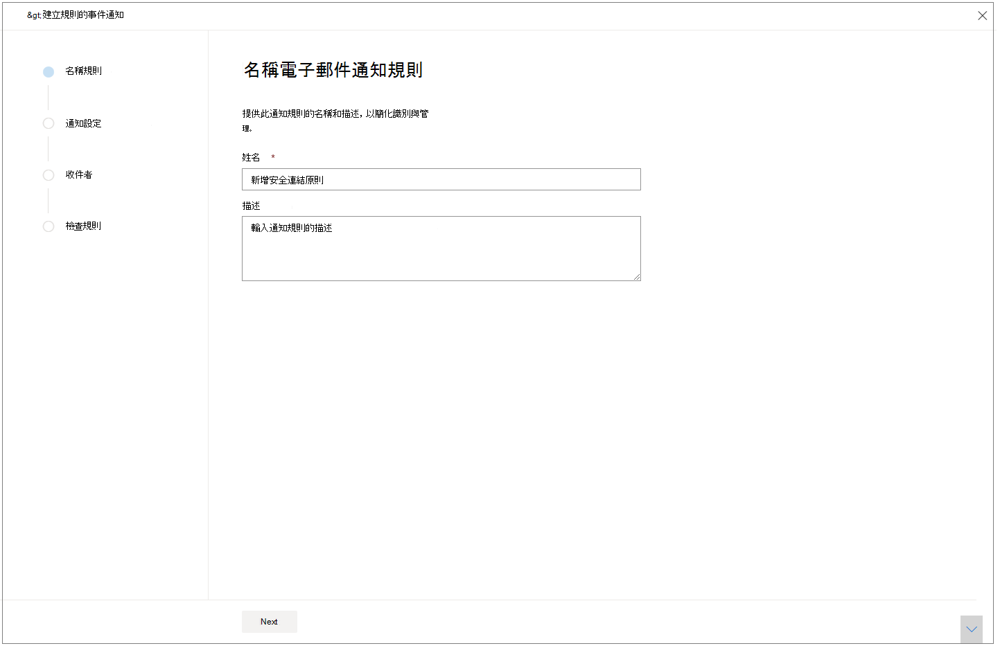
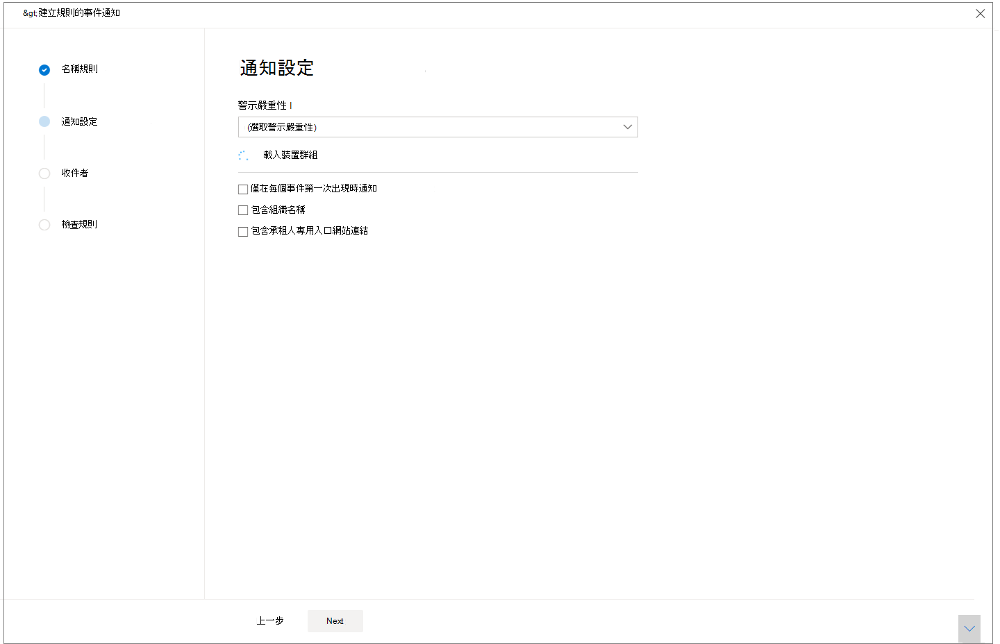
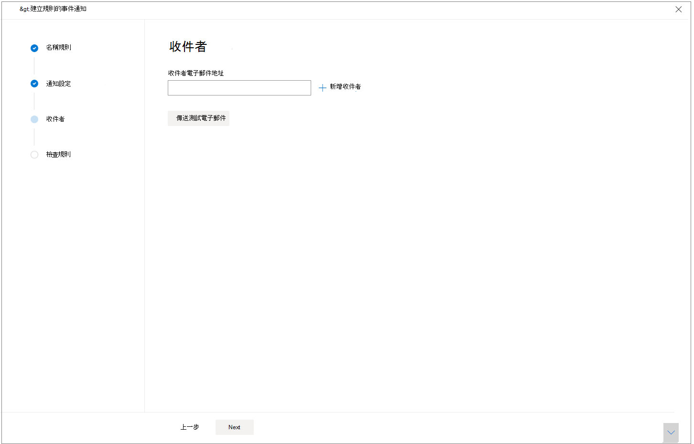

# 透過電子郵件取得事件通知

[!INCLUDE [Microsoft 365 Defender rebranding](../includes/microsoft-defender.md)]

**適用於：**
- Microsoft 365 Defender

您可以設定 Microsoft 365 Defender 以透過電子郵件通知您每次現有的事件發生新的事件或新的更新。 

您可以選擇根據事件嚴重性或設備群組來取得通知。 您也可以選擇只在每個事件第一個更新時取得通知。

您可以在電子郵件通知中新增或移除收件者。 新增的收件者會在新增事件後收到相關通知。 

電子郵件通知包含有關事件的重要詳細資料，例如事件名稱、嚴重性和類別，以及其他。 您也可以直接移至 [事件]，以便立即開始調查。 如需調查事件的詳細資訊，請參閱 [調查 Microsoft 365 Defender 中的事件](./investigate-incidents.md)。

>[!NOTE]
>您必須具有「管理安全性設定」許可權，才可設定電子郵件通知設定。 如果您已選擇使用基本版權管理，具有安全性管理員或全域系統管理員角色的使用者便可為您設定電子郵件通知。    
同樣地，如果您的組織使用角色型存取控制 (RBAC) ，您可以根據允許管理的裝置群組，只建立、編輯、刪除和接收通知。

## 建立事件通知的規則

若要設定第一筆電子郵件通知的事件，請建立新的規則，並自訂電子郵件通知設定。

1. 在功能窗格中，選取 [**設定**  >  **事件的電子郵件通知**]。
2. 選取 [ **新增專案**]。
3. 在 [ **名稱** ] 中為規則命名，並提供 **描述**。

     
4. 選取 **[下一步]** 移至 [ **通知設定**]。 您可以在這裡指定：
    - **警示嚴重性** -選擇會觸發事件通知的警示嚴重性。 例如，如果您只想知道高嚴重性事件，請選取 [高]。
    - **裝置群組範圍** -此下拉式清單顯示使用者可以存取的所有裝置群組。 選取您要為其建立事件通知規則的裝置群組。
    - **僅在每個事件第一次發生時發出通知** -選取此選項只會在第一個符合其他選擇的警示上傳送電子郵件通知。 稍後與該事件相關的更新或警示將不會觸發通知。
    - **包含組織名稱** -指出客戶名稱是否會出現在電子郵件通知中。
    - **包含租使用者專用的入口網站連結** -新增具有租使用者識別碼的連結，以允許存取特定租使用者。
    
    
5. 選取 **[下一步]** 移至 [收件者]**區段。** 在這裡，您可以指定會收到事件電子郵件通知的電子郵件地址。 在輸入每個電子郵件地址後，選取 [ **新增收件** 者]。

     

6. 最後，選取 **[下一步]** 以 **查看規則** ，這樣您就能看到與新規則相關聯的所有設定。 收件者會開始透過電子郵件以設定為基礎來接收事件通知。

## 另請參閱
- [Microsoft 365 Defender 中的事件概述](./incidents-overview.md)
- [設定 Microsoft 365 Defender 中的事件優先順序](./incident-queue.md)
- [調查 Microsoft 365 Defender 中的事件](./investigate-incidents.md)
