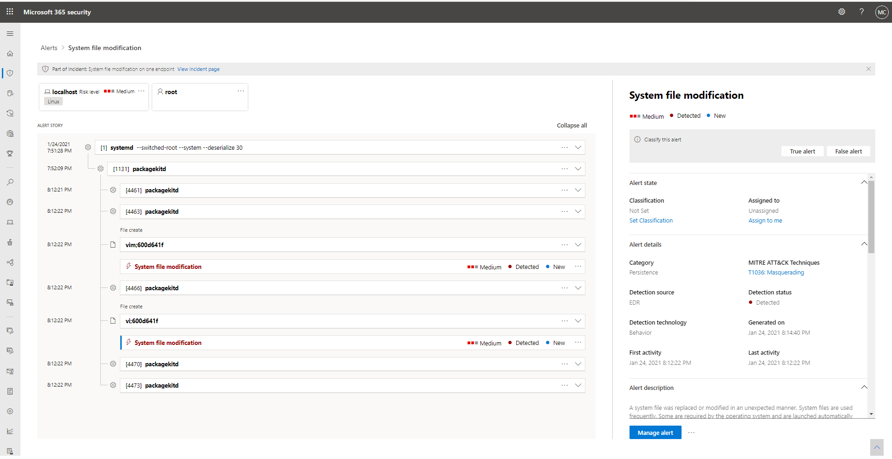

# 調查 Microsoft 365 Defender 中的警示Investigate alerts in Microsoft 365 Defender

[!INCLUDE [Microsoft 365 Defender rebranding](../includes/microsoft-defender.md)]

**適用於：****Applies to:**
- Microsoft 365 DefenderMicrosoft 365 Defender

提醒是指所有的事件，並指出您環境中發生惡意或可疑事件的基礎。Alerts are the basis of all incidents and indicate the occurrence of malicious or suspicious events in your environment. 警示通常是廣泛攻擊的一部分，並提供有關事件的線索。Alerts are typically part of a broader attack and provide pieces of clues about an incident.

在 Microsoft 365 Defender 中，相關的警示會彙集在一起，以形成事件。In Microsoft 365 Defender, related alerts are aggregated together to form incidents. 事件一定會提供更廣泛的攻擊內容，但是在需要深入分析時，調查警示會非常有用。Incidents will always provide the broader context of an attack, however, investigating alerts can be valuable when deeper analysis is required. 

## 使用調查中的警示頁面Using alert pages in investigations

在任何事件頁面的 [警示] 索引標籤中，選取警示可將您帶入個別警示頁面。From the Alerts tab of any incident page, selecting an alert brings you to the individual alert pages. 警示頁面包含三個區段：受影響的資產、警示案例及詳細資料窗格。An alert page is composed of three sections: affected assets, alert story, and the details pane.

在 [提醒] 頁面中，您可以選取任何實體旁邊的三個點圖示 () **...** ，這樣您就能看到可用的動作，例如開啟特定資產頁面或執行特定的修復步驟。Throughout an alert page, you can select the three-dot icon (**...**) beside any entity so you can see available actions like opening the specific asset page or doing specific remediation steps.

### 分析受影響的資產Analyze affected assets
「受影響的資產」區段會列出受此警示影響的信箱、裝置和使用者。The affected assets section lists mailboxes, devices, and users affected by this alert. 選取任何資產卡片都會以資訊顯示詳細資料側窗格，包括有關資產的其他警示（如果有的話）。Selecting any of the asset cards populates the details side pane with information, including other alerts that occurred involving the assets, if any.

### 追蹤警示案例中的警示角色Trace an alert's role in the alert story
警示案例會在處理樹狀檢視中顯示與警示相關的所有資產或實體。The alert story displays all assets or entities related to the alert in a process tree view. 當您第一次在選取的警示頁面上移動時，標題中的警示會是焦點。The alert in the title is the one in focus when you first land on your selected alert's page. 提醒文章中的資產可展開和按一下。Assets in the alert story are expandable and clickable. 它們可讓您在警示頁面的內容中採取行動，以提供額外的資訊並加速回應。They provide additional information and expedite response by allowing you to take actions right in the context of the alert page. 

> [!NOTE]
> 「警示案例」區段中可能會包含一個以上的警示，在您所選取的警示之前或之後，會顯示與相同執行樹狀目錄相關的其他警示。The alert story section may contain more than one alert, with additional alerts related to the same execution tree appearing before or after the alert you've selected.

### 在詳細資料窗格中查看更多警示資訊View more alert information in the details pane

[詳細資料] 窗格會先顯示選取警示的詳細資料，以及與其相關聯的詳細資料和動作。The details pane shows the details of the selected alert at first, with details and actions related to it. 如果您選取預警案例中的任何受影響的資產或實體，詳細資料窗格會變更，以提供所選物件的上下文資訊和動作。If you select any of the affected assets or entities in the alert story, the details pane changes to provide contextual information and actions for the selected object.

當您選取相關實體時，[詳細資料] 窗格會變更，以顯示所選實體類型的相關資訊、可用的歷史資訊，以及直接從 [警示] 頁面採取動作的選項。Once you've selected an entity of interest, the details pane changes to display information about the selected entity type, historic information when it's available, and options to take action on this entity directly from the alert page.

### 管理警示Manage alerts

當您完成調查提醒後，您可以回到您已開始的警示，將警示的狀態標示為 [已解決]，然後將其歸類為「錯誤警示」或「True 警示」。Once you're done investigating the alerts, you can go back to the alert you started with, mark the alert's status as Resolved and classify it as either a False alert or True alert. 分類提醒可協助調整您的產品，以提供更真實的警示及不太虛假的提醒。Classifying alerts helps tune your product to provide more true alerts and less false alerts.

> [!NOTE]
> 透過使用標記來管理提醒的一種方式。One way of managing alerts it through the use of tags. Microsoft Defender for Office 365 的標記功能會逐漸推出，而且目前在預覽中。The tagging capability for Microsoft Defender for Office 365 in incrementally being rolled out and is currently in preview.  
> 目前，已修改的標籤名稱只會套用至更新 *後* 所建立的警示。Currently, modified tag names are only applied to alerts created *after* the update. 修改之前產生的警示不會反映已更新的標記名稱。Alerts that were generated prior to the modification will not reflect the updated tag name. 

## 管理整合的提醒佇列Manage the unified alert queue

在 [事件] 下選取 [Microsoft 365 安全性中心] 導覽窗格中的警示 & 警示會帶您前往整合提醒佇列。Selecting Alerts under Incidents & Alerts in the Microsoft 365 security center navigation pane brings you to the unified alert queue. 來自不同 Microsoft security 解決方案（如 Microsoft Defender for Endpoint、Microsoft Defender for Office 365 及 Microsoft 365 Defender）的警示會顯示在此區段中。Alerts from different Microsoft security solutions like Microsoft Defender for Endpoint, Microsoft Defender for Office 365, and Microsoft 365 Defender appear in this section. 

![[範例警示] 頁面的圖像](../../media/unified-alert-queue.png)

[警示] 佇列顯示網路中已標示的警示清單。The Alerts queue shows a list of alerts that were flagged in your network. 根據預設，佇列會顯示過去30天內看到的警示。By default, the queue displays alerts seen in the last 30 days. 最新的警示會顯示在清單的頂端，可協助您先看到最近的警示。The most recent alerts are shown at the top of the list helping you see the most recent alerts first.

> [!NOTE]
> 在啟動時，[整合的提醒] 佇列只會有7天的 Microsoft Defender for Office 365 的可用警示。At the time of launch, the unified alerts queue will only have 7 days’ worth of Microsoft Defender for Office 365 alerts available. 佇列將繼續隨著時間建立。The queue will continue to build over time. 如果您需要在啟動 [整合提醒] 佇列之前，對提醒進行分類，請使用 [安全性與合規性中心](https://protection.office.com/viewalerts)中的 [警示] 佇列。If you need to triage alerts prior to the launch of the unified alerts queue, use the alerts queue in the [Security and Compliance Center](https://protection.office.com/viewalerts).

在上方導覽中，您可以：On the top navigation, you can:

- 套用篩選Apply filters
- 自訂欄以新增或移除欄Customize columns to add or remove columns
- 匯出資料Export data

您也可以根據不同的準則來篩選警示：You can also filter alerts according to different criteria:

- 嚴重性Severity
- 狀態Status
- 類別Category
- 偵測來源Detection source
- 原則Policy
- 受影響資產Impacted assets
- 第一個活動First activity
- 最後一個活動Last activity

若要開始調查事件，請參閱[Microsoft 365 Defender 中的調查事件](investigate-incidents.md)。To start an investigation on an incident, read [Investigate incidents in Microsoft 365 Defender](investigate-incidents.md)
## 另請參閱See also

- [事件概觀Incidents overview](incidents-overview.md)
- [調查事件Investigate incidents](investigate-incidents.md)
- [管理事件Manage incidents](manage-incidents.md)
