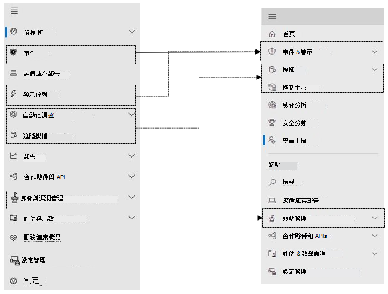

# Microsoft 365 security center 中的 Microsoft Defender for EndpointMicrosoft Defender for Endpoint in the Microsoft 365 security center

[!INCLUDE [Microsoft 365 Defender rebranding](../includes/microsoft-defender.md)]

**適用於：****Applies to:**

- [Microsoft 365 DefenderMicrosoft 365 Defender](microsoft-365-defender.md)
- [適用於端點的 Microsoft DefenderMicrosoft Defender for Endpoint](https://go.microsoft.com/fwlink/p/?linkid=2154037)
- [適用於 Office 365 的 Microsoft DefenderMicrosoft Defender for Office 365](/microsoft-365/security/office-365-security/defender-for-office-365)

## 快速參考Quick reference

下圖列出在 Microsoft Defender 資訊安全中心和 Microsoft 365 安全中心之間的導覽變更。The image and the table below lists the changes in navigation between the Microsoft Defender Security Center and the Microsoft 365 security center.

> [!div class="mx-imgBorder"]
> 

| Microsoft Defender 資訊安全中心Microsoft Defender Security Center | Microsoft 365 安全性中心Microsoft 365 security center |
|---------|---------|
| 儀錶 板Dashboards <ul><li>安全性作業Security Operations</li><li>威脅分析Threat Analytics</li></ul>  |首頁Home <ul><li>威脅分析Threat analytics</li></ul>   |
| 事件Incidents | 事件 & 警示Incidents & alerts |
| 裝置清單Device inventory | 裝置清單Device inventory |
| 警示佇列Alerts queue | 事件 & 警示Incidents & alerts |
| 自動化調查Automated investigations | 控制中心Action center |
| 進階搜捕Advanced hunting | 搜捕Hunting |
| 報告Reports | 報告Reports |
| 合作夥伴 & APIsPartners & APIs | 合作夥伴 & APIsPartners & APIs |
| 威脅 & 弱點管理Threat & Vulnerability Management | 弱點管理Vulnerability management |
| 評估與示教Evaluation and tutorials | 評估 & 教學課程Evaluation & tutorials |
| 設定管理Configuration management | 設定管理Configuration management |
| 設定Settings | 設定Settings | 

改良的[Microsoft 365 安全性中心](overview-security-center.md) [https://security.microsoft.com](https://security.microsoft.com) 結合了保護、偵測、調查和回應電子郵件、共同作業、身分識別及裝置威脅的安全性功能。The improved [Microsoft 365 security center](overview-security-center.md) at [https://security.microsoft.com](https://security.microsoft.com) combines security capabilities that protect, detect, investigate, and respond to email, collaboration, identity, and device threats. 此安全中心會將現有 Microsoft 安全性入口網站的功能彙集在一起，包括 Microsoft Defender 資訊安全中心和 Office 365 安全性 & 規範中心。This security center brings together functionality from existing Microsoft security portals, including Microsoft Defender Security Center and the Office 365 Security & Compliance center.

如果您熟悉 Microsoft Defender 資訊安全中心，本文會協助說明改進的 Microsoft 365 安全性中心的一些變更與改進。If you're familiar with the Microsoft Defender Security Center, this article helps describe some of the changes and improvements in the improved Microsoft 365 security center. 不過，有一些新的和更新的元素需要注意。However there are some new and updated elements to be aware of.

從過去開始， [Microsoft Defender 資訊安全中心](/windows/security/threat-protection/microsoft-defender-atp/portal-overview)是 Microsoft Defender for Endpoint 的主版。Historically, the [Microsoft Defender Security Center](/windows/security/threat-protection/microsoft-defender-atp/portal-overview) has been the home for Microsoft Defender for Endpoint. Enterprise 安全小組已使用它監視及協助回應潛在的持續威脅活動或資料違例的警示。Enterprise security teams have used it to monitor and help responding to alerts of potential advanced persistent threat activity or data breaches. 為了協助減少入口網站數目，Microsoft 365 的安全性中心會在您的 Microsoft 身分識別、資料、裝置、應用程式和基礎結構之間進行監視和管理安全性的家鄉。To help reduce the number of portals, the Microsoft 365 security center will be the home for monitoring and managing security across your Microsoft identities, data, devices, apps, and infrastructure.

Microsoft 365 security center 中的 Microsoft Defender for Endpoint[可將受管理的安全性服務提供者 (MSSPs) 的存取](/windows/security/threat-protection/microsoft-defender-atp/grant-mssp-access)權[授與 Microsoft defender security center](mssp-access.md)中的相同存取方式。Microsoft Defender for Endpoint in the Microsoft 365 security center supports [granting access to managed security service providers (MSSPs)](/windows/security/threat-protection/microsoft-defender-atp/grant-mssp-access) in the same way [access is granted in the Microsoft Defender security center](mssp-access.md).

> [!IMPORTANT]
> 您在「Microsoft 365 安全性中心」所看到的專案取決於您目前的訂閱。What you see in the Microsoft 365 security center depends on your current subscriptions. 例如，如果您沒有用於 Office 365 的 Microsoft Defender 授權，則不會顯示電子郵件 & 協同作業區段。For example, if you don't have a license for Microsoft Defender for Office 365, then the Email & Collaboration section will not be shown.

>[!Note]
>無法使用新的整合入口網站：The new unified portal is not available for:
>- 我們政府社群雲端 (GCC) US Government Community Cloud (GCC)
>- GCC 高) ，我們政府社群雲端高 (US Government Community Cloud High (GCC High)
>- 美國國防部US Department of Defense
>- 具有商業授權的所有美國政府機構All US government institutions with commercial licenses

請參閱改良的 Microsoft 365 安全性中心： [https://security.microsoft.com](https://security.microsoft.com) 。Take a look at the improved Microsoft 365 security center: [https://security.microsoft.com](https://security.microsoft.com).

深入了解優點：[Microsoft 365 安全性中心的概觀](overview-security-center.md)Learn more about the benefits: [Overview of the Microsoft 365 security center](overview-security-center.md)

## 變更的項目What's changed

此表格是 Microsoft Defender 資訊安全中心與 Microsoft 365 安全中心之間的變更的快速參考。This table is a quick reference of the changes between the Microsoft Defender Security Center and the Microsoft 365 security center.

### 警示和動作Alerts and actions

| 區域Area | 變更描述Description of change |
|---------|---------|
| [事件 & 警示Incidents & alerts](incidents-overview.md)  | 在 Microsoft 365 的安全性中心內，您可以管理所有端點、電子郵件及身分識別的事件和警示。In the Microsoft 365 security center, you can manage incidents and alerts across all of your endpoints, email, and identities. 我們已融合經驗，以協助您更輕鬆地找到相關的事件。We've converged the experience to help you find related events more easily. 如需詳細資訊，請參閱 [事件概述](incidents-overview.md)。For more information, see [Incidents Overview](incidents-overview.md).   |
| [搜捕Hunting](advanced-hunting-overview.md)  |  修改在 Microsoft Defender for Endpoint 中建立的自訂偵測規則，以包含身分識別和電子郵件表格，會自動將其移至 Microsoft 365 Defender。Modifying custom detection rules created in Microsoft Defender for Endpoint to include identity and email tables automatically moves them to Microsoft 365 Defender. 其對應的提醒也會出現在 Microsoft 365 Defender 中。Their corresponding alerts will also appear in Microsoft 365 Defender. 如需這些變更的詳細資訊，請參閱 [遷移自訂偵測規則](advanced-hunting-migrate-from-mde.md#migrate-custom-detection-rules)。For more details about these changes, read [Migrate custom detection rules](advanced-hunting-migrate-from-mde.md#migrate-custom-detection-rules).   `DeviceAlertEvents`Microsoft 365 Defender 中無法使用「高級搜尋」表格。The `DeviceAlertEvents` table for advanced hunting isn't available in Microsoft 365 Defender. 若要在 Microsoft 365 Defender 中查詢裝置特有的警示資訊，您可以使用 `AlertInfo` 和 `AlertEvidence` 表格來從一組不同的來源取得更多資訊。To query device-specific alert information in Microsoft 365 Defender, you can use the `AlertInfo` and `AlertEvidence` tables to accommodate even more information from a diverse set of sources. 在不 DeviceAlertEvents 的情況下，使用 [寫入查詢](advanced-hunting-migrate-from-mde.md#write-queries-without-devicealertevents)製作下一個裝置相關的查詢。Craft your next device-related query by following [Write queries without DeviceAlertEvents](advanced-hunting-migrate-from-mde.md#write-queries-without-devicealertevents).|
|[控制中心Action center](m365d-action-center.md)    | 列出遵循自動調查和修正動作所採取的擱置及已完成動作。Lists pending and completed actions that were taken following automated investigations and remediation actions. 先前，Microsoft Defender 資訊安全中心中的行動中心是針對裝置上所執行的修復動作和已完成的動作列出，而且自動調查會列出警示和狀態。Formerly, the Action center in the Microsoft Defender Security Center listed pending and completed actions for remediation actions taken on devices only, while Automated investigations listed alerts and status. 在 [改進的 Microsoft 365 安全性中心] 中，行動中心會將修正動作和調查集中在電子郵件、裝置和使用者上，全部都位於一個位置。In the  improved Microsoft 365 security center, the Action center brings together remediation actions and investigations across email, devices, and users—all in one location.  |
| [威脅分析Threat analytics](threat-analytics.md) |  移至導覽列的頂端，以方便探索和使用。Moved to the top of the navigation bar for easier discovery and use. 現在包括端點的威脅資訊，以及電子郵件與共同作業。Now includes threat information for both endpoints and email and collaboration.    |

### 端點Endpoints

| 區域Area | 變更描述Description of change |
|---------|---------|
|搜尋Search   |  而不是在標題中，Microsoft Defender for Endpoint 搜尋列會在 [端點] 區段下移動。Instead of being in the heading, Microsoft Defender for Endpoint search bar is moving under the Endpoints section. 您可以繼續搜尋裝置、檔案、使用者、URLs、IPs、弱點、軟體及建議。You can continue to search for devices, files, users, URLs, IPs, vulnerabilities, software, and recommendations.  |
|[儀表板Dashboard](/windows/security/threat-protection/microsoft-defender-atp/security-operations-dashboard)   |  這是您的安全性運作儀表板。This is your security operations dashboard. 查看已觸發的主動警示數目、哪些裝置面臨危險、哪些使用者有危險，以及警示、裝置和使用者的嚴重性層級。See an overview of how many active alerts were triggered, which devices are at risk, which users are at risk, and severity level for alerts, devices, and users. 您也可以查看任何裝置是否有感應器問題、整體服務健康情況，以及偵測到任何未解析之警示的方式。You can also see if any devices have sensor issues, your overall service health, and how any unresolved alerts were detected. |
|裝置清單Device inventory | 無變更。No changes. |
|[弱點管理Vulnerability management](/windows/security/threat-protection/microsoft-defender-atp/next-gen-threat-and-vuln-mgt)    |    名稱已縮短，可放入功能窗格中。Name was shortened to fit in the navigation pane. 其與威脅與弱點管理區段相同，所有頁面都位於下方。It's the same as the threat and vulnerability management section, with all the pages underneath.     |
| 合作夥伴和 APIsPartners and APIs | 無變更。No changes. |
| 評估 & 教學課程Evaluations & tutorials    |     新的測試和學習功能。New testing and learning capabilities.     |
| 設定管理Configuration management   |  無變更。No changes.  |

> [!NOTE]
> **自動調查和修正** 現在是事件的一部分。**Automatic investigation and remediation** is now a part of  incidents. 您可以在 [ **事件 > 調查** ] 索引標籤中查看自動調查和修正事件。You can see Automated  investigation and remediation events in the **Incident > Investigation** tab.

> [!TIP]
> 裝置搜尋會從端點 > 搜尋中完成。Device search is done from Endpoints > Search.

### 存取與報告Access and reporting

| 區域Area | 變更描述Description of change |
|---------|---------|
| 報告Reports  | 請參閱報告中的端點和電子郵件 & 共同作業，包括威脅防護、裝置健康情況和合規性，以及易受攻擊的裝置。See reports for endpoints and email & collaboration, including Threat protection, Device health and compliance, and Vulnerable devices. |
| 健康情況Health  |  目前[Microsoft 365 系統管理中心](https://admin.microsoft.com/)的「服務健康情況」頁面連結。Currently links out to the "Service health" page in the [Microsoft 365 admin center](https://admin.microsoft.com/). |
| 設定Settings |  管理 Microsoft 365 安全性中心的設定、Microsoft 365 Defender、端點、電子郵件 & 共同作業、身分識別及裝置探索。Manage your settings for the Microsoft 365 security center, Microsoft 365 Defender, Endpoints, Email & collaboration, Identities, and Device discovery.   |

## Microsoft 365 安全性導覽和功能Microsoft 365 security navigation and capabilities

左側瀏覽或快速啟動列看起來會很熟悉。The left navigation, or quick launch bar, will look familiar. 不過，此安全性中心有一些新的和更新的元素。However, there are some new and updated elements in this security center.

### 事件和警示Incidents and alerts

將橫跨電子郵件、裝置和身分識別的事件和警示管理結合在一起。Brings together incident and alert management across your email, devices, and identities. 警示頁面會將攻擊信號結合在一起，以建立警示的完整內容。The alert page provides full context to the alert by combining attack signals to construct a detailed story. 全新、整合的體驗現在將不同工作負載的警示結合在一致的檢視中。A new, unified experience now brings together a consistent view of alerts across workloads. 您可以快速分類、調查並採取有效動作。You can quickly triage, investigate, and take effective action.

- [深入了解事件Learn more about incidents](incidents-overview.md)
- [深入了解管理警示Learn more about managing alerts](investigate-alerts.md)

### 搜捕Hunting

使用[進階搜捕查詢](advanced-hunting-overview.md)來主動搜尋端點、Office 365 信箱等的威脅、惡意程式碼和惡意活動。Proactively search for threats, malware, and malicious activity across your endpoints, Office 365 mailboxes, and more by using [advanced hunting queries](advanced-hunting-overview.md). 這些功能強大的查詢可用於尋找及審閱已知和潛在威脅的威脅指示器和實體。These powerful queries can be used to locate and review threat indicators and entities for both known and potential threats.

[自訂偵測規則](custom-detection-rules.md) 可以從先進的搜尋查詢中建立，以協助您主動留意可能表示遭到破壞活動和配置錯誤裝置的事件。[Custom detection rules](custom-detection-rules.md) can be built from advanced hunting queries to help you proactively watch for events that might be indicative of breach activity and misconfigured devices.

### 控制中心Action center

控制中心會顯示已由自動化調查及回應功能所建立的調查。Action center shows you the investigations created by automated investigation and response capabilities. Microsoft 365 Defender 中的這個自動化、自我修復功能會透過自動回應特定事件來協助安全性小組。This automated, self-healing in Microsoft 365 Defender can help security teams by automatically responding to specific events.

[深入瞭解行動中心](m365d-action-center.md)。[Learn more about the Action center](m365d-action-center.md).

### 威脅分析Threat Analytics

從專業的 Microsoft 安全性研究工具取得威脅情報。Get threat intelligence from expert Microsoft security researchers. 威脅分析可協助安全性小組在面對新興威脅時更有效率。Threat Analytics helps security teams be more efficient when facing emerging threats. 威脅分析包括：Threat Analytics includes:

- 適用於 Office 365 的 Microsoft Defender 的電子郵件相關偵測和緩和措施。Email-related detections and mitigations from Microsoft Defender for Office 365. 這是已可透過適用於端點的 Microsoft Defender 取得的端點資料的增加項目。This is in addition to the endpoint data already available from Microsoft Defender for Endpoint.
- 與威脅相關的事件檢視。Incidents view related to the threats.
- 用於快速識別及使用報告中可採取動作資訊的增強體驗。Enhanced experience for quickly identifying and using actionable information in the reports.

您可以從 Microsoft 365 security center 的左上方導覽列中存取威脅分析，或是從顯示組織之主要威脅的專用儀表板卡存取。You can access threat analytics either from the upper left navigation bar in the Microsoft 365 security center, or from a dedicated dashboard card that shows the top threats for your organization.

深入瞭解如何 [使用威脅分析追蹤和回應新興威脅](./threat-analytics.md)。Learn more about how to [track and respond to emerging threats with threat analytics](./threat-analytics.md).

### 端點區段Endpoints section

查看和管理組織中端點的安全性。View and manage the security of endpoints in your organization. 如果您已使用 Microsoft Defender 資訊安全中心，它看起來會很熟悉。If you've used the Microsoft Defender Security Center, it will look familiar.

### 存取與報告Access and reports

檢視報告、變更您的設定，以及修改使用者角色。View reports, change your settings, and modify user roles.

### SIEM API 連接SIEM API connections

如果您使用 [Defender For ENDPOINT SIEM API](../defender-endpoint/enable-siem-integration.md)，您可以繼續執行。If you use the [Defender for Endpoint SIEM API](../defender-endpoint/enable-siem-integration.md), you can continue to do so. 我們已在 API 負載上新增連結，指向 [警示] 頁面或 Microsoft 365 安全性入口網站中的 [事件] 頁面。We’ve added new links on the API payload that point to the alert page or the incident page in the Microsoft 365 security portal. 新的 API 欄位包括 LinkToMTP 及 IncidentLinkToMTP。New API fields include LinkToMTP and IncidentLinkToMTP. 如需詳細資訊，請參閱重新導向[從 Microsoft Defender to Endpoint to to the Microsoft 365 security center 的帳戶](./microsoft-365-security-mde-redirection.md)。For more information, see [Redirecting accounts from Microsoft Defender for Endpoint to the Microsoft 365 security center](./microsoft-365-security-mde-redirection.md).

### 電子郵件警示Email alerts

您可以繼續使用用於端點的電子郵件警示。You can continue to use email alerts for Defender for Endpoint. 我們已新增電子郵件中的新連結，指向 [提醒] 頁面或 Microsoft 365 安全性中心的 [事件] 頁面。We've added new links in the emails that point to the alert page or the incident page in the Microsoft 365 security center. 如需詳細資訊，請參閱重新導向[從 Microsoft Defender to Endpoint to to the Microsoft 365 security center 的帳戶](./microsoft-365-security-mde-redirection.md)。For more information, see [Redirecting accounts from Microsoft Defender for Endpoint to the Microsoft 365 security center](./microsoft-365-security-mde-redirection.md).

### 受管理的安全性服務提供者 (MSSP) Managed Security Service Providers (MSSP)

整合入口網站目前不支援在相同流覽會話中同時登入多個承租人。Logging in to multiple tenants simultaneously in the same browsing session is currently not supported in the unified portal. 您可以選擇不使用自動重新導向，方法是 [回復至舊版的端點入口網站](microsoft-365-security-mde-redirection.md#can-i-go-back-to-using-the-former-portal)，以維護此功能直到問題解決為止。You can opt-out of the automatic redirection by [reverting to the former Microsoft Defender for Endpoint portal](microsoft-365-security-mde-redirection.md#can-i-go-back-to-using-the-former-portal), to maintain this functionality until the issue is resolved.

## 相關資訊Related information

- [Microsoft 365 安全性中心Microsoft 365 security center](overview-security-center.md)
- [Microsoft 365 security center 中的 Microsoft Defender for EndpointMicrosoft Defender for Endpoint in the Microsoft 365 security center](microsoft-365-security-center-mde.md)
- [將帳戶從 Microsoft Defender for Endpoint 重新導向至 Microsoft 365 的安全性中心Redirecting accounts from Microsoft Defender for Endpoint to the Microsoft 365 security center](microsoft-365-security-mde-redirection.md)
