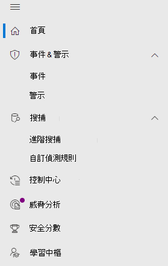

# Microsoft 365 security center 中的 microsoft Defender for Endpoint

[!INCLUDE [Microsoft 365 Defender rebranding](../includes/microsoft-defender.md)]

**適用於：**

- [Microsoft 365 Defender](microsoft-365-defender.md)
- [適用於端點的 Microsoft Defender](https://go.microsoft.com/fwlink/p/?linkid=2154037)
- [適用於 Office 365 的 Microsoft Defender](/microsoft-365/security/office-365-security/defender-for-office-365)

改進的 [Microsoft 365 安全性中心](overview-security-center.md) [https://security.microsoft.com](https://security.microsoft.com) 結合了保護、偵測、調查和回應電子郵件、共同作業、身分識別及裝置威脅的安全性功能。 此安全中心會將現有 Microsoft 安全性入口網站的功能，包括 Microsoft Defender Security Center 和 Office 365 Security & 合規性中心。

如果您熟悉 Microsoft Defender 安全中心，本文可協助說明改進的 Microsoft 365 安全性中心中的一些變更與改進。 不過，有一些新的和更新的元素需要注意。

從過去開始， [Microsoft Defender Security Center](/windows/security/threat-protection/microsoft-defender-atp/portal-overview) 已經是 microsoft Defender 的端點。 企業安全小組已使用它來監視及協助回應潛在的持續威脅活動或資料違例的警示。 為了協助減少入口網站數目，Microsoft 365 的安全性中心將會在您的 Microsoft identity、資料、裝置、應用程式和基礎結構中監控和管理安全性的家鄉。

Microsoft 365 security center 中的 microsoft Defender for Endpoint [可將受管理的安全性服務提供者的存取權授與受管理的安全性服務提供者 (MSSPs) ](/windows/security/threat-protection/microsoft-defender-atp/grant-mssp-access) ，方式 [是在 Microsoft Defender security center 中授與存取權](mssp-access.md)。

> [!IMPORTANT]
> 您在 Microsoft 365 的安全性中心看到的內容，取決於您目前的訂閱。 例如，如果您沒有 Microsoft Defender for Office 365 的授權，則不會顯示 [電子郵件 & 協同作業] 區段。

>[!Note]
>無法使用新的整合入口網站：
>- 美國政府社區雲端 (GCC) 
>- 美國政府社區雲端高 (GCC 高) 
>- 美國國防部
>- 具有商業授權的所有美國政府機構

請參閱改進的 Microsoft 365 安全中心： [https://security.microsoft.com](https://security.microsoft.com) 。

深入了解優點：[Microsoft 365 安全性中心的概觀](overview-security-center.md)

## 變更的項目

此表格是 Microsoft Defender 安全中心與 Microsoft 365 安全性中心之間變更的快速參考。

### 警示和動作

|**區域**  |**變更的描述** |
|---------|---------|
| [事件 & 警示](incidents-overview.md)  | 在 Microsoft 365 的 [安全性中心] 中，您可以管理所有端點、電子郵件和身分識別的事件及警示。 我們已融合經驗，以協助您更輕鬆地找到相關的事件。 如需詳細資訊，請參閱 [事件概述](incidents-overview.md)。   |
| [搜捕](advanced-hunting-overview.md)  |  修改在 Microsoft Defender for Endpoint 中建立的自訂偵測規則，以包含身分識別和電子郵件表格，會自動將其移至 Microsoft 365 Defender。 其對應的警示也會出現在 Microsoft 365 Defender 中。 如需這些變更的詳細資訊，請參閱 [遷移自訂偵測規則](advanced-hunting-migrate-from-mde.md#migrate-custom-detection-rules)。   `DeviceAlertEvents`Microsoft 365 Defender 沒有提供高級搜尋的表格。 若要在 Microsoft 365 Defender 中查詢裝置特有的警示資訊，您可以使用 `AlertInfo` 和 `AlertEvidence` 表格來從一組不同的來源取得更多資訊。 在不 DeviceAlertEvents 的情況下，使用 [寫入查詢](advanced-hunting-migrate-from-mde.md#write-queries-without-devicealertevents)製作下一個裝置相關的查詢。|
|[控制中心](m365d-action-center.md)    | 列出遵循自動調查和修正動作所採取的擱置及已完成動作。 先前，Microsoft Defender Security Center 中的「動作中心」會列出僅對裝置執行之修正動作的擱置和完成動作，同時自動調查會列出警示和狀態。 在改進的 Microsoft 365 安全性中心，「行動中心」會將修正動作和調查集中在電子郵件、裝置和使用者上，全部都位於一個位置。  |
| [威脅分析](threat-analytics.md) |  移至導覽列的頂端，以方便探索和使用。 現在包括端點的威脅資訊，以及電子郵件與共同作業。    |

### 端點

|**區域**  |**變更的描述**  |
|---------|---------|
|搜尋   |  而不是在標題中，Microsoft Defender for Endpoint 搜尋列會在 [端點] 區段下移動。 您可以繼續搜尋裝置、檔案、使用者、URLs、IPs、弱點、軟體及建議。  |
|[儀表板](/windows/security/threat-protection/microsoft-defender-atp/security-operations-dashboard)   |  這是您的安全性運作儀表板。 查看已觸發的主動警示數目、哪些裝置面臨危險、哪些使用者有危險，以及警示、裝置和使用者的嚴重性層級。 您也可以查看任何裝置是否有感應器問題、整體服務健康情況，以及偵測到任何未解析之警示的方式。 |
|裝置清單 | 無變更。 |
|[弱點管理](/windows/security/threat-protection/microsoft-defender-atp/next-gen-threat-and-vuln-mgt)    |    名稱已縮短，可放入功能窗格中。 與「威脅與弱點管理」區段相同，其下所有頁面皆為相同。     |
| 合作夥伴和 APIs | 無變更。 |
| 評估 & 教學課程    |     新的測試和學習功能。     |
| 設定管理   |  無變更。  |

> [!NOTE]
> **自動調查和修正** 現在是事件的一部分。 您可以在 [ **事件 > 調查** ] 索引標籤中查看自動調查和修正事件。

### 存取與報告

|**區域**  |**變更的描述**  |
|---------|---------|
| 報告  | 請參閱報告中的端點和電子郵件 & 共同作業，包括威脅防護、裝置健康情況和合規性，以及易受攻擊的裝置。 |
| 健康情況  |  目前連結到 [Microsoft 365 系統管理中心](https://admin.microsoft.com/)中的「服務健康情況」頁面。 |
| 設定 |  管理您的 Microsoft 365 安全中心設定、Microsoft 365 Defender、端點、電子郵件 & 共同作業、身分識別及裝置探索。   |

## Microsoft 365 安全性導覽和功能

左側瀏覽或快速啟動列看起來會很熟悉。 不過，此安全性中心有一些新的和更新的元素。

### 事件和警示

將橫跨電子郵件、裝置和身分識別的事件和警示管理結合在一起。 警示頁面會將攻擊信號結合在一起，以建立警示的完整內容。 全新、整合的體驗現在將不同工作負載的警示結合在一致的檢視中。 您可以快速分類、調查並採取有效動作。

- [深入了解事件](incidents-overview.md)
- [深入了解管理警示](investigate-alerts.md)

### 搜捕

使用[進階搜捕查詢](advanced-hunting-overview.md)來主動搜尋端點、Office 365 信箱等的威脅、惡意程式碼和惡意活動。 這些功能強大的查詢可用於尋找及審閱已知和潛在威脅的威脅指示器和實體。

[自訂偵測規則](custom-detection-rules.md) 可以從先進的搜尋查詢中建立，以協助您主動留意可能表示遭到破壞活動和配置錯誤裝置的事件。

### 控制中心

控制中心會顯示已由自動化調查及回應功能所建立的調查。 Microsoft 365 Defender 中的這個自動化、自我修復功能會透過自動回應特定事件來協助安全性小組。

[深入了解重要訊息中心](m365d-action-center.md)

### 威脅分析

從專業的 Microsoft 安全性研究工具取得威脅情報。 威脅分析可協助安全性小組在面對新興威脅時更有效率。 威脅分析包括：

- 適用於 Office 365 的 Microsoft Defender 的電子郵件相關偵測和緩和措施。 這是已可透過適用於端點的 Microsoft Defender 取得的端點資料的增加項目。
- 與威脅相關的事件檢視。
- 用於快速識別及使用報告中可採取動作資訊的增強體驗。

您可以從 Microsoft 365 的安全性中心左上方導覽列中存取威脅分析，或是從顯示組織之主要威脅的專用儀表板卡存取。

深入了解如何[使用威脅分析來追蹤和回應新興威脅](./threat-analytics.md)

### 端點區段

查看和管理組織中端點的安全性。 如果您已使用 Microsoft Defender 安全中心，它看起來會很熟悉。

### 存取與報告

檢視報告、變更您的設定，以及修改使用者角色。

### SIEM API 連接

如果您使用 [Defender For ENDPOINT SIEM API](../defender-endpoint/enable-siem-integration.md)，您可以繼續執行。 我們已在 API 負載上新增連結，指向 [警示] 頁面或 Microsoft 365 安全性入口網站中的 [事件] 頁面。 新的 API 欄位包括 LinkToMTP 及 IncidentLinkToMTP。 如需詳細資訊，請參閱 [將客戶從 Microsoft Defender For 端點重新導向至 Microsoft 365 安全中心](./microsoft-365-security-mde-redirection.md)。

### 電子郵件警示

您可以繼續使用用於端點的電子郵件警示。 我們已新增電子郵件中的新連結，指向 [提醒] 頁面或 Microsoft 365 [安全性中心] 中的 [事件] 頁面。 如需詳細資訊，請參閱 [將客戶從 Microsoft Defender For 端點重新導向至 Microsoft 365 安全中心](./microsoft-365-security-mde-redirection.md)。

## 相關資訊

- [Microsoft 365 安全性中心](overview-security-center.md)
- [Microsoft 365 security center 中的 microsoft Defender for Endpoint](microsoft-365-security-center-mde.md)
- [將帳戶從 Microsoft Defender for Endpoint 重新導向至 Microsoft 365 安全中心](microsoft-365-security-mde-redirection.md)