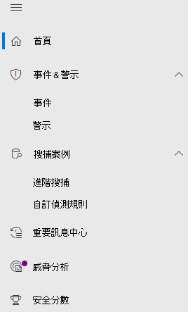

# Microsoft 365 Defender 中的 Microsoft Defender Office 365Microsoft Defender for Office 365 in Microsoft 365 Defender

[!INCLUDE [Microsoft 365 Defender rebranding](../includes/microsoft-defender.md)]

**適用於：****Applies to:**
- [Microsoft 365 DefenderMicrosoft 365 Defender](microsoft-365-defender.md)
- [適用於 Office 365 的 Microsoft DefenderMicrosoft Defender for Office 365](/microsoft-365/security/office-365-security/defender-for-office-365)

## 快速參考Quick reference

下表列出安全性 & 規範中心和 Microsoft 365 Defender 之間的導覽變更。The table below lists the changes in navigation between the Security & Compliance Center and Microsoft 365 Defender.

 

****

|[安全性與合規性中心Security & Compliance Center](https://protection.office.com)|[Microsoft 365 DefenderMicrosoft 365 Defender](https://security.microsoft.com)|[Microsoft 365 合規性中心Microsoft 365 compliance center](https://compliance.microsoft.com/homepage)|[Exchange 系統管理中心Exchange admin center](https://admin.exchange.microsoft.com)|
|---|---|---|---|
|警示Alerts|<ul><li>[警示原則Alert Policies](https://security.microsoft.com/alertpolicies)</li><li>[事件 & 警示Incidents & alerts](https://security.microsoft.com/alerts)</li></ul>|[提醒頁面Alerts page](https://compliance.microsoft.com/homepage)||
|分類Classification||請參閱[Microsoft 365 合規性中心](https://compliance.microsoft.com/homepage)See [Microsoft 365 compliance center](https://compliance.microsoft.com/homepage)||
|資料外洩防護Data loss prevention||請參閱[Microsoft 365 合規性中心](https://compliance.microsoft.com/homepage)See [Microsoft 365 compliance center](https://compliance.microsoft.com/homepage)||
|記錄管理Records management||請參閱[Microsoft 365 合規性中心](https://compliance.microsoft.com/homepage)See [Microsoft 365 compliance center](https://compliance.microsoft.com/homepage)||
|資訊控管Information governance||請參閱[Microsoft 365 合規性中心](https://compliance.microsoft.com/homepage)See [Microsoft 365 compliance center](https://compliance.microsoft.com/homepage)||
|威脅管理Threat management|[電子郵件 & 協同作業Email & Collaboration](https://security.microsoft.com/homepage)|||
|權限Permissions|[許可權 & 角色Permissions & roles](https://security.microsoft.com/emailandcollabpermissions)|請參閱[Microsoft 365 合規性中心](https://compliance.microsoft.com/homepage)See [Microsoft 365 compliance center](https://compliance.microsoft.com/homepage)||
|郵件流程Mail flow|||請參閱[Exchange 系統管理中心](https://admin.exchange.microsoft.com/#/)See [Exchange admin center](https://admin.exchange.microsoft.com/#/)|
|資料隱私權Data privacy||請參閱[Microsoft 365 合規性中心](https://compliance.microsoft.com/homepage)See [Microsoft 365 compliance center](https://compliance.microsoft.com/homepage)||
|搜尋Search|[稽核Audit](https://security.microsoft.com/auditlogsearch?viewid=Async%20Search)|搜尋 (內容搜尋) Search (content search)||
|報告Reports|[報告Report](https://security.microsoft.com/emailandcollabreport)|||
|服務保證Service assurance||請參閱[Microsoft 365 合規性中心](https://compliance.microsoft.com/homepage)See [Microsoft 365 compliance center](https://compliance.microsoft.com/homepage)||
|監督Supervision||請參閱[Microsoft 365 合規性中心](https://compliance.microsoft.com/homepage)See [Microsoft 365 compliance center](https://compliance.microsoft.com/homepage)||
|電子文件探索eDiscovery||請參閱[Microsoft 365 合規性中心](https://compliance.microsoft.com/homepage)See [Microsoft 365 compliance center](https://compliance.microsoft.com/homepage)||
|||||

[Microsoft 365 Defender](./overview-security-center.md) <https://security.microsoft.com> 結合現有 Microsoft 安全性入口網站的安全性功能，包括安全性 & 規範中心。[Microsoft 365 Defender](./overview-security-center.md) at <https://security.microsoft.com> combines security capabilities from existing Microsoft security portals, including the Security & Compliance Center. 此改善的中心可協助安全性小組更有效且有效率地地保護其組織免受威脅。This improved center helps security teams protect their organization from threats more effectively and efficiently.

如果您熟悉安全性 & 規範中心 (protection.office.com) ，本文將說明 Microsoft 365 Defender 中的一些變更與改進。If you are familiar with the Security & Compliance Center (protection.office.com), this article describes some of the changes and improvements in Microsoft 365 Defender.

深入瞭解好處： [Microsoft 365 Defender 綜述](overview-security-center.md)Learn more about the benefits: [Overview of Microsoft 365 Defender](overview-security-center.md)

如果您要尋找合規性相關的項目，請瀏覽 [Microsoft 365 合規性中心](https://compliance.microsoft.com/homepage)。If you are looking for compliance-related items, visit the [Microsoft 365 compliance center](https://compliance.microsoft.com/homepage).

## 新功能與改進功能New and improved capabilities

左側瀏覽或快速啟動列看起來會很熟悉。The left navigation, or quick launch bar, will look familiar. 不過，此安全性中心有一些新的和更新的元素。However, there are some new and updated elements in this security center.

利用整合的 Microsoft 365 Defender 解決方案，您可以將威脅信號結合在一起，判斷威脅的完整範圍和影響，以及它目前對組織的影響。With the unified Microsoft 365 Defender solution, you can stitch together the threat signals and determine the full scope and impact of the threat, and how it's currently impacting the organization.

:::image type="content" source="../../media/M365-defender-converge-experience.png" alt-text="Microsoft 365 Defender 收斂體驗的影像":::

Office 365 的使用者可以保護您的組織免受電子郵件訊息、連結 (URLs) 及共同作業工具帶來的惡意威脅。Defender for Office 365 safeguards your organization against malicious threats posed by email messages, links (URLs), and collaboration tools.

:::image type="content" source="../../media/Defender-for-O365.png" alt-text="Office 365 的 Defender 影像":::

### 事件和警示Incidents and alerts

將橫跨電子郵件、裝置和身分識別的事件和警示管理結合在一起。Brings together incident and alert management across your email, devices, and identities. 警示現在可在 [調查] 節點下取得，並有助於提供攻擊更廣泛的檢視。Alerts are now available under the Investigation node, and help provide a broader view of an attack. 警示頁面透過結合攻擊訊號來建構詳細的案例，提供警示的完整內容。The alert page provides full context to the alert, by combining attack signals to construct a detailed story. 之前，警示是不同工作負載所特有。Previously, alerts were specific to different workloads. 全新、整合的體驗現在將不同工作負載的警示結合在一致的檢視中。A new, unified experience now brings together a consistent view of alerts across workloads. 您可以快速分類、調查並採取有效動作。You can quickly triage, investigate, and take effective action.

- [深入了解調查Learn more about Investigations](incidents-overview.md)
- [深入了解管理警示Learn more about managing alerts](/windows/security/threat-protection/microsoft-defender-atp/review-alerts)

### 搜捕Hunting

使用[進階搜捕查詢](advanced-hunting-overview.md)來主動搜尋端點、Office 365 信箱等的威脅、惡意程式碼和惡意活動。Proactively search for threats, malware, and malicious activity across your endpoints, Office 365 mailboxes, and more by using [advanced hunting queries](advanced-hunting-overview.md). 這些功能強大的查詢可用來找出並檢查已知和潛在威脅的威脅指示器和實體。These powerful queries can be used to  locate and review threat indicators and entities for both known and potential threats.

[自訂偵測規則](/windows/security/threat-protection/microsoft-defender-atp/custom-detection-rules) 可以從先進的搜尋查詢中建立，以協助您主動留意可能表示遭到破壞活動和配置錯誤裝置的事件。[Custom detection rules](/windows/security/threat-protection/microsoft-defender-atp/custom-detection-rules) can be built from advanced hunting queries to help you proactively watch for events that might be indicative of breach activity and misconfigured devices.

以下是 Microsoft Defender for Office 365 中的[高級搜尋範例](advanced-hunting-example.md)。Here is an [example on advanced hunting](advanced-hunting-example.md) in Microsoft Defender for Office 365.

### 控制中心Action center

控制中心會顯示已由自動化調查及回應功能所建立的調查。Action center shows you the investigations created by automated investigation and response capabilities. Microsoft 365 Defender 中的這個自動化、自我修復功能會透過自動回應特定事件來協助安全性小組。This automated, self-healing in Microsoft 365 Defender can help security teams by automatically responding to specific events.

深入瞭解 [操作中心](m365d-action-center.md)。Learn more about [Action center](m365d-action-center.md).

#### 威脅分析Threat Analytics

從專業的 Microsoft 安全性研究工具取得威脅情報。Get threat intelligence from expert Microsoft security researchers. 威脅分析可協助安全性小組在面對新興威脅時更有效率。Threat Analytics helps security teams be more efficient when facing emerging threats. 威脅分析包括：Threat Analytics includes:

- 適用於 Office 365 的 Microsoft Defender 的電子郵件相關偵測和緩和措施。Email-related detections and mitigations from Microsoft Defender for Office 365. 這是已可透過適用於端點的 Microsoft Defender 取得的端點資料的增加項目。This is in addition to the endpoint data already available from Microsoft Defender for Endpoint.
- 與威脅相關的事件檢視。Incidents view related to the threats.
- 用於快速識別及使用報告中可採取動作資訊的增強體驗。Enhanced experience for quickly identifying and using actionable information in the reports.

您可以從 Microsoft 365 Defender 的上方左導覽列中存取威脅分析，或是從顯示組織之主要威脅的專用儀表板卡存取。You can access Threat analytics either from the upper left navigation bar in Microsoft 365 Defender, or from a dedicated dashboard card that shows the top threats for your organization.

深入瞭解如何 [使用威脅分析追蹤和回應新興威脅](./threat-analytics.md)。Learn more about how to [track and respond to emerging threats with threat analytics](./threat-analytics.md).

### 電子郵件與共同作業Email & collaboration

追蹤和調查對您使用者的電子郵件的威脅、追蹤行銷活動等等。Track and investigate threats to your users' email, track campaigns, and more. 如果您已使用安全性 & 規範中心，這會很熟悉。If you've used the Security & Compliance Center, this will be familiar.

:::image type="content" source="../../media/converge-3-email-and-collab-new.png" alt-text="電子郵件 & 的 [快速啟動] 功能表上 (或 MSDO) ，位於 Microsoft 365 Defender 左邊。":::

#### 電子郵件實體頁面Email entity page

「 [電子郵件實體」頁面](../office-365-security/mdo-email-entity-page.md)已 *統一* 分散于過去不同頁面或視圖上的電子郵件資訊。The [Email entity page](../office-365-security/mdo-email-entity-page.md) *unifies* email information that had been scattered across different pages or views in the past. 調查電子郵件是否有威脅和趨勢將會 *集中*。Investigating email for threats and trends is *centralized*. 標頭資訊和電子郵件預覽可透過相同的電子郵件頁面來存取，還有其他實用的電子郵件相關資訊。Header information and email preview are accessible through the same email page, along with other useful email-related information. 同樣地，您可以在相同頁面的分頁上找到惡意檔案附件或 URL 的引爆狀態。Likewise, the detonation status for malicious file attachments or URLs can be found on a tab of the same page. 電子郵件實體頁面讓系統管理員和安全性作業小組能夠快速了解電子郵件威脅及其狀態，然後快速採取行動以判斷處理方式。The Email entity page empowers admins and security operations teams to understand an email threat and its status, fast, and then act quickly determine handling.

### 存取和報告Access and Reports

檢視報告、變更您的設定，以及修改使用者角色。View reports, change your settings, and modify user roles.

:::image type="content" source="../../media/converge-4-access-and-reporting-new.png" alt-text="在 [安全性中心] 的左側 Microsoft 365 Defender 許可權與報告的 [快速啟動] 功能表。":::

> [!NOTE]
> DomainKeys 識別的郵件 (DKIM) 可確保目的地電子郵件系統信任從您的自訂網域傳送輸出的郵件。DomainKeys Identified Mail (DKIM) ensures that destination email systems trust messages sent outbound from your custom domain.
> 針對 Office 365 使用者的 Defender，您現在可以透過 Microsoft 365 Defender *管理及輪替* DKIM 機碼： <https://security.microsoft.com/threatpolicy> 或流覽至 **Policy & 規則** 的原則 \>  \> \> **規則**] 區段 \> **DKIM**。For Defender for Office 365 users, you can now *manage and rotate* DKIM keys through Microsoft 365 Defender: <https://security.microsoft.com/threatpolicy>, or navigate to **Policy & rules** \> **Threat policies** \> \> **Rules** section \> **DKIM**.
>
> 如需詳細資訊，請參閱 [使用 DKIM 驗證從您的自訂網域傳送的輸出電子郵件](/microsoft-365/security/office-365-security/use-dkim-to-validate-outbound-email)。For more information, see [Use DKIM to validate outbound email sent from your custom domain](/microsoft-365/security/office-365-security/use-dkim-to-validate-outbound-email).

## 變更的項目What's changed

此表格是威脅管理的快速參考，在 **安全性 & 規範中心** 與 **Microsoft 365 Defender** 入口網站之間發生變更。This table is a quick reference of Threat management where change has occurred between the **Security & Compliance center** and the **Microsoft 365 Defender** portal. 按一下連結以閱讀更多有關這些區域的相關資訊。Click the links to read more about these areas.

 

****

|區域Area|變更描述Description of change|
|---|---|
|[調查Investigation](../office-365-security/office-365-air.md#changes-are-coming-soon-in-your-microsoft-365-defender-portal)|將[適用於 Office 365 的 Defender](/microsoft-365/security/office-365-security/defender-for-office-365) 和[適用於端點的 Defender](../defender-endpoint/automated-investigations.md) 的 AIR 功能結合在一起。Brings together AIR capabilities in [Defender for Office 365](/microsoft-365/security/office-365-security/defender-for-office-365) and [Defender for Endpoint](../defender-endpoint/automated-investigations.md). 有了這些更新與改善功能，您的安全性作業小組就能在單一位置檢視電子郵件、共同作業內容、使用者帳戶和裝置上的自動化調查和補救動作的詳細資訊。With these updates and improvements, your security operations team will be able to view details about automated investigations and remediation actions across your email, collaboration content, user accounts, and devices, all in one place.|
|[警示佇列Alert queue](../../compliance/alert-policies.md)|安全性 & 規範中心內的「**查看通知**」彈出窗格現在包含 Microsoft 365 Defender 的連結。The **View alerts** flyout pane in the Security & Compliance Center now includes links to Microsoft 365 Defender. 按一下 [**開啟警示] 頁面** 連結，然後 Microsoft 365 Defender 隨即開啟。Click on the **Open Alert Page** link and Microsoft 365 Defender opens. 您可以按一下 [警示] 佇列中的任何 Office 365 警示來存取 [檢視警示 **]** 頁面。You can access the **View alerts** page by clicking on any Office 365 alert in the Alerts queue.|
|[攻擊模擬訓練Attack Simulation training](../office-365-security/attack-simulation-training-insights.md)|使用攻擊模擬訓練在組織中執行真實化的攻擊案例。Use Attack Simulation training to run realistic attack scenarios in your organization. 這些模擬攻擊可協助在真實的攻擊影響您的組織之前訓練您的員工。These simulated attacks can help train your workforce before a real attack impacts your organization. 攻擊模擬訓練包括更多選項、增強的報告，以及改善的訓練流程，可協助讓您的攻擊模擬與訓練案例更易於傳遞和管理。Attack simulation training includes, more options, enhanced reports, and improved training flows help make your attack simulation and training scenarios easier to deliver and manage.|
|

這些區域沒有變更：No changes to these areas:

- [總管Explorer](../office-365-security/threat-explorer.md)
- [原則與規則Policies & Rules](../../compliance/alert-policies.md)
- [行銷活動Campaign](../office-365-security/campaigns.md)
- [提交Submissions](../office-365-security/admin-submission.md)
- [檢閱Review](./m365d-action-center.md)
- [威脅追蹤程式Threat Tracker](../office-365-security/threat-trackers.md)

此外，請查看本文底部的 **相關資訊** 一節。Also, check the **Related Information** section at the bottom of this article.

> [!IMPORTANT]
> Microsoft 365 Defender 入口網站 (<https://security.microsoft.com>) 結合中的安全性功能 <https://securitycenter.windows.com> 和 <https://protection.office.com> 。The Microsoft 365 Defender portal (<https://security.microsoft.com>) combines security features in <https://securitycenter.windows.com>, and <https://protection.office.com>. 不過，您會看到的項目將取決於您的訂閱。However, what you see will depend on your subscription. 例如，如果您只有適用於 Office 365 的 Microsoft Defender 方案 1 或 2，以獨立訂閱形式，您就不會看到有關適用於端點的安全性的功能，而適用於 Office 的 Defender 方案 1 客戶不會看到威脅分析之類的項目。If you only have Microsoft Defender for Office 365 Plan 1 or 2, as standalone subscriptions, for example, you won't see capabilities around Security for Endpoints and Defender for Office Plan 1 customers won't see items such as Threat Analytics.

> [!TIP]
> 所有 Exchange Online Protection (的 EOP) 函數將會包含 Microsoft 365 Defender，因為 EOP 是 Office 365 的 Defender 核心元素。All Exchange Online Protection (EOP) functions will be included in Microsoft 365 Defender, as EOP is a core element of Defender for Office 365.

## Microsoft 365 Defender首頁Microsoft 365 Defender Home page

入口網站的首頁會針對您 Microsoft 365 環境的安全性狀態，呈現重要的摘要資訊。The Home page of the portal surfaces important summary information about the security status of your Microsoft 365 environment.

您可以使用 **導覽** 來快速導覽端點或電子郵件與共同作業頁面。Using the **Guided tour** you can take a quick tour of Endpoint or Email & collaboration pages. 請注意，您會在這裡的項目將取決於您是否擁有適用於 Office 365 的 Defender 和/或適用於端點的 Defender 授權。Note that what you see here will depend on if you have license for Defender for Office 365 and/or Defender for Endpoint.

同時還包含 **安全性 & 規範中心** 的連結，以進行比較。Also included is a link to the **Security & Compliance Center** for comparison. 最後一個是描述最近的更新的 **新功能** 頁面的連結。The last link is to the **What's New** page that describes recent updates.

## 相關資訊Related information

- [將安全性 & 規範中心重新導向至 Microsoft 365 DefenderRedirecting Security & Compliance Center to Microsoft 365 Defender](microsoft-365-security-mdo-redirection.md)
- [控制中心The Action center](./m365d-action-center.md)
- [電子郵件與共同作業警示Email & collaboration alerts](../../compliance/alert-policies.md#default-alert-policies)
- [自訂偵測規則Custom detection rules](/microsoft-365/security/defender-endpoint/custom-detection-rules)
- [建立網路釣魚攻擊模擬](../office-365-security/attack-simulation-training.md)並[建立用於訓練您的人員的承載](../office-365-security/attack-simulation-training-payloads.md)[Create a phishing attack simulation](../office-365-security/attack-simulation-training.md) and [create a payload for training your people](../office-365-security/attack-simulation-training-payloads.md)
