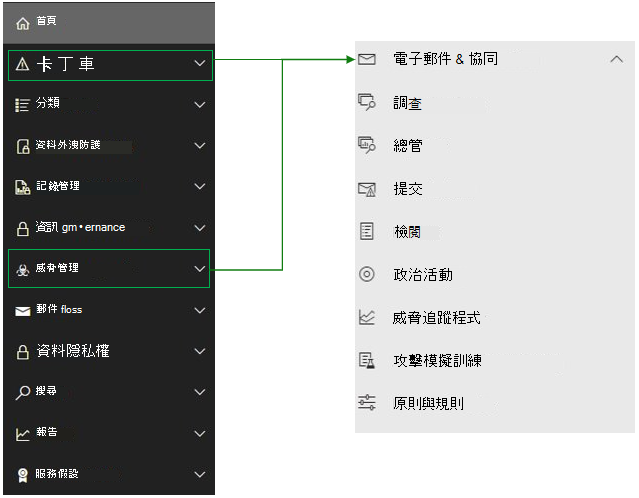

# <a name="microsoft-defender-for-office-365-in-microsoft-365-defender"></a>Microsoft 365 Defender 中的 Microsoft Defender Office 365

[!INCLUDE [Microsoft 365 Defender rebranding](../includes/microsoft-defender.md)]

**適用於：**
- [Microsoft 365 Defender](microsoft-365-defender.md)
- [適用於端點的 Microsoft Defender](https://go.microsoft.com/fwlink/p/?linkid=2154037)
- [適用於 Office 365 的 Microsoft Defender](/microsoft-365/security/office-365-security/defender-for-office-365)

## <a name="quick-reference"></a>快速參考

下表列出 Office 365 安全性 & 規範中心及 Microsoft 365 Defender 之間的導覽變更。

> [!div class="mx-imgBorder"]
> 

<br>

****

|Office 365安全性 & 合規性|Microsoft 365 Defender|Microsoft 365 合規性中心|Exchange 系統管理中心|
|---|---|---|---|
|警示|電子郵件與共同作業|||
|分類||請參閱[Microsoft 365 規範中心](https://compliance.microsoft.com/homepage)||
|資料外洩防護||請參閱[Microsoft 365 規範中心](https://compliance.microsoft.com/homepage)||
|記錄管理||請參閱[Microsoft 365 規範中心](https://compliance.microsoft.com/homepage) ||
|資訊控管||請參閱[Microsoft 365 規範中心](https://compliance.microsoft.com/homepage)||
|威脅管理|電子郵件與共同作業|||
|郵件流程|||請參閱[Exchange 系統管理中心](https://admin.exchange.microsoft.com/#/)|
|資料隱私權||請參閱[Microsoft 365 規範中心](https://compliance.microsoft.com/homepage)||
|搜尋|搜尋|||
|報告|報告|||
|服務保證|設定|||
|

[Microsoft 365 Defender](./overview-security-center.md) <https://security.microsoft.com> 結合了現有 Microsoft 安全性入口網站的安全性功能，包括 Microsoft Defender 資訊安全中心和 Office 365 安全性 & 規範中心。 此改善的中心可協助安全性小組更有效且有效率地地保護其組織免受威脅。

如果您熟悉 Office 365 安全性與合規性入口網站 (protection.office.com) ，本文將說明 Microsoft 365 Defender 中的一些變更與改進。

深入瞭解好處： [Microsoft 365 Defender 的概述](overview-security-center.md)

如果您要尋找合規性相關的項目，請瀏覽 [Microsoft 365 合規性中心](https://compliance.microsoft.com/homepage)。

## <a name="whats-changed"></a>變更的項目

此表格是 **安全性與合規性中心** 與 **Microsoft 365 安全性** 入口網站之間已發生變更的電子郵件與共同作業區域的快速參考。 按一下連結以閱讀更多有關這些區域的相關資訊。

<br>

****

|區域|變更描述|
|---|---|
|[電子郵件實體頁面](../office-365-security/mdo-email-entity-page.md)|此頁面 **整合** 了過去散落在不同頁面或檢視中的電子郵件資訊。 調查電子郵件是否有威脅和趨勢將會 *集中*。 標頭資訊和電子郵件預覽可透過相同的電子郵件頁面來存取，還有其他實用的電子郵件相關資訊。 同樣地，您可以在相同頁面的分頁上找到惡意檔案附件或 URL 的引爆狀態。 電子郵件實體頁面讓系統管理員和安全性作業小組能夠快速了解電子郵件威脅及其狀態，然後快速採取行動以判斷處理方式。|
|[調查](../office-365-security/office-365-air.md#changes-are-coming-soon-in-your-microsoft-365-defender-portal)|將[適用於 Office 365 的 Defender](/microsoft-365/security/office-365-security/defender-for-office-365) 和[適用於端點的 Defender](../defender-endpoint/automated-investigations.md) 的 AIR 功能結合在一起。 有了這些更新與改善功能，您的安全性作業小組就能在單一位置檢視電子郵件、共同作業內容、使用者帳戶和裝置上的自動化調查和補救動作的詳細資訊。|
|[警示檢視](../../compliance/alert-policies.md)|Office 安全性與合規性中心中的「**查看通知**」彈出窗格現在包含 Microsoft 365 Defender 的連結。 按一下 [**開啟警示] 頁面** 連結，並 Microsoft 365 Defender 隨即開啟。 您可以按一下 [警示] 佇列中的任何 Office 365 警示來存取 [檢視警示 **]** 頁面。|
|[攻擊模擬訓練](../office-365-security/attack-simulation-training-insights.md)|使用攻擊模擬訓練在組織中執行真實化的攻擊案例。 這些模擬攻擊可協助在真實的攻擊影響您的組織之前訓練您的員工。 攻擊模擬訓練包括更多選項、增強的報告，以及改善的訓練流程，可協助讓您的攻擊模擬與訓練案例更易於傳遞和管理。|
|

這些區域沒有變更：

- [總管](../office-365-security/threat-explorer.md)
- [原則與規則](../../compliance/alert-policies.md)
- [行銷活動](../office-365-security/campaigns.md)
- [提交](../office-365-security/admin-submission.md)
- [檢閱](./m365d-action-center.md)
- [威脅追蹤程式](../office-365-security/threat-trackers.md)

此外，請查看本文底部的 **相關資訊** 一節。

> [!IMPORTANT]
> Microsoft 365 安全性入口網站 (<https://security.microsoft.com>) 結合中的安全性功能 <https://securitycenter.windows.com> 和 <https://protection.office.com> 。 不過，您會看到的項目將取決於您的訂閱。 例如，如果您只有適用於 Office 365 的 Microsoft Defender 方案 1 或 2，以獨立訂閱形式，您就不會看到有關適用於端點的安全性的功能，而適用於 Office 的 Defender 方案 1 客戶不會看到威脅分析之類的項目。

> [!TIP]
> 所有 Exchange Online Protection (EOP) 功能都會包含在 Microsoft 365 Defender 中，因為 EOP 是 Office 365 的 Defender 核心元素。

## <a name="microsoft-365-defender-home-page"></a>Microsoft 365Defender 首頁

入口網站首頁會呈現：

- 安全分數評等
- 有風險的使用者和裝置數目
- 主動事件佇列
- 具特殊權限的 OAuth 應用程式清單
- 裝置健康情況資料
- 來自 Microsoft 的安全性情報 twitter 摘要的推文
- 以及更多摘要資訊

您可以使用 **導覽** 來快速導覽端點或電子郵件與共同作業頁面。 請注意，您會在這裡的項目將取決於您是否擁有適用於 Office 365 的 Defender 和/或適用於端點的 Defender 授權。

也包含 **Office 365 安全性與合規性中心** 的連結供比較。 最後一個是描述最近的更新的 **新功能** 頁面的連結。

## <a name="improved-capabilities"></a>改善的功能

左側瀏覽或快速啟動列看起來會很熟悉。 不過，此安全性中心有一些新的和更新的元素。

### <a name="incidents-and-alerts"></a>事件和警示

將橫跨電子郵件、裝置和身分識別的事件和警示管理結合在一起。 警示現在可在 [調查] 節點下取得，並有助於提供攻擊更廣泛的檢視。 警示頁面透過結合攻擊訊號來建構詳細的案例，提供警示的完整內容。 之前，警示是不同工作負載所特有。 全新、整合的體驗現在將不同工作負載的警示結合在一致的檢視中。 您可以快速分類、調查並採取有效動作。

- [深入了解調查](incidents-overview.md)
- [深入了解管理警示](/windows/security/threat-protection/microsoft-defender-atp/review-alerts)


### <a name="hunting"></a>搜捕

使用[進階搜捕查詢](advanced-hunting-overview.md)來主動搜尋端點、Office 365 信箱等的威脅、惡意程式碼和惡意活動。 這些功能強大的查詢可用來找出並檢查已知和潛在威脅的威脅指示器和實體。

[自訂偵測規則](/windows/security/threat-protection/microsoft-defender-atp/custom-detection-rules)可以從進階搜捕查詢來建置，以協助您主動監視可能表示入侵活動和裝置設定錯誤的事件。

### <a name="action-center"></a>控制中心

控制中心會顯示已由自動化調查及回應功能所建立的調查。 Microsoft 365 Defender 中的這個自動化、自我修復功能會透過自動回應特定事件來協助安全性小組。

[深入瞭解行動中心](m365d-action-center.md)

#### <a name="threat-analytics"></a>威脅分析

從專業的 Microsoft 安全性研究工具取得威脅情報。 威脅分析可協助安全性小組在面對新興威脅時更有效率。 威脅分析包括：

- 適用於 Office 365 的 Microsoft Defender 的電子郵件相關偵測和緩和措施。 這是已可透過適用於端點的 Microsoft Defender 取得的端點資料的增加項目。
- 與威脅相關的事件檢視。
- 用於快速識別及使用報告中可採取動作資訊的增強體驗。
您可以從 Microsoft 365 Defender 的上方左導覽列，或是從顯示組織之主要威脅的專用儀表板卡，存取威脅分析。

深入了解如何[使用威脅分析來追蹤和回應新興威脅](./threat-analytics.md)

### <a name="email--collaboration"></a>電子郵件與共同作業

追蹤和調查對您使用者的電子郵件的威脅、追蹤行銷活動等等。 如果您曾使用 Office 365 安全性與合規性中心，則這會是熟悉的。

:::image type="content" source="../../media/converge-3-email-and-collab-new.png" alt-text="電子郵件 & 的 [快速啟動] 功能表上 (或 MSDO) ，Microsoft 365 Defender 的左側。":::

### <a name="access-and-reports"></a>存取和報告

檢視報告、變更您的設定，以及修改使用者角色。

:::image type="content" source="../../media/converge-4-access-and-reporting-new.png" alt-text="「安全性中心」左側的「快速啟動」功能表，用於 Microsoft 365 的 Defender 許可權和報告。":::

> [!NOTE]
> 針對 Office 365 使用者的 Defender，您現在可以透過 Microsoft 365 Defender：] <https://security.microsoft.com/threatpolicy> ，或流覽至 **原則 & 規則** \> **威脅原則** \> **DKIM**，來管理和旋轉 DomainKeys 識別的郵件 (DKIM) 機碼。

## <a name="advanced-hunting-example-for-microsoft-defender-for-office-365"></a>適用於 Office 365 的 Microsoft Defender 的進階搜捕範例

想要開始使用進階搜捕來搜尋電子郵件威脅嗎？ 嘗試這樣做：

[適用於 Office 365 的 Microsoft Defender 文章](/microsoft-365/security/office-365-security/defender-for-office-365)的[快速入門](/microsoft-365/security/office-365-security/defender-for-office-365.md#getting-started)小節包含的邏輯早期設定區塊，看起來像這樣：

1. 使用名稱中的「反」設定所有專案。
   - 反惡意程式碼
   - 反網路釣魚
   - 反垃圾郵件
2. 在名稱中設定具有「安全」的所有專案。
   - 安全連結
   - 安全附件
3. 保護工作負載 (例如: SharePoint線上、OneDrive 和 Teams) 。
4. 使用零小時自動清除加以保護。

還有可直接進入並在第 1 天便完成設定的[連結](../office-365-security/protect-against-threats.md)。

**快速入門** 的最後一個步驟會使用 **零時差自動清除** (也稱為 ZAP) 來保護使用者。 了解您對可疑或惡意郵件執行的 ZAP 在傳遞後是否成功非常重要。

快速瀏覽至 Kusto 查詢語言以搜捕問題，是這兩個安全性中心交集的優點。 安全小組 [可以在 [](https://security.microsoft.com/advanced-hunting)**搜尋** \> **高級搜尋**] 底下執行下一個步驟，以監視 ZAP 未命中。

1. 在 [進階搜捕] 頁面上，按一下 [查詢]。
1. 將下列查詢複製到查詢視窗。
1. 選取 [執行查詢]。

```kusto
EmailPostDeliveryEvents 
| where Timestamp > ago(7d)
//List malicious emails that were not zapped successfullyconverge-2-endpoints-new.png
| where ActionType has "ZAP" and ActionResult == "Error"
| project ZapTime = Timestamp, ActionType, NetworkMessageId , RecipientEmailAddress 
//Get logon activity of recipients using RecipientEmailAddress and AccountUpn
| join kind=inner IdentityLogonEvents on $left.RecipientEmailAddress == $right.AccountUpn
| where Timestamp between ((ZapTime-24h) .. (ZapTime+24h))
//Show only pertinent info, such as account name, the app or service, protocol, the target device, and type of logon
| project ZapTime, ActionType, NetworkMessageId , RecipientEmailAddress, AccountUpn, 
LogonTime = Timestamp, AccountDisplayName, Application, Protocol, DeviceName, LogonType
```

:::image type="content" source="../../media/converge-13-advanced-hunt-an-email-zap-new.png" alt-text="[高級搜尋] 頁面 ([搜尋) 上的 [搜尋] 面板上方已選取 [查詢]，並執行 Kusto 查詢，以在過去7天內捕獲 ZAP 動作。":::

來自此查詢的資料會顯示在查詢本身下方的結果面板中。 結果包含可自訂的結果集中的資訊，例如 'DeviceName'、'AccountDisplayName' 和 'ZapTime'。 也可以匯出結果做為記錄。 如果查詢是您所需要的，請再次選取 [儲存 **]**  >  [另存新檔 **]**，並將查詢新增至您的查詢、共用或社群查詢的清單中。

## <a name="related-information"></a>相關資訊

- [Microsoft 365 Defender 中的 Microsoft Defender Office 365](microsoft-365-security-center-mdo.md)
- [控制中心](./m365d-action-center.md)
- [電子郵件與共同作業警示](../../compliance/alert-policies.md#default-alert-policies)
- [跨裝置、電子郵件、應用程式和身分識別搜捕威脅](./advanced-hunting-query-emails-devices.md)
- [自訂偵測規則](/microsoft-365/security/defender-endpoint/custom-detection-rules)
- [建立網路釣魚攻擊模擬](../office-365-security/attack-simulation-training.md)並[建立用於訓練您的人員的承載](../office-365-security/attack-simulation-training-payloads.md)
