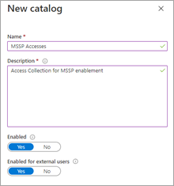

# 提供受管理的安全性服務提供者 (MSSP) 存取權 

[!INCLUDE [Microsoft 365 Defender rebranding](../includes/microsoft-defender.md)]

[!INCLUDE [Prerelease](../includes/prerelease.md)]

**適用於：**

- [Microsoft 365 Defender](microsoft-365-defender.md)
- [適用於端點的 Microsoft Defender](https://go.microsoft.com/fwlink/p/?linkid=2154037)

若要執行多租使用者委派存取解決方案，請執行下列步驟：

1. 在 Microsoft 365 security center 的 Defender for Endpoint 中啟用以 [角色為基礎的存取控制](/windows/security/threat-protection/microsoft-defender-atp/rbac) ，並聯機至 Azure Active Directory (azure AD) 群組。

2. 設定存取要求與布建的控管 [訪問套件](/azure/active-directory/governance/identity-governance-overview) 。

3. 在 [Microsoft Myaccess](/azure/active-directory/governance/entitlement-management-request-approve)中管理存取要求和審核。

## 在 Microsoft 365 安全中心的 Microsoft Defender for Endpoint 中啟用角色型存取控制

1. **在客戶 AAD 中建立 MSSP 資源的訪問群組：群組**

    這些群組會連結至您在 Microsoft 365 安全中心的 [Defender for Endpoint] 中建立的角色。 若要這麼做，請在客戶 AD 承租人中建立三個群組。 在我們的範例方法中，我們建立下列群組：

    - 第1層分析員 
    - 第2層分析員 
    - MSSP 分析員核准者  

2. 在 Microsoft 365 的安全性中心角色和群組中為端點的客戶 Defender 建立適當的訪問層級的 Endpoint role 建立 Defender。

    若要在客戶 Microsoft 365 的安全性中心啟用 RBAC，使用具有全域管理員或安全性管理員許可權的使用者帳戶， **> 端點角色 & 群組 > 角色** 的存取許可權。

    

    接著，建立 RBAC 角色，以符合 MSSP SOC 層需求。 透過「指派的使用者群組」將這些角色連結到建立的使用者群組。

    兩個可能的角色：

    - **第1層分析員**  
      執行除 live response 以外的所有動作和管理安全性設定。

    - **第2層分析員**  
      與[live 回應](/windows/security/threat-protection/microsoft-defender-atp/live-response)外的第1層功能

    如需詳細資訊，請參閱 [使用以角色為基礎的存取控制](/windows/security/threat-protection/microsoft-defender-atp/rbac)。

## 設定調控訪問套件

1.  **在客戶 AAD 中以連線的組織形式新增 MSSP：身分識別管理**
    
    將 MSSP 新增為連線的組織，可讓 MSSP 要求並已布建存取權。 

    若要這麼做，請在客戶 AD 承租人中存取身分識別管理：連線的組織。 透過租使用者識別碼或網域，新增組織並搜尋 MSSP 分析租使用者。 建議您為 MSSP 分析員建立個別的 AD 租使用者。

2. **在客戶 AAD 中建立資原始目錄：身分識別管理**

    資原始目錄是 access 套件的邏輯集合，在客戶 AD 租使用者中建立。

    若要這麼做，請在客戶 AD 承租人中存取身分識別管理：編目，並 **新增目錄**。 在我們的範例中，我們會致電 **MSSP 存取**。 

    

    進一步資訊，請參閱 [建立資源的目錄](/azure/active-directory/governance/entitlement-management-catalog-create)。

3. **建立 MSSP 資源的存取套件客戶 AAD：身分識別控管**

    Access 套件是權利和存取權的集合，會在核准時授與要求。 

    若要這麼做，請在客戶 AD 承租人中存取身分識別管理：存取套件，以及新增 **訪問套件**。 為 MSSP 核准者和每個分析員層建立存取套件。 例如，下列第1層分析員設定會建立下列專案的訪問套件：

    - 需要 AD 群組 **MSSP 分析員核准者** 的成員來授權新的要求
    - 具有年度存取權檢查，在此情況下，SOC 分析程式可以要求存取分機
    - 只能由 MSSP SOC 租使用者中的使用者要求
    - Access auto 會在365天后到期

    

    如需詳細資訊，請參閱 [建立新的 access 套件](/azure/active-directory/governance/entitlement-management-access-package-create)。

4. **提供存取權要求從客戶 AAD：身分識別控管 MSSP 資源的連結**

    MSSP SOC 分析員使用「我的 Access 入口網站」連結，透過建立的訪問套件要求存取權。 連結是持久的，這表示新分析員的時間可能會使用相同的連結。 分析員要求會進入佇列供 **MSSP 分析員核准者** 核准。

    

    此連結位於每個 access 套件的 [概述] 頁面上。

## 管理存取權 

1. 在客戶和/或 MSSP myaccess 中複查和授權存取要求。

    存取要求是由 MSSP 分析員核准者群組的成員在客戶存取。

    若要這麼做，請使用：來存取客戶的 myaccess  `https://myaccess.microsoft.com/@<Customer Domain >` 。 

    範例： `https://myaccess.microsoft.com/@M365x440XXX.onmicrosoft.com#/`   
2. 在 UI 的 [ **核准** ] 區段中核准或拒絕要求。

     此時，已布建分析者存取權，且每個分析員都應該可以存取客戶的 Microsoft 365 安全中心： 

    `https://security.microsoft.com/?tid=<CustomerTenantId>` 具有所指派的許可權和角色。

> [!IMPORTANT]
> Microsoft 365 security center 中的 Microsoft Defender for Endpoint 的委派存取權目前允許存取每個瀏覽器視窗的單一承租人。