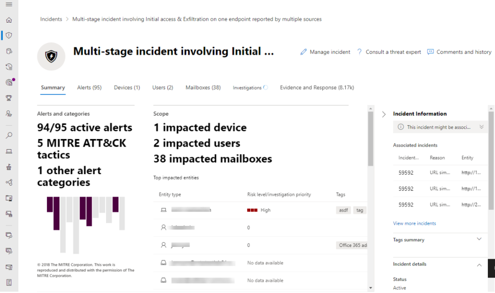

# Microsoft 365Defender 概述Microsoft 365 Defender overview

[!INCLUDE [Microsoft 365 Defender rebranding](../includes/microsoft-defender.md)]

**適用於：****Applies to:**

- [Microsoft 365 DefenderMicrosoft 365 Defender](microsoft-365-defender.md)
- [適用於端點的 Microsoft DefenderMicrosoft Defender for Endpoint](https://go.microsoft.com/fwlink/p/?linkid=2154037)
- [適用於 Office 365 的 Microsoft DefenderMicrosoft Defender for Office 365](/microsoft-365/security/office-365-security/defender-for-office-365)

> 想要體驗 Microsoft 365 Defender 嗎？Want to experience Microsoft 365 Defender? 您可以[在實驗室環境中評估](m365d-evaluation.md?ocid=cx-docs-MTPtriallab) 或[在生產環境中執行試驗專案](m365d-pilot.md?ocid=cx-evalpilot)。You can [evaluate it in a lab environment](m365d-evaluation.md?ocid=cx-docs-MTPtriallab) or [run your pilot project in production](m365d-pilot.md?ocid=cx-evalpilot).

**Microsoft 365 Defender** ([https://security.microsoft.com](https://security.microsoft.com)) 結合了保護、偵測 *、* 調查，以及對 *電子郵件*、共同作業、身分 *識別* 及 *裝置* 威脅的回應，集中入口網站。**Microsoft 365 Defender** ([https://security.microsoft.com](https://security.microsoft.com)) combines protection, detection, investigation, and response to *email*, *collaboration*, *identity*, and *device* threats, in a central portal.

Microsoft 365Defender 會將現有 Microsoft 安全性入口網站的功能彙集在一起，如 Microsoft Defender 資訊安全中心和 Office 365 安全性 & 規範中心。Microsoft 365 Defender brings together functionality from existing Microsoft security portals, like Microsoft Defender Security Center and the Office 365 Security & Compliance center. [安全性中心] 強調快速存取訊號、簡化版面配置，以及將相關資訊放在一起，以方便使用。The security center emphasizes quick access to information, simpler layouts, and bringing related information together for easier use. 此中心包括：This center includes:

- **[Microsoft Defender Office 365](/microsoft-365/security/office-365-security/defender-for-office-365)** 適用于 Office 365 的 Microsoft Defender 可協助組織使用一組預防、偵測和搜尋功能保護其企業，以保護電子郵件，並 Office 365 資源。**[Microsoft Defender for Office 365](/microsoft-365/security/office-365-security/defender-for-office-365)** Microsoft Defender for Office 365 helps organizations secure their enterprise with a set of prevention, detection, investigation and hunting features to protect email, and Office 365 resources.
- **[Microsoft Defender For Endpoint](/microsoft-365/security/defender-endpoint/microsoft-defender-advanced-threat-protection)** 會為組織中的裝置提供預防性保護、入侵後偵測、自動調查和回應。**[Microsoft Defender for Endpoint](/microsoft-365/security/defender-endpoint/microsoft-defender-advanced-threat-protection)** delivers preventative protection, post-breach detection, automated investigation, and response for devices in your organization.
- **[Microsoft 365 Defender](microsoft-365-defender.md)** 是 Microsoft 的 *延伸偵測和回應* (XDR) 解決方案的一部分，利用 Microsoft 365 的安全性產品群組，可以自動分析跨網域的威脅資料，並在單一儀表板上建立攻擊的圖片。**[Microsoft 365 Defender](microsoft-365-defender.md)** is part of Microsoft’s *Extended Detection and Response* (XDR) solution that leverages the Microsoft 365 security portfolio to automatically analyze threat data across domains, and build a picture of an attack on a single dashboard.

如果您需要 Office 365 安全性 & 規範中心或 Microsoft Defender 資訊安全中心中所做變更的相關資訊，請參閱：If you need information about what's changed from the Office 365 Security & Compliance center or the Microsoft Defender Security Center, see:

- [Microsoft 365 defender 中 Office 365 的 defenderDefender for Office 365 in Microsoft 365 Defender](microsoft-365-security-center-mdo.md)
- [Microsoft 365 defender 中的端點的 defenderDefender for Endpoint in Microsoft 365 Defender](microsoft-365-security-center-mde.md)

> [!NOTE]
> Microsoft 365 安全性入口網站會使用並強制執行現有的角色型存取，並將每一種安全性模型移至統一入口網站。The Microsoft 365 security portal uses and enforces existing roles-based access, and will move each security model into the unified portal. 每個收斂工作負載 (例如 MDO 或 MDE) 具有自己的角色型存取權。Each converged workload (such as MDO or MDE) has its own roles-based access. 產品中已有的角色將會自動收斂至 Microsoft 365 的安全性入口網站。The roles already in the products will be converged into the Microsoft 365 security portal, automatically. 不過，MCAS 的角色和許可權仍會在 MCAS 中處理。However, roles and permissions for MCAS will still handled over in MCAS.

## 預期的專案What to expect

在 Office 365 安全性與合規性中心 (protection.office.com) 和 Microsoft Defender security center (securitycenter.microsoft.com) 中所使用的所有安全性內容，現在都可以在 *Microsoft 365 Defender* 中找到。All the security content that you use in the Office 365 Security and Compliance Center (protection.office.com) and the Microsoft Defender security center (securitycenter.microsoft.com) can now be found in the *Microsoft 365 Defender*.

Microsoft 365Defender 可協助安全小組調查和回應攻擊，方法是將不同工作負載的信號引入一組整合體驗：Microsoft 365 Defender helps security teams investigate and respond to attacks by bringing in signals from different workloads into a set of unified experiences for:

- 事件 & 警示Incidents & alerts
- 搜捕Hunting
- 控制中心Action center
- 威脅分析Threat analytics

Microsoft 365當合併 microsoft defender for Office 365 和 microsoft defender for Endpoint 時，Defender 強調 *unity、清晰度及共同目標*。Microsoft 365 Defender emphasizes *unity, clarity, and common goals* as it merges Microsoft Defender for Office 365 and Microsoft Defender for Endpoint. 合併是以下列所列的優先順序為基礎，而不犧牲每個安全性套件所加入的功能：The merge was based on the priorities listed below, and made without sacrificing the capabilities that each security suite brought to the combination of:

- 萬用群組建區塊Common building blocks
- 常見術語Common terminology
- 一般實體Common entities
- 與其他工作負載的功能同位Feature parity with other workloads

> [!NOTE]
> Microsoft 365您不需要讓客戶進行遷移步驟或購買新的授權，即可存取 Defender。Microsoft 365 Defender will be accessible without any need for customers to take migration steps or purchase a new license. 例如，具有 E3 訂閱的系統管理員可以存取這個新入口網站，就像使用 Microsoft Defender 做為 Office 365 方案1和方案2一樣）。不過，Exchange Online Protection 或 MDO Plan 1 客戶只會看到其訂閱授權所支援的安全性功能。For example, this new portal will be accessible to administrators with an E3 subscription, just as it is to those with Microsoft Defender for Office 365 Plan 1 and Plan 2; however, Exchange Online Protection, or MDO Plan 1 customers will see only the security features their subscription license supports. 新的中心目標是集中安全性。The goal of the new center is to centralize security.

## 整合調查Unified investigations

彙聚安全性中心建立單一位置，以用於調查各 Microsoft 365 的安全性事件。Converging security centers creates a single place for investigating security incidents across Microsoft 365. 主要範例是 Microsoft 365 Defender 的快速啟動上之 **事件 & 警示** 的 **事件**。A primary example is **Incidents** under **Incidents & alerts** on the quick launch of Microsoft 365 Defender.

:::image type="content" source="../../media/converged-incidents-2.png.png" alt-text="Microsoft 365 Defender 中的 [事件] 頁面。":::

選取 [事件名稱] 會顯示一個頁面，其中會示範「整合」安全中心的價值。Selecting an incident name displays a page that demonstrates the value of converging security centers.

:::image type="content" source="../../media/converged-incident-info-3.png" alt-text="Microsoft 365 Defender 中的事件摘要頁面範例":::

<!--

--> 

在 [事件] 頁面的頂端，您會看到 **摘要**、 **警示**、 **裝置**、 **使用者**、 **信箱**、 **調查** 和 **證據** 索引標籤。Along the top of an incident page, you'll see the **Summary**, **Alerts**, **Devices**, **Users**, **Mailboxes**, **Investigations**, and **Evidence** tabs. 如需詳細資訊，請選取這些索引標籤。Select these tabs for more detailed information. 例如，[**使用者**] 索引標籤會顯示聚合工作負載 (microsoft defender for Endpoint、microsoft defender 身分識別及 Microsoft Cloud App Security) 和來源範圍（如內部部署 Active Directory 網域服務 (AD DS) 、Azure Active Directory (Azure AD) 和協力廠商身分識別提供者）的使用者資訊。For example, the **Users** tab displays information for users from converged workloads (Microsoft Defender for Endpoint, Microsoft Defender for Identity, and Microsoft Cloud App Security) and a range of sources such as on-premises Active Directory Domain Services (AD DS), Azure Active Directory (Azure AD), and third-party identity providers. 如需詳細資訊，請參閱 [調查使用者](investigate-users.md)。For more information, see [investigate users](investigate-users.md).

花時間複習您環境中的事件、深入查看這些索引標籤，並練習如何針對不同類型的威脅存取針對事件所提供的資訊。Take the time to review the incidents in your environment, drill down into these tabs, and practice building an understanding of how to access the information provided for incidents for different kinds of threats.

如需詳細資訊，請參閱[Microsoft 365 Defender 中的事件](incidents-overview.md)。For more information, see [incidents in Microsoft 365 Defender](incidents-overview.md).

## 改進的處理常式Improved processes

常見的控制項和內容會出現在相同的位置，或是壓縮成一個資料摘要，使其更容易尋找。Common controls and content either appear in the same place, or are condensed into one feed of data making it easier to find. 例如，統一設定。For example, unified settings.

### 統一設定Unified settings

![按一下 [Role]，然後開啟 [設定] 頁面，其中包括一般設定、許可權、APIs 和規則。](../../media/converged-add-role-9.png)

### 許可權 & 角色Permissions & roles

![& 角色] 頁面顯示端點角色的許可權 & 群組、角色和裝置群組。](../../media/converged-roles-5.png)

 使用 Azure Active Directory 通用角色或使用自訂角色設定 Microsoft 365 Defender 的存取權。Access to Microsoft 365 Defender is configured with Azure Active Directory global roles or by using custom roles. 若為 Defender for Endpoint，請參閱[Assign user access to Microsoft Defender 資訊安全中心](/microsoft-365/security/defender-endpoint/assign-portal-access)。For Defender for Endpoint, see [Assign user access to Microsoft Defender Security Center](/microsoft-365/security/defender-endpoint/assign-portal-access). 若為 Office 365 的 Defender，請參閱[Microsoft 365 規範中心的許可權和 Microsoft 365 Defender](../office-365-security/permissions-microsoft-365-compliance-security.md)。For Defender for Office 365, see [Permissions in the Microsoft 365 compliance center and Microsoft 365 Defender](../office-365-security/permissions-microsoft-365-compliance-security.md).

- 深入瞭解如何[管理 Microsoft 365 Defender 的存取權](m365d-permissions.md)Learn more about how to [manage access to Microsoft 365 Defender](m365d-permissions.md)
- 深入瞭解如何在 Microsoft 365 Defender 中[建立自訂角色](custom-roles.md)Learn more about how to [create custom roles](custom-roles.md) in Microsoft 365 Defender

> [!NOTE]
> Microsoft 365 defender 中的 Microsoft defender for Endpoint 支援在[microsoft defender security center 中授](./mssp-access.md)與存取[受管理的安全性服務提供者 (MSSPs) ](/windows/security/threat-protection/microsoft-defender-atp/grant-mssp-access)的方式。Microsoft Defender for Endpoint in Microsoft 365 Defender supports [granting access to managed security service providers (MSSPs)](/windows/security/threat-protection/microsoft-defender-atp/grant-mssp-access) in the same that way access is [granted in the Microsoft Defender security center](./mssp-access.md).

### 整合報告Integrated reports

報表在 Microsoft 365 Defender 中也是統一的。Reports are also unified in Microsoft 365 Defender. 系統管理員可以從一般的安全性報告開始，並在特定報告中分支至相關的端點、電子郵件 & 協同作業。Admins can start with a general security report, and branch into specific reports about endpoints, email & collaboration. 此處的連結是根據工作負載設定動態產生。The links here are dynamically generated based upon workload configuration.

### 快速查看您的 Microsoft 365 環境Quickly view your Microsoft 365 environment

**首頁** 會顯示許多安全小組需要的常見智慧卡。The **Home** page shows many of the common cards that security teams need. 名片和資料的組成取決於使用者角色。The composition of cards and data is dependent on the user role. 因為 Microsoft 365 的安全性中心使用角色型存取控制，所以不同的角色會在日常工作中看到更有意義的卡片。Because Microsoft 365 security center uses role-based access control, different roles will see cards that are more meaningful to their day to day jobs.  

這種一覽的資訊可協助您維持組織中的最新活動。This at-a-glance information helps you keep up with the latest activities in your organization. Microsoft 365Defender 會將不同來源的信號彙集在一起，以呈現您 Microsoft 365 環境的整體觀點。Microsoft 365 Defender brings together signals from different sources to present a holistic view of your Microsoft 365 environment.

這些卡片分為下列類別：The cards fall into these categories:

- 身分 **識別-監視** 組織中的身分識別，並追蹤可疑或危險的行為。**Identities**- Monitor the identities in your organization and keep track of suspicious or risky behaviors. [深入瞭解身分識別保護](/azure/active-directory/identity-protection/overview-identity-protection)。[Learn more about identity protection](/azure/active-directory/identity-protection/overview-identity-protection).
- **Data** -Help 追蹤可能會導致未經授權的資料洩漏的使用者活動。**Data** - Help track user activity that could lead to unauthorized data disclosure.
- **裝置** -在您的裝置上獲得最新資訊，提醒、違規活動及其他威脅。**Devices** - Get up-to-date information on alerts, breach activity, and other threats on your devices.
- **App** -深入瞭解您的組織中使用雲端應用程式的方式。**Apps** - Gain insight into how cloud apps are being used in your organization. [深入瞭解雲端 App 安全性探索的應用程式](/cloud-app-security/discovered-apps)。[Learn more about Cloud App Security discovered apps](/cloud-app-security/discovered-apps).

## 更好的資料覆蓋率進行威脅分析Threat analytics with better data coverage
使用下列 Microsoft 365 Defender 威脅分析整合體驗，追蹤和回應新興威脅：Track and respond to emerging threats with the following Microsoft 365 Defender threat analytics integrated experience:

- 在 microsoft defender for Endpoint 和 microsoft defender for Office 365 之間提供更佳的資料覆蓋率，使綜合的事件管理、自動調查、修復、預防或反應性的威脅搜尋都有可能。Better data coverage between Microsoft Defender for Endpoint and Microsoft Defender for Office 365, making combined incident management, automatic investigation, remediation, and proactive or reactive threat hunting across-domain possible. 
- microsoft defender 針對 Office 365 的電子郵件相關偵測和緩解，除了 microsoft defender for endpoint 中已提供的端點資料之外。Email-related detections and mitigations from Microsoft Defender for Office 365, in addition to the endpoint data already available from Microsoft Defender for Endpoint.
- 威脅相關事件的觀點，可將提醒彙集至 microsoft defender for Endpoint 和 microsoft defender for Office 365 中的端對端攻擊案例，以減少工作佇列，並簡化及加快調查速度。A view of threat-related incidents which aggregate alerts into end-to-end attack stories across Microsoft Defender for Endpoint and Microsoft Defender for Office 365 to reduce the work queue, as well as simplify and speed up your investigation.
- Microsoft 365 Defender 解決方案所偵測到並封鎖的攻擊企圖。Attack attempts detected and blocked by Microsoft 365 Defender solutions. 此外，您還可以使用可讓您用來驅動預防性動作的資料，緩解進一步披露及提高恢復的風險。There's also data that you can use to drive preventive actions that mitigate the risk of further exposure and increase resilience. 
- 增強型設計可將可行動的資訊放在聚光燈中，協助您快速識別從報告中即時關注、調查和利用的資料。Enhanced design that puts actionable information in the spotlight to help you  quickly identify data to urgently focus on, investigate, and leverage from the reports.

## 集中式學習中樞A centralized Learning Hub

Microsoft 365 的安全性中心包含的學習中樞可深入瞭解 microsoft 安全性博客、YouTube 上的 microsoft security 社區，以及 docs.microsoft.com 的官方檔等資源的官方指導方針。Microsoft 365 security center includes a learning hub that bubbles up official guidance from resources such as the Microsoft security blog, the Microsoft security community on YouTube, and the official documentation at docs.microsoft.com.

在學習中樞內，電子郵件 & 共同作業 (microsoft defender for Office 365 或 MDO) 指導方針是以 (microsoft defender for endpoint 或 MDE) 做並列的方式，而且 Microsoft 365 的 Defender 學習資源。Inside the learning hub, Email & Collaboration (Microsoft Defender for Office 365 or MDO) guidance is side-by-side with Endpoint (Microsoft Defender for Endpoint or MDE), and Microsoft 365 Defender learning resources.

學習中心隨即開啟，並以類似「如何使用 Microsoft 365 Defender 進行調查」主題所組織的教學路徑來開啟。The learning hub opens with Learning paths organized around topics such as “How to Investigate Using Microsoft 365 Defender?” 和「Microsoft Defender for Office 365 最佳作法》。and “Microsoft Defender for Office 365 Best Practices”. 此區段目前是由 Microsoft 中的安全性產品群組策劃。This section is currently curated by the security Product Group inside Microsoft. 每個學習路徑會反映所需的預測時間，以取得概念。Each Learning path reflects a projected time it takes to get through the concepts. 例如，預計 Microsoft Defender Office 365 使用者帳戶受到危害時所採取的步驟，將需要8分鐘，而且可以即時瞭解有價值的知識。For example 'Steps to take when a Microsoft Defender for Office 365 user account is compromised' is projected to take 8 minutes, and is valuable learning on the fly.

按一下內容之後，將此網站做成書簽並將書簽組織至 ' Security ' 或 ' 嚴重」資料夾可能會很有用。After clicking through to the content, it may be useful to bookmark this site and organize bookmarks into a 'Security' or 'Critical' folder. 若要查看所有學習路徑，請按一下主面板中的 [全部顯示] 連結。To see all Learning paths, click the Show all link in the main panel.

> [!NOTE]
> Microsoft 365 defender 教學中樞的最上層有一些有説明的 **篩選準則**，可讓您在目前 Microsoft 365 的產品 (、microsoft defender for Endpoint 和 microsoft defender for Office 365) 中，進行選擇。There are helpful **filters** along the top of Microsoft 365 Defender learning hub that will let you choose between products (currently Microsoft 365 Defender, Microsoft Defender for Endpoint, and Microsoft Defender for Office 365). 請注意，會列出每個區段的學習資源數目，可協助教學人員追蹤他們手頭的訓練和學習資源數目。Notice that the number of learning resources for each section is listed, which can help learners keep track of how many resources they have at hand for training and learning.
>
> 除了產品篩選、目前主題、 (從影片到網路研討會的資源類型) 、熟悉或經驗的安全性區域、安全性角色及產品功能的層級。Along with the Product filter, current topics, types of resources (from videos to webinars), levels of familiarity or experience with security areas, security roles, and product features are listed.

> [!TIP]
> 在 [Microsoft 中學](/e/learn/)中還有許多其他的學習機會。There are lots of other learning opportunities in [Microsoft Learn](/e/learn/). 您可以找到認證訓練，例如[課程500T02：實施 Microsoft 365 威脅防護](/learn/certifications/courses/ms-500t02)。You'll find certification training such as [Course MS-500T02-A: Implementing Microsoft 365 Threat Protection](/learn/certifications/courses/ms-500t02).

## 將您的意見傳送給我們Send us your feedback

我們需要您的意見反應。We need your feedback. 我們一定會尋求改進功能，因此，如果有您想要看到的內容，請[傳送您 Microsoft 365 的 Defender 意見](https://www.microsoft.com/videoplayer/embed/RE4K5Ci)反應給我們。We're always looking to improve, so if there's something you'd like to see, [send us your Microsoft 365 Defender feedback](https://www.microsoft.com/videoplayer/embed/RE4K5Ci).

您也可以留下本文的意見反應。You can also leave feedback from this article. 在「提交並查看意見反應」下方的「意見反應」區段中，選項是 *此產品* 或 *此頁面*。In the 'Feedback' section at the end under 'Submit and view feedback for', the options are *This product*, or *This page*.

針對 *產品* 回饋使用 **此產品** 按鈕：Use the **This product** button for *product* feedback:

1. 選取本文底部的 [ *本產品* ]。Select *This product* at the bottom of the article.
    1. 如果您想要繼續閱讀這些指示，請在按鈕上按一下滑鼠右鍵，然後按一下 [在新索引標籤中開啟]。Right-click the button and 'Open in a new tab' if you want to keep reading these directions.
2. 這會流覽至 **UserVoice 論壇**。This will navigate to the **UserVoice forum**.
3. 您有2個選項：You have 2 options:
    1. 向左下到文字方塊，*我們應如何改善法規遵從性，或在 Office 365 中更好地保護您的使用者*，並在 *Microsoft 365 Defender* 中貼上。Scroll down to the text box *How can we improve compliance or protect your users better in Office 365?* and paste in *Microsoft 365 Defender*. 您可以搜尋結果與您的觀點，並向上-投票，或使用按鈕 **發佈新的觀點**。You can search the results for an idea like yours and up-vote it, or use the button for **Post a new idea**.
    1. 如果您認為已經報告此問題，而且想要使用投票 (或投票) 提升其設定檔，請使用 UserVoice 右側的 [ *提供意見* 反應] 方塊。If you feel certain this issue is already reported, and want to raise its profile with a vote (or votes), use the *Give Feedback* box on the right side of UserVoice. 搜尋 *Microsoft 365 Defender*、**找出問題，然後使用 [投票] 按鈕** 提升其狀態。Search for *Microsoft 365 Defender*, **find the issue, and use the vote button** to raise its status.

使用 *此頁面* 以取得文章本身的回饋。Use *This page* for feedback on the article itself. 感謝您的意見反應。Thanks for your feedback. 您的語音可協助我們改進產品。Your voice helps us improve products.

### 探索「安全性中心」所提供的功能Explore what the security center has to offer

繼續探索 Microsoft 365 Defender 的功能：Keep exploring the features and capabilities in Microsoft 365 Defender:

- [管理事件及警示Manage incidents and alerts](manage-incidents.md)
- [使用威脅分析追蹤並回應新興威脅Track and respond to emerging threats with threat analytics](threat-analytics.md)
- [控制中心The Action center](m365d-action-center.md)
- [跨裝置、電子郵件、應用程式和身分識別搜捕威脅Hunt for threats across devices, emails, apps, and identities](./advanced-hunting-query-emails-devices.md)
- [自訂偵測規則Custom detection rules](./custom-detection-rules.md)
- [電子郵件與共同作業警示Email & collaboration alerts](../../compliance/alert-policies.md#default-alert-policies)
- [建立網路釣魚攻擊模擬](../office-365-security/attack-simulation-training.md) ，並 [建立訓練您的小組的負載](/microsoft-365/security/office-365-security/attack-simulation-training-payloads)[Create a phishing attack simulation](../office-365-security/attack-simulation-training.md) and [create a payload for training your teams](/microsoft-365/security/office-365-security/attack-simulation-training-payloads)
 
### 相關資訊Related information
- [Microsoft 365 Defender 中的 Microsoft Defender Office 365Microsoft Defender for Office 365 in Microsoft 365 Defender](microsoft-365-security-center-mdo.md)
- [Microsoft 365 defender 中的 Microsoft defender for EndpointMicrosoft Defender for Endpoint in Microsoft 365 Defender](microsoft-365-security-center-mde.md)
- [將帳戶從 Microsoft Defender for Endpoint 重新導向至 Microsoft 365 DefenderRedirecting accounts from Microsoft Defender for Endpoint to Microsoft 365 Defender](microsoft-365-security-mde-redirection.md)