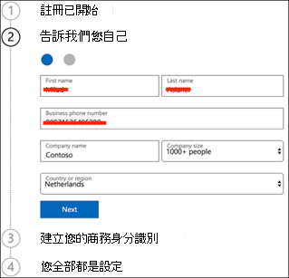
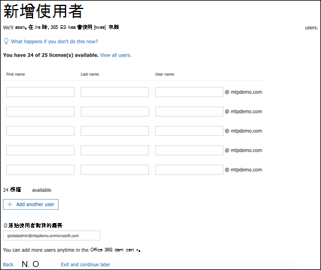
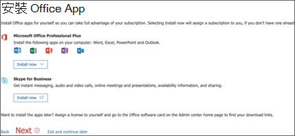

# 設定 Microsoft 365 的 Defender 試用實驗室環境Set up your Microsoft 365 Defender trial lab environment 

[!INCLUDE [Microsoft 365 Defender rebranding](../includes/microsoft-defender.md)]

**適用於：****Applies to:**
- Microsoft 365 DefenderMicrosoft 365 Defender 

建立 Microsoft 365 的 Defender 試用實驗室或試驗環境並加以部署時，會有三個階段的程式：Creating a Microsoft 365 Defender trial lab or pilot environment and deploying it is a three-phase process:

| [階段 1：準備Phase 1: Prepare](prepare-m365d-eval.md) | 階段 2：設定Phase 2: Set up | [第 3 階段：導入Phase 3: Onboard](config-m365d-eval.md) |  [回到試驗行動手冊Back to pilot playbook](m365d-pilot.md) |
|--|--|--|--|
||*您在這裡！**You are here!*  | | |

您目前是在 [設定] 階段。You're currently in the set up phase. 請先開始存取 Microsoft 365 的安全性中心，然後設定您的試用實驗室或試驗環境。Take the initial steps to access Microsoft 365 Security Center then set up your trial lab or pilot environment.

註冊 Office 365 或 Azure Active Directory 訂閱，以產生可用於註冊 Microsoft 365 E5 授權的 *onmicrosoft.com* 租使用者。Sign up for an Office 365 or Azure Active Directory subscription to generate a *.onmicrosoft.com* tenant that you can use to sign up for your Microsoft 365 E5 license. 

>[!NOTE]
>如果您已經有現有的 Office 365 或 Azure Active Directory 訂閱，則可以略過 Office 365 E5 試用版或試驗承租人建立步驟。If you already have an existing Office 365 or Azure Active Directory subscription, you can skip the Office 365 E5 trial or pilot tenant creation steps.

在這個階段中，您將會指導您：In this phase, you'll be guided to:
- 建立 Office 365 E5 試用租使用者Create an Office 365 E5 trial tenant
- 啟用 Microsoft 365 試用訂閱Enable Microsoft 365 trial subscription

## 建立 Office 365 E5 試用租使用者Create an Office 365 E5 trial tenant
>[!NOTE]
>如果您已經有現有的 Office 365 或 Azure Active Directory 訂閱，您可以略過 Office 365 E5 試用租使用者建立步驟。If you already have an existing Office 365 or Azure Active Directory subscription, you can skip the Office 365 E5 trial tenant creation steps.

1. 移至 [Office 365 E5 產品入口網站](https://www.microsoft.com/microsoft-365/business/office-365-enterprise-e5-business-software?activetab=pivot%3aoverviewtab)，然後選取 [**免費試用版**]。Go to the [Office 365 E5 product portal](https://www.microsoft.com/microsoft-365/business/office-365-enterprise-e5-business-software?activetab=pivot%3aoverviewtab) and select **Free trial**.

   
  
2. 輸入您的電子郵件地址 (個人或公司) ，以完成試用註冊。Complete the trial registration by entering your email address (personal or corporate). 按一下 [ **設定帳戶**]。Click **Set up account**.

   ![影像 of_Office 365 E5 試用版註冊設定] 頁面](../../media/mtp-eval-10.png)

3. 請填入您的名字、姓氏、商務電話號碼、公司名稱、公司規模和國家或地區。Fill in your first name, last name, business phone number, company name, company size, and country or region.  

   
   
   > [!NOTE]
   > 您在這裡設定的國家或地區決定 Office 365 將主控的資料中心區域。The country or region you set here determines the data center region your Office 365 will be hosted.
  
4. 選擇您的驗證喜好設定：透過短信或來電。Choose your verification preference: through a text message or call. 按一下 [ **傳送驗證碼**]。Click **Send Verification Code**. 

   

5. 為您的租使用者設定自訂的功能變數名稱，然後按 **[下一步]**。Set the custom domain name for your tenant, then click **Next**.

   ![影像 of_Office 365 E5 試用註冊設定] 頁面，您可以在其中設定自訂功能變數名稱](../../media/mtp-eval-13.png)
 
6. 設定第一個身分識別，這將是租使用者的全域管理員。Set up the first identity, which will be a Global Administrator for the tenant. 填入 **名稱** 和 **密碼**。Fill in **Name** and **Password**. 按一下 [ **註冊**]。Click **Sign up**.

   ![影像 of_Office 365 E5 試用註冊設定] 頁面，您可以在這裡設定您的商務身分識別](../../media/mtp-eval-14.png)

7. 按一下 [**移至設定**] 以完成 Office 365 E5 試用租使用者布建。Click **Go to Setup** to complete the Office 365 E5 trial tenant provisioning.

   ![Office 365 E5 試用註冊設定頁面的影像，提示按一下 [開始設定] 按鈕](../../media/mtp-eval-15.png)

8. 連線公司網域加入 Office 365 租使用者。Connect your corporate domain to the Office 365 tenant. 選選擇 [**連線您已擁有的網域**，然後輸入您的功能變數名稱。[Optional] Choose **Connect a domain you already own** and type in your domain name. 按 [下一步 **]**。Click **Next**.

   
 
9. 新增 TXT 或 MX 記錄以驗證網域擁有權。Add a TXT or MX record to validate the domain ownership. 將 TXT 或 MX 記錄新增至您的網域後，請選取 [ **驗證**]。Once you’ve added the TXT or MX record to your domain, select **Verify**.

   
 
10. 選為您的租使用者建立更多使用者帳戶。[Optional] Create more user accounts for your tenant. 您可以按 **[下一步]** 略過此步驟。You can skip this step by clicking **Next**.

    
 
11. 選下載 Office 的應用程式。[Optional] Download Office apps. 按 **[下一步]** 略過此步驟。Click **Next** to skip this step. 

    

12. 選遷移電子郵件。[Optional] Migrate email messages. 您也可以略過此步驟。Again, you can skip this step.

    
 
13. 選擇 [線上服務]。Choose online services. 選取 **Exchange** ，然後按 **[下一步]**。Select **Exchange** and click **Next**. 

    

14. 將 MX、CNAME 及 TXT 記錄新增至您的網域。Add MX, CNAME, and TXT records to your domain. 完成時，選取 [ **驗證**]。When completed, select **Verify**.

    
 
15. 恭喜，您已完成對 Office 365 租使用者的布建。Congratulations, you have completed the provisioning of your Office 365 tenant.

    

## 啟用 Microsoft 365 試用訂閱Enable Microsoft 365 trial subscription

>[!NOTE]
>註冊試用版可提供25個使用者授權供一個月使用。Signing up for a trial gives you 25 user licenses to use for a month. 如需詳細資訊，請參閱 [Try Or 購買 M365 訂閱](../../commerce/try-or-buy-microsoft-365.md) 。See [Try or Buy an M365 subscription](../../commerce/try-or-buy-microsoft-365.md) for details.

1. 從 [Microsoft 365 系統管理中心](https://admin.microsoft.com/)，按一下 [**帳單**]，然後流覽至 [**購買服務**]。From [Microsoft 365 Admin Center](https://admin.microsoft.com/), click **Billing** and then navigate to **Purchase services**.

2. 選取 **Microsoft 365 E5** ，然後按一下 [**開始免費試用**]。Select **Microsoft 365 E5** and click **Start free trial**. 

   

3. 選擇您的驗證喜好設定：透過短信或來電。Choose your verification preference: through a text message or call. 決定之後，請輸入電話號碼、選取 [ **文字** ] 或 [ **呼叫我** ]，視您的選擇而定。Once you have decided, enter the phone number, select **Text me** or **Call me** depending on your selection.

   
 
4. 輸入驗證碼，然後按一下 [ **開始免費試用**]。Enter the verification code and click **Start your free trial**.

   

5. 按一下 [**立即試用**] 以確認您的 Microsoft 365 E5 試用版。Click **Try now** to confirm your Microsoft 365 E5 trial.

   
 
6. 移至 **Microsoft 365 系統管理中心**  >  **使用者** 作用中的  >  **使用者**。Go to the **Microsoft 365 Admin Center** > **Users** > **Active users**. 選取您的使用者帳戶，選取 [**管理產品授權**]，然後換用 Office 365 E5 到 **Microsoft 365 E5** 的授權。Select your user account, select **Manage product licenses**, then swap the license from Office 365 E5 to **Microsoft 365 E5**. 按一下 **[儲存]**。Click **Save**.

   
 
7. 再次選取全域管理員帳戶，然後按一下 [ **管理使用者名稱**]。Select the global administrator account again then click **Manage username**.

   ![Image of_Microsoft 365 系統管理中心] 頁面，您可以在其中選取 [帳戶]，然後管理使用者名稱](../../media/mtp-eval-29.png)

8. 選根據您在先前步驟中選取的專案，將網域從 *onmicrosoft.com* 變更為您自己的網域。[Optional] Change the domain from *onmicrosoft.com* to your own domain—depending on what you chose on the previous steps. 按一下 **[儲存變更]**。Click **Save changes**.

   ![Image of_Microsoft 365 系統管理中心] 頁面，您可以在其中變更您的網域偏好設定](../../media/mtp-eval-30.png)

## 下一步Next step
|[階段3：設定板載 &Phase 3: Configure & Onboard](config-m365d-eval.md) | 針對您的 Microsoft 365 Defender 試用實驗室或試驗環境和上架端點，設定每個 Microsoft 365 Defender pillar。Configure each Microsoft 365 Defender pillar for your Microsoft 365 Defender trial lab or pilot environment and onboard your endpoints.
|:-------|:-----|
