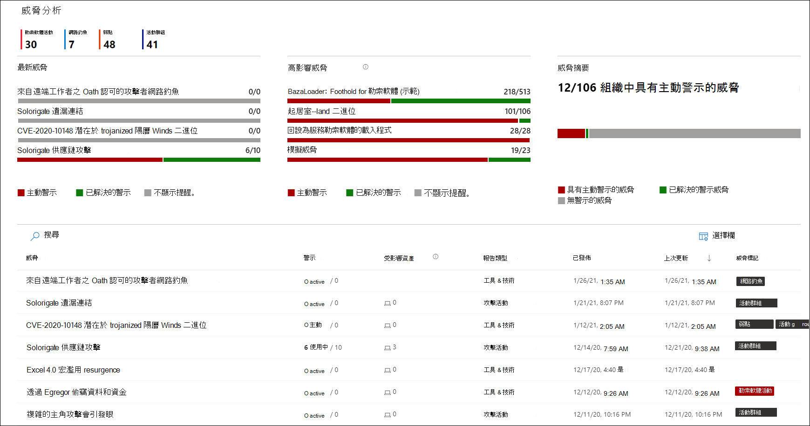
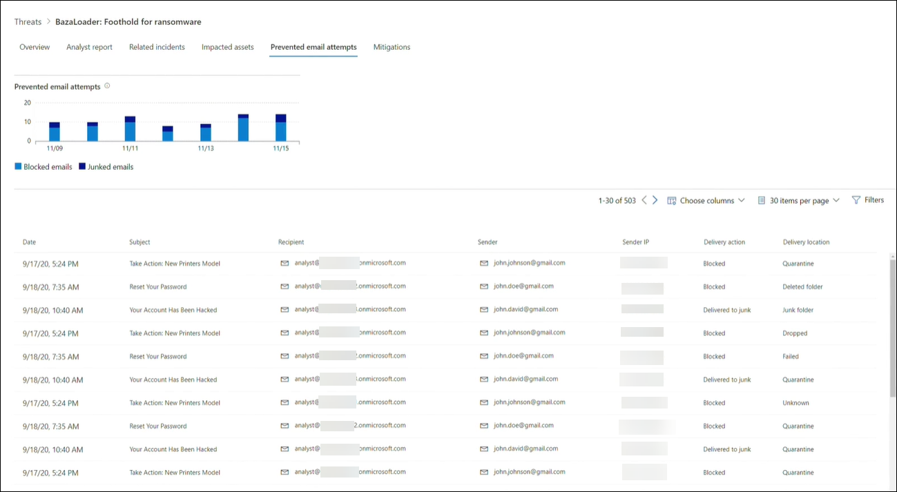
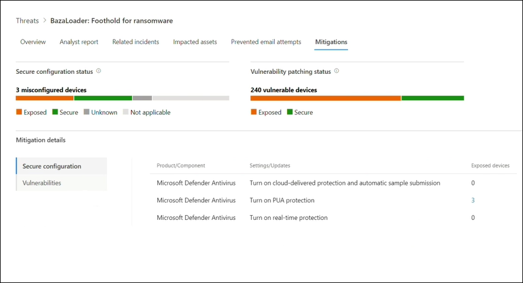

# 使用威脅分析追蹤並回應新興威脅 

[!INCLUDE [Microsoft 365 Defender rebranding](../includes/microsoft-defender.md)]

**適用於：**
- Microsoft 365 Defender

> 想要體驗 Microsoft 365 Defender 嗎？ 您可以[在實驗室環境中評估](m365d-evaluation.md?ocid=cx-docs-MTPtriallab) 或[在生產環境中執行試驗專案](m365d-pilot.md?ocid=cx-evalpilot)。
>

[!INCLUDE [Prerelease](../includes/prerelease.md)]

威脅分析是來自專家 Microsoft 安全性調查的產品威脅情報解決方案，其設計目的是為了協助安全性小組盡可能有效地應對新興威脅，包括：

- 作用中的威脅演員及其活動
- 常見和新的攻擊技術
- 嚴重弱點
- 常見的攻擊面
- 流行惡意程式碼

請觀看這段簡短的影片，深入瞭解威脅分析如何協助您追蹤最新的威脅並加以停止。

>[!VIDEO https://www.microsoft.com/en-us/videoplayer/embed/RWwJfU]

您可以從 Microsoft 365 安全性入口網站導覽列的左上方或專用的儀表板卡，存取威脅分析，以顯示您組織中的主要威脅。深入瞭解使用中或持續進行的行銷活動，並瞭解透過威脅分析所進行的工作，可協助您瞭解安全性運作小組的決策。 

_在何處存取威脅分析_

透過經常和 prevalently 的複雜敵人和新威脅，您可以快速：

- 識別並應對新興威脅 
- 瞭解您目前是否受到攻擊
- 評估對資產的威脅影響
- 檢查威脅的復原能力或洩密
- 識別您可以採取以停止或包含威脅的緩解、修復或防護動作

每個報告都提供有關如何抵禦威脅之追蹤威脅和大量指導的分析。 它也會整合您網路的資料，指出威脅是否作用中，以及您是否有適當的保護。

## 查看威脅分析儀表板

「威脅分析」儀表板 ([security.microsoft.com/threatanalytics3](https://security.microsoft.com/threatanalytics3)) 會強調最適合您組織的報表。 它會摘要說明下列各節中的威脅：

- **最新威脅**-列出最近發行或更新的威脅報告，以及作用中和已解決的提醒數目。
- **高影響威脅**-列出對您的組織具有最高影響的威脅。 本節會列出最高作用中且已解析之警示數目上限的威脅。
- **威脅摘要**—顯示所有追蹤威脅的整體影響，只要顯示使用中及已解決之警示的威脅數目。

從儀表板選取威脅，以查看該威脅的報告。

_威脅分析儀表板。您也可以在與您想要讀取之威脅分析報告相關的關鍵字中，按一下 [搜尋] 圖示。_ 

## 查看威脅分析報告

每個威脅分析報告都提供若干區段中的資訊： 

- [**概觀**](#overview-quickly-understand-the-threat-assess-its-impact-and-review-defenses) 
- [**分析報告**](#analyst-report-get-expert-insight-from-microsoft-security-researchers)
- [**相關的事件**](#related-incidents-view-and-manage-related-incidents)
- [**受影響資產**](#impacted-assets-get-list-of-impacted-devices-and-mailboxes)
- [**禁止電子郵件嘗試**](#prevented-email-attempts-view-blocked-or-junked-threat-emails)
- [**減輕方式**](#mitigations-review-list-of-mitigations-and-the-status-of-your-devices)

### 概覽：快速瞭解威脅、評估其影響，以及複查防護

[ **一覽表** ] 區段提供詳細分析報告的預覽。 它還提供圖表，以強調您的組織面臨的威脅影響，以及透過誤設定及未修補的裝置來公開。

![威脅分析報告之 [一覽] 區段的影像](../../media/threat-analytics/ta_overview_mtp.png)

_威脅分析報告的一覽區段_

#### 評估組織的影響
每個報告都包含設計用來提供威脅之組織影響的資訊的圖表：
- **相關事件**--透過下列資料，提供對組織之追蹤威脅影響的概覽：
  - 作用中警示的數目，以及與其相關聯的主動事件數目
  - 主動事件的嚴重性
- **隨時間的提醒**-顯示一段時間內 **的相關作用** 中和 **已解決** 的警示數目。 已解決的警示數目會指出組織對與威脅相關聯的提醒回應的快慢程度。 理想狀況下，圖表應該會顯示幾天內所解決的警示。
- **受影響的資產**-顯示目前至少有一個與追蹤威脅相關聯之主動警示的不同裝置和電子郵件帳戶的數量 (信箱) 。 會針對接收到威脅電子郵件的信箱觸發警示。 回顧組織和使用者層級原則，以進行導致威脅電子郵件傳送的覆寫。
- **禁止電子郵件嘗試**—顯示過去七天內已封鎖或傳送至 [垃圾郵件] 資料夾之前封鎖的電子郵件數目。

#### 檢查安全性恢復能力與狀況
每個報告都包含的圖表，可提供您的組織對特定威脅的彈性程度。
- **安全設定狀態**-顯示設定不當的安全性設定裝置數目。 套用建議的安全性設定，以協助緩解威脅。 如果裝置已套用 _所有_ 追蹤的設定，則會被視為 **安全** 裝置。
- **弱點修補狀態**-顯示有缺陷裝置的數目。 套用安全性更新或修補程式，以解決威脅所利用的漏洞。

### 分析報告：從 Microsoft security 研究員取得專家洞察力
在 [ **分析報告** ] 區段中，閱讀詳細的專家撰寫。 大多數報告提供攻擊鏈的詳細描述，包含對應至 MITRE ATT 的戰術和技術&CK 架構、詳盡的建議清單，以及強大的 [威脅搜尋](advanced-hunting-overview.md) 指導方針。

[深入瞭解分析報告](threat-analytics-analyst-reports.md)

### 相關的事件：查看及管理相關的事件
[ **相關事件** ] 索引標籤會提供與追蹤威脅相關的所有事件清單。 您可以指派事件或管理連結至每個事件的警示。 

_威脅分析報告的相關事件區段_

### 受影響的資產：取得受影響的裝置和信箱清單
如果資產受到作用中未解析的警示影響，便會視為受影響的資產。 [ **受影響的資產** ] 索引標籤會列出下列受影響的資產類型：
- **受影響的裝置**—具有未解析之 Microsoft Defender for Endpoint 警示的端點。 這些警示通常會引發 sightings 已知威脅指示器和活動。
- **受影響的信箱**：已接收的電子郵件已觸發 Microsoft Defender 以 Office 365 警示的信箱。 雖然通常會封鎖觸發提醒的郵件，但使用者或組織層級原則也可以覆寫篩選器。

_威脅分析報告的「受影響的資產」區段_

### 禁止電子郵件企圖：查看封鎖或 junked 威脅電子郵件
Microsoft Defender for Office 365 通常會封鎖具有已知威脅指示器的電子郵件，包括惡意連結或附件。 在某些情況下，檢查可疑內容的前瞻性篩選機制，會改為將威脅電子郵件傳送至 [垃圾郵件] 資料夾。 在任何情況下，在裝置上發動惡意程式碼碼威脅的機率都會降低。

「**防止的電子郵件嘗試**」索引標籤會列出所有已封鎖的電子郵件，再傳送或傳送至 Microsoft Defender for Office 365 的垃圾郵件資料夾。 

_威脅分析報告的 [防止電子郵件嘗試] 區段_

### 緩解：查看緩解清單和裝置狀態
在 [ **緩解** ] 區段中，複查可協助您增加組織對威脅抵禦能力的特定可行動建議清單。 追蹤的緩解措施清單包括：

- **安全性更新**-針對架裝置上的漏洞，部署支援的軟體安全性更新
- **支援的安全性設定**
  - 雲端提供的保護  
  - 可能有害的應用程式 (PUA) 保護
  - 即時保護
 
本節中的緩解資訊包含來自[威脅與弱點管理](/windows/security/threat-protection/microsoft-defender-atp/next-gen-threat-and-vuln-mgt)的資料，也就是從報告中各種連結提供的詳細深入資訊。

 ![ 弱點詳細資料之威脅分析報告之「緩解」區段之 [安全設定詳細資料] 的 [威脅分析] 區段的 [緩解] 區段的影像](../../media/threat-analytics/ta_mitigations_mtp2.png)

_威脅分析報告的緩解區段_

## 其他報告詳細資料與限制
>[!NOTE]
>在統一的安全性體驗中，威脅分析現在不僅適用于 microsoft defender for Endpoint，也適用于 microsoft defender 的 Office E5 授權擁有者。
>如果您未使用 Microsoft 365 安全性入口網站 (Microsoft 365 Defender) ，您也可以在 (入口網站 Office microsoft defender for Endpoint) 中，查看不含 Microsoft defender Microsoft Defender 資訊安全中心資料 (的報告詳細資料。 

若要存取威脅分析報告，您需要特定的角色和許可權。 如需詳細資訊，請參閱[Microsoft 365 Defender 的角色型存取控制中的自訂角色](custom-roles.md)。
  - 若要查看警示、事件或受影響的資產資料，您必須具有 microsoft defender for Office 或 microsoft defender for Endpoint 警示資料，或兩者的許可權。
  - 若要查看已禁止的電子郵件嘗試，您必須具有 Microsoft Defender 的許可權，才能 Office 搜尋資料。 
  - 若要查看緩解，您必須具有在 Microsoft Defender for Endpoint 中威脅與弱點管理資料的許可權。

在查看威脅分析資料時，請記住下列因素：
- 圖表只會反映所追蹤的緩解。 請查看報告中未顯示圖表的其他緩解。
- 緩解不會保證完全恢復。 提供的緩解反映改進恢復所需的最佳動作。
- 如果裝置未將資料傳輸至服務，則會將裝置計為「無法使用」。
- 防病毒相關的統計資料是以 Microsoft Defender 防毒軟體設定為基礎。 使用協力廠商防病毒解決方案的裝置可能會顯示為「已公開」。

## 相關主題
- [使用高級搜尋主動尋找威脅](advanced-hunting-overview.md) 
- [瞭解分析報告區段](threat-analytics-analyst-reports.md)
- [評估並解決安全弱點與洩密問題](/windows/security/threat-protection/microsoft-defender-atp/next-gen-threat-and-vuln-mgt)