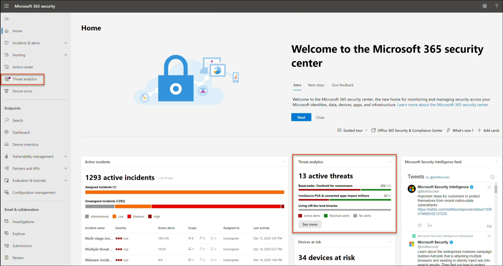

# 使用威脅分析追蹤並回應新興威脅Track and respond to emerging threats with threat analytics 

[!INCLUDE [Microsoft 365 Defender rebranding](../includes/microsoft-defender.md)]

**適用於：****Applies to:**
- Microsoft 365 DefenderMicrosoft 365 Defender

> 想要體驗 Microsoft 365 Defender 嗎？Want to experience Microsoft 365 Defender? 您可以[在實驗室環境中評估](m365d-evaluation.md?ocid=cx-docs-MTPtriallab) 或[在生產環境中執行試驗專案](m365d-pilot.md?ocid=cx-evalpilot)。You can [evaluate it in a lab environment](m365d-evaluation.md?ocid=cx-docs-MTPtriallab) or [run your pilot project in production](m365d-pilot.md?ocid=cx-evalpilot).
>

[!INCLUDE [Prerelease](../includes/prerelease.md)]

威脅分析是來自專家 Microsoft 安全性調查的產品威脅情報解決方案，其設計目的是為了協助安全性小組盡可能有效地應對新興威脅，包括：Threat analytics is our in-product threat intelligence solution from expert Microsoft security researchers, designed to assist security teams to be as efficient as possible while facing emerging threats, including:

- 作用中的威脅演員及其活動Active threat actors and their campaigns
- 常見和新的攻擊技術Popular and new attack techniques
- 嚴重弱點Critical vulnerabilities
- 常見的攻擊面Common attack surfaces
- 流行惡意程式碼Prevalent malware

請觀看這段簡短的影片，深入瞭解威脅分析如何協助您追蹤最新的威脅並加以停止。Watch this short video to learn more about how threat analytics can help you track the latest threats and stop them.

>[!VIDEO https://www.microsoft.com/en-us/videoplayer/embed/RWwJfU]

您可以從 Microsoft 365 安全性入口網站導覽列的左上方或專用的儀表板卡，存取威脅分析，以顯示您組織中的主要威脅。深入瞭解使用中或持續進行的行銷活動，並瞭解透過威脅分析所進行的工作，可協助您瞭解安全性運作小組的決策。You can access threat analytics either from the upper left-hand side of Microsoft 365 security portal’s navigation bar, or from a dedicated dashboard card which shows the top threats in your org. Getting visibility on active or ongoing campaigns and knowing what to do through threat analytics can help equip your security operations team with informed decisions. 

_在何處存取威脅分析__Where to access threat analytics_

透過經常和 prevalently 的複雜敵人和新威脅，您可以快速：With more sophisticated adversaries and new threats emerging frequently and prevalently, it's critical to be able to quickly:

- 識別並應對新興威脅Identify and react to emerging threats 
- 瞭解您目前是否受到攻擊Learn if you are currently under attack
- 評估對資產的威脅影響Assess the impact of the threat to your assets
- 檢查威脅的復原能力或洩密Review your resilience against or exposure to the threats
- 識別您可以採取以停止或包含威脅的緩解、修復或防護動作Identify the mitigation, recovery, or prevention actions you can take to stop or contain the threats

每個報告都提供有關如何抵禦威脅之追蹤威脅和大量指導的分析。Each report provides an analysis of a tracked threat and extensive guidance on how to defend against that threat. 它也會整合您網路的資料，指出威脅是否作用中，以及您是否有適當的保護。It also incorporates data from your network, indicating whether the threat is active and if you have applicable protections in place.

## 查看威脅分析儀表板View the threat analytics dashboard

「威脅分析」儀表板 ([security.microsoft.com/threatanalytics3](https://security.microsoft.com/threatanalytics3)) 會強調最適合您組織的報表。The threat analytics dashboard ([security.microsoft.com/threatanalytics3](https://security.microsoft.com/threatanalytics3)) highlights the reports that are most relevant to your organization. 它會摘要說明下列各節中的威脅：It summarizes the threats in the following sections:

- **最新威脅**-列出最近發行或更新的威脅報告，以及作用中和已解決的提醒數目。**Latest threats**—lists the most recently published or updated threat reports, along with the number of active and resolved alerts.
- **高影響威脅**-列出對您的組織具有最高影響的威脅。**High-impact threats**—lists the threats that have the highest impact to your organization. 本節會列出最高作用中且已解析之警示數目上限的威脅。This section lists threats with the highest number of active and resolved alerts first.
- **威脅摘要**—顯示所有追蹤威脅的整體影響，只要顯示使用中及已解決之警示的威脅數目。**Threat summary**—provides the overall impact of all tracked threats by showing the number of threats with active and resolved alerts.

從儀表板選取威脅，以查看該威脅的報告。Select a threat from the dashboard to view the report for that threat.

_威脅分析儀表板。您也可以在與您想要讀取之威脅分析報告相關的關鍵字中，按一下 [搜尋] 圖示。__Threat analytics dashboard. You can also click the Search icon to key in a keyword related to the threat analytics report that you'd like to read._ 

## 查看威脅分析報告View a threat analytics report

每個威脅分析報告都提供若干區段中的資訊：Each threat analytics report provides information in several sections: 

- [**概觀****Overview**](#overview-quickly-understand-the-threat-assess-its-impact-and-review-defenses) 
- [**分析報告****Analyst report**](#analyst-report-get-expert-insight-from-microsoft-security-researchers)
- [**相關的事件****Related incidents**](#related-incidents-view-and-manage-related-incidents)
- [**受影響資產****Impacted assets**](#impacted-assets-get-list-of-impacted-devices-and-mailboxes)
- [**禁止電子郵件嘗試****Prevented email attempts**](#prevented-email-attempts-view-blocked-or-junked-threat-emails)
- [**減輕方式****Mitigations**](#mitigations-review-list-of-mitigations-and-the-status-of-your-devices)

### 概覽：快速瞭解威脅、評估其影響，以及複查防護Overview: Quickly understand the threat, assess its impact, and review defenses

[ **一覽表** ] 區段提供詳細分析報告的預覽。The **Overview** section provides a preview of the detailed analyst report. 它還提供圖表，以強調您的組織面臨的威脅影響，以及透過誤設定及未修補的裝置來公開。It also provides charts that highlight the impact of the threat to your organization and your exposure through misconfigured and unpatched devices.

![威脅分析報告之 [一覽] 區段的影像](../../media/threat-analytics/ta_overview_mtp.png)

_威脅分析報告的一覽區段__Overview section of a threat analytics report_

#### 評估組織的影響Assess impact on your organization
每個報告都包含設計用來提供威脅之組織影響的資訊的圖表：Each report includes charts designed to provide information about the organizational impact of a threat:
- **相關事件**--透過下列資料，提供對組織之追蹤威脅影響的概覽：**Related incidents**—provides an overview of the impact of the tracked threat to your organization with the following data:
  - 作用中警示的數目，以及與其相關聯的主動事件數目Number of active alerts and the number of active incidents they are associated with
  - 主動事件的嚴重性Severity of active incidents
- **隨時間的提醒**-顯示一段時間內 **的相關作用** 中和 **已解決** 的警示數目。**Alerts over time**—shows the number of related **Active** and **Resolved** alerts over time. 已解決的警示數目會指出組織對與威脅相關聯的提醒回應的快慢程度。The number of resolved alerts indicates how quickly your organization responds to alerts associated with a threat. 理想狀況下，圖表應該會顯示幾天內所解決的警示。Ideally, the chart should be showing alerts resolved within a few days.
- **受影響的資產**-顯示目前至少有一個與追蹤威脅相關聯之主動警示的不同裝置和電子郵件帳戶的數量 (信箱) 。**Impacted assets**—shows the number of distinct devices and email accounts (mailboxes) that currently have at least one active alert associated with the tracked threat. 會針對接收到威脅電子郵件的信箱觸發警示。Alerts are triggered for mailboxes that received threat emails. 回顧組織和使用者層級原則，以進行導致威脅電子郵件傳送的覆寫。Review both org- and user-level policies for overrides that cause the delivery of threat emails.
- **禁止電子郵件嘗試**—顯示過去七天內已封鎖或傳送至 [垃圾郵件] 資料夾之前封鎖的電子郵件數目。**Prevented email attempts**—shows the number of emails from the past seven days that were either blocked before delivery or delivered to the junk mail folder.

#### 檢查安全性恢復能力與狀況Review security resilience and posture
每個報告都包含的圖表，可提供您的組織對特定威脅的彈性程度。Each report includes charts that provide an overview of how resilient your organization is against a given threat:
- **安全設定狀態**-顯示設定不當的安全性設定裝置數目。**Secure configuration status**—shows the number of devices with misconfigured security settings. 套用建議的安全性設定，以協助緩解威脅。Apply the recommended security settings to help mitigate the threat. 如果裝置已套用 _所有_ 追蹤的設定，則會被視為 **安全** 裝置。Devices are considered **Secure** if they have applied _all_ the tracked settings.
- **弱點修補狀態**-顯示有缺陷裝置的數目。**Vulnerability patching status**—shows the number of vulnerable devices. 套用安全性更新或修補程式，以解決威脅所利用的漏洞。Apply security updates or patches to address vulnerabilities exploited by the threat.

### 分析報告：從 Microsoft security 研究員取得專家洞察力Analyst report: Get expert insight from Microsoft security researchers
在 [ **分析報告** ] 區段中，閱讀詳細的專家撰寫。In the **Analyst report** section, read through the detailed expert write-up. 大多數報告提供攻擊鏈的詳細描述，包含對應至 MITRE ATT 的戰術和技術&CK 架構、詳盡的建議清單，以及強大的 [威脅搜尋](advanced-hunting-overview.md) 指導方針。Most reports provide detailed descriptions of attack chains, including tactics and techniques mapped to the MITRE ATT&CK framework, exhaustive lists of recommendations, and powerful [threat hunting](advanced-hunting-overview.md) guidance.

[深入瞭解分析報告Learn more about the analyst report](threat-analytics-analyst-reports.md)

### 相關的事件：查看及管理相關的事件Related incidents: View and manage related incidents
[ **相關事件** ] 索引標籤會提供與追蹤威脅相關的所有事件清單。The **Related incidents** tab provides the list of all incidents related to the tracked threat. 您可以指派事件或管理連結至每個事件的警示。You can assign incidents or manage alerts linked to each incident. 

_威脅分析報告的相關事件區段__Related incidents section of a threat analytics report_

### 受影響的資產：取得受影響的裝置和信箱清單Impacted assets: Get list of impacted devices and mailboxes
如果資產受到作用中未解析的警示影響，便會視為受影響的資產。An asset is considered impacted if it is affected by an active, unresolved alert. [ **受影響的資產** ] 索引標籤會列出下列受影響的資產類型：The **Impacted assets** tab lists the following types of impacted assets:
- **受影響的裝置**—具有未解析之 Microsoft Defender for Endpoint 警示的端點。**Impacted devices**—endpoints that have unresolved Microsoft Defender for Endpoint alerts. 這些警示通常會引發 sightings 已知威脅指示器和活動。These alerts typically fire on sightings of known threat indicators and activities.
- **受影響的信箱**：已接收的電子郵件已觸發 Microsoft Defender 以 Office 365 警示的信箱。**Impacted mailboxes**—mailboxes that have received email messages that have triggered Microsoft Defender for Office 365 alerts. 雖然通常會封鎖觸發提醒的郵件，但使用者或組織層級原則也可以覆寫篩選器。While most messages that trigger alerts are typically blocked, user- or org-level policies can override filters.

_威脅分析報告的「受影響的資產」區段__Impacted assets section of a threat analytics report_

### 禁止電子郵件企圖：查看封鎖或 junked 威脅電子郵件Prevented email attempts: View blocked or junked threat emails
Microsoft Defender for Office 365 通常會封鎖具有已知威脅指示器的電子郵件，包括惡意連結或附件。Microsoft Defender for Office 365 typically blocks emails with known threat indicators, including malicious links or attachments. 在某些情況下，檢查可疑內容的前瞻性篩選機制，會改為將威脅電子郵件傳送至 [垃圾郵件] 資料夾。In some cases, proactive filtering mechanisms that check for suspicious content will instead send threat emails to the junk mail folder. 在任何情況下，在裝置上發動惡意程式碼碼威脅的機率都會降低。In either case, the chances of the threat launching malware code on the device is reduced.

「**防止的電子郵件嘗試**」索引標籤會列出所有已封鎖的電子郵件，再傳送或傳送至 Microsoft Defender for Office 365 的垃圾郵件資料夾。The **Prevented email attempts** tab lists all the emails that have either been blocked before delivery or sent to the junk mail folder by Microsoft Defender for Office 365. 

_威脅分析報告的 [防止電子郵件嘗試] 區段__Prevented email attempts section of a threat analytics report_

### 緩解：查看緩解清單和裝置狀態Mitigations: Review list of mitigations and the status of your devices
在 [ **緩解** ] 區段中，複查可協助您增加組織對威脅抵禦能力的特定可行動建議清單。In the **Mitigations** section, review the list of specific actionable recommendations that can help you increase your organizational resilience against the threat. 追蹤的緩解措施清單包括：The list of tracked mitigations includes:

- **安全性更新**-針對架裝置上的漏洞，部署支援的軟體安全性更新**Security updates**—deployment of supported software security updates for vulnerabilities found on onboarded devices
- **支援的安全性設定****Supported security configurations**
  - 雲端提供的保護Cloud-delivered protection  
  - 可能有害的應用程式 (PUA) 保護Potentially unwanted application (PUA) protection
  - 即時保護Real-time protection
 
本節中的緩解資訊包含來自[威脅與弱點管理](/windows/security/threat-protection/microsoft-defender-atp/next-gen-threat-and-vuln-mgt)的資料，也就是從報告中各種連結提供的詳細深入資訊。Mitigation information in this section incorporates data from [threat and vulnerability management](/windows/security/threat-protection/microsoft-defender-atp/next-gen-threat-and-vuln-mgt), which also provides detailed drill-down information from various links in the report.

 ![ 弱點詳細資料之威脅分析報告之「緩解」區段之 [安全設定詳細資料] 的 [威脅分析] 區段的 [緩解] 區段的影像](../../media/threat-analytics/ta_mitigations_mtp2.png)

_威脅分析報告的緩解區段__Mitigations section of a threat analytics report_

## 其他報告詳細資料與限制Additional report details and limitations
>[!NOTE]
>在統一的安全性體驗中，威脅分析現在不僅適用于 microsoft defender for Endpoint，也適用于 microsoft defender 的 Office E5 授權擁有者。As part of the unified security experience, threat analytics is now available not just for Microsoft Defender for Endpoint, but also for Microsoft Defender for Office E5 license holders.
>如果您未使用 Microsoft 365 安全性入口網站 (Microsoft 365 Defender) ，您也可以在 (入口網站 Office microsoft defender for Endpoint) 中，查看不含 Microsoft defender Microsoft Defender 資訊安全中心資料 (的報告詳細資料。If you are not using the Microsoft 365 security portal (Microsoft 365 Defender), you can also see the report details (without the Microsoft Defender for Office data) in the Microsoft Defender Security Center portal (Microsoft Defender for Endpoint). 

若要存取威脅分析報告，您需要特定的角色和許可權。To access threat analytics report you need certain roles and permissions. 如需詳細資訊，請參閱[Microsoft 365 Defender 角色型存取控制中的自訂角色](custom-roles.md)。See [Custom roles in role-based access control for Microsoft 365 Defender](custom-roles.md) for details.
  - 若要查看警示、事件或受影響的資產資料，您必須具有 microsoft defender for Office 或 microsoft defender for Endpoint 警示資料，或兩者的許可權。To view alerts, incidents, or impacted assets data, you need to have permissions to Microsoft Defender for Office or Microsoft Defender for Endpoint alerts data, or both.
  - 若要查看已禁止的電子郵件嘗試，您必須具有 Microsoft Defender 的許可權，才能 Office 搜尋資料。To view prevented email attempts, you need to have permissions to Microsoft Defender for Office hunting data. 
  - 若要查看緩解，您必須具有在 Microsoft Defender for Endpoint 中威脅與弱點管理資料的許可權。To view mitigations, you need to have permissions to threat and vulnerability management data in Microsoft Defender for Endpoint.

在查看威脅分析資料時，請記住下列因素：When looking at the threat analytics data, remember the following factors:
- 圖表只會反映所追蹤的緩解。Charts reflect only mitigations that are tracked. 請查看報告中未顯示圖表的其他緩解。Check the report overview for additional mitigations that are not shown in the charts.
- 緩解不會保證完全恢復。Mitigations don't guarantee complete resilience. 提供的緩解反映改進恢復所需的最佳動作。The provided mitigations reflect the best possible actions needed to improve resiliency.
- 如果裝置未將資料傳輸至服務，則會將裝置計為「無法使用」。Devices are counted as "unavailable" if they have not transmitted data to the service.
- 防病毒相關的統計資料是以 Microsoft Defender 防毒軟體設定為基礎。Antivirus-related statistics are based on Microsoft Defender Antivirus settings. 使用協力廠商防病毒解決方案的裝置可能會顯示為「已公開」。Devices with third-party antivirus solutions can appear as "exposed".

## 相關主題Related topics
- [使用高級搜尋主動尋找威脅Proactively find threats with advanced hunting](advanced-hunting-overview.md) 
- [瞭解分析報告區段Understand the analyst report section](threat-analytics-analyst-reports.md)
- [評估並解決安全弱點與洩密問題Assess and resolve security weaknesses and exposures](/windows/security/threat-protection/microsoft-defender-atp/next-gen-threat-and-vuln-mgt)
