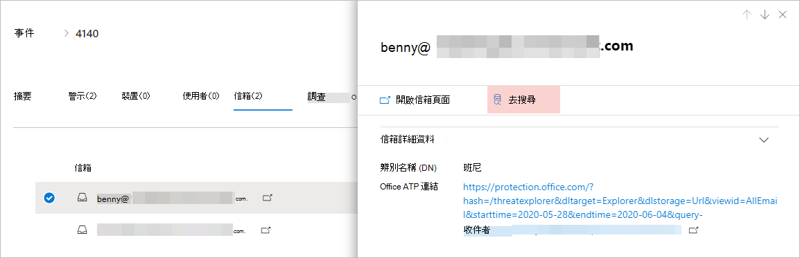
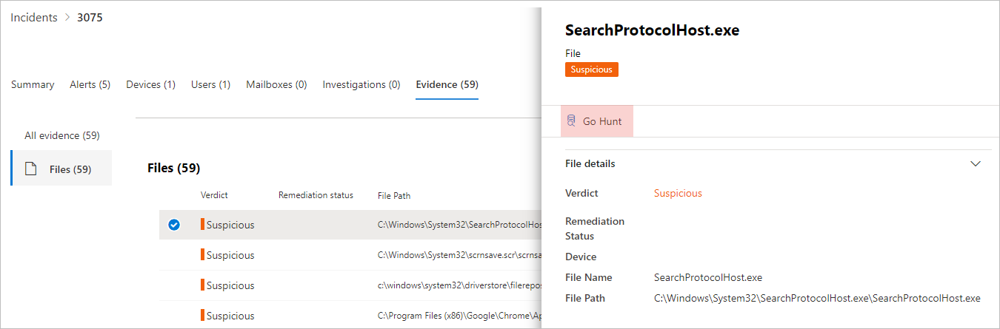
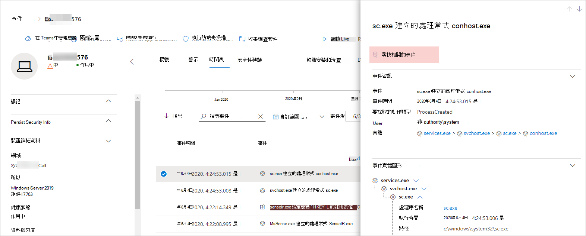

# <a name="quickly-hunt-for-entity-or-event-information-with-go-hunt"></a>使用搜尋快速搜尋實體或活動資訊

[!INCLUDE [Microsoft 365 Defender rebranding](../includes/microsoft-defender.md)]


適用於：
- Microsoft 365 Defender

有了 *搜尋動作* ，您可以使用功能強大的查詢型進一步搜尋功能，快速調查事件 [及](advanced-hunting-overview.md) 各種實體類型。 此動作會自動執行進一步搜尋查詢，以尋找所選事件或實體的相關相關資訊。

每當 *顯示事件* 或實體詳細資料時，可在安全性中心的各個區段使用搜尋動作。 例如，您可以使用下列 *各* 節中的搜尋功能：

- 您可以在 [事件頁面中](investigate-incidents.md#incident-overview)，查看與事件相關的使用者、裝置及許多其他實體詳細資料。 當您選取實體時，您取得其他資訊，以及您可針對該實體執行的各種動作。 在下面的範例中，已選取一個信箱，其中顯示該信箱的詳細資訊，以及尋找信箱詳細資訊的選項。

    

- 在事件頁面中，您也可以存取證據分頁下的實體清單。選取其中一個實體，即可提供快速搜尋該實體相關資訊的選項。

    


- 檢視裝置的時程表時，您可以選取時程表中的事件，以檢視該事件的其他相關資訊。 選取事件後，您可以選擇在進一次搜尋中尋找其他相關的事件。

    

選取 **搜尋** 或 **搜尋相關** 事件會依據您是否選取實體或事件，而傳遞不同的查詢。

## <a name="query-for-entity-information"></a>實體資訊的查詢
使用 *搜尋來* 查詢使用者、裝置或任何其他實體類型相關資訊時，查詢會檢查所有涉及該實體之事件的相關架構資料表。 若要讓結果易於管理，查詢的範圍會與過去 30 天內與實體相關且與事件相關聯的最早活動期間左右。

以下是裝置搜尋查詢的範例：

```kusto
let selectedTimestamp = datetime(2020-06-02T02:06:47.1167157Z);
let deviceName = "fv-az770.example.com";
let deviceId = "device-guid";
search in (DeviceLogonEvents, DeviceProcessEvents, DeviceNetworkEvents, DeviceFileEvents, DeviceRegistryEvents, DeviceImageLoadEvents, DeviceEvents, DeviceImageLoadEvents, IdentityLogonEvents, IdentityQueryEvents)
Timestamp between ((selectedTimestamp - 1h) .. (selectedTimestamp + 1h))
and DeviceName == deviceName
// or RemoteDeviceName == deviceName
// or DeviceId == deviceId
| take 100
```
### <a name="supported-entity-types"></a>支援的實體類型
選取以下 *任何實體類型* 後，就可以使用搜尋：

- 檔案
- 電子郵件
- 電子郵件組
- 信箱
- 使用者
- 裝置
- IP 位址
- URL

## <a name="query-for-event-information"></a>事件資訊的查詢
使用 *搜尋來* 查詢時程表事件相關資訊時，查詢會檢查所有與所選事件期間相關的架構資料表，以尋找其他事件。 例如，下列查詢會列出相同裝置上同一時期發生各種架構資料表中的事件：

```kusto
// List relevant events 30 minutes before and after selected LogonAttempted event
let selectedEventTimestamp = datetime(2020-06-04T01:29:09.2496688Z);
search in (DeviceFileEvents, DeviceProcessEvents, DeviceEvents, DeviceRegistryEvents, DeviceNetworkEvents, DeviceImageLoadEvents, DeviceLogonEvents)
    Timestamp between ((selectedEventTimestamp - 30m) .. (selectedEventTimestamp + 30m))
    and DeviceId == "079ecf9c5798d249128817619606c1c47369eb3e"
| sort by Timestamp desc
| extend Relevance = iff(Timestamp == selectedEventTimestamp, "Selected event", iff(Timestamp < selectedEventTimestamp, "Earlier event", "Later event"))
| project-reorder Relevance
```

## <a name="adjust-the-query"></a>調整查詢
具備查詢語言 [相關知識後](advanced-hunting-query-language.md)，就可以根據自己的喜好調整查詢。 例如，您可以調整此線，這決定時間視窗的大小：

```kusto
Timestamp between ((selectedTimestamp - 1h) .. (selectedTimestamp + 1h))
```

除了修改查詢以取得更相關的結果，您也可以：
- [以圖表查看結果](advanced-hunting-query-results.md#view-query-results-as-a-table-or-chart)
- [建立自訂偵測規則](custom-detection-rules.md)

## <a name="related-topics"></a>相關主題
- [進階搜捕概觀](advanced-hunting-overview.md)
- [了解查詢語言](advanced-hunting-query-language.md)
- [使用查詢結果工作](advanced-hunting-query-results.md)
- [自訂偵測規則](custom-detection-rules.md)
