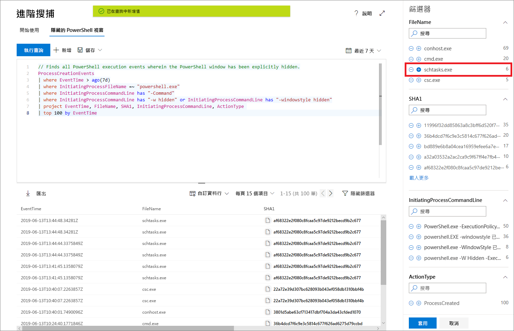

# 使用 Microsoft 威脅防護中的進階搜捕功能主動尋找威脅

**適用於：**
- Microsoft 威脅防護

[!INCLUDE [Prerelease information](../includes/prerelease.md)]

進階搜捕是一種查詢式威脅搜捕工具，可讓您探索最多 30 天的原始資料。 您可以主動檢查您網路中的事件，以找出相關的指標和實體。 可靈活存取資料有助於不受限制地同時搜捕已知和潛在的威脅。

在 Microsoft 365 資訊安全中心，進階的狩獵支援從這兩個 Microsoft Defender ATP，涵蓋上架的裝置和 Office 365 ATP 中的資料、 提供電子郵件中的資料，查看資料的查詢。 若要使用進階搜捕，請[開啟 Microsoft 威脅防護](mtp-enable.md)。

## 開始使用進階搜捕

建議您透過數個步驟來利用進階搜捕快速啟動並執行。

| 學習目標 | 描述 | 資源 |
|--|--|--|
| **了解語言** | 進階搜捕是基於 [Kusto 查詢語言](https://docs.microsoft.com/azure/kusto/query/)，支援相同的語法和運算子。 執行您的第一個查詢來開始學習查詢語言。 | [查詢語言概觀](advanced-hunting-query-language.md) |
| **了解結構描述** | 深入了解結構描述中的資料表和資料行。 這可協助您決定要在何處尋找資料，以及如何建構查詢。 | [結構描述參考](advanced-hunting-schema-tables.md) |
| **使用預先定義的查詢** | 探索涵蓋不同威脅搜捕案例的預先定義查詢集合。 | [使用共用查詢](advanced-hunting-shared-queries.md)
| **最佳化查詢** | 了解如何建立可結合來自電子郵件和裝置資料的高效查詢。 | [查詢最佳做法](advanced-hunting-shared-queries.md)、[跨裝置和電子郵件搜捕](advanced-hunting-best-practices.md)

## 編寫查詢時取得協助
運用下列功能更快速地編寫查詢：
- **自動建議** - 在您編寫查詢時，進階搜捕會提供建議。 
- **結構描述參考** - 在您的工作區域旁提供、包含資料表清單和其資料欄的結構描述參考。 如需詳細資訊，請將游標暫留在某項目上。 按兩下某個項目，將它插入查詢編輯器。

## 從查詢結果深入分析
若要在查詢結果中檢視實體 (例如電腦、檔案、使用者、IP 位址和 URL) 的詳細資訊，只要按一下實體識別碼即可。 這會為 Microsoft Defender 安全性中心選取的實體開啟詳細的設定檔頁面。

## 從結果調整您的查詢
以滑鼠右鍵按一下結果集中的值，以快速強化您的查詢。 您可以使用下列選項來執行這些動作：

- 明確尋找選取的值 (`==`)
- 從查詢排除選取的值 (`!=`)
- 取得更多可將值新增至查詢的進階運算子，例如 `contains`、`starts with` 和 `ends with` 

## 篩選查詢結果
顯示在右側的篩選器可提供結果集的摘要。 每個資料行都有各自的區段，列出針對該資料行找到的獨特值和執行個體數量。

選取您要包含或排除的值上的 "+" 或 "-"，然後選取 [執行查詢]****，以精簡您的查詢。

一旦套用篩選來修改查詢，然後執行查詢，結果就會相應更新。

## 相關主題
- [了解查詢語言](advanced-hunting-query-language.md)
- [使用共用查詢](advanced-hunting-shared-queries.md)
- [搜捕所有裝置和電子郵件的威脅](advanced-hunting-query-emails-devices.md)
- [了解結構描述](advanced-hunting-schema-tables.md)
- [套用查詢最佳做法](advanced-hunting-best-practices.md)