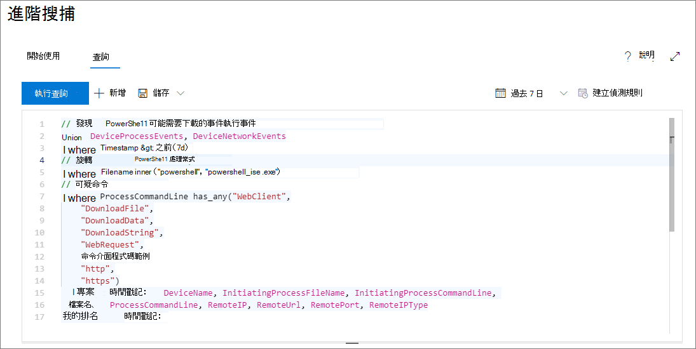
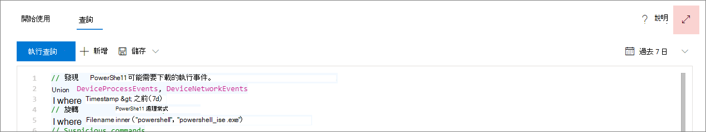

# <a name="learn-the-advanced-hunting-query-language"></a>了解進階搜捕查詢語言

適用於：****
- Microsoft 威脅防護

進階搜捕是以 [Kusto 查詢語言](https://docs.microsoft.com/azure/kusto/query/)為基礎。 您可以使用 Kusto 語法和運算子來建立查詢，以在特別為進階搜捕而建構的[結構描述](advanced-hunting-schema-tables.md)中尋找的資訊。 若要深入了解這些概念，請執行您的第一個查詢。

## <a name="try-your-first-query"></a>嘗試您的第一個查詢

在 Microsoft 365 的 [安全性中心] 中，移至**搜尋**以執行第一個查詢。 請使用下列範例：

```kusto
// Finds PowerShell execution events that could involve a download
union DeviceProcessEvents, DeviceNetworkEvents
| where Timestamp > ago(7d)
// Pivoting on PowerShell processes
| where FileName in~ ("powershell.exe", "powershell_ise.exe")
// Suspicious commands
| where ProcessCommandLine has_any("WebClient",
 "DownloadFile",
 "DownloadData",
 "DownloadString",
"WebRequest",
"Shellcode",
"http",
"https")
| project Timestamp, DeviceName, InitiatingProcessFileName, InitiatingProcessCommandLine, 
FileName, ProcessCommandLine, RemoteIP, RemoteUrl, RemotePort, RemoteIPType
| top 100 by Timestamp
```

這是它在進階搜捕中看起來的樣子。



### <a name="describe-the-query-and-specify-the-tables-to-search"></a>描述查詢，並指定要搜尋的表格
已將簡短批註新增至查詢的開頭，以描述其用途。 這可協助您稍後決定要儲存查詢，並與組織中的其他人共用。 

```kusto
// Finds PowerShell execution events that could involve a download
```

查詢本身通常會以資料表名稱開頭，後面接著管道 (`|`) 開始的一系列元素。 在此範例中，我們會從建立兩個表格的同盟開始，並 `DeviceProcessEvents` `DeviceNetworkEvents` 視需要新增管線元素。

```kusto
union DeviceProcessEvents, DeviceNetworkEvents
```
### <a name="set-the-time-range"></a>設定時間範圍
第一個輸送的元素是一種範圍設定為前七天的時間篩選器。 盡可能讓時間範圍越小越好，以確保查詢能順利執行、傳回可管理的結果，且不會逾時。

```kusto
| where Timestamp > ago(7d)
```

### <a name="check-specific-processes"></a>檢查特定進程
時間範圍後緊接著搜尋代表 PowerShell 應用程式的處理常式檔案名。

```kusto
// Pivoting on PowerShell processes
| where FileName in~ ("powershell.exe", "powershell_ise.exe")
```

### <a name="search-for-specific-command-strings"></a>搜尋特定的命令字串
之後，查詢會在命令列中尋找通常用來透過 PowerShell 下載檔案的字串。

```kusto
// Suspicious commands
| where ProcessCommandLine has_any("WebClient",
    "DownloadFile",
    "DownloadData",
    "DownloadString",
    "WebRequest",
    "Shellcode",
    "http",
    "https")
```

### <a name="customize-result-columns-and-length"></a>自訂結果欄及長度 
現在您的查詢已清楚識別出您要尋找的資料，您可以新增元素來定義結果。 `project`會傳回特定的欄，並 `top` 限制結果的數目。 這些運算子可協助確保結果具有適當的格式，且易於處理。

```kusto
| project Timestamp, DeviceName, InitiatingProcessFileName, InitiatingProcessCommandLine, 
FileName, ProcessCommandLine, RemoteIP, RemoteUrl, RemotePort, RemoteIPType
| top 100 by Timestamp
```

按一下 [執行查詢]**** 以查看結果。 選取查詢編輯器右上角的展開圖示，以著重于搜尋查詢和結果。 



>[!TIP]
>您可以以圖表形式查看查詢結果，並快速調整篩選。 如需相關指導，請[參閱使用查詢結果](advanced-hunting-query-results.md)

## <a name="learn-common-query-operators-for-advanced-hunting"></a>了解適用於進階搜捕的一般查詢運算子

您已執行了第一個查詢，並對其組成元素有一點了解了，現在可以開始追蹤一些基本概念。 進階搜捕所使用的 Kusto 查詢語言支援一系列運算子，包括下列常見運算子。

| 運算子 | 描述及用法 |
|--|--|
| `where` | 將資料表篩選為符合述詞的資料列子集。 |
| `summarize` | 產生匯總輸入資料表內容的資料表。 |
| `join` | 合併兩個資料表的資料列，並比對每個資料表中的指定資料行的值來建立新的資料表。 |
| `count` | 傳回輸入記錄集中的記錄數目。 |
| `top` | 傳回按指定資料行排序的前 N 筆記錄。 |
| `limit` | 傳回指定的資料列數。 |
| `project` | 選取要包含的資料行、重新命名或捨棄，然後插入新的計算資料行。 |
| `extend` | 建立計算資料行並將它們附加到結果集中。 |
| `makeset` |  傳回 Expr 在群組中取得的獨特值集合的動態 (JSON) 陣列。 |
| `find` | 在一組資料表中尋找符合述詞的資料列。 |

若要查看這些運算子的實際範例，請從進階搜捕的 [開始使用]**** 區段中執行這些運算子。

## <a name="understand-data-types-and-their-query-syntax-implications"></a>了解資料類型及其查詢語法含意

進階搜捕資料表中的資料通常會分類為以下資料類型。

| 資料類型 | 描述與查詢含意 |
|--|--|
| `datetime` | 通常代表事件時間戳記的資料和時間資訊 |
| `string` | 字元字串 |
| `bool` | True 或 False |
| `int` | 32 位元數值  |
| `long` | 64 位元數值 |

## <a name="get-help-as-you-write-queries"></a>編寫查詢時取得協助
運用下列功能更快速地編寫查詢：
- **Autosuggest** --當您撰寫查詢時，高級搜尋會提供 IntelliSense 的建議。 
- **架構樹**系-您的工作區域旁會提供包含資料表清單和其欄的架構標記法。 如需詳細資訊，請將游標暫留在某項目上。 按兩下某個項目，將它插入查詢編輯器。
- **[架構參考（Schema](advanced-hunting-schema-tables.md#get-schema-information-in-the-security-center)** ）包含資料表和欄描述的入口網站參照，以及支援的事件種類（ `ActionType` 值）和範例查詢

## <a name="work-with-multiple-queries-in-the-editor"></a>在編輯器中使用多個查詢
查詢編輯器可以做為您用來試驗多個查詢的草稿墊。 若要使用多個查詢：

- 以空行分隔每個查詢。
- 將游標放在查詢的任何部分，以選取該查詢，然後再執行它。 這只會執行選取的查詢。 若要執行另一個查詢，請據以移動游標，然後選取 [**執行查詢**]。


## <a name="use-sample-queries"></a>使用範例查詢

[開始使用]**** 區段提供一些使用常用運算子的簡單查詢。 嘗試執行這些查詢，並對它們進行些微修改。


>[!NOTE]
>除了基本查詢範例以外，您也可以取得適用於特定威脅搜捕案例的[共用查詢](advanced-hunting-shared-queries.md)。 探索頁面左側或 GitHub 查詢儲存庫的共用查詢。

## <a name="access-query-language-documentation"></a>Access 查詢語言說明文件

如需有關 Kusto 查詢語言和支援運算子的詳細資訊，請參閱 [Kusto 查詢語言說明文件](https://docs.microsoft.com/azure/kusto/query/)。

## <a name="related-topics"></a>相關主題
- [進階搜捕概觀](advanced-hunting-overview.md)
- [使用查詢結果工作](advanced-hunting-query-results.md)
- [使用共用查詢](advanced-hunting-shared-queries.md)
- [搜捕所有裝置和電子郵件的威脅](advanced-hunting-query-emails-devices.md)
- [了解結構描述](advanced-hunting-schema-tables.md)
- [套用查詢最佳做法](advanced-hunting-best-practices.md)
