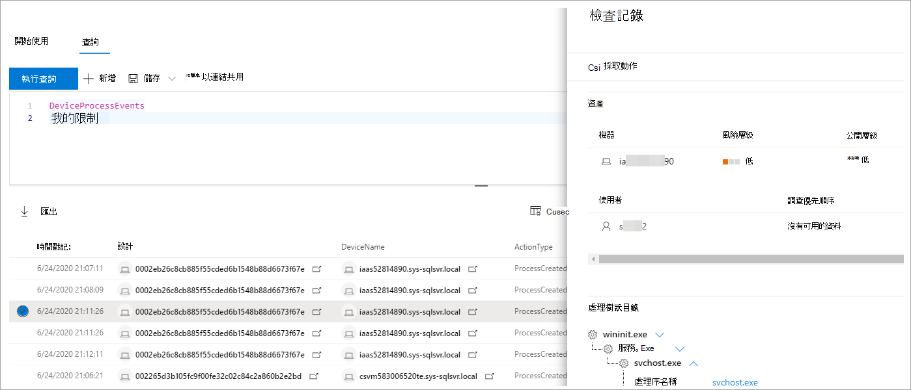

# <a name="work-with-advanced-hunting-query-results"></a>使用進位搜尋查詢結果

[!INCLUDE [Microsoft 365 Defender rebranding](../includes/microsoft-defender.md)]


適用於：
- Microsoft 365 Defender

[!INCLUDE [Prerelease information](../includes/prerelease.md)]

雖然您可以建構 [進位](advanced-hunting-overview.md) 的搜尋查詢來返回非常精確的資訊，您也可以使用查詢結果來取得進一步的深入見解，並調查特定活動和標記。 您可以對查詢結果採取下列動作：

- 以表格或圖表查看結果
- 匯出表格和圖表
- 向下切入至詳細的實體資訊
- 直接從結果調整查詢或篩選

## <a name="view-query-results-as-a-table-or-chart"></a>以表格或圖表查看查詢結果
根據預設，進位搜尋會以表格式資料顯示查詢結果。 您也可以顯示與圖表相同的資料。 進位搜尋支援下列視圖：

| 檢視類型 | 說明 |
| -- | -- |
| **Table** | 以表格式格式顯示查詢結果 |
| **直條圖** | 將 X 軸上的一系列唯一專案轉成垂直軸，其高度代表另一個欄位的數值 |
| **堆疊直條圖** | 將 X 軸上的一系列唯一專案轉成堆疊的垂直軸，其高度代表來自一或多個其他欄位的數值 |
| **圓形圖** | 呈現代表唯一專案的區段圓形圖。 每個圓形圖的大小代表來自另一個欄位的數值。 |
| **環圈圖** | 呈現代表唯一專案的分節弧線。 每個弧線的長度代表來自另一個欄位的數值。 |
| **折線圖** | 繪製一系列唯一專案的數值，並連接繪製的值 |
| **散佈圖** | 繪製一系列唯一專案的數值 |
| **面積圖** | 繪製一系列唯一專案的數值，並填滿繪製值下方的區段 |

### <a name="construct-queries-for-effective-charts"></a>建構有效圖表的查詢
當呈現圖表時，進位搜尋會自動識別感興趣的欄和要匯總的數值。 若要取得有意義的圖表，請建構查詢以視覺化方式返回您想要查看的特定值。 以下是一些範例查詢和產生的圖表。

#### <a name="alerts-by-severity"></a>按嚴重性顯示警示
使用 `summarize` 運算子取得您想要繪製圖表之值的數值計數。 下列查詢使用 `summarize` 運算子來按嚴重性取得警示數目。

```kusto
AlertInfo
| summarize Total = count() by Severity
```
呈現結果時，直條圖會以個別的欄顯示每個嚴重性值：


 *直條圖*

#### <a name="alert-severity-by-operating-system"></a>根據作業系統警示嚴重性
您也可以使用運算子 `summarize` 來準備多個欄位的值圖表結果。 例如，您可能會想要瞭解警示嚴重性如何分散在作業系統或作業系統 () 。 

下列查詢使用運算子從資料表提取作業系統資訊，然後用來計算 `join` `DeviceInfo` `summarize` 資料行 `OSPlatform` 與資料行 `Severity` 中的值：

```kusto
AlertInfo
| join AlertEvidence on AlertId
| join DeviceInfo on DeviceId
| summarize Count = count() by OSPlatform, Severity 
```
使用堆疊直條圖以視覺化方式呈現的結果最佳：


 *圖表的警示*

#### <a name="phishing-emails-across-top-ten-sender-domains"></a>橫跨十大寄件者網域的網路釣魚電子郵件
如果您要處理的值清單並非有限，可以使用運算子只繪製實例數 `Top` 最多的值圖表。 例如，若要取得網路釣魚電子郵件數最多的十大寄件者網域，請使用下列查詢：

```kusto
EmailEvents
| where PhishFilterVerdict == "Phish"
| summarize Count = count() by SenderFromDomain
| top 10 by Count
```
使用圓形圖視圖，有效顯示上方網域的分佈：


 *電子郵件分佈*

#### <a name="file-activities-over-time"></a>一段時間的檔案活動
您可以將 `summarize` 運算子與 `bin()` 函數一起使用，檢查一段時間是否與特定標記有關的事件。 以下查詢會以時間間隔 30 分鐘計算涉及檔案的事件，以顯示與檔案相關的 `invoice.doc` 活動尖峰：

```kusto
AppFileEvents
| union DeviceFileEvents
| where FileName == "invoice.doc"
| summarize FileCount = count() by bin(Timestamp, 30m)
```
下方的線條圖會清楚突顯包含更多涉及活動的時段 `invoice.doc` ： 


 *有關之事件的數量*


## <a name="export-tables-and-charts"></a>匯出表格和圖表
執行查詢之後，選取 **匯出以** 將結果儲存到本地檔案。 您所選擇的視圖會決定匯出結果的方式：

- **表格視圖** - 查詢結果會以清單方式匯出為 Microsoft Excel 活頁簿
- **任何圖表** — 查詢結果會匯出為所呈現圖表的 JPEG 影像

## <a name="drill-down-from-query-results"></a>從查詢結果向下切入
若要快速檢查查詢結果中的記錄，請選取對應的資料列以開啟檢查 **記錄** 面板。 面板會依據選取的記錄提供下列資訊：

- **資產** — 在記錄中 (信箱、裝置和使用者之) 摘要視圖，豐富的可用資訊，例如風險與曝光層級
- **程式樹** — 產生包含程式資訊的記錄，並且使用可用的內容相關資訊豐富;一般而言，會返回更多資料行的查詢可能會導致更豐富的程式樹狀結構。
- **所有詳細** 資料 — 記錄中資料行的所有值  



若要在查詢結果中查看特定實體的詳細資訊 ，例如電腦、檔案、使用者、IP 位址或 URL，請選取實體識別碼以開啟該實體的詳細設定檔頁面面。

## <a name="tweak-your-queries-from-the-results"></a>從結果調整您的查詢
以滑鼠右鍵按一下結果集中的值，以快速強化您的查詢。 您可以使用下列選項來執行這些動作：

- 明確尋找選取的值 (`==`)
- 從查詢排除選取的值 (`!=`)
- 取得更多可將值新增至查詢的進階運算子，例如 `contains`、`starts with` 和 `ends with` 


## <a name="filter-the-query-results"></a>篩選查詢結果
顯示在右側的篩選器可提供結果集的摘要。 每個資料行都有各自的區段，列出針對該資料行找到的獨特值和執行個體數量。

針對您想要包含或排除的值選取一或兩個按鈕，然後選取執行查詢，以 `+` `-` **精簡查詢**。


一旦套用篩選來修改查詢，然後執行查詢，結果就會相應更新。

## <a name="related-topics"></a>相關主題
- [進階搜捕概觀](advanced-hunting-overview.md)
- [了解查詢語言](advanced-hunting-query-language.md)
- [使用共用查詢](advanced-hunting-shared-queries.md)
- [跨裝置、電子郵件、應用程式和身分識別搜捕](advanced-hunting-query-emails-devices.md)
- [了解結構描述](advanced-hunting-schema-tables.md)
- [套用查詢最佳做法](advanced-hunting-best-practices.md)
- [自訂偵測概觀](custom-detections-overview.md)
