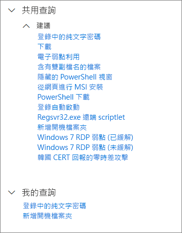

# 在進階搜捕中使用共用查詢Use shared queries in advanced hunting

適用於：\*\*\*\***Applies to:**
- Microsoft 威脅防護Microsoft Threat Protection

[!INCLUDE [Prerelease information](../includes/prerelease.md)]

您可以在同一個組織的多位使用者之間共用[進階搜捕](advanced-hunting-overview.md)查詢。[Advanced hunting](advanced-hunting-overview.md) queries can be shared among users in the same organization. 您也可以在 GitHub 尋找公開的查詢。You can also find queries shared publicly on GitHub. 這些查詢可讓您快速地執行特定威脅搜捕案例，而不需要從頭開始撰寫查詢。These queries let you quickly pursue specific threat hunting scenarios without having to write queries from scratch.

## 儲存、修改及共用查詢Save, modify, and share a query
您可以儲存新的或現有的查詢，以便只有組織中的其他使用者能存取或共用。You can save a new or existing query so that it is only accessible to you or shared with other users in your organization. 

1. 建立或修改查詢。Create or modify a query. 

2. 按一下 [儲存查詢]\*\*\*\* 下拉式按鈕，然後選取 [另存新檔]\*\*\*\*。Click the **Save query** drop-down button and select **Save as**.
    
3. 輸入查詢的名稱。Enter a name for the query. 

   

4. 選取您要儲存查詢的資料夾。Select the folder where you'd like to save the query.
    - **共用的查詢** — 與組織的所有使用者共用**Shared queries** — shared to all users your organization
    - **我的查詢** —只有您可以存取**My queries** — accessible only to you
    
5. 選取 [儲存]\*\*\*\*。Select **Save**. 

## 刪除或重新命名查詢Delete or rename a query
1. 以滑鼠右鍵按一下您要重新命名或刪除的查詢。Right-click on a query you want to rename or delete.

    

2. 選取 [刪除]\*\*\*\* 並確認刪除。Select **Delete** and confirm deletion. 或選取 [重新命名]\*\*\*\*，並為查詢提供新名稱。Or select **Rename** and provide a new name for the query.

## 存取 GitHub 儲存庫中的查詢Access queries in the GitHub repository  
Microsoft 安全研究人員會定期在 [GitHub 上的指定公開儲存庫](https://github.com/microsoft/MTP-AHQ)中共用進階搜捕查詢。Microsoft security researchers regularly share advanced hunting queries in a [designated public repository on GitHub](https://github.com/microsoft/MTP-AHQ). 這個儲存庫開放個人提出貢獻。This repository is open to contributions. 若要貢獻，請[免費加入 GitHub ](https://github.com/)。To contribute, [join GitHub for free](https://github.com/).

>[!tip]
>Microsoft 安全研究人員也會提供進階搜捕查詢，您可以用來尋找與新興威脅相關聯的活動和指標。Microsoft security researchers also provide advanced hunting queries that you can use to locate activities and indicators associated with emerging threats. 這些查詢是由 Microsoft Defender 安全性中心中的[威脅分析](https://docs.microsoft.com/windows/security/threat-protection/microsoft-defender-atp/threat-analytics)報告提供。These queries are provided as part of the [threat analytics](https://docs.microsoft.com/windows/security/threat-protection/microsoft-defender-atp/threat-analytics) reports in Microsoft Defender Security Center.

## 相關主題Related topics
- [主動威脅搜捕Proactively hunt for threats](advanced-hunting-overview.md)
- [了解查詢語言Learn the query language](advanced-hunting-query-language.md)
- [搜捕所有裝置和電子郵件的威脅Hunt for threats across devices and emails](advanced-hunting-query-emails-devices.md)
- [了解結構描述Understand the schema](advanced-hunting-schema-tables.md)
- [套用查詢最佳做法Apply query best practices](advanced-hunting-best-practices.md)