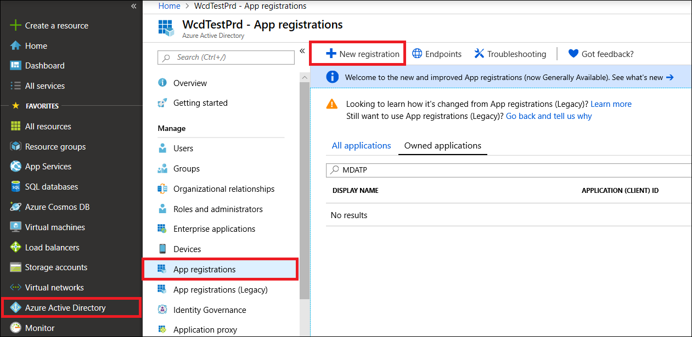

# <a name="access-microsoft-threat-protection-apis-on-behalf-of-user"></a><span data-ttu-id="0fb2f-104">代表使用者存取 Microsoft 威脅防護 APIs</span><span class="sxs-lookup"><span data-stu-id="0fb2f-104">Access Microsoft Threat Protection APIs on behalf of user</span></span>

<span data-ttu-id="0fb2f-105">適用於：\*\*\*\*</span><span class="sxs-lookup"><span data-stu-id="0fb2f-105">**Applies to:**</span></span>
- <span data-ttu-id="0fb2f-106">Microsoft 威脅防護</span><span class="sxs-lookup"><span data-stu-id="0fb2f-106">Microsoft Threat Protection</span></span>

>[!IMPORTANT] 
><span data-ttu-id="0fb2f-107">一些與 prereleased 產品相關的資訊，在正式發行之前，可能會受到大量修改。</span><span class="sxs-lookup"><span data-stu-id="0fb2f-107">Some information relates to prereleased product which may be substantially modified before it's commercially released.</span></span> <span data-ttu-id="0fb2f-108">Microsoft makes no warranties, express or implied, with respect to the information provided here.</span><span class="sxs-lookup"><span data-stu-id="0fb2f-108">Microsoft makes no warranties, express or implied, with respect to the information provided here.</span></span>


<span data-ttu-id="0fb2f-109">此頁面說明如何建立應用程式，以讓使用者能夠以程式設計方式存取 Microsoft 威脅防護。</span><span class="sxs-lookup"><span data-stu-id="0fb2f-109">This page describes how to create an application to get programmatic access to Microsoft Threat Protection on behalf of a user.</span></span>

<span data-ttu-id="0fb2f-110">如果您需要以程式設計方式存取 Microsoft 威脅防護，但沒有使用者，請參閱 [Create a app to Access Microsoft 威脅 protection （沒有使用者](api-create-app-web.md)）。</span><span class="sxs-lookup"><span data-stu-id="0fb2f-110">If you need programmatic access Microsoft Threat Protection without a user, refer to [Create an app to access Microsoft Threat Protection without a user](api-create-app-web.md).</span></span>

<span data-ttu-id="0fb2f-111">如果您不確定需要哪種存取權，請閱讀 [Access Microsoft 威脅防護 APIs](api-access.md)。</span><span class="sxs-lookup"><span data-stu-id="0fb2f-111">If you are not sure which access you need, read the [Access the Microsoft Threat Protection APIs](api-access.md).</span></span>

<span data-ttu-id="0fb2f-112">Microsoft 威脅防護會透過一組程式設計 APIs 來公開其資料和動作。</span><span class="sxs-lookup"><span data-stu-id="0fb2f-112">Microsoft Threat Protection exposes much of its data and actions through a set of programmatic APIs.</span></span> <span data-ttu-id="0fb2f-113">這些 APIs 可讓您根據 Microsoft 威脅防護功能來自動化工作流程及創新。</span><span class="sxs-lookup"><span data-stu-id="0fb2f-113">Those APIs will enable you to automate work flows and innovate based on Microsoft Threat Protection capabilities.</span></span> <span data-ttu-id="0fb2f-114">API 存取需要 OAuth 2.0 驗證。</span><span class="sxs-lookup"><span data-stu-id="0fb2f-114">The API access requires OAuth2.0 authentication.</span></span> <span data-ttu-id="0fb2f-115">如需詳細資訊，請參閱 [OAuth 2.0 授權碼流程](https://docs.microsoft.com/azure/active-directory/develop/active-directory-v2-protocols-oauth-code)。</span><span class="sxs-lookup"><span data-stu-id="0fb2f-115">For more information, see [OAuth 2.0 Authorization Code Flow](https://docs.microsoft.com/azure/active-directory/develop/active-directory-v2-protocols-oauth-code).</span></span>

<span data-ttu-id="0fb2f-116">一般來講，您必須採取下列步驟，才能使用 APIs：</span><span class="sxs-lookup"><span data-stu-id="0fb2f-116">In general, you’ll need to take the following steps to use the APIs:</span></span>
- <span data-ttu-id="0fb2f-117">建立 AAD 應用程式</span><span class="sxs-lookup"><span data-stu-id="0fb2f-117">Create an AAD application</span></span>
- <span data-ttu-id="0fb2f-118">使用此應用程式取得存取 token</span><span class="sxs-lookup"><span data-stu-id="0fb2f-118">Get an access token using this application</span></span>
- <span data-ttu-id="0fb2f-119">使用權杖存取 Microsoft 威脅防護 API</span><span class="sxs-lookup"><span data-stu-id="0fb2f-119">Use the token to access Microsoft Threat Protection API</span></span>

<span data-ttu-id="0fb2f-120">此頁面說明如何建立 AAD 應用程式、取得 Microsoft 威脅防護的存取權杖，以及驗證權杖。</span><span class="sxs-lookup"><span data-stu-id="0fb2f-120">This page explains how to create an AAD application, get an access token to Microsoft Threat Protection and validate the token.</span></span>

>[!NOTE]
> <span data-ttu-id="0fb2f-121">代表使用者存取 Microsoft 威脅防護 API 時，您將需要正確的應用程式許可權和使用者許可權。</span><span class="sxs-lookup"><span data-stu-id="0fb2f-121">When accessing Microsoft Threat Protection API on behalf of a user, you will need the correct Application permission and user permission.</span></span>


>[!TIP]
> <span data-ttu-id="0fb2f-122">如果您有許可權執行入口網站中的動作，您就具有在 API 中執行該動作的許可權。</span><span class="sxs-lookup"><span data-stu-id="0fb2f-122">If you have the permission to perform an action in the portal, you have the permission to perform the action in the API.</span></span>

## <a name="create-an-app"></a><span data-ttu-id="0fb2f-123">建立應用程式</span><span class="sxs-lookup"><span data-stu-id="0fb2f-123">Create an app</span></span>

1. <span data-ttu-id="0fb2f-124">使用具有**全域系統管理員**角色的使用者登入[Azure](https://portal.azure.com) 。</span><span class="sxs-lookup"><span data-stu-id="0fb2f-124">Log on to [Azure](https://portal.azure.com) with user that has **Global Administrator** role.</span></span>

2. <span data-ttu-id="0fb2f-125">流覽至 [ **Azure Active Directory**  >  **應用程式註冊**]  >  **新註冊**。</span><span class="sxs-lookup"><span data-stu-id="0fb2f-125">Navigate to **Azure Active Directory** > **App registrations** > **New registration**.</span></span> 

   

3. <span data-ttu-id="0fb2f-127">在註冊中，輸入下列資訊，然後按一下 [ **註冊**]。</span><span class="sxs-lookup"><span data-stu-id="0fb2f-127">In the registration from, enter the following information then click **Register**.</span></span>

   

   - <span data-ttu-id="0fb2f-129">**名稱：** 您的應用程式名稱</span><span class="sxs-lookup"><span data-stu-id="0fb2f-129">**Name:** Your application name</span></span>
   - <span data-ttu-id="0fb2f-130">**應用程式類型：** 公用用戶端</span><span class="sxs-lookup"><span data-stu-id="0fb2f-130">**Application type:** Public client</span></span>
   - <span data-ttu-id="0fb2f-131">重新**導向 URI：**https://portal.azure.com</span><span class="sxs-lookup"><span data-stu-id="0fb2f-131">**Redirect URI:** https://portal.azure.com</span></span>

4. <span data-ttu-id="0fb2f-132">若要讓您的應用程式能夠存取 Microsoft 威脅防護並指派 it 許可權，請在應用程式頁面上，選取 [ **API 許可權**  >  **新增許可權**  >  **APIs 我的組織使用**>]，輸入 [ **microsoft 威脅防護**]，然後選取 [ **microsoft 威脅防護**]。</span><span class="sxs-lookup"><span data-stu-id="0fb2f-132">To enable your app to access Microsoft Threat Protection and assign it permissions, on your application page, select **API Permissions** > **Add permission** > **APIs my organization uses** >, type **Microsoft Threat Protection**, and then select **Microsoft Threat Protection**.</span></span>

    >[!NOTE]
    > <span data-ttu-id="0fb2f-133">Microsoft 威脅防護不會出現在原始清單中。</span><span class="sxs-lookup"><span data-stu-id="0fb2f-133">Microsoft Threat Protection does not appear in the original list.</span></span> <span data-ttu-id="0fb2f-134">您必須先在文字方塊中寫入其名稱，才能看到顯示的名稱。</span><span class="sxs-lookup"><span data-stu-id="0fb2f-134">You need to start writing its name in the text box to see it appear.</span></span>

      

    - <span data-ttu-id="0fb2f-136">選擇 [ **委派的許可權** ] > 選擇您案例的相關許可權，例如 Incident、 **Read**，然後選取 [ **新增許可權**]。</span><span class="sxs-lookup"><span data-stu-id="0fb2f-136">Choose **Delegated permissions** > Choose the relevant permissions for your scenario, e.g. **Incident.Read**, and then select **Add permissions**.</span></span>

      

     >[!IMPORTANT]
     ><span data-ttu-id="0fb2f-138">您必須選取相關的許可權。</span><span class="sxs-lookup"><span data-stu-id="0fb2f-138">You need to select the relevant permissions.</span></span> 

    -  <span data-ttu-id="0fb2f-139">若要決定您需要的許可權，請參閱您想要呼叫之 API 中的 [ **許可權** ] 區段。</span><span class="sxs-lookup"><span data-stu-id="0fb2f-139">To determine which permission you need, please look at the **Permissions** section in the API you are interested to call.</span></span>

    - <span data-ttu-id="0fb2f-140">按一下 **[授與同意**]</span><span class="sxs-lookup"><span data-stu-id="0fb2f-140">Click **Grant consent**</span></span>

      >[!NOTE]
      ><span data-ttu-id="0fb2f-141">每次您新增許可權時，您必須按一下 **[授與同意** 才能讓新的許可權生效。</span><span class="sxs-lookup"><span data-stu-id="0fb2f-141">Every time you add permission you must click on **Grant consent** for the new permission to take effect.</span></span>

      

6. <span data-ttu-id="0fb2f-143">記下來記錄應用程式識別碼和您的租使用者 ID:</span><span class="sxs-lookup"><span data-stu-id="0fb2f-143">Write down your application ID and your tenant ID:</span></span>

   - <span data-ttu-id="0fb2f-144">在 [應用程式] 頁面上，移至 **[簡介** ]，然後複製下列專案：</span><span class="sxs-lookup"><span data-stu-id="0fb2f-144">On your application page, go to **Overview** and copy the following:</span></span>

   


## <a name="get-an-access-token-using-powershell"></a><span data-ttu-id="0fb2f-146">使用 PowerShell 取得存取權杖</span><span class="sxs-lookup"><span data-stu-id="0fb2f-146">Get an access token using PowerShell</span></span>

```
#Install the ADAL.PS package if it's not installed.
if(!(Get-Package adal.ps)) { Install-Package -Name adal.ps }

$authority = "https://login.windows.net/{tenant-id}" # replace {tenant-id} with your tenant ID.

$clientId = "{application-id}" #replace {application-id} with your application ID.

$redirectUri = "{redirect-uri}" # replace {redirect-uri} with your application redirect URI.

$resourceUrl = "https://api.security.microsoft.com"

$response = Get-ADALToken -Resource $resourceUrl -ClientId $clientId -RedirectUri $redirectUri -Authority $authority -PromptBehavior:Always
$response.AccessToken | clip
$response.AccessToken
```

## <a name="related-topics"></a><span data-ttu-id="0fb2f-147">相關主題</span><span class="sxs-lookup"><span data-stu-id="0fb2f-147">Related topics</span></span>
- [<span data-ttu-id="0fb2f-148">存取 Microsoft 威脅防護 APIs</span><span class="sxs-lookup"><span data-stu-id="0fb2f-148">Access the Microsoft Threat Protection APIs</span></span>](api-access.md)
- [<span data-ttu-id="0fb2f-149">使用應用程式內容存取 Microsoft 威脅防護</span><span class="sxs-lookup"><span data-stu-id="0fb2f-149">Access  Microsoft Threat Protection with application context</span></span>](api-create-app-web.md)
