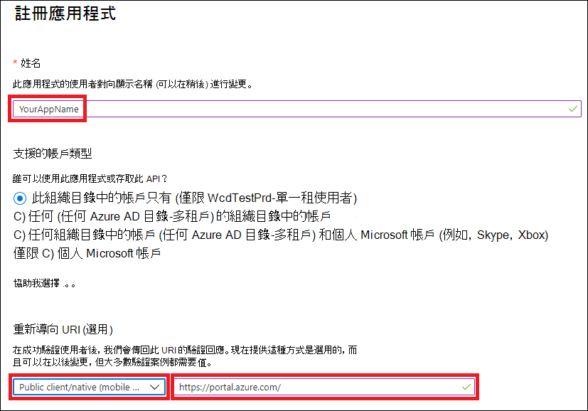

# <a name="access-microsoft-365-defender-apis-on-behalf-of-user"></a><span data-ttu-id="eeabc-104">代表使用者存取 Microsoft 365 Defender APIs</span><span class="sxs-lookup"><span data-stu-id="eeabc-104">Access Microsoft 365 Defender APIs on behalf of user</span></span>

[!INCLUDE [Microsoft 365 Defender rebranding](../includes/microsoft-defender.md)]


<span data-ttu-id="eeabc-105">適用於：</span><span class="sxs-lookup"><span data-stu-id="eeabc-105">**Applies to:**</span></span>
- <span data-ttu-id="eeabc-106">Microsoft 365 Defender</span><span class="sxs-lookup"><span data-stu-id="eeabc-106">Microsoft 365 Defender</span></span>

>[!IMPORTANT] 
><span data-ttu-id="eeabc-107">一些與 prereleased 產品相關的資訊，在正式發行之前，可能會受到大量修改。</span><span class="sxs-lookup"><span data-stu-id="eeabc-107">Some information relates to prereleased product which may be substantially modified before it's commercially released.</span></span> <span data-ttu-id="eeabc-108">Microsoft makes no warranties, express or implied, with respect to the information provided here.</span><span class="sxs-lookup"><span data-stu-id="eeabc-108">Microsoft makes no warranties, express or implied, with respect to the information provided here.</span></span>


<span data-ttu-id="eeabc-109">此頁面說明如何建立應用程式，以讓使用者能夠以程式設計方式存取 Microsoft 365 Defender。</span><span class="sxs-lookup"><span data-stu-id="eeabc-109">This page describes how to create an application to get programmatic access to Microsoft 365 Defender on behalf of a user.</span></span>

<span data-ttu-id="eeabc-110">如果您需要以程式設計方式存取 Microsoft 365 Defender，但沒有使用者，請參閱 [Create a app to Access microsoft 365 Defender （不含使用者](api-create-app-web.md)）。</span><span class="sxs-lookup"><span data-stu-id="eeabc-110">If you need programmatic access Microsoft 365 Defender without a user, refer to [Create an app to access Microsoft 365 Defender without a user](api-create-app-web.md).</span></span>

<span data-ttu-id="eeabc-111">如果您不確定需要哪種存取權，請閱讀 [access The Microsoft 365 Defender APIs](api-access.md)。</span><span class="sxs-lookup"><span data-stu-id="eeabc-111">If you are not sure which access you need, read the [Access the Microsoft 365 Defender APIs](api-access.md).</span></span>

<span data-ttu-id="eeabc-112">Microsoft 365 Defender 會透過一組程式設計 APIs 來公開其大部分資料和動作。</span><span class="sxs-lookup"><span data-stu-id="eeabc-112">Microsoft 365 Defender exposes much of its data and actions through a set of programmatic APIs.</span></span> <span data-ttu-id="eeabc-113">這些 APIs 可讓您根據 Microsoft 365 Defender 功能來自動化工作流程及創新。</span><span class="sxs-lookup"><span data-stu-id="eeabc-113">Those APIs will enable you to automate work flows and innovate based on Microsoft 365 Defender capabilities.</span></span> <span data-ttu-id="eeabc-114">API 存取需要 OAuth 2.0 驗證。</span><span class="sxs-lookup"><span data-stu-id="eeabc-114">The API access requires OAuth2.0 authentication.</span></span> <span data-ttu-id="eeabc-115">如需詳細資訊，請參閱 [OAuth 2.0 授權碼流程](https://docs.microsoft.com/azure/active-directory/develop/active-directory-v2-protocols-oauth-code)。</span><span class="sxs-lookup"><span data-stu-id="eeabc-115">For more information, see [OAuth 2.0 Authorization Code Flow](https://docs.microsoft.com/azure/active-directory/develop/active-directory-v2-protocols-oauth-code).</span></span>

<span data-ttu-id="eeabc-116">一般來講，您必須採取下列步驟，才能使用 APIs：</span><span class="sxs-lookup"><span data-stu-id="eeabc-116">In general, you’ll need to take the following steps to use the APIs:</span></span>
- <span data-ttu-id="eeabc-117">建立 AAD 應用程式</span><span class="sxs-lookup"><span data-stu-id="eeabc-117">Create an AAD application</span></span>
- <span data-ttu-id="eeabc-118">使用此應用程式取得存取 token</span><span class="sxs-lookup"><span data-stu-id="eeabc-118">Get an access token using this application</span></span>
- <span data-ttu-id="eeabc-119">使用權杖來存取 Microsoft 365 Defender API</span><span class="sxs-lookup"><span data-stu-id="eeabc-119">Use the token to access Microsoft 365 Defender API</span></span>

<span data-ttu-id="eeabc-120">此頁面說明如何建立 AAD 應用程式、取得 Microsoft 365 Defender 的存取權杖，以及驗證權杖。</span><span class="sxs-lookup"><span data-stu-id="eeabc-120">This page explains how to create an AAD application, get an access token to Microsoft 365 Defender and validate the token.</span></span>

>[!NOTE]
> <span data-ttu-id="eeabc-121">當您代表使用者存取 Microsoft 365 Defender API 時，您將需要正確的應用程式許可權和使用者許可權。</span><span class="sxs-lookup"><span data-stu-id="eeabc-121">When accessing Microsoft 365 Defender API on behalf of a user, you will need the correct Application permission and user permission.</span></span>


>[!TIP]
> <span data-ttu-id="eeabc-122">如果您有許可權執行入口網站中的動作，您就具有在 API 中執行該動作的許可權。</span><span class="sxs-lookup"><span data-stu-id="eeabc-122">If you have the permission to perform an action in the portal, you have the permission to perform the action in the API.</span></span>

## <a name="create-an-app"></a><span data-ttu-id="eeabc-123">建立應用程式</span><span class="sxs-lookup"><span data-stu-id="eeabc-123">Create an app</span></span>

1. <span data-ttu-id="eeabc-124">使用具有 **全域系統管理員** 角色的使用者登入 [Azure](https://portal.azure.com) 。</span><span class="sxs-lookup"><span data-stu-id="eeabc-124">Log on to [Azure](https://portal.azure.com) with user that has **Global Administrator** role.</span></span>

2. <span data-ttu-id="eeabc-125">流覽至 [ **Azure Active Directory**  >  **應用程式註冊** ]  >  **新註冊** 。</span><span class="sxs-lookup"><span data-stu-id="eeabc-125">Navigate to **Azure Active Directory** > **App registrations** > **New registration**.</span></span> 

   

3. <span data-ttu-id="eeabc-127">在註冊中，輸入下列資訊，然後按一下 [ **註冊** ]。</span><span class="sxs-lookup"><span data-stu-id="eeabc-127">In the registration from, enter the following information then click **Register**.</span></span>

   

   - <span data-ttu-id="eeabc-129">**名稱：** 您的應用程式名稱</span><span class="sxs-lookup"><span data-stu-id="eeabc-129">**Name:** Your application name</span></span>
   - <span data-ttu-id="eeabc-130">**應用程式類型：** 公用用戶端</span><span class="sxs-lookup"><span data-stu-id="eeabc-130">**Application type:** Public client</span></span>
   - <span data-ttu-id="eeabc-131">重新 **導向 URI：**https://portal.azure.com</span><span class="sxs-lookup"><span data-stu-id="eeabc-131">**Redirect URI:** https://portal.azure.com</span></span>

4. <span data-ttu-id="eeabc-132">若要讓您的應用程式能夠存取 Microsoft 365 Defender 並指派 it 許可權，請在應用程式頁面上，選取 [ **API 許可權**  >  **新增許可權**  >  **APIs 我的組織使用** >]，輸入 [ **microsoft 365 Defender** ]，然後選取 [ **microsoft 365 Defender** ]。</span><span class="sxs-lookup"><span data-stu-id="eeabc-132">To enable your app to access Microsoft 365 Defender and assign it permissions, on your application page, select **API Permissions** > **Add permission** > **APIs my organization uses** >, type **Microsoft 365 Defender** , and then select **Microsoft 365 Defender**.</span></span>

    >[!NOTE]
    > <span data-ttu-id="eeabc-133">Microsoft 365 Defender 未出現在原始清單中。</span><span class="sxs-lookup"><span data-stu-id="eeabc-133">Microsoft 365 Defender does not appear in the original list.</span></span> <span data-ttu-id="eeabc-134">您必須先在文字方塊中寫入其名稱，才能看到顯示的名稱。</span><span class="sxs-lookup"><span data-stu-id="eeabc-134">You need to start writing its name in the text box to see it appear.</span></span>

      

    - <span data-ttu-id="eeabc-136">選擇 [ **委派的許可權** ] > 選擇您案例的相關許可權，例如 Incident、 **Read** ，然後選取 [ **新增許可權** ]。</span><span class="sxs-lookup"><span data-stu-id="eeabc-136">Choose **Delegated permissions** > Choose the relevant permissions for your scenario, e.g. **Incident.Read** , and then select **Add permissions**.</span></span>

      

     >[!IMPORTANT]
     ><span data-ttu-id="eeabc-138">您必須選取相關的許可權。</span><span class="sxs-lookup"><span data-stu-id="eeabc-138">You need to select the relevant permissions.</span></span> 

    -  <span data-ttu-id="eeabc-139">若要決定您需要的許可權，請參閱您想要呼叫之 API 中的 [ **許可權** ] 區段。</span><span class="sxs-lookup"><span data-stu-id="eeabc-139">To determine which permission you need, please look at the **Permissions** section in the API you are interested to call.</span></span>

    - <span data-ttu-id="eeabc-140">按一下 **[授與同意** ]</span><span class="sxs-lookup"><span data-stu-id="eeabc-140">Click **Grant consent**</span></span>

      >[!NOTE]
      ><span data-ttu-id="eeabc-141">每次您新增許可權時，您必須按一下 **[授與同意** 才能讓新的許可權生效。</span><span class="sxs-lookup"><span data-stu-id="eeabc-141">Every time you add permission you must click on **Grant consent** for the new permission to take effect.</span></span>

      

6. <span data-ttu-id="eeabc-143">記下來記錄應用程式識別碼和您的租使用者 ID:</span><span class="sxs-lookup"><span data-stu-id="eeabc-143">Write down your application ID and your tenant ID:</span></span>

   - <span data-ttu-id="eeabc-144">在 [應用程式] 頁面上，移至 **[簡介** ]，然後複製下列專案：</span><span class="sxs-lookup"><span data-stu-id="eeabc-144">On your application page, go to **Overview** and copy the following:</span></span>

   


## <a name="get-an-access-token-using-powershell"></a><span data-ttu-id="eeabc-146">使用 PowerShell 取得存取權杖</span><span class="sxs-lookup"><span data-stu-id="eeabc-146">Get an access token using PowerShell</span></span>

```
#Install the ADAL.PS package if it's not installed.
if(!(Get-Package adal.ps)) { Install-Package -Name adal.ps }

$authority = "https://login.windows.net/{tenant-id}" # replace {tenant-id} with your tenant ID.

$clientId = "{application-id}" #replace {application-id} with your application ID.

$redirectUri = "{redirect-uri}" # replace {redirect-uri} with your application redirect URI.

$resourceUrl = "https://api.security.microsoft.com"

$response = Get-ADALToken -Resource $resourceUrl -ClientId $clientId -RedirectUri $redirectUri -Authority $authority -PromptBehavior:Always
$response.AccessToken | clip
$response.AccessToken
```

## <a name="related-topics"></a><span data-ttu-id="eeabc-147">相關主題</span><span class="sxs-lookup"><span data-stu-id="eeabc-147">Related topics</span></span>
- [<span data-ttu-id="eeabc-148">存取 Microsoft 365 Defender APIs</span><span class="sxs-lookup"><span data-stu-id="eeabc-148">Access the Microsoft 365 Defender APIs</span></span>](api-access.md)
- [<span data-ttu-id="eeabc-149">使用應用程式內容存取 Microsoft 365 Defender</span><span class="sxs-lookup"><span data-stu-id="eeabc-149">Access  Microsoft 365 Defender with application context</span></span>](api-create-app-web.md)
