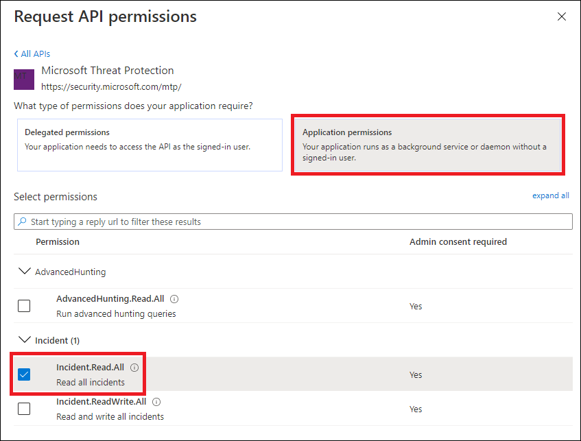
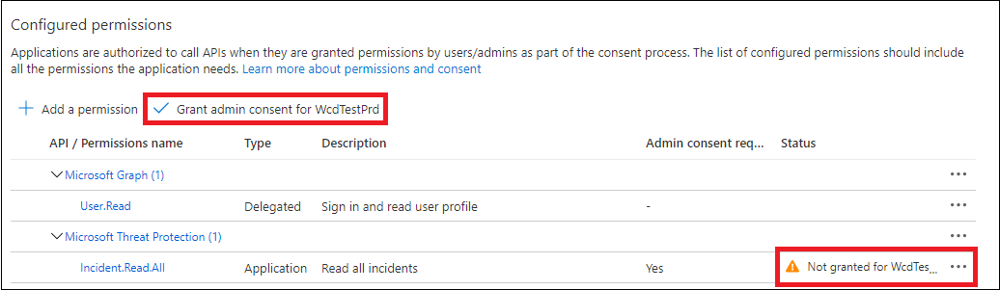
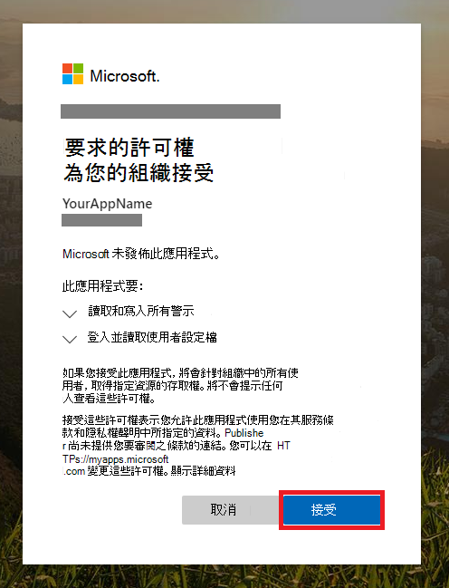

# <a name="partner-access-through-microsoft-threat-protection-apis"></a>透過 Microsoft 威脅防護進行夥伴存取 APIs

[!INCLUDE [Microsoft 365 Defender rebranding](../includes/microsoft-defender.md)]


適用於：****
- Microsoft 威脅防護

>[!IMPORTANT] 
>一些與 prereleased 產品相關的資訊，在正式發行之前，可能會受到大量修改。 Microsoft makes no warranties, express or implied, with respect to the information provided here.


此頁面說明如何建立 AAD 應用程式，以對客戶進行以程式設計方式存取 Microsoft 威脅防護。

Microsoft 威脅防護會透過一組程式設計 APIs 來公開其資料和動作。 這些 APIs 會協助您根據 Microsoft 威脅防護功能來自動化工作流程與創新。 API 存取需要 OAuth 2.0 驗證。 如需詳細資訊，請參閱 [OAuth 2.0 授權碼流程](https://docs.microsoft.com/azure/active-directory/develop/active-directory-v2-protocols-oauth-code)。

一般來講，您必須採取下列步驟，才能使用 APIs：
- 建立 **多租** 使用者 AAD 應用程式。
- 取得授權 (，由您的應用程式的客戶管理員) ，以存取所需的 Microsoft 威脅防護資源。
- 使用此應用程式取得存取權杖。
- 使用權杖來存取 Microsoft 威脅防護 API。

下列步驟會指導您如何建立 AAD 應用程式、取得 Microsoft 威脅防護的存取權杖，以及驗證權杖。

## <a name="create-the-multi-tenant-app"></a>建立多租使用者應用程式

1. 使用具有**全域系統管理員**角色的使用者登入您的[Azure 租](https://portal.azure.com)使用者。

2. 流覽至 [ **Azure Active Directory**  >  **應用程式註冊**]  >  **新註冊**。 

   

3. 在 [註冊] 表單中：

    - 選擇應用程式的名稱。

    - 支援的帳戶類型-任何組織目錄中的帳戶。

    - 重新導向 URI-類型： Web，URI： https://portal.azure.com

    


4. 讓您的應用程式能夠存取 Microsoft 威脅防護，並將其指派給完成整合所需的最少一組許可權。

   - 在 [應用程式] 頁面上，按一下 [ **API 許可權**  >  **新增許可權**  >  **APIs 我的組織] 使用**> 輸入**microsoft 威脅防護**，然後按一下 [ **microsoft 威脅防護**]。

   >[!NOTE]
   >Microsoft 威脅防護不會出現在原始清單中。 您必須先在文字方塊中寫入其名稱，才能看到顯示的名稱。

   
   
   ### <a name="request-api-permissions"></a>要求 API 許可權

   若要決定您需要的許可權，請參閱您想要呼叫之 API 中的 [ **許可權** ] 區段。 

   在下列範例中，我們將使用「 **讀取所有事件** 」許可權：

   選擇**應用程式許可權**  >  **事件。讀取。所有**> 按一下 [**新增許可權**]

   


5. 按一下 **[授與同意**]

    >[!NOTE]
    >每次您新增許可權時，您必須按一下 **[授與同意** 才能讓新的許可權生效。

    

6. 將密碼新增至應用程式。

    - 按一下 [ **憑證 & 機密**]，將 description 新增至密碼，然後按一下 [ **新增**]。

    >[!IMPORTANT]
    > 選取 [ **新增**] 之後，請 **複製產生的密碼值**。 離開後，您將無法進行找回！

    

7. 記下來記錄應用程式 ID:

   - 在 [應用程式] 頁面上，移至 **[簡介** ]，然後複製下列專案：

   

8. 將應用程式新增至客戶的承租人。

    您必須在您要使用的每個客戶承租人中核准您的應用程式。 這是因為您的應用程式代表客戶與 Microsoft 威脅防護應用程式互動。

    擁有客戶之租使用者之 **全域管理員** 的使用者，必須按一下 [同意] 連結並核准您的應用程式。

    「同意」連結的格式如下：

    ```
    https://login.microsoftonline.com/common/oauth2/authorize?prompt=consent&client_id=00000000-0000-0000-0000-000000000000&response_type=code&sso_reload=true
    ```

    其中00000000-0000-0000-0000-000000000000 應該會取代為您的應用程式識別碼

    按一下 [同意] 連結後，請使用客戶租使用者的全域管理員登入，並同意該應用程式。

    

    此外，您需要向客戶尋求其租使用者識別碼，並將其儲存以供日後用於取得權杖。

- **做！** 您已成功註冊應用程式！ 
- 請參閱下列範例以取得及驗證權杖。

## <a name="get-an-access-token-examples"></a>取得存取 token 範例：

>[!NOTE]
> 若要代表客戶取得存取權杖，請在下列標記上使用客戶的租使用者識別碼。

<br>如需 AAD 權杖的詳細資訊，請參閱[AAD 教學](https://docs.microsoft.com/azure/active-directory/develop/active-directory-v2-protocols-oauth-client-creds)課程

### <a name="using-powershell"></a>使用 PowerShell

```
# That code gets the App Context Token and save it to a file named "Latest-token.txt" under the current directory
# Paste below your Tenant ID, App ID and App Secret (App key).

$tenantId = '' ### Paste your tenant ID here
$appId = '' ### Paste your Application ID here
$appSecret = '' ### Paste your Application key here

$resourceAppIdUri = 'https://api.security.microsoft.com'
$oAuthUri = "https://login.windows.net/$TenantId/oauth2/token"
$authBody = [Ordered] @{
    resource = "$resourceAppIdUri"
    client_id = "$appId"
    client_secret = "$appSecret"
    grant_type = 'client_credentials'
}
$authResponse = Invoke-RestMethod -Method Post -Uri $oAuthUri -Body $authBody -ErrorAction Stop
$token = $authResponse.access_token
Out-File -FilePath "./Latest-token.txt" -InputObject $token
return $token
```

### <a name="using-c"></a>使用 c #：

>下列程式碼已使用 Nuget Windows.identitymodel.extensions.dll 進行測試。 ActiveDirectory

- 建立新的主控台應用程式
- 安裝 Nuget [windows.identitymodel.extensions.dll ActiveDirectory](https://www.nuget.org/packages/Microsoft.IdentityModel.Clients.ActiveDirectory/)
- 使用下列新增

    ```
    using Microsoft.IdentityModel.Clients.ActiveDirectory;
    ```

- 在應用程式中複製/貼上下列程式碼 (請勿忘記更新3個變數： ```tenantId, appId, appSecret```) 

    ```
    string tenantId = "00000000-0000-0000-0000-000000000000"; // Paste your own tenant ID here
    string appId = "11111111-1111-1111-1111-111111111111"; // Paste your own app ID here
    string appSecret = "22222222-2222-2222-2222-222222222222"; // Paste your own app secret here for a test, and then store it in a safe place! 

    const string authority = "https://login.windows.net";
    const string mtpResourceId = "https://api.security.microsoft.com";

    AuthenticationContext auth = new AuthenticationContext($"{authority}/{tenantId}/");
    ClientCredential clientCredential = new ClientCredential(appId, appSecret);
    AuthenticationResult authenticationResult = auth.AcquireTokenAsync(mtpResourceId, clientCredential).GetAwaiter().GetResult();
    string token = authenticationResult.AccessToken;
    ```


### <a name="using-curl"></a>使用捲曲

> [!NOTE]
> 下列程式會在您的電腦上安裝已安裝 Windows 的卷

- 開啟命令視窗
- 將 CLIENT_ID 設定為您的 Azure 應用程式識別碼
- 將 CLIENT_SECRET 設定為您的 Azure 應用程式機密
- 將 TENANT_ID 設定為想要使用應用程式來存取 Microsoft 威脅防護應用程式之客戶的 Azure 租使用者識別碼
- 執行下列命令：

```
curl -i -X POST -H "Content-Type:application/x-www-form-urlencoded" -d "grant_type=client_credentials" -d "client_id=%CLIENT_ID%" -d "scope=https://api.security.microsoft.com.default" -d "client_secret=%CLIENT_SECRET%" "https://login.microsoftonline.com/%TENANT_ID%/oauth2/v2.0/token" -k
```

您會收到下列表單的答案：

```
{"token_type":"Bearer","expires_in":3599,"ext_expires_in":0,"access_token":"eyJ0eXAiOiJKV1QiLCJhbGciOiJSUzI1NiIsIn <truncated> aWReH7P0s0tjTBX8wGWqJUdDA"}
```

## <a name="validate-the-token"></a>驗證 token

健全檢查以確認您獲得正確的權杖：

- 複製/貼上您在上一個步驟中 [取得的標記](https://jwt.ms) ，以便進行解碼
- 驗證您取得所需許可權的「role」宣告
- 在下列螢幕擷取畫面中，您可以看到從應用程式取得的解碼標記，具有對 Microsoft 威脅防護的多個許可權：
- 「Tid」宣告是識別碼所屬的租使用者識別碼。


## <a name="use-the-token-to-access-microsoft-threat-protection-api"></a>使用權杖存取 Microsoft 威脅防護 API

- 選擇您要使用的 API，如需詳細資訊，請參閱 [支援的 Microsoft 威脅防護 APIs](api-supported.md)
- 在您傳送至 "載荷 {token}" 的 Http 要求中設定授權標頭 (載荷是授權配置) 
- 權杖的到期時間是1小時 (您可以使用相同的權杖傳送一個以上的要求) 

- **使用 c #** 傳送要求以取得事件清單的範例 
    ```
    var httpClient = new HttpClient();

    var request = new HttpRequestMessage(HttpMethod.Get, "https://api.security.microsoft.com/api/incidents");

    request.Headers.Authorization = new AuthenticationHeaderValue("Bearer", token);

    var response = httpClient.SendAsync(request).GetAwaiter().GetResult();

    // Do something useful with the response
    ```

## <a name="related-topics"></a>相關主題 

- [存取 Microsoft 威脅防護 APIs](api-access.md)
- [使用應用程式內容存取 Microsoft 威脅防護](api-create-app-web.md)
- [使用使用者內容存取 Microsoft 威脅防護](api-create-app-user-context.md)
