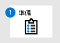
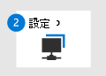
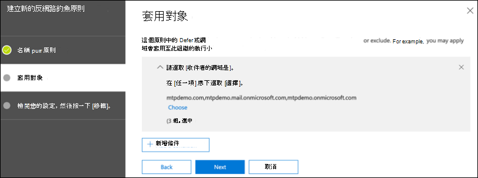
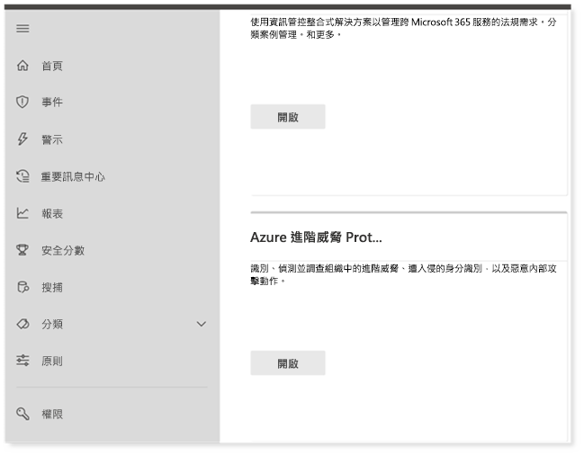
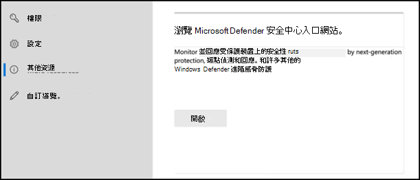
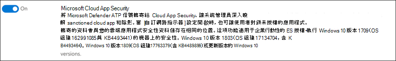

# 為您的試用實驗室或試驗環境設定 Microsoft 365 Defender 支柱Configure Microsoft 365 Defender pillars for your trial lab or pilot environment

[!INCLUDE [Microsoft 365 Defender rebranding](../includes/microsoft-defender.md)]

適用於：**Applies to:**
- Microsoft 365 DefenderMicrosoft 365 Defender

建立 Microsoft 365 Defender 試驗實驗室或試驗環境並加以部署時，會有三個階段的處理常式：Creating a Microsoft 365 Defender trial lab or pilot environment and deploying it is a three-phase process:

| [階段1：準備Phase 1: Prepare](prepare-mtpeval.md) | [階段2：設定Phase 2: Set up](setup-mtpeval.md) | 階段3：板載Phase 3: Onboard |  [回到試驗行動手冊Back to pilot playbook](mtp-pilot.md) |
|--|--|--|--|
|| |*您在這裡！**You are here!* | |

您目前正在設定階段。You're currently in the configuration phase.

準備工作是任何成功部署的關鍵。Preparation is key to any successful deployment. 在本文中，您將指導您準備部署 Microsoft Defender 做為端點時所需考慮的點數。In this article, you'll be guided on the points you'll need to consider as you prepare to deploy Microsoft Defender for Endpoint.

## Microsoft 365 Defender 支柱Microsoft 365 Defender pillars
Microsoft 365 Defender 包含四個支柱。Microsoft 365 Defender consists of four pillars. 雖然一個 pillar 可以為您的網路組織的安全性提供價值，但是啟用四個 Microsoft 365 Defender 支柱會為組織提供最大的價值。Although one pillar can already provide value to your network organization's security, enabling the four Microsoft 365 Defender pillars will give your organization the most value.

本節會引導您設定下列專案：This section will guide you to configure:
-   適用於 Office 365 的 Microsoft DefenderMicrosoft Defender for Office 365
-   適用於身分識別的 Microsoft DefenderMicrosoft Defender for Identity 
-   Microsoft 雲端 App 安全性Microsoft Cloud App Security
-   適用於端點的 Microsoft DefenderMicrosoft Defender for Endpoint

## 設定 Microsoft Defender for Office 365Configure Microsoft Defender for Office 365

>[!NOTE]
>如果您已啟用 Office 365 的 Defender，請略過此步驟。Skip this step if you've already enabled Defender for Office 365. 

有一個稱為「 *Office 365 高級威脅防護* 」的 PowerShell 模組 (ORCA) 可協助判斷部分設定。There's a PowerShell Module called the *Office 365 Advanced Threat Protection Recommended Configuration Analyzer (ORCA)* that helps determine some of these settings. 當您在租使用者中以系統管理員身分執行時，ORCAReport 將協助產生反垃圾郵件、反網路釣魚和其他郵件衛生設定的評估。When run as an administrator in your tenant, get-ORCAReport will help generate an assessment of the anti-spam, anti-phish, and other message hygiene settings. 您可以從下載此模組 https://www.powershellgallery.com/packages/ORCA/ 。You can download this module from https://www.powershellgallery.com/packages/ORCA/. 

1. 流覽至 [Office 365 Security & 合規性中心](https://protection.office.com/homepage)  >  **威脅管理**  >  **原則**。Navigate to [Office 365 Security & Compliance Center](https://protection.office.com/homepage) > **Threat management** > **Policy**.

   
 
2. 按一下 [ **反網路釣魚**]，選取 [ **建立** 並填入原則名稱和描述]。Click **Anti-phishing**, select **Create** and fill in the policy name and description. 按 [下一步 **]**。Click **Next**.

   

   > [!NOTE]
   > 在 Microsoft Defender for Office 365 中編輯您的高級防網路釣魚原則。Edit your Advanced anti-phishing policy in Microsoft Defender for Office 365. 將 **高級網路釣魚閥值** 變更為 **2-嚴格**。Change **Advanced Phishing Threshold** to **2 - Aggressive**.

3. 按一下 [ **新增條件** ] 下拉式功能表，然後選取您的網域 (s) 做為收件者網域。Click the **Add a condition** drop-down menu and select your domain(s) as recipient domain. 按 [下一步 **]**。Click **Next**.

   
 
4. 請複查您的設定。Review your settings. 按一下 [ **建立這個原則** ] 以確認。Click **Create this policy** to confirm. 

   ![Image of_Office 365 Security & 相容性中心反網路釣魚原則頁面，您可以在其中檢查您的設定，然後按一下 [建立這個原則] 按鈕](../../media/mtp-eval-35.png)
 
5. 選取 [ **安全附件** ]，然後選取 [ **開啟 SharePoint]、[OneDrive] 和 [Microsoft 小組** ] 選項的 ATP。Select **Safe Attachments** and select the **Turn on ATP for SharePoint, OneDrive, and Microsoft Teams** option.

   ![Image of_Office 365 Security & 合規性中心] 頁面，您可以在其中開啟 SharePoint、OneDrive 及 Microsoft 小組的 ATP](../../media/mtp-eval-36.png)

6. 按一下 [+] 圖示，以建立新的安全附件原則，並將其套用為網域的收件者網域。Click the + icon to create a new safe attachment policy, apply it as recipient domain to your domains. 按一下 **[儲存]**。Click **Save**.

   ![Image of_Office 365 Security & 合規性中心] 頁面，您可以在此頁面上建立新的安全附件原則](../../media/mtp-eval-37.png)
 
7. 接下來，選取 [ **安全連結** 原則]，然後按一下鉛筆圖示以編輯預設原則。Next, select the **Safe Links** policy, then click the pencil icon to edit the default policy.

8. 請確定未選取 [ **不要在使用者按一下安全連結時進行追蹤** ] 選項，而會選取其餘的選項。Make sure that the **Do not track when users click safe links** option is not selected, while the rest of the options are selected. 如需詳細資訊，請參閱 [安全連結設定](../office-365-security/recommended-settings-for-eop-and-office365-atp.md) 。See [Safe Links settings](../office-365-security/recommended-settings-for-eop-and-office365-atp.md) for details. 按一下 **[儲存]**。Click **Save**. 

   ![Image of_Office 365 Security & 相容性中心] 頁面，顯示未選取 [使用者按一下安全時不會追蹤] 選項](../../media/mtp-eval-38.png)

9. 接下來選取 **反惡意** 代碼原則，選取預設值，然後選擇 [鉛筆] 圖示。Next select the **Anti-malware** policy, select the default, and choose the pencil icon.

10. 按一下 [ **設定** ]，然後選取 **[是] 並使用預設通知文字** ，以啟用 **惡意程式碼偵測回應**。Click **Settings** and select **Yes and use the default notification text** to enable **Malware Detection Response**. 開啟 **通用附件類型 Filter** 。Turn the **Common Attachment Types Filter** on. 按一下 **[儲存]**。Click **Save**.

    ![Image of_Office 365 Security & 合規性中心] 頁面，顯示惡意程式碼偵測回應開啟時會啟用預設通知，而一般附件類型篩選已開啟](../../media/mtp-eval-39.png)
  
11. 流覽至 [Office 365 Security & 合規性中心](https://protection.office.com/homepage)  >  **搜尋**  >  **審核記錄檔搜尋**，然後開啟審計。Navigate to [Office 365 Security & Compliance Center](https://protection.office.com/homepage) > **Search** > **Audit log search** and turn Auditing on.

    ![Image of_Office 365 Security & 合規性中心] 頁面，您可以在此開啟審核記錄搜尋](../../media/mtp-eval-40.png)

12. 整合 Microsoft Defender for Office 365 搭配 Microsoft Defender for Endpoint。Integrate Microsoft Defender for Office 365 with Microsoft Defender for Endpoint. 流覽至 [Office 365 Security & 合規性中心](https://protection.office.com/homepage)  >  **威脅管理**  >  **瀏覽器**，然後選取螢幕右上角的 [ **Microsoft Defender for Endpoint] 設定**。Navigate to [Office 365 Security & Compliance Center](https://protection.office.com/homepage) > **Threat management** > **Explorer** and select **Microsoft Defender for Endpoint Settings** on the upper right corner of the screen. 在 [Defender for Endpoint connection] 對話方塊中，開啟 **[連線至 Microsoft Defender For endpoint**]。In the Defender for Endpoint connection dialog box, turn on **Connect to Microsoft Defender for Endpoint**.

    ![Image of_Office 365 Security & 合規性中心] 頁面，您可以在此頁面上開啟 Microsoft Defender for Endpoint connection。](../../media/mtp-eval-41.png)

## 設定 Microsoft Defender 身分識別Configure Microsoft Defender for Identity

>[!NOTE]
>如果您已啟用 Microsoft Defender 身分識別，請略過此步驟。Skip this step if you've already enabled Microsoft Defender for Identity

1. 流覽至 [microsoft 365 Security Center](https://security.microsoft.com/info) > 選取 [microsoft Defender 身分識別] 的 [**更多資源**]  >  \*\*\*\*。Navigate to [Microsoft 365 Security Center](https://security.microsoft.com/info) > select **More Resources** > **Microsoft Defender for Identity**.

   

2. 按一下 [ **建立** ]，以啟動 Microsoft Defender 身分識別嚮導。Click **Create** to start the Microsoft Defender for Identity wizard. 

   ![Image of_Microsoft 身分識別嚮導的 Defender] 頁面，您應該按一下 [建立] 按鈕](../../media/mtp-eval-43.png)

3. 選擇 [ **提供使用者名稱和密碼] 以連線至您的 Active Directory 樹** 系。Choose **Provide a username and password to connect to your Active Directory forest**.  

   

4. 輸入您的 Active Directory 內部部署認證。Enter your Active Directory on-premises credentials. 這可以是具有 Active Directory 讀取權限的任何使用者帳戶。This can be any user account that has read access to Active Directory.

   ![Image of_Microsoft 用於身分識別目錄服務的 Defender 目錄服務] 頁面，您應該在這裡放置您的認證](../../media/mtp-eval-45.png)

5. 接下來，選擇 [將 **感應器安裝** 和傳輸檔案下載到您的網域控制站]。Next, choose **Download Sensor Setup** and transfer file to your domain controller.

   ![影像 of_Microsoft 身分識別] 頁面，您可以在其中選取 [下載感應器設定]](../../media/mtp-eval-46.png)

6. 針對身分識別感應器安裝執行 Microsoft Defender，並開始遵循此嚮導。Execute the Microsoft Defender for Identity Sensor Setup and begin following the wizard.

   ![Image of_Microsoft 用於身分識別的 Defender] 頁面，您應該按 [下一步] 遵循 Microsoft Defender for Identity 感應器嚮導](../../media/mtp-eval-47.png)
 
7. 在感應器部署類型中按 **[下一步]** 。Click **Next** at the sensor deployment type.

   ![影像 of_Microsoft 身分識別] 頁面，您應該在此按 [下一步] 移至下一頁面](../../media/mtp-eval-48.png)
 
8. 複製存取機碼，因為您需要在嚮導的下一步輸入它。Copy the access key because you need to enter it next in the Wizard.

   ![影像 of_the 感應器頁面，您應該在下一個 Microsoft Defender for Identity 感應器安裝精靈] 頁面中複製您需要輸入的訪問機碼。](../../media/mtp-eval-49.png)
 
9. 將存取機碼複製到嚮導，然後按一下 [ **安裝**]。Copy the access key into the Wizard and click **Install**. 

   ![Image of_Microsoft 用於身分識別感應器的 Defender 嚮導] 頁面，您應該在此頁面上提供存取機碼，然後按一下 [安裝] 按鈕](../../media/mtp-eval-50.png)

10. 恭喜，您已在您的網域控制站上成功設定 Microsoft Defender 身分識別。Congratulations, you've successfully configured Microsoft Defender for Identity on your domain controller.

    ![Image of_Microsoft 用於身分識別感應器的 Defender 安裝程式安裝完成，您應該按一下 [完成] 按鈕](../../media/mtp-eval-51.png)
 
11. 在 [ [Microsoft defender 身分識別](https://go.microsoft.com/fwlink/?linkid=2040449) 設定] 區段中，選取 [\* \* microsoft Defender for Endpoint \* \*]，然後開啟切換。Under the [Microsoft Defender for Identity](https://go.microsoft.com/fwlink/?linkid=2040449) settings section, select \*\*Microsoft Defender for Endpoint \*\*, then turn on the toggle. 按一下 **[儲存]**。Click **Save**. 

    ![Image of_the Microsoft Defender 身分識別設定] 頁面，您應該在此頁面上開啟 Microsoft Defender 的端點切換功能](../../media/mtp-eval-52.png)

> [!NOTE]
> Windows Defender ATP 已 rebranded 為 Microsoft Defender for Endpoint。Windows Defender ATP has been rebranded as Microsoft Defender for Endpoint. 所有的入口網站上的 ..org 變更都會針對一致性加以匯總。Rebranding changes across all of our portals are being rolled out the for consistency.

## 設定 Microsoft Cloud App SecurityConfigure Microsoft Cloud App Security

> [!NOTE]
> 如果您已啟用 Microsoft Cloud App 安全性，請略過此步驟。Skip this step if you've already enabled Microsoft Cloud App Security. 

1. 流覽至 [microsoft](https://security.microsoft.com/info)  >    >  **Cloud App security** 的 microsoft 365 Security Center More Resources。Navigate to [Microsoft 365 Security Center](https://security.microsoft.com/info) > **More Resources** > **Microsoft Cloud App Security**.

   ![Image of_Microsoft 365 Security Center 頁面，您可以在其中看到 Microsoft Cloud App 卡片，應該按一下 [開啟] 按鈕](../../media/mtp-eval-53.png)

2. 在資訊提示中，針對身分識別整合 Microsoft Defender，請選取 [ **啟用 Microsoft defender 以進行識別資料整合**]。At the information prompt to integrate Microsoft Defender for Identity, select **Enable Microsoft Defender for Identity data integration**.
  
   ![Image of_the 資訊提示，針對識別整合 Microsoft Defender 以供您選取 [啟用 Microsoft Defender 身分識別資料整合] 連結](../../media/mtp-eval-54.png)

   > [!NOTE]
   > 如果您未看到此提示，這可能表示您的 Microsoft Defender 的身分識別資料整合已經啟用。If you don’t see this prompt, it might mean that your Microsoft Defender for Identity data integration has already been enabled. 不過，如果您不確定，請與您的 IT 系統管理員聯繫以確認。However, if you are not sure, contact your IT Administrator to confirm. 

3. 移至 [ **設定**]，開啟 **Microsoft Defender 的身分識別整合** 切換，然後按一下 [ **儲存**]。Go to **Settings**, turn on the **Microsoft Defender for Identity integration** toggle, then click **Save**. 

   ![影像 of_the 設定] 頁面，您應該在此頁面上開啟「Microsoft Defender 身分識別整合」切換，然後按一下 [儲存]](../../media/mtp-eval-55.png)
   
   > [!NOTE]
   > 針對新的 Microsoft Defender for Identity 實例，此整合切換功能會自動開啟。For new Microsoft Defender for Identity instances, this integration toggle is automatically turned on. 在繼續進行下一個步驟之前，請確認已啟用 Microsoft Defender 的身分識別整合。Confirm that your Microsoft Defender for Identity integration has been enabled before you proceed to the next step.
 
4. 在 [雲端探索設定] 底下，選取 [ **Microsoft Defender For Endpoint integration**]，然後啟用整合。Under the Cloud discovery settings, select **Microsoft Defender for Endpoint integration**, then enable the integration. 按一下 **[儲存]**。Click **Save**.

   ![Image of_the Microsoft Defender for Endpoint] 頁面，選取 [Microsoft defender for Endpoint integration] 下的 [封鎖 unsanctioned 應用程式] 核取方塊。](../../media/mtp-eval-56.png)

5. 在 [雲端探索設定] 底下，選取 [ **使用者豐富**]，然後啟用與 Azure Active Directory 的整合。Under Cloud discovery settings, select **User enrichment**, then enable the integration with Azure Active Directory.

   ![[使用者豐富] 區段中的 [濃縮已發現使用者識別碼與 Azure Active Directory 使用者識別碼] 核取方塊的影像](../../media/mtp-eval-57.png)

## 設定 Microsoft Defender for EndpointConfigure Microsoft Defender for Endpoint

>[!NOTE]
>如果您已啟用 Microsoft Defender for Endpoint，請略過此步驟。Skip this step if you've already enabled Microsoft Defender for Endpoint.

1. 流覽至 microsoft Defender security center 的 [microsoft 365 Security center](https://security.microsoft.com/info)  >  **More Resources**  >  \*\*\*\*。Navigate to [Microsoft 365 Security Center](https://security.microsoft.com/info) > **More Resources** > **Microsoft Defender Security Center**. 按一下 [開啟]。Click **Open**.

   
 
2. 遵循 Microsoft Defender for Endpoint 嚮導。Follow the Microsoft Defender for Endpoint wizard. 按 [下一步 **]**。Click **Next**. 

   

3. 選擇 [根據您慣用的資料儲存位置]、[資料保留原則]、[組織大小] 和 [加入宣告預覽] 功能。Choose based on your preferred data storage location, data retention policy, organization size, and opt-in for preview features.

   ![Image of_the] 頁面上，選取您的資料儲存國家、保留原則及組織規模。](../../media/mtp-eval-60.png)
   
   > [!NOTE]
   > 您無法變更某些設定，例如，以後的資料儲存位置。You cannot change some of the settings, like data storage location, afterwards. 

   按 [下一步 **]**。Click **Next**. 

4. 按一下 [ **繼續** ]，它會布建您的 Microsoft Defender for Endpoint 租使用者。Click **Continue** and it will provision your Microsoft Defender for Endpoint tenant.

   ![影像 of_the 頁面提示您按一下 [繼續] 按鈕以建立您的雲端實例](../../media/mtp-eval-61.png)

5. 透過「群組原則」、「Microsoft 端點管理員」或執行本機腳本至 Microsoft Defender for Endpoint，將端點架上。Onboard your endpoints through Group Policies, Microsoft Endpoint Manager or by running a local script to Microsoft Defender for Endpoint. 為了簡便起見，本指南使用本機腳本。For simplicity, this guide uses the local script.

6. 按一下 [ **下載套件** ]，然後將上架腳本複製到端點 (s) 。Click **Download package** and copy the onboarding script to your endpoint(s).

   ![影像 of_page 提示您按一下 [下載套件] 按鈕，將上架腳本複製到您的端點或端點](../../media/mtp-eval-62.png)

7. 在您的端點上，以系統管理員身分執行上架腳本，然後選擇 [Y]。On your endpoint, run the onboarding script as Administrator and choose Y. 

   ![Image of_the 命令列，您可以在其中執行上架腳本，然後選擇 [Y] 繼續](../../media/mtp-eval-63.png)

8. 恭喜，您已架您的第一個端點。Congratulations, you've onboarded your first endpoint.

   

9. 從 Microsoft Defender for Endpoint 嚮導複製並貼上偵測測試。Copy-paste the detection test from the Microsoft Defender for Endpoint wizard.

   ![影像 of_the 執行偵測測試步驟，您應該按一下 [複製] 以複製您應該在命令提示字元中貼上的偵測測試腳本。](../../media/mtp-eval-65.png)

10. 將 PowerShell 腳本複製到提升許可權的命令提示字元，然後執行它。Copy the PowerShell script to an elevated command prompt and run it. 

    

11. 選取 [ **開始使用 Microsoft Defender For Endpoint** ] 從嚮導。Select **Start using Microsoft Defender for Endpoint** from the Wizard.

    ![從嚮導中 of_the 的確認提示，您應該按一下 [開始使用 Microsoft Defender for Endpoint]](../../media/mtp-eval-67.png)
 
12. 流覽 [Microsoft Defender 安全中心](https://securitycenter.windows.com/)。Visit the [Microsoft Defender Security Center](https://securitycenter.windows.com/). 移至 [ **設定** ]，然後選取 [ **高級功能**]。Go to **Settings** and then select **Advanced features**. 

    ![您應選取 [高級功能] 的 [of_Microsoft Defender 安全性中心設定] 功能表中的影像](../../media/mtp-eval-68.png)

13. 開啟與 **Microsoft Defender 身分識別** 的整合。Turn on the integration with **Microsoft Defender for Identity**.  

    

14. 開啟與 **Office 365 威脅情報** 的整合。Turn on the integration with **Office 365 Threat Intelligence**.

    

15. 開啟與 **Microsoft Cloud App Security** 的整合。Turn on integration with **Microsoft Cloud App Security**.

    

16. 向中按向下方，然後按一下 [ **儲存偏好** 設定] 以確認新的整合。Scroll down and click **Save preferences** to confirm the new integrations.

    

## 開始使用 Microsoft 365 Defender 服務Start the Microsoft 365 Defender service

>[!NOTE]
>從2020年6月1日開始，Microsoft 會自動為所有合格的承租人啟用 Microsoft 365 Defender 功能。Starting June 1, 2020, Microsoft automatically enables Microsoft 365 Defender features for all eligible tenants. 如需詳細資訊，請參閱此 [Microsoft 技術小組文章](https://techcommunity.microsoft.com/t5/security-privacy-and-compliance/microsoft-threat-protection-will-automatically-turn-on-for/ba-p/1345426) 。See this [Microsoft Tech Community article on license eligibility](https://techcommunity.microsoft.com/t5/security-privacy-and-compliance/microsoft-threat-protection-will-automatically-turn-on-for/ba-p/1345426) for details. 

移至 [Microsoft 365 Security Center](https://security.microsoft.com/homepage)。Go to [Microsoft 365 Security Center](https://security.microsoft.com/homepage). 流覽至 [ **設定** ]，然後選取 [ **Microsoft 365 Defender**]。Navigate to **Settings** and then select **Microsoft 365 Defender**.

  

如需更完整的指導，請參閱 [開啟 Microsoft 365 Defender](mtp-enable.md)。For a more comprehensive guidance, see [Turn on Microsoft 365 Defender](mtp-enable.md). 

恭喜！Congratulations! 您剛剛建立 Microsoft 365 Defender 試用實驗室或試驗環境！You've just created your Microsoft 365 Defender trial lab or pilot environment! 現在，您可以熟悉 Microsoft 365 Defender 使用者介面！Now you can familiarize yourself with the Microsoft 365 Defender user interface! 查看您可以從下列 Microsoft 365 Defender 互動版指南中學到的內容，並瞭解如何使用每個儀表板做為日常安全性作業工作。See what you can learn from the following Microsoft 365 Defender interactive guide and know how to use each dashboard for your day-to-day security operation tasks.

>[!VIDEO https://aka.ms/MTP-Interactive-Guide]

接下來，您可以模擬攻擊，並查看「向量積」功能如何偵測、建立提醒，以及自動回應端點上的 fileless 攻擊。Next, you can simulate an attack and see how the cross product capabilities detect, create alerts, and automatically respond to a fileless attack on an endpoint.

## 後續步驟Next step

- [產生測試警示](generate-test-alert.md) -在您的 Microsoft 365 Defender 試用版實驗室中執行攻擊模擬。[Generate a test alert](generate-test-alert.md) - Run an attack simulation in your Microsoft 365 Defender trial lab.