# 設定試用實驗室環境的 Microsoft 威脅防護支柱Configure Microsoft Threat Protection pillars for your trial lab environment

適用於：\*\*\*\***Applies to:**
- Microsoft 威脅防護Microsoft Threat Protection

建立 Microsoft 威脅防護試用實驗室環境並加以部署時，會有三個階段的處理常式：Creating a Microsoft Threat Protection trial lab environment and deploying it is a three-phase process:

 
<table border="0" width="100%" align="center">
  <tr style="text-align:center;">
    <td align="center" style="width:25%; border:0;" >
      <a href= "https://docs.microsoft.com/microsoft-365/security/mtp/prepare-mtpeval?view=o365-worldwide"> 
        
       階段1：準備</a>Phase 1: Prepare </a> 
    </td>
     <td align="center">
      <a href="https://docs.microsoft.com/microsoft-365/security/mtp/setup-mtpeval?view=o365-worldwide">
        
       階段2：設定</a>Phase 2: Setup </a> 
    </td>
    <td align="center" bgcolor="#d5f5e3">
      <a href="https://docs.microsoft.com/microsoft-365/security/mtp/config-mtpeval?view=o365-worldwide">
        
       階段3：設定板載 &</a>Phase 3: Configure & Onboard </a> 
</td>

  </tr>
</table>

您目前在設定階段。You are currently in the configuration phase.

準備工作是任何成功部署的關鍵。Preparation is key to any successful deployment. 在本文中，您將指導您準備部署 Microsoft Defender ATP 時所需考慮的事項。In this article, you'll be guided on the points you'll need to consider as you prepare to deploy Microsoft Defender ATP.

## Microsoft 威脅防護的支柱Microsoft Threat Protection pillars
Microsoft 威脅防護包含四個支柱。Microsoft Threat Protection consists of four pillars. 雖然一個 pillar 可以為您的網路組織的安全性提供價值，但是啟用四個 Microsoft 威脅防護的分項會使組織發揮最大的價值。Although one pillar can already provide value to your network organization's security, enabling the four Microsoft Threat Protection pillars will give your organization the most value.

  

本節會引導您設定下列專案：This section will guide you to configure:
-   Office 365 進階威脅防護Office 365 Advanced Threat Protection
-   Azure 進階威脅防護Azure Advanced Threat Protection 
-   Microsoft Cloud App SecurityMicrosoft Cloud App Security
-   Microsoft Defender 進階威脅防護Microsoft Defender Advanced Threat Protection

## 設定 Office 365 的高級威脅防護Configure Office 365 Advanced Threat Protection
>[!NOTE]
>如果您已啟用 Office 365 的高級威脅防護，請略過此步驟。Skip this step if you have already enabled Office 365 Advanced Threat Protection. 

有一個稱為*Office 365 Advanced 威脅防護*的 PowerShell 模組，建議的設定分析器（ORCA）可協助判斷部分設定。There is a PowerShell Module called the *Office 365 Advanced Threat Protection Recommended Configuration Analyzer (ORCA)* that helps determine some of these settings. 當您在租使用者中以系統管理員身分執行時，ORCAReport 將協助產生反垃圾郵件、反網路釣魚和其他郵件衛生設定的評估。When run as an administrator in your tenant, get-ORCAReport will help generate an assessment of the anti-spam, anti-phish, and other message hygiene settings. 您可以從下載此模組 https://www.powershellgallery.com/packages/ORCA/ 。You can download this module from https://www.powershellgallery.com/packages/ORCA/. 

1. 流覽至[Office 365 Security & 合規性中心](https://protection.office.com/homepage)  >  **威脅管理**  >  **原則**。Navigate to [Office 365 Security & Compliance Center](https://protection.office.com/homepage) > **Threat management** > **Policy**.
  
 
2. 按一下 [ **ATP 反網路釣魚**]，選取 [**建立**並填入原則名稱和描述]。Click **ATP anti-phishing**, select **Create** and fill in the policy name and description. 按 [下一步]\*\*\*\*。Click **Next**.
  

>[!NOTE]
>編輯您的高級 ATP 反網路釣魚原則。Edit your Advanced ATP anti-phishing policy. 將**高級網路釣魚閥值**變更為**2-嚴格**。Change **Advanced Phishing Threshold** to **2 - Aggressive**.
 

3. 按一下 [**新增條件**] 下拉式功能表，然後選取您的網域做為收件者網域。Click the **Add a condition** drop-down menu and select your domain(s) as recipient domain. 按 [下一步]\*\*\*\*。Click **Next**.
  
 
4. 請複查您的設定。Review your settings. 按一下 [**建立這個原則**] 以確認。Click **Create this policy** to confirm. 
![Image of_Office 365 Security & 相容性中心反網路釣魚原則頁面，您可以在其中檢查您的設定，然後按一下 [建立這個原則] 按鈕](../../media/mtp-eval-35.png)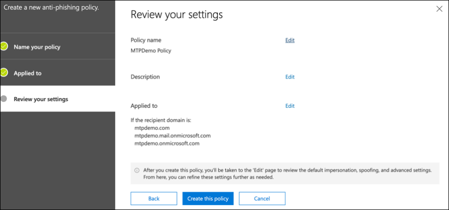  
 
5. 選取 [ **ATP 安全附件**]，然後選取 [**開啟 SharePoint]、[OneDrive] 和 [Microsoft 小組**] 選項的 atp。Select **ATP Safe attachments** and select the **Turn on ATP for SharePoint, OneDrive, and Microsoft Teams** option.  
![Image of_Office 365 Security & 合規性中心] 頁面，您可以在其中開啟 SharePoint、OneDrive 及 Microsoft 小組的 ATP](../../media/mtp-eval-36.png)  

6. 按一下 [+] 圖示，以建立新的安全附件原則，並將其套用為網域的收件者網域。Click the + icon to create a new safe attachment policy, apply it as recipient domain to your domains. 按一下 **[儲存]**。Click **Save**.
![Image of_Office 365 Security & 合規性中心] 頁面，您可以在此頁面上建立新的安全附件原則](../../media/mtp-eval-37.png)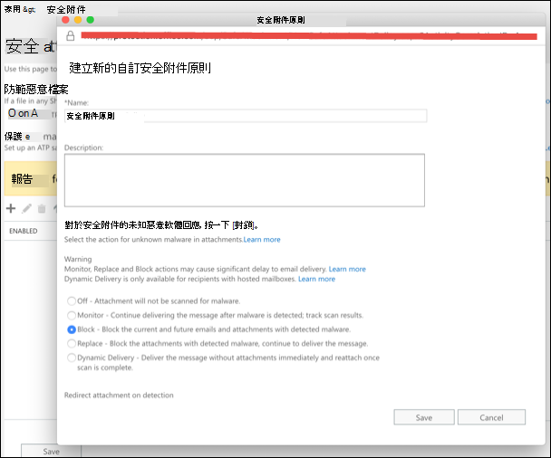  
 
7. 接下來，選取 [ **ATP 安全連結**原則]，然後按一下鉛筆圖示以編輯預設原則。Next, select the **ATP Safe Links** policy, then click the pencil icon to edit the default policy.

8. 請確定未選取 [**不要在使用者按一下安全連結時進行追蹤**] 選項，而會選取其餘的選項。Make sure that the **Do not track when users click safe links** option is not selected, while the rest of the options are selected. 如需詳細資訊，請參閱[安全連結設定](https://docs.microsoft.com/microsoft-365/security/office-365-security/recommended-settings-for-eop-and-office365-atp?view=o365-worldwide)。See [Safe Links settings](https://docs.microsoft.com/microsoft-365/security/office-365-security/recommended-settings-for-eop-and-office365-atp?view=o365-worldwide) for details. 按一下 **[儲存]**。Click **Save**. 
![Image of_Office 365 Security & 相容性中心] 頁面，顯示未選取 [使用者按一下安全時不會追蹤] 選項](../../media/mtp-eval-38.png)  

9. 接下來選取**反惡意**代碼原則，選取預設值，然後選擇 [鉛筆] 圖示。Next select the **Anti-malware** policy, select the default, and choose the pencil icon.

10. 按一下 [**設定**]，然後選取 **[是] 並使用預設通知文字**，以啟用**惡意程式碼偵測回應**。Click **Settings** and select **Yes and use the default notification text** to enable **Malware Detection Response**. 開啟**通用附件類型 Filter** 。Turn the **Common Attachment Types Filter** on. 按一下 **[儲存]**。Click **Save**.
 ![Image of_Office 365 Security & 合規性中心] 頁面，顯示惡意程式碼偵測回應開啟時會啟用預設通知，而一般附件類型篩選已開啟](../../media/mtp-eval-39.png)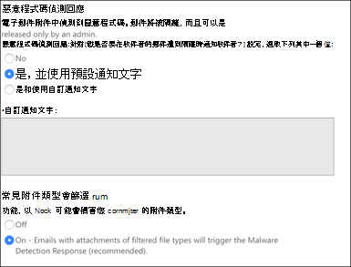  
  
11. 流覽至[Office 365 Security & 合規性中心](https://protection.office.com/homepage)  >  **搜尋**  >  **審核記錄檔搜尋**，然後開啟審計。Navigate to [Office 365 Security & Compliance Center](https://protection.office.com/homepage) > **Search** > **Audit log search** and turn Auditing on.  
![Image of_Office 365 Security & 合規性中心] 頁面，您可以在此開啟審核記錄搜尋](../../media/mtp-eval-40.png)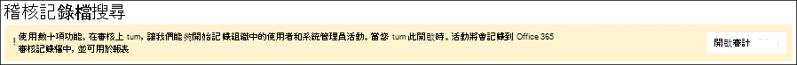  

12. 將 Office 365 ATP 與 Microsoft Defender ATP 整合。Integrate Office 365 ATP with Microsoft Defender ATP. 流覽至[Office 365 Security & 合規性中心](https://protection.office.com/homepage)  >  **威脅管理**  >  **瀏覽器**，然後選取螢幕右上角的 [ **WDATP 設定**]。Navigate to [Office 365 Security & Compliance Center](https://protection.office.com/homepage) > **Threat management** > **Explorer** and select **WDATP Settings** on the upper right corner of the screen. 在 [Microsoft Defender ATP connection] 對話方塊中，開啟 **[連線到 WINDOWS ATP**]。In the Microsoft Defender ATP connection dialog box, turn on **Connect to Windows ATP**.
![Image of_Office 365 Security & 合規性中心] 頁面，您可以在此頁面上開啟 Windows Defender ATP 連接](../../media/mtp-eval-41.png)  

## 設定 Azure 高級威脅防護Configure Azure Advanced Threat Protection
>[!NOTE]
>如果您已啟用 Azure 高級威脅防護，請略過此步驟。Skip this step if you have already enabled Azure Advanced Threat Protection

1. 流覽至[Microsoft 365 Security Center](https://security.microsoft.com/info) > 選取**其他資源**  >  **Azure 高級威脅防護**。Navigate to [Microsoft 365 Security Center](https://security.microsoft.com/info) > select **More Resources** > **Azure Advanced Threat Protection**.
  

2. 按一下 [**建立**]，啟動 Azure 高級威脅防護嚮導。Click **Create** to start the Azure Advanced Threat Protection wizard. 
 ![影像 of_Azure 高級威脅防護嚮導] 頁面，您應該按一下此頁面上的 [建立] 按鈕](../../media/mtp-eval-43.png)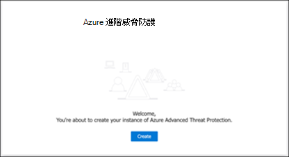  

3. 選擇 [**提供使用者名稱和密碼] 以連線至您的 Active Directory 樹**系。Choose **Provide a username and password to connect to your Active Directory forest**.  
  

4. 輸入您的 Active Directory 內部部署認證。Enter your Active Directory on-premises credentials. 這可以是具有 Active Directory 讀取權限的任何使用者帳戶。This can be any user account that has read access to Active Directory.
![影像 of_Azure 高級威脅防護目錄服務] 頁面，您應該在這裡放置您的認證](../../media/mtp-eval-45.png)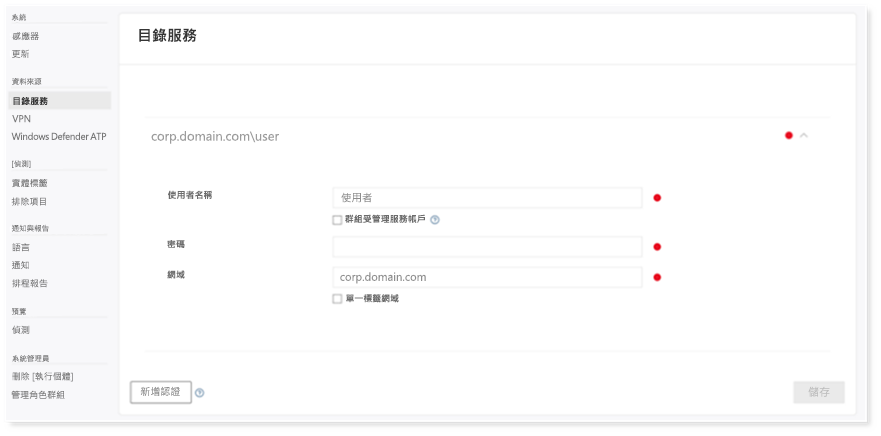  

5. 接下來，選擇 [將**感應器安裝**和傳輸檔案下載到您的網域控制站]。Next, choose **Download Sensor Setup** and transfer file to your domain controller. 
![影像 of_Azure 高級威脅防護] 頁面，您可以在其中選取 [下載感應器設定]](../../media/mtp-eval-46.png)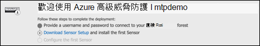  

6. 執行 Azure ATP 感應器設定，然後開始遵循嚮導。Execute the Azure ATP Sensor Setup and begin following the wizard.
 ![影像 of_Azure 高級威脅防護] 頁面，您應該在此按一下 [下一步] 依照 Azure ATP 感應器嚮導](../../media/mtp-eval-47.png)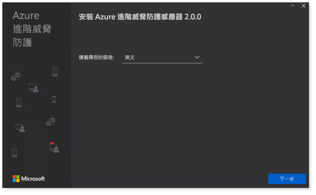  
 
7. 在感應器部署類型中按 **[下一步]** 。Click **Next** at the sensor deployment type.
 ![影像 of_Azure 高級威脅防護] 頁面，您應該在此按一下 [下一步] 依照 Azure ATP 感應器嚮導](../../media/mtp-eval-48.png)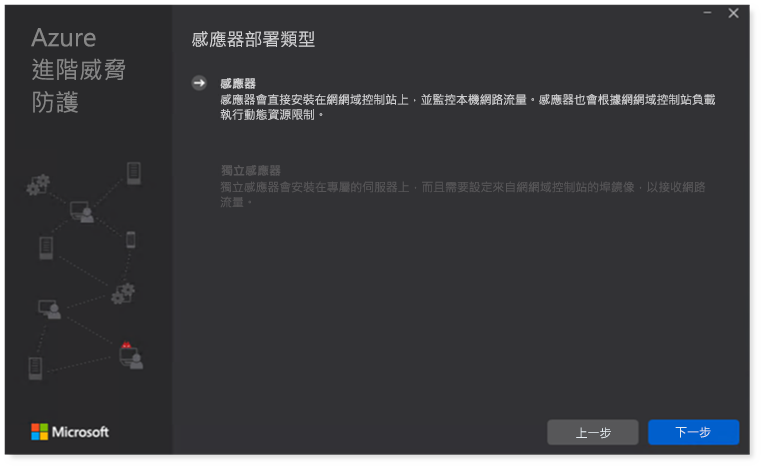  
 
8. 複製存取機碼，您必須在嚮導中輸入它的下一步。Copy the access key as you will need to enter it next in the Wizard.
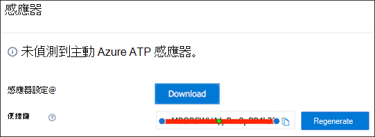  
 
9. 將存取機碼複製到嚮導，然後按一下 [**安裝**]。Copy the access key into the Wizard and click **Install**. 
 ![Image of_Azure Advanced 威脅防護 Azure ATP 感應器嚮導] 頁面，您應該在此頁面上提供存取機碼，然後按一下 [安裝] 按鈕](../../media/mtp-eval-50.png)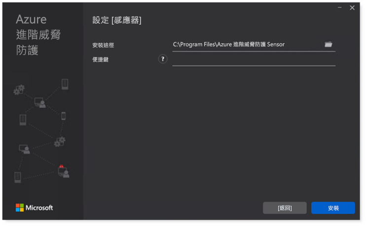  

10. 恭喜，您已在您的網域控制站上成功設定 Azure 高級威脅防護。Congratulations, you have successfully configured Azure Advanced Threat Protection on your domain controller.
![影像 of_Azure 高級威脅防護 Azure ATP 感應器嚮導安裝完成，您應該按一下 [完成] 按鈕](../../media/mtp-eval-51.png)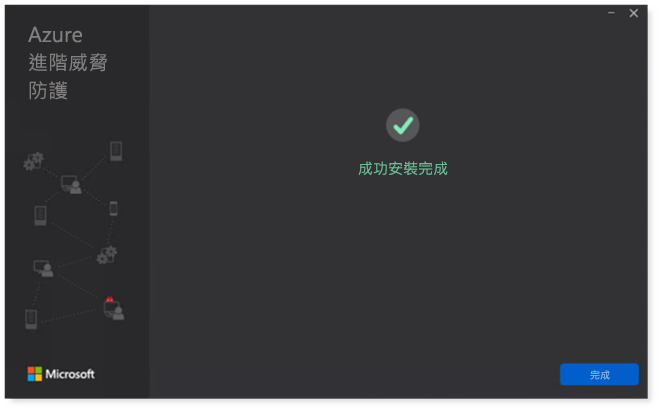  
 
11. 在 [ [Azure AZURE ATP](https://go.microsoft.com/fwlink/?linkid=2040449)設定] 區段中，選取 [ **Windows Defender atp**]，然後開啟 [開啟]。Under the [Azure Azure ATP](https://go.microsoft.com/fwlink/?linkid=2040449) settings section, select **Windows Defender ATP**, then turn the toggle on. 按一下 **[儲存]**。Click **Save**. 
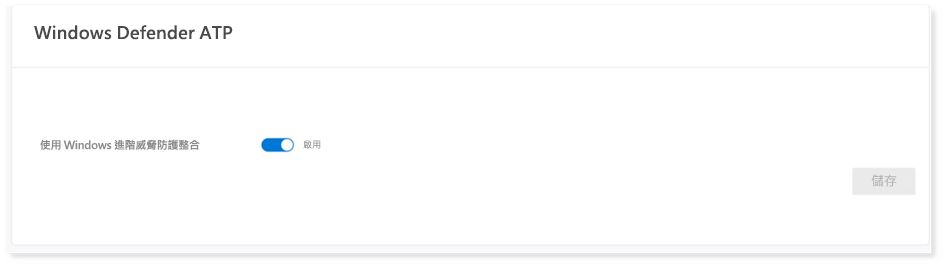  

>[!NOTE]
>Windows Defender ATP 已 rebranded 為 Microsoft Defender ATP。Windows Defender ATP has been rebranded as Microsoft Defender ATP. 所有的入口網站上的 ..org 變更都會針對一致性加以匯總。Rebranding changes across all of our portals are being rolled out the for consistency.

## 設定 Microsoft Cloud App SecurityConfigure Microsoft Cloud App Security
>[!NOTE]
>如果您已啟用 Microsoft Cloud App 安全性，請略過此步驟。Skip this step if you have already enabled Microsoft Cloud App Security. 

1. 流覽至[microsoft](https://security.microsoft.com/info)  >  **More Resources**  >  **Cloud App security**的 microsoft 365 Security Center More Resources。Navigate to [Microsoft 365 Security Center](https://security.microsoft.com/info) > **More Resources** > **Microsoft Cloud App Security**.
![Image of_Microsoft 365 Security Center 頁面，您可以在其中看到 Microsoft Cloud App 卡片，應該按一下 [開啟] 按鈕](../../media/mtp-eval-53.png)  

2. 在資訊提示中，整合 Azure ATP，選取 [**啟用 AZURE atp 資料整合**]。At the information prompt to integrate Azure ATP, select **Enable Azure ATP data integration**. 
 ![Image of_the information prompt 整合 Azure ATP 應選取 [啟用 Azure ATP 資料整合] 連結](../../media/mtp-eval-54.png)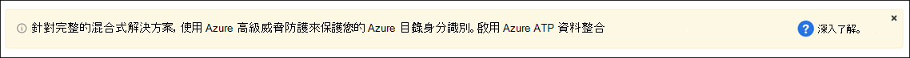  

>[!NOTE]
>如果您未看到此提示，這可能表示您的 Azure ATP 資料整合已經啟用。If you don’t see this prompt, it might mean that your Azure ATP data integration has already been enabled. 不過，如果您不確定，請與您的 IT 系統管理員聯繫以確認。However, if you are not sure, contact your IT Administrator to confirm. 

3. 移至 [**設定**]，然後開啟**Azure ATP 整合**切換開啟，然後按一下 [**儲存**]。Go to **Settings**, turn the **Azure ATP integration** toggle on, then click **Save**. 
![在您應關閉 Azure ATP 整合切換的 [影像 of_the 設定] 頁面上，按一下 [儲存]](../../media/mtp-eval-55.png)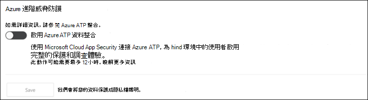  
>[!NOTE]
>針對新的 Azure ATP 實例，此整合切換功能會自動開啟。For new Azure ATP instances, this integration toggle is automatically turned on. 在您繼續下一個步驟之前，請確認您的 Azure ATP 整合已啟用。Confirm that your Azure ATP integration has been enabled before you proceed to the next step.
 
4. 在 [雲端探索設定] 底下，選取 [ **Microsoft DEFENDER ATP 整合**]，然後啟用整合。Under the Cloud discovery settings, select **Microsoft Defender ATP integration**, then enable the integration. 按一下 **[儲存]**。Click **Save**.
![Unsanctioned Microsoft Defender ATP 頁面上的 of_the 影像，其中會選取 [Microsoft Defender ATP 整合] 底下的 [封鎖應用程式] 核取方塊。![Image of_the Microsoft Defender ATP page where the block unsanctioned apps checkbox under Microsoft Defender ATP integration is selected. 按一下 [儲存]。](../../media/mtp-eval-56.png)Click save.](../../media/mtp-eval-56.png)  

5. 在 [雲端探索設定] 底下，選取 [**使用者豐富**]，然後啟用與 Azure Active Directory 的整合。Under Cloud discovery settings, select **User enrichment**, then enable the integration with Azure Active Directory.
![[使用者豐富] 區段中的 [濃縮已發現使用者識別碼與 Azure Active Directory 使用者識別碼] 核取方塊的影像](../../media/mtp-eval-57.png)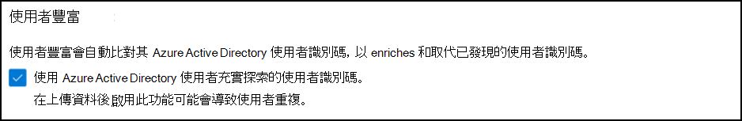  

## 設定 Microsoft Defender 高級威脅防護Configure Microsoft Defender Advanced Threat Protection
>[!NOTE]
>如果您已啟用 Microsoft Defender 高級威脅防護，請略過此步驟。Skip this step if you have already enabled Microsoft Defender Advanced Threat Protection.

1. 流覽至 microsoft Defender security center 的[microsoft 365 Security center](https://security.microsoft.com/info)  >  **More Resources**  >  \*\* \*\*。Navigate to [Microsoft 365 Security Center](https://security.microsoft.com/info) > **More Resources** > **Microsoft Defender Security Center**. 按一下 [開啟]\*\*\*\*。Click **Open**.
   
 
2. 遵循 Microsoft Defender 高級威脅防護嚮導。Follow the Microsoft Defender Advanced Threat Protection wizard. 按 [下一步]\*\*\*\*。Click **Next**. 
   

3. 選擇 [根據您慣用的資料儲存位置]、[資料保留原則]、[組織大小] 和 [加入宣告預覽] 功能。Choose based on your preferred data storage location, data retention policy, organization size, and opt-in for preview features. 
 ![Image of_the] 頁面上，選取您的資料儲存國家、保留原則及組織規模。![Image of_the page to select your data storage country, retention policy, and organization size. 完成選取之後，請按 [下一步]。](../../media/mtp-eval-60.png)Click next when you're done selecting.](../../media/mtp-eval-60.png)  
>[!NOTE]
>您無法變更某些設定，例如，以後的資料儲存位置。You cannot change some of the settings, like data storage location, afterwards. 
 

按 [下一步]\*\*\*\*。Click **Next**. 

4. 按一下 [**繼續**]，它會布建您的 MICROSOFT Defender ATP 租使用者。Click **Continue** and it will provision your Microsoft Defender ATP tenant.
 ![影像 of_the 頁面提示您按一下 [繼續] 按鈕以建立您的雲端實例](../../media/mtp-eval-61.png)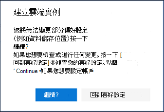  

5. 透過「群組原則」、「Microsoft 端點管理員」或執行本機腳本至 Microsoft Defender ATP，將您的端點上架在一起。Onboard your endpoints through Group Policies, Microsoft Endpoint Manager or by running a local script to Microsoft Defender ATP. 為了簡便起見，本指南使用本機腳本。For simplicity, this guide uses the local script.

6. 按一下 [**下載套件**]，然後將上架腳本複製到您的端點。Click **Download package** and copy the onboarding script to your endpoint(s).  
 ![影像 of_page 提示您按一下 [下載套件] 按鈕，將上架腳本複製到您的端點或端點](../../media/mtp-eval-62.png)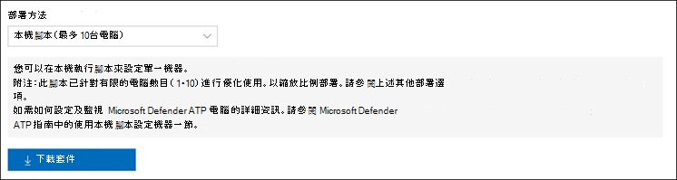  

7. 在您的端點上，以系統管理員身分執行上架腳本，然後選擇 [Y]。On your endpoint, run the onboarding script as Administrator and choose Y.
 ![Image of_the 命令列，您可以在其中執行上架腳本，然後選擇 [Y] 繼續](../../media/mtp-eval-63.png)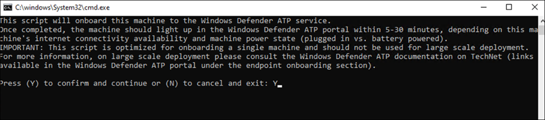  

8. 恭喜，您已架您的第一個端點。Congratulations, you have onboarded your first endpoint.  
   

9. 從 Microsoft Defender ATP 嚮導複製並貼上偵測測試。Copy-paste the detection test from the Microsoft Defender ATP wizard.
 ![影像 of_the 執行偵測測試步驟，您應該按一下 [複製] 以複製您應該在命令提示字元中貼上的偵測測試腳本。](../../media/mtp-eval-65.png)  

10. 將 PowerShell 腳本複製到提升許可權的命令提示字元，然後執行它。Copy the PowerShell script to an elevated command prompt and run it. 
   

11. 從嚮導選取 [**開始使用 Microsoft DEFENDER ATP** ]。Select **Start using Microsoft Defender ATP** from the Wizard.
 ![在您應該按一下 [開始使用 Microsoft Defender ATP] 的嚮導中 of_the 確認提示](../../media/mtp-eval-67.png)  
 
12. 流覽[Microsoft Defender 安全中心](https://securitycenter.windows.com/)。Visit the [Microsoft Defender Security Center](https://securitycenter.windows.com/). 移至 [**設定**]，然後選取 [**高級功能**]。Go to **Settings** and then select **Advanced features**. 
 ![您應選取 [高級功能] 的 [of_Microsoft Defender 安全性中心設定] 功能表中的影像](../../media/mtp-eval-68.png)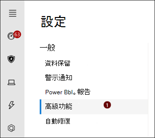  

13. 開啟與**Azure 高級威脅防護**的整合。Turn on the integration with **Azure Advanced Threat Protection**.  
   

14. 開啟與**Office 365 威脅情報**的整合。Turn on the integration with **Office 365 Threat Intelligence**.
   

15. 開啟與**Microsoft Cloud App Security**的整合。Turn on integration with **Microsoft Cloud App Security**.
   

16. 向中按向下方，然後按一下 [**儲存偏好**設定] 以確認新的整合。Scroll down and click **Save preferences** to confirm the new integrations.
   

## 啟動 Microsoft 威脅防護服務Start the Microsoft Threat Protection service
>[!NOTE]
>從2020年6月1日開始，Microsoft 會自動為所有合格的承租人啟用 Microsoft 威脅防護功能。Starting June 1, 2020, Microsoft automatically enables Microsoft Threat Protection features for all eligible tenants. 如需詳細資訊，請參閱此[Microsoft 技術小組文章](https://techcommunity.microsoft.com/t5/security-privacy-and-compliance/microsoft-threat-protection-will-automatically-turn-on-for/ba-p/1345426)。See this [Microsoft Tech Community article on license eligibility](https://techcommunity.microsoft.com/t5/security-privacy-and-compliance/microsoft-threat-protection-will-automatically-turn-on-for/ba-p/1345426) for details. 
 

移至[Microsoft 365 Security Center](https://security.microsoft.com/homepage)。Go to [Microsoft 365 Security Center](https://security.microsoft.com/homepage). 流覽至 [**設定**]，然後選取 [ **Microsoft 威脅防護**]。Navigate to **Settings** and then select **Microsoft Threat Protection**.
   

如需更完整的指導，請參閱[開啟 Microsoft 威脅防護](mtp-enable.md)。For a more comprehensive guidance, see [Turn on Microsoft Threat Protection](mtp-enable.md). 

恭喜！Congratulations! 您剛剛建立的是 Microsoft 威脅防護試用實驗室環境！You've just created your Microsoft Threat Protection trial lab environment! 您現在可以模擬攻擊，並查看「向量積」功能如何偵測、建立提醒，以及自動回應端點上的 fileless 攻擊。You can now simulate an attack and see how the cross product capabilities detect, create alerts, and automatically respond to a fileless attack on an endpoint.

## 後續步驟Next steps
[產生測試警示](generate-test-alert.md)。[Generate a test alert](generate-test-alert.md).
