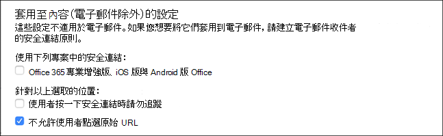
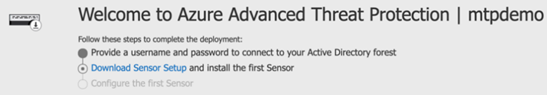

# 設定試用實驗室環境的 Microsoft 威脅防護支柱

適用於：****
- Microsoft 威脅防護

建立 Microsoft 威脅防護試用實驗室環境並加以部署時，會有三個階段的處理常式：

 
<table border="0" width="100%" align="center">
  <tr style="text-align:center;">
    <td align="center" style="width:25%; border:0;" >
      <a href= "https://docs.microsoft.com/microsoft-365/security/mtp/prepare-mtpeval?view=o365-worldwide"> 
        
       階段1：準備</a> 
    </td>
     <td align="center">
      <a href="https://docs.microsoft.com/microsoft-365/security/mtp/setup-mtpeval?view=o365-worldwide">
        
       階段2：設定</a> 
    </td>
    <td align="center" bgcolor="#d5f5e3">
      <a href="https://docs.microsoft.com/microsoft-365/security/mtp/config-mtpeval?view=o365-worldwide">
        
       階段3：設定板載 &</a> 
</td>

  </tr>
</table>

您目前在設定階段。

準備工作是任何成功部署的關鍵。 在本文中，您將指導您準備部署 Microsoft Defender ATP 時所需考慮的事項。

## Microsoft 威脅防護的支柱
Microsoft 威脅防護包含四個支柱。 雖然一個 pillar 可以為您的網路組織的安全性提供價值，但是啟用四個 Microsoft 威脅防護的分項會使組織發揮最大的價值。

  

本節會引導您設定下列專案：
-   Office 365 進階威脅防護
-   Azure 進階威脅防護 
-   Microsoft Cloud App Security
-   Windows Defender 進階威脅防護

## 設定 Office 365 的高級威脅防護
>[!NOTE]
>如果您已啟用 Office 365 的高級威脅防護，請略過此步驟。 

有一個稱為*Office 365 Advanced 威脅防護*的 PowerShell 模組，建議的設定分析器（ORCA）可協助判斷部分設定。 當您在租使用者中以系統管理員身分執行時，ORCAReport 將協助產生反垃圾郵件、反網路釣魚和其他郵件衛生設定的評估。 您可以從https://www.powershellgallery.com/packages/ORCA/下載此模組。 

1. 流覽至[Office 365 Security & 合規性中心](https://protection.office.com/homepage) > **威脅管理** > **原則**。
  
 
2. 按一下 [ **ATP 反網路釣魚**]，選取 [**建立**並填入原則名稱和描述]。 按 [下一步]****。
  

>[!NOTE]
>編輯您的高級 ATP 反網路釣魚原則。 將**高級網路釣魚閥值**變更為**2-嚴格**。
 

3. 按一下 [**新增條件**] 下拉式功能表，然後選取您的網域做為收件者網域。 按 [下一步]****。
  
 
4. 請複查您的設定。 按一下 [**建立這個原則**] 以確認。 
  
 
5. 選取 [ **ATP 安全附件**]，然後選取 [**開啟 SharePoint]、[OneDrive] 和 [Microsoft 小組**] 選項的 atp。  
  

6. 按一下 [+] 圖示，以建立新的安全附件原則，並將其套用為網域的收件者網域。 按一下 [儲存]****。
  
 
7. 接下來，選取 [ **ATP 安全連結**原則]，然後按一下鉛筆圖示以編輯預設原則。

8. 請確定未選取 [**不要在使用者按一下安全連結時進行追蹤**] 選項，而會選取其餘的選項。 如需詳細資訊，請參閱[安全連結設定](https://docs.microsoft.com/microsoft-365/security/office-365-security/recommended-settings-for-eop-and-office365-atp?view=o365-worldwide)。 按一下 [儲存]****。 
  

9. 接下來選取**反惡意**代碼原則，選取預設值，然後選擇 [鉛筆] 圖示。

10. 按一下 [**設定**]，然後選取 **[是] 並使用預設通知文字**，以啟用**惡意程式碼偵測回應**。 開啟**通用附件類型 Filter** 。 按一下 [儲存]****。
   
  
11. 流覽至[Office 365 Security & 合規性中心](https://protection.office.com/homepage) > **搜尋** > **審核記錄檔搜尋**，然後開啟審計。  
  

12. 將 Office 365 ATP 與 Microsoft Defender ATP 整合。 流覽至[Office 365 Security & 合規性中心](https://protection.office.com/homepage) > **威脅管理** > **瀏覽器**，然後選取螢幕右上角的 [ **WDATP 設定**]。 在 [Microsoft Defender ATP connection] 對話方塊中，開啟 **[連線到 WINDOWS ATP**]。
  

## 設定 Azure 高級威脅防護
>[!NOTE]
>如果您已啟用 Azure 高級威脅防護，請略過此步驟。

1. 流覽至[Microsoft 365 Security Center](https://security.microsoft.com/info) > 選取**其他資源** > **Azure 高級威脅防護**。
  

2. 按一下 [**建立**]，啟動 Azure 高級威脅防護嚮導。 
   

3. 選擇 [**提供使用者名稱和密碼] 以連線至您的 Active Directory 樹**系。  
  

4. 輸入您的 Active Directory 內部部署認證。 這可以是具有 Active Directory 讀取權限的任何使用者帳戶。
  

5. 接下來，選擇 [將**感應器安裝**和傳輸檔案下載到您的網域控制站]。 
  

6. 執行 Azure ATP 感應器設定，然後開始遵循嚮導。
   
 
7. 在感應器部署類型中按 **[下一步]** 。
   
 
8. 複製存取機碼，您必須在嚮導中輸入它的下一步。
  
 
9. 將存取機碼複製到嚮導，然後按一下 [**安裝**]。 
   

10. 恭喜，您已在您的網域控制站上成功設定 Azure 高級威脅防護。
  
 
11. 在 [ [Azure AZURE ATP](https://go.microsoft.com/fwlink/?linkid=2040449)設定] 區段中，選取 [ **Windows Defender atp**]，然後開啟 [開啟]。 按一下 [儲存]****。 
  

>[!NOTE]
>Windows Defender ATP 已 rebranded 為 Microsoft Defender ATP。 所有的入口網站上的 ..org 變更都會針對一致性加以匯總。

## 設定 Microsoft Cloud App Security
>[!NOTE]
>如果您已啟用 Microsoft Cloud App 安全性，請略過此步驟。 

1. 流覽至 microsoft**Cloud App security**的[microsoft 365 Security Center](https://security.microsoft.com/info) > **More Resources** > 。
  

2. 在資訊提示中，整合 Azure ATP，選取 [**啟用 AZURE atp 資料整合**]。 
   

>[!NOTE]
>如果您未看到此提示，這可能表示您的 Azure ATP 資料整合已經啟用。 不過，如果您不確定，請與您的 IT 系統管理員聯繫以確認。 

3. 移至 [**設定**]，然後開啟**Azure ATP 整合**切換開啟，然後按一下 [**儲存**]。 
  
>[!NOTE]
>針對新的 Azure ATP 實例，此整合切換功能會自動開啟。 在您繼續下一個步驟之前，請確認您的 Azure ATP 整合已啟用。
 
4. 在 [雲端探索設定] 底下，選取 [ **Microsoft DEFENDER ATP 整合**]，然後啟用整合。 按一下 [儲存]****。
  

5. 在 [雲端探索設定] 底下，選取 [**使用者豐富**]，然後啟用與 Azure Active Directory 的整合。
  

## 設定 Microsoft Defender 高級威脅防護
>[!NOTE]
>如果您已啟用 Microsoft Defender 高級威脅防護，請略過此步驟。

1. 流覽至 microsoft**Defender security center**的[microsoft 365 Security center](https://security.microsoft.com/info) > **More Resources** > 。 按一下 [開啟]****。
   
 
2. 遵循 Microsoft Defender 高級威脅防護嚮導。 按 [下一步]****。 
   

3. 選擇 [根據您慣用的資料儲存位置]、[資料保留原則]、[組織大小] 和 [加入宣告預覽] 功能。 
   
>[!NOTE]
>您無法變更某些設定，例如，以後的資料儲存位置。 
 

按 [下一步]****。 

4. 按一下 [**繼續**]，它會布建您的 MICROSOFT Defender ATP 租使用者。
   

5. 透過「群組原則」、「Microsoft 端點管理員」或執行本機腳本至 Microsoft Defender ATP，將您的端點上架在一起。 為了簡便起見，本指南使用本機腳本。

6. 按一下 [**下載套件**]，然後將上架腳本複製到您的端點。  
   

7. 在您的端點上，以系統管理員身分執行上架腳本，然後選擇 [Y]。
   

8. 恭喜，您已架您的第一個端點。  
   

9. 從 Microsoft Defender ATP 嚮導複製並貼上偵測測試。
   

10. 將 PowerShell 腳本複製到提升許可權的命令提示字元，然後執行它。 
   

11. 從嚮導選取 [**開始使用 Microsoft DEFENDER ATP** ]。
   
 
12. 流覽[Microsoft Defender 安全中心](https://securitycenter.windows.com/)。 移至 [**設定**]，然後選取 [**高級功能**]。 
   

13. 開啟與**Azure 高級威脅防護**的整合。  
   

14. 開啟與**Office 365 威脅情報**的整合。
   

15. 開啟與**Microsoft Cloud App Security**的整合。
   

16. 向中按向下方，然後按一下 [**儲存偏好**設定] 以確認新的整合。
   

## 後續步驟
[開啟 Microsoft 威脅防護](https://docs.microsoft.com/microsoft-365/security/mtp/mtp-enable?view=o365-worldwide#start-using-the-service)，然後[產生測試警示](generate-test-alert.md)。
