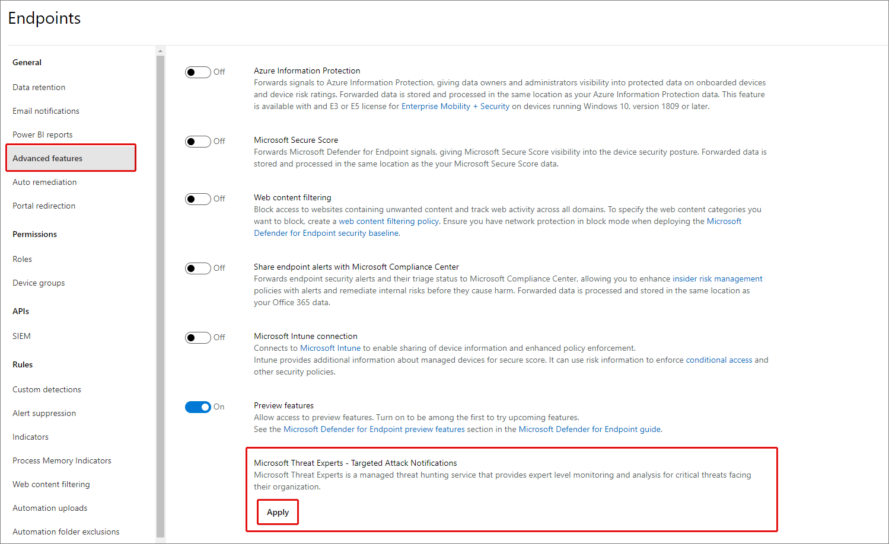
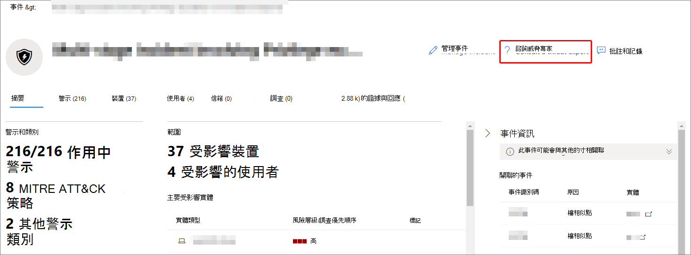

# 透過 Microsoft 365 Defender 設定及管理 Microsoft 威脅專家功能

[!INCLUDE [Microsoft 365 Defender rebranding](../includes/microsoft-defender.md)]

**適用於：**

- [Microsoft 365 Defender](https://go.microsoft.com/fwlink/?linkid=2118804)
- [適用於端點的 Microsoft Defender](https://go.microsoft.com/fwlink/p/?linkid=2154037)

[!INCLUDE [Prerelease](../includes/prerelease.md)]

## 開始之前

> [!IMPORTANT]
> 在您套用之前，請務必與您的 Microsoft 技術服務提供者和客戶團隊討論 Microsoft 威脅專家的資格需求–目標攻擊通知受管理的威脅搜尋服務。

若要接收已設定目標的攻擊通知，您需要在已註冊的裝置中部署 Microsoft 365 Defender。 然後，透過 M365 入口網站提交應用程式，以取得 Microsoft 威脅專家目標的攻擊通知。

請與您的帳戶小組或 Microsoft 代表聯繫，以訂閱 Microsoft 威脅專家-點播的專家。 需求專家可讓您向我們的威脅專家請教如何保護您的組織，避免相關的偵測和敵人。

## 適用于 Microsoft 威脅專家-目標攻擊通知服務

如果您已有 Microsoft Defender for Endpoint 和 Microsoft 365 Defender，您可以套用 microsoft 威脅專家–透過其 Microsoft 365 Defender 入口網站的目標攻擊通知。  目標攻擊通知會授與您特殊的洞察力和分析，以協助您識別組織的最重要威脅，讓您能快速回應這些威脅。

1. 從功能窗格中，移至 [ **設定] > 端點] > 一般 > 高級功能 > Microsoft 威脅專家-已設定目標攻擊通知**。

2. 選取 **套用**。

    

3. 輸入您的名稱和電子郵件地址，讓 Microsoft 可與您聯繫您的應用程式。

    

4. 閱讀 [隱私權聲明](https://privacy.microsoft.com/en-us/privacystatement)，然後在完成時選取 [ **提交** ]。 您的應用程式經過核准後，您就會收到歡迎電子郵件。

    

5. 當您收到歡迎電子郵件之後，您將會自動開始接收已設定目標的攻擊通知。

6. 您可以透過將 **設定 > 端點 > 一般 > 高級功能** 來驗證您的狀態。 核准後， **Microsoft 威脅專家即會顯示並開啟 Microsoft 威脅專家目標的攻擊通知****切換。**

## 您會看到 Microsoft 威脅專家對目標的攻擊通知

您可以透過下列媒介接收來自 Microsoft 威脅專家的目標攻擊通知：

- Microsoft 365 Defender 入口網站的 **事件** 頁面
- Microsoft 365 Defender 入口網站的 **警示** 儀表板
- OData 警示 [api](https://docs.microsoft.com/windows/security/threat-protection/microsoft-defender-atp/get-alerts) 和 [REST API](https://docs.microsoft.com/windows/security/threat-protection/microsoft-defender-atp/pull-alerts-using-rest-api)
- 高級搜尋中的[DeviceAlertEvents](https://docs.microsoft.com/windows/security/threat-protection/microsoft-defender-atp/advanced-hunting-devicealertevents-table)表格
- 您的收件匣，如果您選擇透過電子郵件傳送目標攻擊通知給您。 請參閱 [Create a email notification rule](#create-an-email-notification-rule) 。

### 建立電子郵件通知規則

您可以建立規則來傳送通知收件者的電子郵件通知。 如需完整的詳細資料，請參閱  [設定警示通知](https://docs.microsoft.com/windows/security/threat-protection/microsoft-defender-atp/configure-email-notifications) 以建立、編輯、刪除或疑難排解電子郵件通知。

## 查看已設定目標的攻擊通知

在您將系統設定為接收電子郵件通知之後，您將開始從電子郵件中的 Microsoft 威脅專家接收目標攻擊通知。

1. 選取電子郵件中的連結，以移至以 **威脅專家** 標記的儀表板中對應的警示內容。

2. 在 [ **提醒** ] 頁面上，選取您在電子郵件中收到的警示主題，以查看進一步的詳細資料。

## 訂閱 Microsoft 威脅專家-點播的專家

如果您已經是 Microsoft Defender for Endpoint 客戶，您可以聯繫您的 Microsoft 代表，以訂閱 Microsoft 威脅專家-按需求的專家。

## 請參閱 Microsoft 威脅專家關於您組織中的可疑 cybersecurity 活動

您可以從 Microsoft 365 Defender 入口網站中與 Microsoft 威脅專家聯繫。 專家可協助您瞭解複雜威脅及目標攻擊通知。 與專家合作，以取得有關警示和事件的詳細資訊，或有關如何處理遭到損害的建議。 深入瞭解入口網站儀表板所述的威脅情報內容。

> [!NOTE]
>
> - 目前不支援與貴組織的自訂威脅智慧資料相關的警示查詢。 如需詳細資訊，請參閱安全性作業或事件回應小組。
> - 您必須具有 Microsoft 365 Defender 入口網站中的 [ **管理安全性中心的安全性設定** ] 許可權，才可透過 [ **諮詢威脅專家** ] 表單提交查詢。

1. 流覽至與您想要調查之資訊相關的入口網站頁面：例如， **裝置**、 **警示** 或 **事件**。 在您傳送調查要求之前，請確定與您查詢相關的入口網站頁面已在視圖中。

2. 從上方的功能表中，選取 **？請參閱威脅專家**。

    

    隨即會開啟彈出畫面。

    標頭會指出您是在試用訂閱上，還是完整的 Microsoft 威脅專家-點播訂閱。

    

    「 **調查主題** 」欄位將會填入您要求之相關頁面的連結。

3. 在下一個欄位中，提供足夠的資訊，讓 Microsoft 威脅專家有足夠的內容來開始調查。

4. 輸入您想要用來對應 Microsoft 威脅專家的電子郵件地址。

> [!NOTE]
> 如果您想要透過 Microsoft Services Hub 追蹤專家對需求案例的狀態，請與您的技術客戶經理聯繫。

觀賞這段影片，以快速流覽 Microsoft Services 中樞。

> [!VIDEO https://www.microsoft.com/videoplayer/embed/RE4pk9f]

## 範例調查主題

### 警示資訊

- 我們看到一種新的警示類型，以用於非 land 的二進位。 我們可以提供警示識別碼。 您可以告訴我們更多有關此提醒的資訊，以及我們可以進一步調查的方式嗎？
- 我們已觀察到兩個類似的攻擊，這會嘗試執行惡意 PowerShell 腳本，但會產生不同的警示。 一個是「可疑 PowerShell 命令列」，另一個是「根據 O365 所提供的指示偵測到惡意檔案」。 有何差異？
- 我們收到有關來自高設定檔使用者裝置的失敗登入錯誤數目的奇怪警示。 我們無法找到這些嘗試的進一步證據。 Microsoft 365 Defender 如何才能看到這些嘗試？ 受監視的登入類型為何？
- 您可以提供更多關於警示的內容或洞察力，「系統公用程式已觀察到可疑行為」？
- 已觀察到「建立轉寄/重新導向規則」標題的警示。 我相信活動是良性的。 您可以告訴我為什麼收到警示？

### 可能危害的機器

- 您可以協助說明為什麼我們在組織中的許多裝置上看到「已觀測未知程式」的訊息或警示？ 我們非常感謝任何輸入，以澄清此郵件或警示是否與惡意活動有關。
- 您可以從過去一周的 dating，協助驗證下列系統上可能的損損？ 其行為類似于在六個月前的同一個系統上進行惡意程式碼偵測。

### 威脅智慧詳細資料

- 我們偵測到網路釣魚電子郵件，將惡意的 Word 檔傳遞給使用者。 檔導致一系列的可疑事件，這些事件會觸發針對特定惡意程式碼系列的多個警示。 您是否有這種惡意程式碼的資訊？ 如果是，您可以將連結傳送給我們嗎？
- 我們最近看到的是以我們為行業之威脅為目標的博客文章。 您可以協助我們瞭解 Microsoft 365 Defender 針對此威脅的內容提供什麼保護？
- 我們最近觀察到我們對我們組織進行的網路釣魚活動。 您可以告訴我們我們是否特別針對公司或縱向？

### Microsoft 威脅專家的警示通訊

- 您的事件回應小組可以協助我們解決我們所收到的目標攻擊通知嗎？
- 我們收到來自 Microsoft 威脅專家的此目標攻擊通知。 我們沒有自己的事件回應小組。 我們現在可以做什麼，以及如何包含該事件？
- 我們收到來自 Microsoft 威脅專家的目標攻擊通知。 您可以為我們提供哪些資料，讓我們能夠傳遞給我們的事件回應小組？

> [!NOTE]
> Microsoft 威脅專家是受管理的威脅搜尋服務，不是事件回應服務。 不過，當必要時，專家可將調查順利轉換至 Microsoft Cybersecurity 解決方案群組 (CSG) 的偵測和回應小組 (DART) 服務。 您也可以選擇與您自己的事件回應小組合作，以解決需要事件回應的問題。

## 案例

### 接收受管理搜尋查詢的進度報告

Microsoft 威脅專家的回應會隨著您的查詢而異。 您通常會收到下列其中一項回應：

- 需要有其他資訊才能繼續進行調查
- 需要有一個或多個檔案範例，以判斷技術內容
- 調查需要更多時間
- 最初的資訊足以結束調查

如果專家要求更多資訊或檔案範例，請快速回應，以繼續進行調查的移動。

## 另請參閱

- [Microsoft 威脅專家概觀](microsoft-threat-experts.md)
