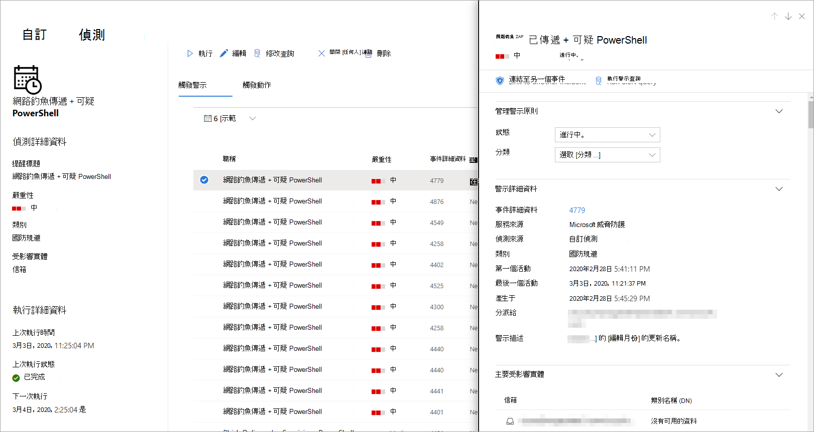

# <a name="create-and-manage-custom-detections-rules"></a><span data-ttu-id="23e76-104">建立及管理自訂的偵測規則</span><span class="sxs-lookup"><span data-stu-id="23e76-104">Create and manage custom detections rules</span></span>

<span data-ttu-id="23e76-105">適用於：\*\*\*\*</span><span class="sxs-lookup"><span data-stu-id="23e76-105">**Applies to:**</span></span>
- <span data-ttu-id="23e76-106">Microsoft 威脅防護</span><span class="sxs-lookup"><span data-stu-id="23e76-106">Microsoft Threat Protection</span></span>

[!INCLUDE [Prerelease information](../includes/prerelease.md)]

<span data-ttu-id="23e76-107">透過[高級搜尋](advanced-hunting-overview.md)查詢所建立的自訂偵測規則，可讓您主動監視各種事件和系統狀態，包括可疑的破壞活動和設定不當的端點。</span><span class="sxs-lookup"><span data-stu-id="23e76-107">Custom detection rules built from [Advanced hunting](advanced-hunting-overview.md) queries let you proactively monitor various events and system states, including suspected breach activity and misconfigured endpoints.</span></span> <span data-ttu-id="23e76-108">您可以將其設定為定期執行，並在每個專案相符時產生提醒並採取回應動作。</span><span class="sxs-lookup"><span data-stu-id="23e76-108">You can set them to run at regular intervals, generating alerts and taking response actions whenever there are matches.</span></span>

## <a name="required-permissions-for-managing-custom-detections"></a><span data-ttu-id="23e76-109">管理自訂偵測的必要許可權</span><span class="sxs-lookup"><span data-stu-id="23e76-109">Required permissions for managing custom detections</span></span>

<span data-ttu-id="23e76-110">若要管理自訂偵測，您必須被指派其中一個角色：</span><span class="sxs-lookup"><span data-stu-id="23e76-110">To manage custom detections, you need to be assigned one of these roles:</span></span>

- <span data-ttu-id="23e76-111">**安全性管理員**（安全性管理員或安全性系統管理員角色）是[Azure Active Directory 角色](https://docs.microsoft.com/azure/active-directory/users-groups-roles/directory-assign-admin-roles#security-administrator)，用來管理 Microsoft 365 安全性中心和各種入口網站和服務中的各種安全性設定。</span><span class="sxs-lookup"><span data-stu-id="23e76-111">**Security administrator** — the security administrator or security admin role is an [Azure Active Directory role](https://docs.microsoft.com/azure/active-directory/users-groups-roles/directory-assign-admin-roles#security-administrator) for managing various security settings in Microsoft 365 security center and various portals and services.</span></span>

- <span data-ttu-id="23e76-112">**安全操作員**-安全性操作員角色是用來管理提醒的[Azure Active Directory 角色](https://docs.microsoft.com/azure/active-directory/users-groups-roles/directory-assign-admin-roles#security-administrator)，具有安全性相關功能的全域唯讀許可權，包括 Microsoft 365 Security center 中的所有資訊。</span><span class="sxs-lookup"><span data-stu-id="23e76-112">**Security operator** —  the security operator role is an [Azure Active Directory role](https://docs.microsoft.com/azure/active-directory/users-groups-roles/directory-assign-admin-roles#security-administrator) for managing alerts and has global read-only access on security-related features, including all information in Microsoft 365 security center.</span></span> <span data-ttu-id="23e76-113">只有當 Microsoft Defender ATP 中的角色型存取控制（RBAC）關閉時，此角色才足以管理自訂偵測。</span><span class="sxs-lookup"><span data-stu-id="23e76-113">This role is sufficient for managing custom detections only if role-based access control (RBAC) is turned off in Microsoft Defender ATP.</span></span> <span data-ttu-id="23e76-114">如果您已設定 RBAC，您也需要 Microsoft Defender ATP 的「**管理安全性設定**」許可權。</span><span class="sxs-lookup"><span data-stu-id="23e76-114">If you have RBAC configured, you also need the **manage security settings** permission for Microsoft Defender ATP.</span></span>

<span data-ttu-id="23e76-115">若要管理必要的許可權，**全域管理員**可以執行下列作業：</span><span class="sxs-lookup"><span data-stu-id="23e76-115">To manage required permissions, a **global administrator** can do the following:</span></span>

- <span data-ttu-id="23e76-116"> > 在 [ **rol\e\*\*\**security admin**] 底下的[Microsoft 365 系統管理中心](https://admin.microsoft.com/)中指派**安全性管理員**或**安全性操作員**角色。</span><span class="sxs-lookup"><span data-stu-id="23e76-116">Assign the **security administrator** or **security operator** role in [Microsoft 365 admin center](https://admin.microsoft.com/) under **Roles** > **Security admin**.</span></span>
- <span data-ttu-id="23e76-117">在 [**設定** > **許可權** > **角色**] 底下的[microsoft defender Security Center](https://securitycenter.windows.com/)中檢查 microsoft defender ATP 的 RBAC 設定。</span><span class="sxs-lookup"><span data-stu-id="23e76-117">Check RBAC settings for Microsoft Defender ATP in [Microsoft Defender Security Center](https://securitycenter.windows.com/) under **Settings** > **Permissions** > **Roles**.</span></span> <span data-ttu-id="23e76-118">選取對應的角色以指派「**管理安全性設定**」許可權。</span><span class="sxs-lookup"><span data-stu-id="23e76-118">Select the corresponding role to assign the **manage security settings** permission.</span></span>

> [!NOTE]
> <span data-ttu-id="23e76-119">若要管理自訂的偵測，當已開啟 RBAC 時，**安全性操作員**會需要 MICROSOFT Defender ATP 中的「**管理安全性設定**」許可權。</span><span class="sxs-lookup"><span data-stu-id="23e76-119">To manage custom detections, **security operators** will need the **manage security settings** permission in Microsoft Defender ATP if RBAC is turned on.</span></span>

## <a name="create-a-custom-detection-rule"></a><span data-ttu-id="23e76-120">建立自訂偵測規則</span><span class="sxs-lookup"><span data-stu-id="23e76-120">Create a custom detection rule</span></span>
### <a name="1-prepare-the-query"></a><span data-ttu-id="23e76-121">1. 準備查詢。</span><span class="sxs-lookup"><span data-stu-id="23e76-121">1. Prepare the query.</span></span>

<span data-ttu-id="23e76-122">在 Microsoft 365 的 [安全性中心] 中，移至 [**高級搜尋**]，然後選取現有的查詢或建立新的查詢。</span><span class="sxs-lookup"><span data-stu-id="23e76-122">In Microsoft 365 security center, go to **Advanced hunting** and select an existing query or create a new query.</span></span> <span data-ttu-id="23e76-123">使用新的查詢時，請執行查詢以識別錯誤，並瞭解可能的結果。</span><span class="sxs-lookup"><span data-stu-id="23e76-123">When using a new query, run the query to identify errors and understand possible results.</span></span>

#### <a name="required-columns-in-the-query-results"></a><span data-ttu-id="23e76-124">查詢結果中的必要欄</span><span class="sxs-lookup"><span data-stu-id="23e76-124">Required columns in the query results</span></span>
<span data-ttu-id="23e76-125">若要建立自訂偵測規則，查詢必須傳回下列資料行：</span><span class="sxs-lookup"><span data-stu-id="23e76-125">To create a custom detection rule, the query must return the following columns:</span></span>

- `Timestamp`
- <span data-ttu-id="23e76-126">下列其中一個裝置、使用者或信箱欄：</span><span class="sxs-lookup"><span data-stu-id="23e76-126">One of the following device, user, or mailbox columns:</span></span>
    - `DeviceId`
    - `DeviceName`
    - `RemoteDeviceName`
    - `RecipientEmailAddress`
    - <span data-ttu-id="23e76-127">`SenderFromAddress`（信封寄件者或回信路徑位址）</span><span class="sxs-lookup"><span data-stu-id="23e76-127">`SenderFromAddress` (envelope sender or Return-Path address)</span></span>
    - <span data-ttu-id="23e76-128">`SenderMailFromAddress`（由電子郵件客戶程式顯示的寄件者位址）</span><span class="sxs-lookup"><span data-stu-id="23e76-128">`SenderMailFromAddress` (sender address displayed by email client)</span></span>
    - `RecipientObjectId`
    - `AccountSid`
    - `InitiatingProcessAccountSid`
    - `InitiatingProcessAccountUpn`
    - `InitiatingProcessAccountObjectId`
>[!NOTE]
><span data-ttu-id="23e76-129">當新的資料表新增至[高級搜尋架構](advanced-hunting-schema-tables.md)時，將新增額外實體的支援。</span><span class="sxs-lookup"><span data-stu-id="23e76-129">Support for additional entities will be added as new tables are added to the [advanced hunting schema](advanced-hunting-schema-tables.md).</span></span>

<span data-ttu-id="23e76-130">簡單的查詢（如未使用`project` or `summarize`運算子自訂或匯總結果的查詢）通常會傳回這些通用欄。</span><span class="sxs-lookup"><span data-stu-id="23e76-130">Simple queries, such as those that don't use the `project` or `summarize` operator to customize or aggregate results, typically return these common columns.</span></span>

<span data-ttu-id="23e76-131">有多種方式可確保更複雜的查詢傳回這些欄位。</span><span class="sxs-lookup"><span data-stu-id="23e76-131">There are various ways to ensure more complex queries return these columns.</span></span> <span data-ttu-id="23e76-132">例如，如果您想要依實體（如所示`DeviceId`）匯總和計數，您仍然`Timestamp`可以從每個唯一`DeviceId`相關的最近事件中取得。</span><span class="sxs-lookup"><span data-stu-id="23e76-132">For example, if you prefer to aggregate and count by entity under a column such as `DeviceId`, you can still return `Timestamp` by getting it from the most recent event involving each unique `DeviceId`.</span></span>

<span data-ttu-id="23e76-133">下列範例查詢會計算具有防病毒偵測的唯一`DeviceId`電腦（）數目，並使用此計數來找出具有超過五個偵測的電腦。</span><span class="sxs-lookup"><span data-stu-id="23e76-133">The sample query below counts the number of unique machines (`DeviceId`) with antivirus detections and uses this count to find only the machines with more than five detections.</span></span> <span data-ttu-id="23e76-134">若要傳回最`Timestamp`新的，它`summarize`會搭配`arg_max`函數使用運算子。</span><span class="sxs-lookup"><span data-stu-id="23e76-134">To return the latest `Timestamp`, it uses the `summarize` operator with the `arg_max` function.</span></span>

```kusto
DeviceEvents
| where Timestamp > ago(7d)
| where ActionType == "AntivirusDetection"
| summarize Timestamp = max(Timestamp), count() by DeviceId
| where count_ > 5
```
### <a name="2-create-new-rule-and-provide-alert-details"></a><span data-ttu-id="23e76-135">2. 建立新的規則，並提供警示詳細資料。</span><span class="sxs-lookup"><span data-stu-id="23e76-135">2. Create new rule and provide alert details.</span></span>

<span data-ttu-id="23e76-136">使用查詢編輯器中的查詢，選取 [**建立偵測規則**]，並指定下列警示詳細資料：</span><span class="sxs-lookup"><span data-stu-id="23e76-136">With the query in the query editor, select **Create detection rule** and specify the following alert details:</span></span>

- <span data-ttu-id="23e76-137">**偵測名稱**—偵測規則的名稱</span><span class="sxs-lookup"><span data-stu-id="23e76-137">**Detection name** — name of the detection rule</span></span>
- <span data-ttu-id="23e76-138">**Frequency** ：執行查詢和採取動作的間隔。</span><span class="sxs-lookup"><span data-stu-id="23e76-138">**Frequency** — interval for running the query and taking action.</span></span> [<span data-ttu-id="23e76-139">請參閱以下其他指導方針</span><span class="sxs-lookup"><span data-stu-id="23e76-139">See additional guidance below</span></span>](#rule-frequency)
- <span data-ttu-id="23e76-140">**警示標題**—顯示規則所觸發警示的標題</span><span class="sxs-lookup"><span data-stu-id="23e76-140">**Alert title** — title displayed with alerts triggered by the rule</span></span>
- <span data-ttu-id="23e76-141">**嚴重性**（由規則所識別之元件或活動的潛在風險）</span><span class="sxs-lookup"><span data-stu-id="23e76-141">**Severity** — potential risk of the component or activity identified by the rule</span></span>
- <span data-ttu-id="23e76-142">**類別**：由規則識別的威脅元件或活動</span><span class="sxs-lookup"><span data-stu-id="23e76-142">**Category** — threat component or activity identified by the rule</span></span>
- <span data-ttu-id="23e76-143">**MITRE ATT&CK 技術**-由規則識別的一或多個攻擊技術（如 MITRE ATT 中所述） [&CK framework](https://attack.mitre.org/)</span><span class="sxs-lookup"><span data-stu-id="23e76-143">**MITRE ATT&CK techniques** — one or more attack techniques identified by the rule as documented in the [MITRE ATT&CK framework](https://attack.mitre.org/)</span></span>
- <span data-ttu-id="23e76-144">**描述**-規則所識別之元件或活動的詳細資訊</span><span class="sxs-lookup"><span data-stu-id="23e76-144">**Description** — more information about the component or activity identified by the rule</span></span> 
- <span data-ttu-id="23e76-145">**建議動作**-回應者可能會採取以回應警示的其他動作</span><span class="sxs-lookup"><span data-stu-id="23e76-145">**Recommended actions** — additional actions that responders might take in response to an alert</span></span>

#### <a name="rule-frequency"></a><span data-ttu-id="23e76-146">規則頻率</span><span class="sxs-lookup"><span data-stu-id="23e76-146">Rule frequency</span></span>
<span data-ttu-id="23e76-147">儲存之後，新的或已編輯的自訂偵測規則會立即執行，並檢查過去30天的資料是否相符。</span><span class="sxs-lookup"><span data-stu-id="23e76-147">When saved, a new or edited custom detection rule immediately runs and checks for matches from  the past 30 days of data.</span></span> <span data-ttu-id="23e76-148">然後，該規則會以固定間隔重新執行，並根據您所選擇的頻率 lookback 持續時間：</span><span class="sxs-lookup"><span data-stu-id="23e76-148">The rule then runs again at fixed intervals and lookback durations based on the frequency you choose:</span></span>

- <span data-ttu-id="23e76-149">**每24小時**-每24小時執行一次，檢查過去30天的資料</span><span class="sxs-lookup"><span data-stu-id="23e76-149">**Every 24 hours** — runs every 24 hours, checking data from the past 30 days</span></span>
- <span data-ttu-id="23e76-150">**每12小時**-每12小時執行一次，檢查過去24小時的資料</span><span class="sxs-lookup"><span data-stu-id="23e76-150">**Every 12 hours** — runs every 12 hours, checking data from the past 24 hours</span></span>
- <span data-ttu-id="23e76-151">**每3小時**，每3小時執行一次，檢查過去6個小時的資料</span><span class="sxs-lookup"><span data-stu-id="23e76-151">**Every 3 hours** — runs every 3 hours, checking data from the past 6 hours</span></span>
- <span data-ttu-id="23e76-152">**每小時-每小時執行一次**，檢查過去2個小時的資料</span><span class="sxs-lookup"><span data-stu-id="23e76-152">**Every hour** — runs hourly, checking data from the past 2 hours</span></span>

<span data-ttu-id="23e76-153">選取您要監視偵測的頻率，並考慮組織的容量以回應提醒。</span><span class="sxs-lookup"><span data-stu-id="23e76-153">Select the frequency that matches how closely you want to monitor detections, and consider your organization's capacity to respond to the alerts.</span></span>

### <a name="3-choose-the-impacted-entities"></a><span data-ttu-id="23e76-154">3. 選擇受影響的實體。</span><span class="sxs-lookup"><span data-stu-id="23e76-154">3. Choose the impacted entities.</span></span>
<span data-ttu-id="23e76-155">在查詢結果中識別欄，以找出主要受影響或受影響的實體。</span><span class="sxs-lookup"><span data-stu-id="23e76-155">Identify the columns in your query results where you expect to find the main affected or impacted entity.</span></span> <span data-ttu-id="23e76-156">例如，查詢可能會傳回寄件者`SenderFromAddress` （ `SenderMailFromAddress`或）和收`RecipientEmailAddress`件者（）位址。</span><span class="sxs-lookup"><span data-stu-id="23e76-156">For example, a query might return sender (`SenderFromAddress` or `SenderMailFromAddress`) and recipient (`RecipientEmailAddress`) addresses.</span></span> <span data-ttu-id="23e76-157">識別哪些欄位代表主要受影響的實體，可協助服務匯總相關的警示、關聯事件，以及目標回應動作。</span><span class="sxs-lookup"><span data-stu-id="23e76-157">Identifying which of these columns represent the main impacted entity helps the service aggregate relevant alerts, correlate incidents, and target response actions.</span></span>

<span data-ttu-id="23e76-158">您可以為每個實體類型（信箱、使用者或裝置）只選取一個資料行。</span><span class="sxs-lookup"><span data-stu-id="23e76-158">You can select only one column for each entity type (mailbox, user, or device).</span></span> <span data-ttu-id="23e76-159">無法選取查詢未傳回的資料行。</span><span class="sxs-lookup"><span data-stu-id="23e76-159">Columns that are not returned by your query can't be selected.</span></span>

### <a name="4-specify-actions-on-files-or-machines"></a><span data-ttu-id="23e76-160">4. 指定檔或機器的動作。</span><span class="sxs-lookup"><span data-stu-id="23e76-160">4. Specify actions on files or machines.</span></span>
<span data-ttu-id="23e76-161">您的自訂偵測規則可對查詢所傳回的檔案或機器自動採取動作。</span><span class="sxs-lookup"><span data-stu-id="23e76-161">Your custom detection rule can automatically take actions on files or machines that are returned by the query.</span></span>

#### <a name="actions-on-machines"></a><span data-ttu-id="23e76-162">對機器的動作</span><span class="sxs-lookup"><span data-stu-id="23e76-162">Actions on machines</span></span>
<span data-ttu-id="23e76-163">這些動作會套用至查詢結果`DeviceId`欄中的機器：</span><span class="sxs-lookup"><span data-stu-id="23e76-163">These actions are applied to machines in the `DeviceId` column of the query results:</span></span>
- <span data-ttu-id="23e76-164">**隔離電腦**—使用 MICROSOFT Defender ATP 來套用完整網路隔離，以防止機器連接至任何應用程式或服務。</span><span class="sxs-lookup"><span data-stu-id="23e76-164">**Isolate machine** — uses Microsoft Defender ATP to apply full network isolation, preventing the machine from connecting to any application or service.</span></span> [<span data-ttu-id="23e76-165">深入瞭解 Microsoft Defender ATP 電腦隔離</span><span class="sxs-lookup"><span data-stu-id="23e76-165">Learn more about Microsoft Defender ATP machine isolation</span></span>](https://docs.microsoft.com/windows/security/threat-protection/microsoft-defender-atp/respond-machine-alerts#isolate-machines-from-the-network)
- <span data-ttu-id="23e76-166">**收集調查套件**—收集 ZIP 檔案中的電腦資訊。</span><span class="sxs-lookup"><span data-stu-id="23e76-166">**Collect investigation package** — collects machine information in a ZIP file.</span></span> [<span data-ttu-id="23e76-167">深入瞭解 Microsoft Defender ATP 調查套件</span><span class="sxs-lookup"><span data-stu-id="23e76-167">Learn more about the Microsoft Defender ATP investigation package</span></span>](https://docs.microsoft.com/windows/security/threat-protection/microsoft-defender-atp/respond-machine-alerts#collect-investigation-package-from-machines)
- <span data-ttu-id="23e76-168">**執行防病毒掃描**-在電腦上執行完整的 Windows Defender 防病毒掃描</span><span class="sxs-lookup"><span data-stu-id="23e76-168">**Run antivirus scan** — performs a full Windows Defender Antivirus scan on the machine</span></span>
- <span data-ttu-id="23e76-169">**開始調查**-在機器上開始[自動調查](mtp-autoir.md)</span><span class="sxs-lookup"><span data-stu-id="23e76-169">**Initiate investigation** — initiates an [automated investigation](mtp-autoir.md) on the machine</span></span>

#### <a name="actions-on-files"></a><span data-ttu-id="23e76-170">檔上的動作</span><span class="sxs-lookup"><span data-stu-id="23e76-170">Actions on files</span></span>
<span data-ttu-id="23e76-171">選取此選項時**Quarantine file** ，會對查詢結果的`SHA1`、 `InitiatingProcessSHA1` `SHA256`、或`InitiatingProcessSHA256`欄中的檔採取隔離檔案動作。</span><span class="sxs-lookup"><span data-stu-id="23e76-171">When selected, the **Quarantine file** action is taken on files in the `SHA1`, `InitiatingProcessSHA1`, `SHA256`, or `InitiatingProcessSHA256` column of the query results.</span></span> <span data-ttu-id="23e76-172">此巨集指令會從目前的位置刪除檔案，並將複本放入隔離區。</span><span class="sxs-lookup"><span data-stu-id="23e76-172">This action deletes the file from its current location and places a copy in quarantine.</span></span>

> [!NOTE]
> <span data-ttu-id="23e76-173">Microsoft 威脅防護目前不支援自訂偵測規則的 allow 或 block 動作。</span><span class="sxs-lookup"><span data-stu-id="23e76-173">The allow or block action for custom detection rules is currently not supported on Microsoft Threat Protection.</span></span>

### <a name="5-set-the-rule-scope"></a><span data-ttu-id="23e76-174">5. 設定規則範圍。</span><span class="sxs-lookup"><span data-stu-id="23e76-174">5. Set the rule scope.</span></span>
<span data-ttu-id="23e76-175">設定範圍以指定規則涵蓋哪些裝置。</span><span class="sxs-lookup"><span data-stu-id="23e76-175">Set the scope to specify which devices are covered by the rule.</span></span> <span data-ttu-id="23e76-176">此範圍會影響檢查裝置的規則，而不會影響僅檢查信箱和使用者帳戶或身分識別的規則。</span><span class="sxs-lookup"><span data-stu-id="23e76-176">The scope influences rules that check devices and doesn't affect rules that check only mailboxes and user accounts or identities.</span></span>

<span data-ttu-id="23e76-177">當您設定範圍時，您可以選取：</span><span class="sxs-lookup"><span data-stu-id="23e76-177">When setting the scope, you can select:</span></span>

- <span data-ttu-id="23e76-178">所有裝置</span><span class="sxs-lookup"><span data-stu-id="23e76-178">All devices</span></span>
- <span data-ttu-id="23e76-179">特定裝置群組</span><span class="sxs-lookup"><span data-stu-id="23e76-179">Specific device groups</span></span>

<span data-ttu-id="23e76-180">只會查詢範圍中裝置的資料。</span><span class="sxs-lookup"><span data-stu-id="23e76-180">Only data from devices in scope will be queried.</span></span> <span data-ttu-id="23e76-181">此外，只會對那些裝置採取動作。</span><span class="sxs-lookup"><span data-stu-id="23e76-181">Also, actions will be taken only on those devices.</span></span>

### <a name="6-review-and-turn-on-the-rule"></a><span data-ttu-id="23e76-182">6. 檢查並開啟規則。</span><span class="sxs-lookup"><span data-stu-id="23e76-182">6. Review and turn on the rule.</span></span>
<span data-ttu-id="23e76-183">檢查規則之後，按一下 [**建立**] 進行儲存。</span><span class="sxs-lookup"><span data-stu-id="23e76-183">After reviewing the rule, click **Create** to save it.</span></span> <span data-ttu-id="23e76-184">自訂偵測規則會立即執行。</span><span class="sxs-lookup"><span data-stu-id="23e76-184">The custom detection rule immediately runs.</span></span> <span data-ttu-id="23e76-185">它會以檢查相符專案的設定頻率重新執行，並產生警示和採取回應動作。</span><span class="sxs-lookup"><span data-stu-id="23e76-185">It runs again based on configured frequency to check for matches, generate alerts, and take response actions.</span></span>

## <a name="manage-existing-custom-detection-rules"></a><span data-ttu-id="23e76-186">管理現有的自訂偵測規則</span><span class="sxs-lookup"><span data-stu-id="23e76-186">Manage existing custom detection rules</span></span>
<span data-ttu-id="23e76-187">您可以查看現有的自訂偵測規則清單，檢查其先前的執行，並查看其觸發的警示。</span><span class="sxs-lookup"><span data-stu-id="23e76-187">You can view the list of existing custom detection rules, check their previous runs, and review the alerts they have triggered.</span></span> <span data-ttu-id="23e76-188">您也可以根據需要執行規則，並加以修改。</span><span class="sxs-lookup"><span data-stu-id="23e76-188">You can also run a rule on demand and modify it.</span></span>

### <a name="view-existing-rules"></a><span data-ttu-id="23e76-189">查看現有規則</span><span class="sxs-lookup"><span data-stu-id="23e76-189">View existing rules</span></span>

<span data-ttu-id="23e76-190">若要查看所有現有的自訂偵測規則，請流覽至**搜尋** > **自訂**偵測。</span><span class="sxs-lookup"><span data-stu-id="23e76-190">To view all existing custom detection rules, navigate to **Hunting** > **Custom detections**.</span></span> <span data-ttu-id="23e76-191">頁面會列出具有下列執行資訊的所有規則：</span><span class="sxs-lookup"><span data-stu-id="23e76-191">The page lists all the rules with the following run information:</span></span>

- <span data-ttu-id="23e76-192">**上次執行**時間-最後一次執行規則以檢查查詢符合專案並產生警示</span><span class="sxs-lookup"><span data-stu-id="23e76-192">**Last run** — when a rule was last run to check for query matches and generate alerts</span></span>
- <span data-ttu-id="23e76-193">**上次執行狀態**—是否已成功執行規則</span><span class="sxs-lookup"><span data-stu-id="23e76-193">**Last run status** — whether a rule ran successfully</span></span>
- <span data-ttu-id="23e76-194">**下一次執行**（下一個排程的執行）</span><span class="sxs-lookup"><span data-stu-id="23e76-194">**Next run** — the next scheduled run</span></span>
- <span data-ttu-id="23e76-195">**狀態**—是否已開啟或關閉規則</span><span class="sxs-lookup"><span data-stu-id="23e76-195">**Status** — whether a rule has been turned on or off</span></span>

### <a name="view-rule-details-modify-rule-and-run-rule"></a><span data-ttu-id="23e76-196">View rule details、modify rule 及 run rule</span><span class="sxs-lookup"><span data-stu-id="23e76-196">View rule details, modify rule, and run rule</span></span>

<span data-ttu-id="23e76-197">若要查看有關自訂偵測規則的完整資訊，請從**搜尋** > **自訂**偵測中的規則清單中，選取規則的名稱。</span><span class="sxs-lookup"><span data-stu-id="23e76-197">To view comprehensive information about a custom detection rule, select the name of rule from the list of rules in **Hunting** > **Custom detections**.</span></span> <span data-ttu-id="23e76-198">這會開啟有關該規則之一般資訊的自訂偵測規則頁面，包括警示、執行狀態和範圍的詳細資料。</span><span class="sxs-lookup"><span data-stu-id="23e76-198">This opens a page about the custom detection rule with general information about the rule, including the details of the alert, run status, and scope.</span></span> <span data-ttu-id="23e76-199">它也會提供觸發警示及觸發動作的清單。</span><span class="sxs-lookup"><span data-stu-id="23e76-199">It also provides the list of triggered alerts and triggered actions.</span></span>

<span data-ttu-id="23e76-200"></span><span class="sxs-lookup"><span data-stu-id="23e76-200"></span></span><br>
<span data-ttu-id="23e76-201">*自訂偵測規則詳細資料*</span><span class="sxs-lookup"><span data-stu-id="23e76-201">*Custom detection rule details*</span></span>

<span data-ttu-id="23e76-202">您也可以在此頁面上對規則採取下列動作：</span><span class="sxs-lookup"><span data-stu-id="23e76-202">You can also take the following actions on the rule from this page:</span></span>

- <span data-ttu-id="23e76-203">**Run** -立即執行規則。</span><span class="sxs-lookup"><span data-stu-id="23e76-203">**Run** — run the rule immediately.</span></span> <span data-ttu-id="23e76-204">這也會重設下一個執行的間隔。</span><span class="sxs-lookup"><span data-stu-id="23e76-204">This also resets the interval for the next run.</span></span>
- <span data-ttu-id="23e76-205">**編輯**—修改規則但不變更查詢</span><span class="sxs-lookup"><span data-stu-id="23e76-205">**Edit** — modify the rule without changing the query</span></span>
- <span data-ttu-id="23e76-206">**修改查詢**-在高級搜尋中編輯查詢</span><span class="sxs-lookup"><span data-stu-id="23e76-206">**Modify query** — edit the query in advanced hunting</span></span>
- <span data-ttu-id="23e76-207">**開啟**關閉—啟用規則或停止執行**Turn off**  / </span><span class="sxs-lookup"><span data-stu-id="23e76-207">**Turn on** / **Turn off** — enable the rule or stop it from running</span></span>
- <span data-ttu-id="23e76-208">**刪除**—關閉規則並加以移除</span><span class="sxs-lookup"><span data-stu-id="23e76-208">**Delete** — turn off the rule and remove it</span></span>

### <a name="view-and-manage-triggered-alerts"></a><span data-ttu-id="23e76-209">查看及管理觸發的警示</span><span class="sxs-lookup"><span data-stu-id="23e76-209">View and manage triggered alerts</span></span>

<span data-ttu-id="23e76-210">在 [規則詳細資料] 畫面（**搜尋** > **自訂** > 偵測 **[規則名稱]**）中，移至 [**觸發警示**]，以查看與規則相符所產生的警示清單。</span><span class="sxs-lookup"><span data-stu-id="23e76-210">In the rule details screen (**Hunting** > **Custom detections** > **[Rule name]**), go to **Triggered alerts** to view the list of alerts generated by matches to the rule.</span></span> <span data-ttu-id="23e76-211">選取警示以查看該警示的詳細資訊，並對該警示採取下列動作：</span><span class="sxs-lookup"><span data-stu-id="23e76-211">Select an alert to view detailed information about that alert and take the following actions on that alert:</span></span>

- <span data-ttu-id="23e76-212">透過設定其狀態和分類（true 或 false 警示）來管理提醒</span><span class="sxs-lookup"><span data-stu-id="23e76-212">Manage the alert by setting its status and classification (true or false alert)</span></span>
- <span data-ttu-id="23e76-213">將警示連結到事件</span><span class="sxs-lookup"><span data-stu-id="23e76-213">Link the alert to an incident</span></span>
- <span data-ttu-id="23e76-214">在高級搜尋中執行觸發警示的查詢</span><span class="sxs-lookup"><span data-stu-id="23e76-214">Run the query that triggered the alert on advanced hunting</span></span>

### <a name="review-actions"></a><span data-ttu-id="23e76-215">審閱動作</span><span class="sxs-lookup"><span data-stu-id="23e76-215">Review actions</span></span>
<span data-ttu-id="23e76-216">在 [規則詳細資料] 畫面（**搜尋** > **自訂** > 偵測 **[規則名稱]**）中，移至 [**觸發動作**]，以查看根據與規則相符所執行的動作清單。</span><span class="sxs-lookup"><span data-stu-id="23e76-216">In the rule details screen (**Hunting** > **Custom detections** > **[Rule name]**), go to **Triggered actions** to view the list of actions taken based on matches to the rule.</span></span>

>[!TIP]
><span data-ttu-id="23e76-217">若要快速查看資訊，並對表格中的專案採取動作，請使用表格左邊的選取範圍欄 [&#10003;]。</span><span class="sxs-lookup"><span data-stu-id="23e76-217">To quickly view information and take action on an item in a table, use the selection column [&#10003;] at the left of the table.</span></span>

## <a name="related-topic"></a><span data-ttu-id="23e76-218">相關主題</span><span class="sxs-lookup"><span data-stu-id="23e76-218">Related topic</span></span>
- [<span data-ttu-id="23e76-219">自訂偵測概觀</span><span class="sxs-lookup"><span data-stu-id="23e76-219">Custom detections overview</span></span>](custom-detections-overview.md)
- [<span data-ttu-id="23e76-220">進階搜捕概觀</span><span class="sxs-lookup"><span data-stu-id="23e76-220">Advanced hunting overview</span></span>](advanced-hunting-overview.md)
- [<span data-ttu-id="23e76-221">了解進階搜捕查詢語言</span><span class="sxs-lookup"><span data-stu-id="23e76-221">Learn the advanced hunting query language</span></span>](advanced-hunting-query-language.md)
