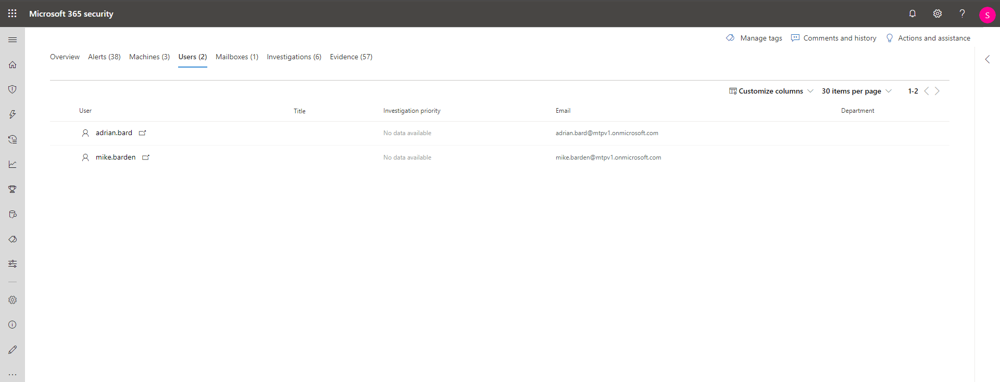

# 調查 Microsoft 365 Defender 中的事件Investigate incidents in Microsoft 365 Defender

[!INCLUDE [Microsoft 365 Defender rebranding](../includes/microsoft-defender.md)]

**適用於：****Applies to:**

- Microsoft 365 DefenderMicrosoft 365 Defender

Microsoft 365 Defender 會匯總所有來自您裝置、使用者和信箱的相關警示、資產、調查與證據，以全面瞭解整起攻擊事件。Microsoft 365 Defender aggregates all related alerts, assets, investigations and evidence from across your devices, users, and mailboxes to give you a comprehensive look into the entire breadth of an attack.

調查影響您網路的警示、了解其含義，並彙整與該事件相關聯的證據，以便設計有效的修復方案。Investigate the alerts that affect your network, understand what they mean, and collate evidence associated with the incidents so that you can devise an effective remediation plan.

## 調查事件Investigate an incident

1. 從事件佇列中選取事件。Select an incident from the incident queue.   側邊面板隨即開啟，並預覽重要資訊，例如狀態、嚴重性、類別及受影響實體。A side panel opens and gives a preview of important information such as status, severity, categories, and the impacted entities.

    

2. 選取 **開啟事件頁面**。Select **Open incident page**.   這會開啟事件頁面，您可以在其中找到事件詳細資料、批註和動作、 (、警示、裝置、使用者、調查、證據和) 。This opens the incident page where you'll find more information incident details, comments, and actions, tabs (overview, alerts, devices, users, investigations, evidence).

3. 檢閱涉及事件的警示、裝置、使用者和其他實體。Review the alerts, devices, users, other entities involved in the incident.

## 事件概觀Incident overview

概觀頁面可讓您一覽無遺地了解事件的主要內容。The overview page gives you a snapshot glance into the top things to notice about the incident.

攻擊類別提供您一個視覺化和數值的視圖，瞭解攻擊在威脅鏈中的進步進度。The attack categories give you a visual and numeric view of how advanced the attack has progressed against the kill chain. 與其他 Microsoft 安全性產品一樣，Microsoft 365 Defender 會與[MITRE ATT&&trade; CK](https://attack.mitre.org/)架構對齊。As with other Microsoft security products, Microsoft 365 Defender is aligned to the [MITRE ATT&CK&trade;](https://attack.mitre.org/) framework.

範圍區段會顯示屬於此事件中影響最大的資產清單。The scope section gives you a list of top impacted assets that are part of this incident. 如果關於此資產的特定資訊，例如風險層級、調查優先順序以及資產上的任何標記，本區段也將會顯示這項資訊。If there is specific information regarding this asset, such as risk level, investigation priority as well as any tagging on the assets this will also surface in this section.

警示時間表可讓您先預覽警示發生的時間順序，以及這些警示與此事件相關聯的原因。The alerts timeline provides a sneak peek into the chronological order in which the alerts occurred, as well as the reasons that these alerts linked to this incident.

最後，證據區段提供事件中包含多少不同成品以及其修復狀態摘要，因此您可以立即識別是否需要採取任何動作。And last - the evidence section provides a summary of how many different artifacts were included in the incident and their remediation status, so you can immediately identify if any action is needed on your end.

此概觀藉由提供您應該注意的事件主要特性深入解析，可協助對事件進行初步分級。This overview can assist in the initial triage of the incident by providing insight to the top characteristics of the incident that you should be aware of.

## 警示Alerts

您可以查看與事件相關的所有警示及其他相關資訊，例如嚴重性、參與警示的實體、警示的來源 (Microsoft Defender for Identity、Microsoft Defender for Endpoint、Microsoft Defender for Office 365) ，以及它們連結的原因。You can view all the alerts related to the incident and other information about them such as severity, entities that were involved in the alert, the source of the alerts (Microsoft Defender for Identity, Microsoft Defender for Endpoint, Microsoft Defender for Office 365) and the reason they were linked together.

根據預設，警示會依時間順序排列，讓您首先檢視攻擊如何隨時間推移而進行。By default, the alerts are ordered chronologically, to allow you to first view how the attack played out over time. 按一下每個警示，將您引導至相關的警示頁面，您可以在此深入調查該警示。Clicking on each alert will lead you to the relevant alert page where you can conduct an in-depth investigation of that alert.

## 裝置Devices

裝置索引標籤會列出所有顯示事件相關警示的裝置。The devices tab lists all the devices where alerts related to the incident are seen.

按一下執行攻擊的電腦名稱，引導您至其 [電腦] 頁面，您可以其中查看觸發的警示，以及提供的相關事件，以便輕鬆調查。Clicking the name of the machine where the attack was conducted navigates you to its Machine page where you can see alerts that were triggered on it and related events provided to ease investigation.

選取 [時間表] 索引標籤可讓您捲動電腦時程表，並以時間順序檢視電腦上觀測到的所有活動和行為，以及散布其中的警示。Selecting the Timeline tab enables you to scroll through the machine timeline and view all events and behaviors observed on the machine in chronological order, interspersed with the alerts raised.

## 使用者Users

查看已識別為指定事件一部分或與相關的使用者。See users that have been identified to be part of, or related to a given incident.

按一下使用者名稱以引導您至使用者的雲端 App 安全性頁面，可在頁面中執行進一步的調查。Clicking the username navigates you to the user's Cloud App Security page where further investigation can be conducted.

## 信箱Mailboxes

調查已識別為指定事件一部分或與相關的信箱。Investigate mailboxes that's been identified to be part of, or related to an incident. 若要進一步進行工作，選取郵件相關警示會開啟 Office 365 的 Microsoft Defender，您可以在其中採取補救動作。To do further investigative work, selecting the mail-related alert will open Microsoft Defender for Office 365 where you can take remediation actions.

## 調查Investigations

選取 **調查** 以查看此事件警示所觸發的所有自動化調查。Select **Investigations** to see all the automated investigations triggered by alerts in this incident. 視您如何將自動化調查在 Microsoft Defender for Endpoint 和 Defender for Office 365 中執行，調查將會執行補救動作，或等待分析師核准動作。The investigations will perform remediation actions or wait for analyst approval of actions, depending on how you configured your automated investigations to run in Microsoft Defender for Endpoint and Defender for Office 365.

選取調查以瀏覽至 [調查詳細資料] 頁面，取得調查和修復狀態的完整資訊。Select an investigation to navigate to the Investigation details page to get full information on the investigation and remediation status. 如果調查期間有任何等待核准的動作，這些動作會顯示在擱置中動作的 Tab。在事件補救中採取行動。If there are any actions pending for approval as part of the investigation, they will appear in the Pending actions tab. Take action as part of incident remediation.

## 證據Evidence

Microsoft 365 Defender 會自動調查警示中所有事件支援的事件和可疑實體，為您提供自動控制以及重要檔案、程式、服務、電子郵件等相關資訊。Microsoft 365 Defender automatically investigates all the incidents' supported events and suspicious entities in the alerts, providing you with autoresponse and information about the important files, processes, services, emails, and more. 可協助您快速偵測並封鎖事件中的潛在威脅。This helps quickly detect and block potential threats in the incident.

系統會將每個經分析的實體標示為判定結果 (惡意、可疑、清除) 以及修復狀態。Each of the analyzed entities will be marked with a verdict (Malicious, Suspicious, Clean) as well as a remediation status. 可協助您了解整個事件的修復狀態，以及進一步修復可採取的步驟。This assists you in understanding the remediation status of the entire incident and what are the next steps that can be taken to further remediate.

## 相關主題Related topics

- [事件概觀Incidents overview](incidents-overview.md)
- [設定事件優先順序Prioritize incidents](incident-queue.md)
- [管理事件Manage incidents](manage-incidents.md)

