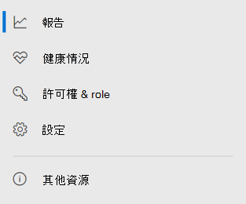

# Microsoft 365 security center 中的 microsoft Defender for EndpointMicrosoft Defender for Endpoint in the Microsoft 365 security center

[!INCLUDE [Microsoft 365 Defender rebranding](../includes/microsoft-defender.md)]

[!INCLUDE [Prerelease](../includes/prerelease.md)]

適用於：**Applies to:**

- [Microsoft 365 DefenderMicrosoft 365 Defender](https://go.microsoft.com/fwlink/?linkid=2118804)
- [適用於端點的 Microsoft DefenderMicrosoft Defender for Endpoint](https://go.microsoft.com/fwlink/p/?linkid=2146631)
- [適用於 Office 365 的 Microsoft DefenderMicrosoft Defender for Office 365](https://go.microsoft.com/fwlink/?linkid=2148715)

改進的 [Microsoft 365 安全性中心](overview-security-center.md) [https://security.microsoft.com](https://security.microsoft.com) 結合了保護、偵測、調查和回應電子郵件、共同作業、身分識別及裝置威脅的安全性功能。The improved [Microsoft 365 security center](overview-security-center.md) at [https://security.microsoft.com](https://security.microsoft.com) combines security capabilities that protect, detect, investigate, and respond to email, collaboration, identity, and device threats. 此安全中心會將現有 Microsoft 安全性入口網站的功能，包括 Microsoft Defender Security Center 和 Office 365 Security & 合規性中心。This security center brings together functionality from existing Microsoft security portals, including Microsoft Defender Security Center and the Office 365 Security & Compliance center.

如果您熟悉 Microsoft Defender 安全中心，本文可協助說明改進的 Microsoft 365 安全性中心中的一些變更與改進。If you're familiar with the Microsoft Defender Security Center, this article helps describe some of the changes and improvements in the improved Microsoft 365 security center. 不過，有一些新的和更新的元素需要注意。However there are some new and updated elements to be aware of.

從過去開始， [Microsoft Defender Security Center](https://docs.microsoft.com/windows/security/threat-protection/microsoft-defender-atp/portal-overview) 已經是 microsoft Defender 的端點。Historically, the [Microsoft Defender Security Center](https://docs.microsoft.com/windows/security/threat-protection/microsoft-defender-atp/portal-overview) has been the home for Microsoft Defender for Endpoint. 企業安全小組已使用它來監視及協助回應潛在的持續威脅活動或資料違例的警示。Enterprise security teams have used it to monitor and help responding to alerts of potential advanced persistent threat activity or data breaches. 為了協助減少入口網站數目，Microsoft 365 的安全性中心將會在您的 Microsoft identity、資料、裝置、應用程式和基礎結構中監控和管理安全性的家鄉。To help reduce the number of portals, the Microsoft 365 security center will be the home for monitoring and managing security across your Microsoft identities, data, devices, apps, and infrastructure.

Microsoft 365 security center 中的 microsoft Defender for Endpoint [可將受管理的安全性服務提供者的存取權授與受管理的安全性服務提供者 (MSSPs) ](https://docs.microsoft.com/windows/security/threat-protection/microsoft-defender-atp/grant-mssp-access) ，方式 [是在 Microsoft Defender security center 中授與存取權](mssp-access.md)。Microsoft Defender for Endpoint in the Microsoft 365 security center supports [granting access to managed security service providers (MSSPs)](https://docs.microsoft.com/windows/security/threat-protection/microsoft-defender-atp/grant-mssp-access) in the same way [access is granted in the Microsoft Defender security center](mssp-access.md).

> [!IMPORTANT]
> 您在 Microsoft 365 的安全性中心看到的內容，取決於您目前的訂閱。What you see in the Microsoft 365 security center depends on your current subscriptions. 例如，如果您沒有 Microsoft Defender for Office 365 的授權，則不會顯示 [電子郵件 & 協同作業] 區段。For example, if you don't have a license for Microsoft Defender for Office 365, then the Email & Collaboration section will not be shown.

>[!Note]
>新的整合入口網站無法供下列人員使用：美國政府社區雲端 (GCC) US 政府社區雲端高 (GCC 高) 美國政府機構，含商業授權的美國政府機構The new unified portal is not available for: US Government Community Cloud (GCC) US Government Community Cloud High (GCC High) US Department of Defense All US government institutions with commercial licenses

請參閱改進的 Microsoft 365 安全中心： [https://security.microsoft.com](https://security.microsoft.com) 。Take a look at the improved Microsoft 365 security center: [https://security.microsoft.com](https://security.microsoft.com).

深入瞭解好處： [Microsoft 365 安全中心概述](overview-security-center.md)Learn more about the benefits: [Overview of the Microsoft 365 security center](overview-security-center.md)

## 變更的功能What's changed

此表格是 Microsoft Defender 安全中心與 Microsoft 365 安全性中心之間變更的快速參考。This table is a quick reference of the changes between the Microsoft Defender Security Center and the Microsoft 365 security center.

### 警示和動作Alerts and actions

|**適用範圍****Area**  |**變更描述****Description of change**  |
|---------|---------|
| [事件 & 警示Incidents & alerts](incidents-overview.md)  | 在 Microsoft 365 的 [安全性中心] 中，您可以管理所有端點、電子郵件和身分識別的事件及警示。In the Microsoft 365 security center, you can manage incidents and alerts across all of your endpoints, email, and identities. 我們已融合經驗，以協助您更輕鬆地找到相關的事件。We've converged the experience to help you find related events more easily. 如需詳細資訊，請參閱 [事件概述](incidents-overview.md)。For more information, see [Incidents Overview](incidents-overview.md).   |
| [狩獵Hunting](advanced-hunting-overview.md)  |  修改在 Microsoft Defender for Endpoint 中建立的自訂偵測規則，以包含身分識別和電子郵件表格，會自動將其移至 Microsoft 365 Defender。Modifying custom detection rules created in Microsoft Defender for Endpoint to include identity and email tables automatically moves them to Microsoft 365 Defender. 其對應的警示也會出現在 Microsoft 365 Defender 中。Their corresponding alerts will also appear in Microsoft 365 Defender. 如需這些變更的詳細資訊，請參閱 [遷移自訂偵測規則](advanced-hunting-migrate-from-mdatp.md#migrate-custom-detection-rules)。For more details about these changes, read [Migrate custom detection rules](advanced-hunting-migrate-from-mdatp.md#migrate-custom-detection-rules). `DeviceAlertEvents`Microsoft 365 Defender 沒有提供高級搜尋的表格。The `DeviceAlertEvents` table for advanced hunting isn't available in Microsoft 365 Defender. 若要在 Microsoft 365 Defender 中查詢裝置特有的警示資訊，您可以使用 `AlertInfo` 和 `AlertEvidence` 表格來從一組不同的來源取得更多資訊。To query device-specific alert information in Microsoft 365 Defender, you can use the `AlertInfo` and `AlertEvidence` tables to accommodate even more information from a diverse set of sources. 在不 DeviceAlertEvents 的情況下，使用 [寫入查詢](advanced-hunting-migrate-from-mdatp.md#write-queries-without-devicealertevents)製作下一個裝置相關的查詢。Craft your next device-related query by following [Write queries without DeviceAlertEvents](advanced-hunting-migrate-from-mdatp.md#write-queries-without-devicealertevents).|
|[行動中心Action center](mtp-action-center.md)    | 列出遵循自動調查和修正動作所採取的擱置及已完成動作。Lists pending and completed actions that were taken following automated investigations and remediation actions. 先前，Microsoft Defender Security Center 中的「動作中心」會列出僅對裝置執行之修正動作的擱置和完成動作，同時自動調查會列出警示和狀態。Formerly, the Action center in the Microsoft Defender Security Center listed pending and completed actions for remediation actions taken on devices only, while Automated investigations listed alerts and status. 在改進的 Microsoft 365 安全性中心，「行動中心」會將修正動作和調查集中在電子郵件、裝置和使用者上，全部都位於一個位置。In the  improved Microsoft 365 security center, the Action center brings together remediation actions and investigations across email, devices, and users—all in one location.  |
| [威脅分析Threat analytics](threat-analytics.md) |  移至導覽列的頂端，以方便探索和使用。Moved to the top of the navigation bar for easier discovery and use. 現在包括端點的威脅資訊，以及電子郵件與共同作業。Now includes threat information for both endpoints and email and collaboration.    |

### 端點Endpoints

|**適用範圍****Area**  |**變更描述****Description of change**  |
|---------|---------|
|搜尋Search   |  而不是在標題中，Microsoft Defender for Endpoint 搜尋列會在 [端點] 區段下移動。Instead of being in the heading, Microsoft Defender for Endpoint search bar is moving under the Endpoints section. 您可以繼續搜尋裝置、檔案、使用者、URLs、IPs、弱點、軟體及建議。You can continue to search for devices, files, users, URLs, IPs, vulnerabilities, software, and recommendations.  |
|[儀表板Dashboard](https://docs.microsoft.com/windows/security/threat-protection/microsoft-defender-atp/security-operations-dashboard)   |  這是您的安全性運作儀表板。This is your security operations dashboard. 查看已觸發的主動警示數目、哪些裝置面臨危險、哪些使用者有危險，以及警示、裝置和使用者的嚴重性層級。See an overview of how many active alerts were triggered, which devices are at risk, which users are at risk, and severity level for alerts, devices, and users. 您也可以查看任何裝置是否有感應器問題、整體服務健康情況，以及偵測到任何未解析之警示的方式。You can also see if any devices have sensor issues, your overall service health, and how any unresolved alerts were detected. |
|裝置清單Device inventory | 無變更。No changes. |
|[弱點管理Vulnerability management](https://docs.microsoft.com/windows/security/threat-protection/microsoft-defender-atp/next-gen-threat-and-vuln-mgt)    |    名稱已縮短，可放入功能窗格中。Name was shortened to fit in the navigation pane. 與「威脅與弱點管理」區段相同，其下所有頁面皆為相同。It's the same as the threat and vulnerability management section, with all the pages underneath.     |
| 合作夥伴和 APIsPartners and APIs | 無變更。No changes. |
| 評估 & 教學課程Evaluations & tutorials    |     新的測試和學習功能。New testing and learning capabilities.     |
| 設定管理Configuration management   |  無變更。No changes.  |

> [!NOTE]
> **自動調查和修正** 現在是事件的一部分。**Automatic investigation and remediation** is now a part of  incidents. 您可以在 [ **事件 > 調查** ] 索引標籤中查看自動調查和修正事件。You can see Automated  investigation and remediation events in the **Incident > Investigation** tab.

### 存取與報告Access and reporting

|**適用範圍****Area**  |**變更描述****Description of change**  |
|---------|---------|
| 報告Reports  | 請參閱報告中的端點和電子郵件 & 共同作業，包括威脅防護、裝置健康情況和合規性，以及易受攻擊的裝置。See reports for endpoints and email & collaboration, including Threat protection, Device health and compliance, and Vulnerable devices. |
| 健康情況Health  |  目前連結到 [Microsoft 365 系統管理中心](https://admin.microsoft.com/)中的「服務健康情況」頁面。Currently links out to the "Service health" page in the [Microsoft 365 admin center](https://admin.microsoft.com/). |
| 設定Settings |  管理您的 Microsoft 365 安全中心設定、Microsoft 365 Defender、端點、電子郵件 & 共同作業、身分識別及裝置探索。Manage your settings for the Microsoft 365 security center, Microsoft 365 Defender, Endpoints, Email & collaboration, Identities, and Device discovery.   |

## Microsoft 365 安全性導覽和功能Microsoft 365 security navigation and capabilities

左側導覽列或快速啟動列會非常熟悉。The left navigation, or quick launch bar, will look familiar. 不過，此安全中心有一些新的和更新的元素。However, there are some new and updated elements in this security center.

### 事件及警示Incidents and alerts

在您的電子郵件、裝置和身分識別上彙集事件及警示管理。Brings together incident and alert management across your email, devices, and identities. 警示頁面會將攻擊信號結合在一起，以建立警示的完整內容。The alert page provides full context to the alert by combining attack signals to construct a detailed story. 現在，新的整合體驗，讓您可以在不同的工作負載中統一查看警示。A new, unified experience now brings together a consistent view of alerts across workloads. 您可以快速地會審、調查和採取有效的動作。You can quickly triage, investigate, and take effective action.

- [深入了解事件Learn more about incidents](incidents-overview.md)
- [深入瞭解管理提醒Learn more about managing alerts](investigate-alerts.md)

![警示和動作的 [快速啟動] 欄](../../media/converge-1-alerts-and-actions.png)

### 狩獵Hunting

使用 [高級搜尋查詢](advanced-hunting-overview.md)，主動搜尋您的端點、Office 365 信箱等威脅、惡意程式碼和惡意活動。Proactively search for threats, malware, and malicious activity across your endpoints, Office 365 mailboxes, and more by using [advanced hunting queries](advanced-hunting-overview.md). 這些功能強大的查詢可用於尋找及審閱已知和潛在威脅的威脅指示器和實體。These powerful queries can be used to locate and review threat indicators and entities for both known and potential threats.

[自訂偵測規則](custom-detection-rules.md) 可以從先進的搜尋查詢中建立，以協助您主動留意可能表示遭到破壞活動和配置錯誤裝置的事件。[Custom detection rules](custom-detection-rules.md) can be built from advanced hunting queries to help you proactively watch for events that might be indicative of breach activity and misconfigured devices.

### 行動中心Action center

行動中心會顯示自動化調查和回應功能所建立的調查。Action center shows you the investigations created by automated investigation and response capabilities. 在 Microsoft 365 Defender 中，這項自動化的自我修復功能可自動回應特定事件，以協助安全性小組。This automated, self-healing in Microsoft 365 Defender can help security teams by automatically responding to specific events.

[深入了解重要訊息中心Learn more about the Action center](mtp-action-center.md)

### 威脅分析Threat Analytics

從 Microsoft 安全性調查專家那裡取得威脅情報。Get threat intelligence from expert Microsoft security researchers. 威脅分析可協助安全性小組更有效率面臨面臨的新威脅。Threat Analytics helps security teams be more efficient when facing emerging threats. 威脅分析包括：Threat Analytics includes:

- Microsoft Defender for Office 365 中的電子郵件相關偵測和緩解。Email-related detections and mitigations from Microsoft Defender for Office 365. 這除了 Microsoft Defender for Endpoint 中已提供的端點資料之外。This is in addition to the endpoint data already available from Microsoft Defender for Endpoint.
- 與威脅相關的事件檢視。Incidents view related to the threats.
- 在報告中快速識別及使用可行動資訊的增強體驗。Enhanced experience for quickly identifying and using actionable information in the reports.

您可以從 Microsoft 365 的安全性中心左上方導覽列中存取威脅分析，或是從顯示組織之主要威脅的專用儀表板卡存取。You can access threat analytics either from the upper left navigation bar in the Microsoft 365 security center, or from a dedicated dashboard card that shows the top threats for your organization.

深入瞭解如何 [使用威脅分析追蹤和回應新興威脅](https://docs.microsoft.com/microsoft-365/security/mtp/threat-analytics)Learn more about how to [track and respond to emerging threats with threat analytics](https://docs.microsoft.com/microsoft-365/security/mtp/threat-analytics)

### 端點區段Endpoints section

查看和管理組織中端點的安全性。View and manage the security of endpoints in your organization. 如果您已使用 Microsoft Defender 安全中心，它看起來會很熟悉。If you've used the Microsoft Defender Security Center, it will look familiar.

### 存取與報告Access and reports

查看報告、變更您的設定，以及修改使用者角色。View reports, change your settings, and modify user roles.

### SIEM API 連接SIEM API connections

如果您使用 [Defender For ENDPOINT SIEM API](/windows/security/threat-protection/microsoft-defender-atp/enable-siem-integration.md)，您可以繼續執行。If you use the [Defender for Endpoint SIEM API](/windows/security/threat-protection/microsoft-defender-atp/enable-siem-integration.md), you can continue to do so. 我們已在 API 負載上新增連結，指向 [警示] 頁面或 Microsoft 365 安全性入口網站中的 [事件] 頁面。We’ve added new links on the API payload that point to the alert page or the incident page in the Microsoft 365 security portal. 新的 API 欄位包括 LinkToMTP 及 IncidentLinkToMTP。New API fields include LinkToMTP and IncidentLinkToMTP. 如需詳細資訊，請參閱 [將客戶從 Microsoft Defender For 端點重新導向至 Microsoft 365 安全中心](/microsoft-365/security/mtp/microsoft-365-security-mde-redirection.md)。For more information, see [Redirecting accounts from Microsoft Defender for Endpoint to the Microsoft 365 security center](/microsoft-365/security/mtp/microsoft-365-security-mde-redirection.md).

### 電子郵件警示Email alerts

您可以繼續使用用於端點的電子郵件警示。You can continue to use email alerts for Defender for Endpoint. 我們已新增電子郵件中的新連結，指向 [提醒] 頁面或 Microsoft 365 [安全性中心] 中的 [事件] 頁面。We've added new links in the emails that point to the alert page or the incident page in the Microsoft 365 security center. 如需詳細資訊，請參閱 [將客戶從 Microsoft Defender For 端點重新導向至 Microsoft 365 安全中心](/microsoft-365/security/mtp/microsoft-365-security-mde-redirection.md)。For more information, see [Redirecting accounts from Microsoft Defender for Endpoint to the Microsoft 365 security center](/microsoft-365/security/mtp/microsoft-365-security-mde-redirection.md).

## 相關資訊Related information

- [Microsoft 365 安全性中心Microsoft 365 security center](overview-security-center.md)
- [Microsoft 365 security center 中的 microsoft Defender for EndpointMicrosoft Defender for Endpoint in the Microsoft 365 security center](microsoft-365-security-center-mde.md)
- [將帳戶從 Microsoft Defender for Endpoint 重新導向至 Microsoft 365 安全中心Redirecting accounts from Microsoft Defender for Endpoint to the Microsoft 365 security center](microsoft-365-security-mde-redirection.md)
