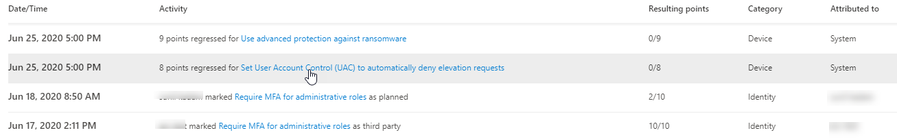

# 追蹤您的 Microsoft 安全分數記錄並符合目標Track your Microsoft Secure Score history and meet goals

[Microsoft Secure 得分](microsoft-secure-score.md)是組織的安全性狀況度量，具有較高的數目，表示執行的改善動作越多。[Microsoft Secure Score](microsoft-secure-score.md) is a measurement of an organization's security posture, with a higher number indicating more improvement actions taken. 可在 https://security.microsoft.com/securescore [Microsoft 365 的安全性中心](overview-security-center.md)找到該網址。It can be found at https://security.microsoft.com/securescore in the [Microsoft 365 security center](overview-security-center.md).

## 深入瞭解已影響分數的活動Gain insights into activity that has affected your score

在 [**記錄**] 索引標籤中，透過一段時間來查看組織的分數圖表。View a graph of your organization's score over time in the **History** tab.

在圖形下方，會列出所選時間範圍內所執行的所有動作及其屬性，例如結果點和類別。Below the graph is a list of all the actions taken in the selected time range and their attributes, such as resulting points and category. 您可以自訂日期範圍及依類別篩選。You can customize a date range and filter by category.

如果您選取與活動相關聯的 [改進] 動作，就會出現 [完整的「改進動作」快顯視窗。If you select the improvement action associated with an activity, the full improvement action flyout will appear.

若要查看該特定 [改進] 動作的所有歷史記錄，請選取浮出控制項中的 [歷程記錄] 連結。To view all history for that specific improvement action, select the history link in the flyout.

## 探索趨勢及設定目標Discover trends and set goals

在 [**度量 & 趨勢**] 索引標籤中，有數個圖形可讓您更深入的趨勢及設定目標。In the **Metrics & trends** tab, there are several graphs and charts to give you more visibility into trends and set goals. 您可以設定整個視覺效果頁面的日期範圍。You can set the date range for the whole page of visualizations. 視覺化效果包括：The visualizations include:

* **您的安全分數區域**-自訂取決於組織的目標和「良好」、「好」和「不良分數」範圍的定義。**Your Secure Score zone** — Customized based on your organization's goals and definitions of good, okay, and bad score ranges.
* **回歸趨勢**-因設定、使用者或裝置變更而 regressed 之點的時程表。**Regression trend** — A timeline of points that have regressed due to configuration, user, or device changes.  
* **比較趨勢**-組織的安全分數與其他時間的比較方式。**Comparison trend** — How your organization's Secure Score compares to others' over time. 此視圖可以包含表示具有類似座位元數目之組織之分數平均的行，以及您可以設定的自訂比較視圖。This view can include lines representing the score average of organizations with similar seat count and a custom comparison view that you can set.
* **風險接受趨勢**-標示為「風險已接受」的「改進」動作時程表。**Risk acceptance trend** — Timeline of improvement actions marked as "risk accepted."
* **得分變更**-已取得的點數，點 regressed，以及後續得分變更，在指定的日期範圍內。**Score changes** — The number of points achieved, points regressed, along with the subsequent score change, in the specified date range.

### 比較您的分數與您的組織Compare your score to organizations like yours

您可以在兩個位置查看您的分數如何與您類似的組織進行比較。There are two place to see how your score compares to organizations that are similar to you.

第一個位置是在 [**一覽**] 索引標籤中，您可以在其中看到比較柱狀圖圖表。The first place is in the **Overview** tab, where you will be able to see a comparison bar graph. 將游標移至圖表上方，以查看分數和排名機會。Hover over the chart to view the score and score opportunity.

第二個地方是在 [**度量 & 趨勢**] 索引標籤中，您可以在其中查看組織的安全分數與其他時間的比較方式。The second place is in the **Metrics & trends** tab, where you can view how your organization's Secure Score compares to others' over time.

在這兩個圖表中，您可以選取 [**管理比較**]，以查看及編輯組織的資訊。In both charts, you can select **Manage comparisons** to view and edit your organization's information. 您也可以根據行業、組織大小、授權及地區建立自訂比較。You can also create a custom comparison based on industry, organization size, licenses, and regions. 

## 我們想要聽到您的來信We want to hear from you

如果您有任何問題，請在[安全性、隱私權 & 合規性](https://techcommunity.microsoft.com/t5/Security-Privacy-Compliance/bd-p/security_privacy)社區中公佈，以告知我們。If you have any issues, please let us know by posting in the [Security, Privacy & Compliance](https://techcommunity.microsoft.com/t5/Security-Privacy-Compliance/bd-p/security_privacy) community. 我們正在監視社區，並會提供協助。We're monitoring the community and will provide help.

## 相關資源Related resources

- [Microsoft 安全評分概述Microsoft Secure Score overview](microsoft-secure-score.md)
- [深入瞭解您的安全性狀況Gain visibility into your security posture](microsoft-secure-score-improvement-actions.md)
- [即將推出的功能What's coming](microsoft-secure-score-whats-coming.md)