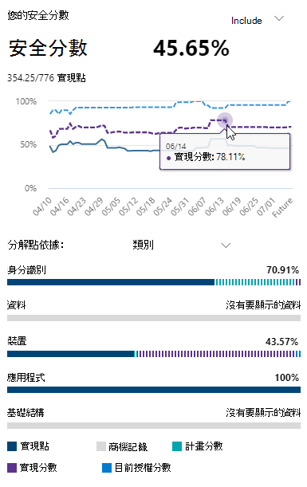

# 使用 Microsoft 安全分數評估安全性狀況Assess your security posture with Microsoft Secure Score

[!INCLUDE [Microsoft 365 Defender rebranding](../includes/microsoft-defender.md)]

Microsoft Secure 得分是組織的安全性狀況度量，具有較高的數目，表示執行的改善動作越多。Microsoft Secure Score is a measurement of an organization's security posture, with a higher number indicating more improvement actions taken. 可在 https://security.microsoft.com/securescore [Microsoft 365 的安全性中心](overview-security-center.md)找到該網址。It can be found at https://security.microsoft.com/securescore in the [Microsoft 365 security center](overview-security-center.md).

為了協助您更快速地取得所需資訊，Microsoft 改進的動作會組織成群組：To help you the information you need more quickly, Microsoft improvement actions are organized into groups:

*  (Azure Active Directory 帳戶 & 角色的身分識別) Identity (Azure Active Directory accounts & roles)
* 資料 (現在沒有任何改進動作) Data  (no improvement actions for now)
* 裝置 (Microsoft Defender for Endpoint，稱為 [裝置的 Microsoft 安全評分](https://docs.microsoft.com/windows/security/threat-protection/microsoft-defender-atp/tvm-microsoft-secure-score-devices)) Device (Microsoft Defender for Endpoint, known as [Microsoft Secure Score for Devices](https://docs.microsoft.com/windows/security/threat-protection/microsoft-defender-atp/tvm-microsoft-secure-score-devices))
* App (電子郵件和雲端應用程式，包括 Office 365 和 Microsoft Cloud App Security) App (email and cloud apps, including Office 365 and Microsoft Cloud App Security)
* 基礎結構 (現在沒有任何改進動作) Infrastructure (no improvement actions for now)

>[!NOTE]
>在最近發行的 Microsoft Secure 得分中，已發行的評分模型已發佈，使 Microsoft 安全分數暫時不相容身分識別安全分數和圖形 API。In the recent release of Microsoft Secure Score, an improved scoring model has been released which made Microsoft Secure Score temporarily incompatible with Identity Secure Score and the Graph API. [檢視詳細資料View details](microsoft-secure-score-whats-new.md)

在 [Microsoft Secure 得分一覽] 頁面中，瞭解如何在這些群組間分割點，以及可以使用哪些點數。In the Microsoft Secure Score overview page, see how points are split between these groups and what points are available. 您也可以取得總分的整體總分、安全分數的歷史趨勢和基準比較，以及可以採取以改善評分的優先改進動作。You can also get an all-up view of the total score, historical trend of your secure score with benchmark comparisons, and prioritized improvement actions that can be taken to improve your score.

## 檢查您目前的分數Check your current score

若要檢查您目前的分數，請移至 [Microsoft Secure 得分一覽] 頁面，並尋找包含 **您安全分數** 的麻將牌。To check on your current score, go to the Microsoft Secure Score overview page and look for the tile that says **Your secure score**. 您的分數會顯示為百分數，以及您已從總可能點數取得的點數。Your score will be shown as a percentage, along with the number of points you've achieved out of a total possible points.

此外，如果您選取分數旁邊的 [ **包含** ] 按鈕，您可以選擇不同的分數視圖。Additionally, if you select the **Include** button next to your score, you can choose different views of your score. 這些不同的分數視圖會顯示在 [分數] 磚和 [點] 分解圖上的圖表中。These different score views will display in the graph on the score tile and the point breakdown chart.

以下是您可以新增至您的整體分數視圖的分數，可讓您更完整的整體分數的描述如下：The following are scores you can add to your view of your overall score to give you a fuller picture of your overall score:

- 已 **計畫分數** ：在計畫的動作完成時顯示預計分數**Planned score** : Show projected score when planned actions are completed
- **目前的授權分數** ：顯示可使用您目前的 Microsoft 授權所能達到的分數**Current license score** : Show score that can be achieved with your current Microsoft license
- 可 **實現分數** ：顯示可透過您的 Microsoft 授權和目前的風險接受程度達到的分數**Achievable score** : Show score that can be achieved with your Microsoft licenses and current risk acceptance

如果您已包含所有可能的分數視圖，則此視圖的外觀會如下：This view is what it will look like if you've included all possible score views:

## 採取動作以提升您的分數Take action to improve your score

[ **改進動作** ] 索引標籤會列出解決可能攻擊曲面的安全性建議。The **Improvement actions** tab lists the security recommendations that address possible attack surfaces. 此外，它還包括其狀態 (，以解決、規劃、接受的風險、透過協力廠商解決，以及透過替代的緩解可解決，以及已完成的) 。It also includes their status (to address, planned, risk accepted, resolved through third party, resolved through alternate mitigation, and completed). 您可以搜尋、篩選和群組所有的「改進」動作。You can search, filter, and group all the improvement actions.  

### 排名Ranking

排名是根據剩下的點數、實施難度、使用者影響和複雜性而定。Ranking is based on the number of points left to achieve, implementation difficulty, user impact, and complexity. 最高排名的「改進」動作具有很大的分數，但有低難度、使用者影響和複雜性。The highest ranked improvement actions have a large number of points remaining with low difficulty, user impact, and complexity.

### 查看改進動作詳細資料View improvement action details

當您選取特定的 [提升] 動作時，會出現完整的頁面快顯視窗。When you select a specific improvement action, a full page flyout appears.  

 *圖2：改進動作飛出範例*
*Figure 2: Improvement action flyout example*

若要完成此動作，您有幾個選項：To complete the action, you have a few options:

* 選取 [ **管理** ] 以進入設定畫面並進行變更。Select **Manage** to go the configuration screen and make the change. 接著，您將會在飛出的位置看到必要的動作。點通常需要24小時才能更新。You'll then gain the points that the action is worth, visible in the fly out. Points generally take about 24 hours to update.

* 選取 [ **共用** ]，將直接連結複製到 [改進] 動作。Select **Share** to copy the direct link to the improvement action. 您也可以選擇要共用連結的平臺，例如電子郵件、Microsoft 小組、Microsoft Planner 或 ServiceNow。You can also choose the platform to share the link, such as email, Microsoft Teams, Microsoft Planner, or ServiceNow. 選取 [ServiceNow 將可讓您建立 ServiceNow 和 Microsoft 365 安全性中心首頁會顯示的變更票證。Selecting ServiceNow will let you create a change ticket that will be visible in ServiceNow and the Microsoft 365 security center home. 若要深入瞭解，請參閱 [Microsoft 365 security center 和 ServiceNow integration](tickets-security-center.md)。To learn more, see [Microsoft 365 security center and ServiceNow integration](tickets-security-center.md).

### 選擇改進動作狀態Choose an improvement action status

選擇 [改進] 動作特有的任何狀態和記錄附注。Choose any statuses and record notes specific to the improvement action.

- **若要解決** 此事項-您可以辨識改進動作是必要的，並計畫于未來某一點進行處理。**To address** - You recognize that the improvement action is necessary and plan to address it at some point in the future. 這種狀態也適用于已偵測到部分但未完全完成的動作。This state also applies to actions that are detected as partially, but not fully completed.
- 已 **計畫** -已有適當的計畫可完成改進動作。**Planned** - There are concrete plans in place to complete the improvement action.
- 已 **接受風險** -安全性絕對應該與可用性進行平衡，而不是每個建議適用于您的環境。**Risk accepted** - Security should always be balanced with usability, and not every recommendation will work for your environment. 在這種情況下，您可以選擇接受風險或餘下的風險，而不會制定改進動作。When that is the case, you can choose to accept the risk, or the remaining risk, and not enact the improvement action. 您不會獲得任何點數，但是動作將不再顯示在 [改進動作] 清單中。You won't be given any points, but the action will no longer be visible in the list of improvement actions. 您可以在歷史記錄中查看此動作，也可以隨時復原。You can view this action in history or undo it at any time.
- **透過協力廠商解決** ，並 **透過替代的緩解措施解決** -改進動作已經由協力廠商應用程式或軟體或內部工具所解決。**Resolved through third party** and **Resolved through alternate mitigation** - The improvement action has already been addressed by a third-party application or software, or an internal tool. 您將會看到必要的動作點，所以您的分數會更好反映整體的安全性狀況。You'll gain the points that the action is worth, so your score better reflects your overall security posture. 如果協力廠商或內部工具不再涵蓋該控制項，您可以選擇其他狀態。If a third party or internal tool no longer covers the control, you can choose another status. 請記住，如果改進動作標示為這兩種狀態，Microsoft 將無法深入瞭解實施的完整性。Keep in mind, Microsoft will have no visibility into the completeness of implementation if the improvement action is marked as either of these statuses.

#### 威脅 & 弱點管理的改進動作Threat & Vulnerability Management improvement actions

若要在 "Device" 類別中改進動作，您將無法選擇狀態。For improvement actions in the "Device" category, you won't be able to choose statuses. 相反地，您會被導向相關 [威脅 & 弱點管理 (TVM) 安全性建議](https://docs.microsoft.com/windows/security/threat-protection/microsoft-defender-atp/tvm-security-recommendation) 的 [Microsoft Defender security Center](https://docs.microsoft.com/windows/security/threat-protection/microsoft-defender-atp/use) 採取行動。Instead, you'll be directed to the associated [Threat & Vulnerability Management (TVM) security recommendation](https://docs.microsoft.com/windows/security/threat-protection/microsoft-defender-atp/tvm-security-recommendation) in the [Microsoft Defender Security Center](https://docs.microsoft.com/windows/security/threat-protection/microsoft-defender-atp/use) to take action. 您選擇的例外狀況和您所撰寫的對齊方式，都是該入口網站特有的。The exception you choose and justification you write will be specific to that portal. 它不會出現在 Microsoft Secure 得分入口網站中。It won't be present in the Microsoft Secure Score portal.

#### 已完成的改進動作Completed improvement actions

在完成改進動作的所有可能點之後，[改進動作] 的狀態為「已完成」。Improvement actions have a "completed" status once all possible points for the improvement action have been achieved. 已完成的改進動作會透過 Microsoft data 加以確認，而且您將無法變更狀態。Completed improvement actions are confirmed though Microsoft data, and you won't be able to change the status.

### 評估資訊並複查使用者影響Assess information and review user impact

一 **眼** 就會告訴您，您的類別、可以防禦的攻擊，以及產品。The section called **At a glance** will tell you the category, attacks it can protect against, and the product.

[ **使用者影響** ] 顯示使用者在已頒佈改進動作時的體驗，以及 **受影響的使用者** 會顯示誰會體驗。The **User impact** shows what the users will experience if the improvement action is enacted, and **Users affected** shows who will experience it.

### 實施改進動作Implement the improvement action

「 **實施** 」區段顯示所有必要條件、逐步後續步驟，以完成 [改進] 動作、[改進動作] 的目前實施狀態，以及任何 [深入瞭解] 連結。The **Implementation** section shows any prerequisites, step-by-step next steps to complete the improvement action, the current implementation status of the improvement action, and any learn more links.

必要條件包括需要取得的任何授權，或是在解決改進動作之前必須完成的動作。Prerequisites include any licenses that need to be obtained or actions that need to be completed before the improvement action is addressed. 請確定您的授權有足夠的座位，可完成 [改進] 動作，並將這些授權套用至必要的使用者。Make sure you have enough seats in your license to complete the improvement action and that those licenses are applied to the necessary users.  

## 我們想要聽到您的來信We want to hear from you

如果您有任何問題，請在 [安全性、隱私權 & 合規性](https://techcommunity.microsoft.com/t5/Security-Privacy-Compliance/bd-p/security_privacy) 社區中發佈以告知我們。If you have any issues, let us know by posting in the [Security, Privacy & Compliance](https://techcommunity.microsoft.com/t5/Security-Privacy-Compliance/bd-p/security_privacy) community. 我們正在監視社區，並會提供協助。We're monitoring the community and will provide help.

## 相關資源Related resources

- [Microsoft 安全評分概述Microsoft Secure Score overview](microsoft-secure-score.md)
- [追蹤您的 Microsoft 安全分數記錄並符合目標Track your Microsoft Secure Score history and meet goals](microsoft-secure-score-history-metrics-trends.md)
- [即將推出的功能What's coming](microsoft-secure-score-whats-coming.md)
- [新功能What's new](microsoft-secure-score-whats-new.md)
