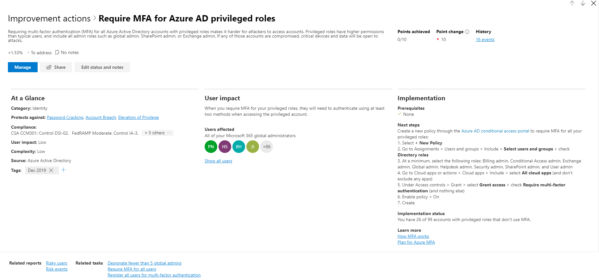

# Microsoft 安全分數 （預覽）Microsoft Secure Score (preview)

>[!IMPORTANT]
>一些資訊和有關搶鮮產品，可能會在正式發行之前大幅修改。Some information relates to prereleased product which may be substantially modified before it's commercially released. Microsoft makes no warranties, express or implied, with respect to the information provided here.Microsoft makes no warranties, express or implied, with respect to the information provided here.

Microsoft 安全分數是具有較高的數字，表示所採取的多個改進動作的組織的安全性狀態，度量單位。Microsoft Secure Score is a measurement of an organization’s security posture, with a higher number indicating more improvement actions taken. 下列建議的安全分數可以防止潛在威脅組織。Following the Security Score recommendations can protect your organization from threats. 從 Microsoft 365 安全性中心集中式儀表板，組織可以監視，並在其 Microsoft 365 身分識別、 資料、 app、 裝置和基礎結構的安全性上運作。From a centralized dashboard in the Microsoft 365 security center, organizations can monitor and work on the security of their Microsoft 365 identities, data, apps, devices, and infrastructure.

安全分數可幫助組織：Secure Score helps organizations:  

* 在組織的安全性狀態的目前狀態報告。Report on the current state of the organization’s security posture.
* 提供可測知性、 可見性、 指導以及控制項，以提高其安全性狀態。Improve their security posture by providing discoverability, visibility, guidance, and control.  
* 比較基準，並建立關鍵效能指標 (Kpi)。Compare with benchmarks and establish key performance indicators (KPIs).

組織存取的評量和趨勢，與其他 Microsoft 產品整合、 分數比較與類似的組織，以及執行更多功能強大的視覺效果。Organizations gain access to robust visualizations of metrics and trends, integration with other Microsoft products, score comparison with similar organizations, and much more. 分數也可反映協力廠商解決方案時解決建議的動作。The score can also reflect when third-party solutions have addressed recommended actions.

此外，您可以存取您的建議，以及分數透過[Microsoft Graph API](https://www.microsoft.com/security/partnerships/graph-security-api)。Additionally, you can access your recommendations and score through the [Microsoft Graph API](https://www.microsoft.com/security/partnerships/graph-security-api). 了解[安全分數資源類型](https://go.microsoft.com/fwlink/?linkid=2092996)。Learn about the [Secure Score resource type](https://go.microsoft.com/fwlink/?linkid=2092996).

## 運作方式How it works

您所設定的特定點建議的安全性功能，執行與安全性相關的工作，或解決與協力廠商應用程式或軟體的改進巨集指令。You are given points for configuring recommended security features, performing security-related tasks, or addressing the improvement action with a third-party application or software. 一些改進動作只提供點完全完成時，和某些授與部分點為單位，如果他們使用某些裝置或使用者完成。Some improvement actions only give points when fully completed, and some give partial points if they are completed for some devices or users. 如果您無法或不想要達成其中一個改進動作，您可以選擇接受風險或其餘的風險。If you cannot or do not want to enact one of the improvement actions, you can choose to accept the risk or the remaining risk.

我們示範整組可能的改進功能，無論授權，因此您可以了解安全性最佳做法，並改善您的分數。We show you the full set of possible improvements, regardless of license, so you can understand security best practices and improve your score. 安全分數，無論哪項產品授權您的組織相同擁有哪些保持代表您的絕對的安全性狀態。Your absolute security posture is represented by Secure Score, which stays the same no matter what product licenses your organization owns. 請記住，應取得平衡安全性與可用性，並不是每個建議才能為您的環境。Keep in mind that security should be balanced with usability, and not every recommendation can work for your environment.

您的分數會更新以反映視覺效果和改進動作頁面中所呈現的資訊的即時。Your score is updated in real time to reflect the information presented in the visualizations and improvement action pages. 安全分數也每天同步處理以接收關於每個動作您達成點為單位的系統資料。Secure Score also syncs daily to receive system data about your achieved points for each action.

### 如何改進動作，就會獲得How improvement actions are scored

每個改進動作是值得 10 點或更少。Each improvement action is worth 10 points or less. 二進位的方式，就會獲得最-如果您實作的改進巨集指令，如建立新的原則，或開啟的特定設定，您會收到的資料點的 100%。Most are scored in a binary fashion — if you implement the improvement action, like create a new policy or turn on a specific setting, you get 100% of the points. 其他改進的動作，點都指定的百分比的總組態。For other improvement actions, points are given as a percentage of the total configuration. 例如，如果改進巨集指令會指出您取得 30 點保護您的所有使用者以多重要素驗證和您只需要 100 個受保護的總使用者 5，會提供您大約 2 點的部分分數 (受保護的 5 / 100 總 \* 30 的最大點數 = 2 點數部分分數)。For example, if the improvement action states you get 30 points by protecting all your users with multi-factor authentication and you only have 5 of 100 total users protected, you would be given a partial score of around 2 points (5 protected / 100 total \* 30 max pts = 2 pts partial score).

### 安全分數中包含的產品Products included in Secure Score

目前有 Office 365 （包括 SharePoint Online、 Exchange Online、 OneDrive for Business、 Microsoft 資訊保護和更多），建議 Azure AD，Intune、 Microsoft Defender ATP 和 Cloud App Security。Currently there are recommendations for Office 365 (including SharePoint Online, Exchange Online, OneDrive for Business, Microsoft Information Protection, and more), Azure AD, Intune, Microsoft Defender ATP, and Cloud App Security. 建議的其他安全性產品即將推出。Recommendations for other security products are coming soon. 建議將涵蓋每個產品相關聯的所有受攻擊面，但它們是不錯的比較基準。The recommendations will not cover all the attack surfaces associated with each product, but they are a good baseline. 您也可以將標示改進動作為所涵蓋的協力廠商。You can also mark the improvement actions as covered by a third party.

## 必要的權限Required permissions

若要存取 Microsoft 安全分數的權限，您必須獲指派其中一個 Azure Active Directory 中的下列角色。To have permission to access Microsoft Secure Score, you must be assigned one of the following roles in Azure Active Directory.

### 讀取和寫入角色Read and write roles

讀取與寫入權限，您可以進行的變更，並直接互動安全分數。With read and write access, you can make changes and directly interact with Secure Score. 您也可以指派給其他使用者的唯讀權限。You can also assign read-only access to other users.

* 全域管理員Global administrator
* 安全性系統管理員Security administrator
* Exchange 管理員Exchange administrator
* SharePoint 系統管理員SharePoint administrator

### 唯讀的角色Read-only roles

具有唯讀存取權，您不能編輯狀態] 或 [備忘稿改進巨集指令、 編輯分數區域，或編輯自訂比較。With read-only access, you are not able to edit status or notes for an improvement action, edit score zones, or edit custom comparisons.

* 服務台管理員Helpdesk administrator
* 使用者系統管理員User administrator
* 服務管理員Service administrator
* 安全性讀取者Security reader
* 安全性操作員Security operator
* 全域的讀取者Global reader

### Graph APIGraph API

若要存取 Graph API，您需要有下列其中一個角色除了下列範圍：To access the Graph API, you need to have one of the following scopes in addition to a role:

* SecurityEvents.Read.All （適用於唯讀角色）SecurityEvents.Read.All (for read-only roles)
* SecurityEvents.ReadWrite.All (針對讀取和寫入角色)SecurityEvents.ReadWrite.All (for read and write roles)

## 取得您的安全性狀態的可視性Gain visibility into your security posture

為了協助您更快速地需要的資訊，Microsoft 改進動作會組織成群組：To help you the information you need more quickly, Microsoft improvement actions are organized into groups:

* 身分識別 （Azure AD 帳戶 & 角色與 Azure ATP 即將推出）Identity (Azure AD accounts & roles, with Azure ATP coming soon)
* 資料 (Microsoft Information Protection)Data  (Microsoft Information Protection)
* 裝置 （Microsoft Defender ATP 裝置）Device (Microsoft Defender ATP devices)
* 應用程式 （電子郵件和雲端應用程式，包括 Office 365 和 Microsoft Cloud App Security）App (email and cloud apps, including Office 365 and Microsoft Cloud App Security)
* 基礎結構 （Azure 的資源）Infrastructure (Azure resources)

在 [Microsoft 安全分數概觀] 頁面中，您可以看到點分割的方式這些群組與何種點可用之間。In the Microsoft Secure Score overview page, you can see how points are split between these groups and what points are available. [概觀] 頁面上也是以取得總分基準比較，與您安全分數的歷史趨勢的全面檢視的位置，並可以採取來改善您的分數的改進動作的優先順序。The overview page is also the place to get an all-up view of the total score, historical trend of your secure score with benchmark comparisons, and prioritized improvement actions that can be taken to improve your score.

*圖 1: Microsoft 安全分數概觀] 頁面上*
*Figure 1: Microsoft Secure Score overview page*

## 採取動作來改善您的分數Take action to improve your score

改進動作] 索引標籤列出解決可能受攻擊面，以及其狀態的安全性建議 （已完成且計劃，風險接受，第三廠商，與地址）。The improvement actions tab lists the security recommendations that address possible attack surfaces, along with their status (completed, planned, risk accepted, third party, and to address). 您可以搜尋、 篩選和群組改進的所有動作。You can search, filter, and group all the improvement actions.  

### 排名Ranking

排名根據由左到達成，實作困難，使用者的影響和複雜性的其餘點的數目。Ranking is based on the number of remaining points left to achieve, implementation difficulty, user impact, and complexity. 最高排名的改進動作有大量的剩餘低困難、 使用者的影響，與複雜性的點。The highest ranked improvement actions have a large number of points remaining with low difficulty, user impact, and complexity.

### 動作Actions

當您選取特定的改進巨集指令時，整頁彈出式視窗隨即出現。When you select a specific improvement action, a full page flyout appears.  

*圖 2： 改進巨集指令彈出式範例*
*Figure 2: Improvement action flyout example*

若要完成此動作，您有幾個選項：To complete the action, you have a few options:

* 選取 [**管理**回到 [設定] 畫面，並進行變更。Select **Manage** to go the configuration screen and make the change. 然後，您將取得巨集指令，值得中為可見的飛出視窗中的點。點通常需要大約 24 小時更新。You will then gain the points that the action is worth, visible in the fly out. Points generally take about 24 hours to update.

* 選取 [**共用**複製直接連結到的改進巨集指令，或選擇要共用的連結，例如電子郵件、 Microsoft Teams、 Microsoft Planner 或 ServiceNow 的平台。Select **Share** to copy the direct link to the improvement action, or choose the platform to share the link such as email, Microsoft Teams, Microsoft Planner, or ServiceNow. 選取 ServiceNow 可讓您建立變更票證也就是顯示在 ServiceNow 和 Microsoft 365 安全性中心首頁。Selecting ServiceNow will let you create a change ticket which will be visible in ServiceNow and the Microsoft 365 security center home. 若要深入了解，請參閱[Microsoft 365 安全中心和 ServiceNow 整合](tickets.md)。To learn more, see [Microsoft 365 Security Center and ServiceNow integration](tickets.md).

* 選取 [**編輯狀態和記事**] 以編輯任何手動狀態或錄製備忘稿特有的改進巨集指令。Select **Edit status and notes** to edit any manual statuses or record notes specific to the improvement action. 您可以篩選或群組所改進動作] 索引標籤中狀態。您可以選取雕像如下所示You can filter or group by the statuses in the improvement actions tab. The statues you can select are the following

    * **地址**-您辨識改進巨集指令是必要的而且打算在未來解決在某個時間點。**To address** — You recognize that the improvement action is necessary and plan to address it at some point in the future. 此狀態下也適用於部分，但未完全完成時會偵測的動作。This state also applies to actions which are detected as partially, but not fully completed.
    * **計劃**— 中準備就緒可以完成的改進巨集指令沒有具體計劃。**Planned** — There are concrete plans in place to complete the improvement action.
    * **風險接受**— 安全性應該一律平衡與可用性，並不是每個建議適用於您的環境。**Risk accepted** — Security should always be balanced with usability, and not every recommendation will work for your environment. 時，這種情況，您可以選擇要接受風險; 或是其餘的風險，並不制訂的改進巨集指令。When that is the case, you can choose to accept the risk, or the remaining risk, and not enact the improvement action. 您不會提供任何點，但巨集指令不再是可見的改進動作清單中。You will not be given any points, but the action will no longer be visible in the list of improvement actions. 您可以檢視歷程記錄中的此巨集指令或復原在任何時間。You can view this action in history or undo it at any time.
    * **透過協力廠商解決**— 由協力廠商應用程式或軟體已處理過的改進巨集指令。**Resolve through third party** — The improvement action has already been addressed by a third-party application or software. 讓您的成績更妥善地反映您的整體安全性狀態，您將能夠值得了巨集指令的點。You will gain the points that the action is worth, so your score better reflects your overall security posture. 如果協力廠商不再涵蓋控制項，您可以選擇另一個狀態。If a third party no longer covers the control, you can choose another status. 請記住，Microsoft 就會有任何可見性實作的完整性，如果改進巨集指令會標示為透過協力廠商解決Please keep in mind, Microsoft will have no visibility into the completeness of implementation if the improvement action is marked as resolved through third party

### 必要條件Prerequisites

任何需要可獲得授權或需要解決的改進巨集指令先完成的動作，將會列出實作] 區段中的必要條件。Prerequisites in the Implementation section will list any licenses that need to be obtained or actions that need to be completed before the improvement action is addressed. 請確定您在您完成的改進巨集指令的授權中有足夠的基座，而且這些授權可套用至所需的使用者。Make sure you have enough seats in your license to complete the improvement action and that those licenses are applied to the necessary users.  

## 追蹤您的分數歷程記錄，以及達成目標Track your score history and meet goals

您可以檢視圖表，貴組織的分數經過一段時間**歷程記錄**中的圖形下方] 索引標籤所採取的所選的時間範圍和其屬性，例如產生點及類別中的所有動作的清單。You can view a graph of your organization's score over time in the **History** tab. Below the graph is a list of all the actions taken in the selected time range and their attributes, such as resulting points and category. 您可以依類別自訂日期範圍與篩選器。You can customize a date range and filter by category.

在 [**度量資訊 & 趨勢**] 索引標籤中，有數個圖形與圖表提供更多的可見性趨勢，並設定目標。In the **Metrics & trends** tab, there are several graphs and charts to give you more visibility into trends and set goals. 您可以設定整頁的視覺效果的日期範圍。You can set the date range for the whole page of visualizations. 視覺效果包括：The visualizations include:

* **您的安全分數區域**— 自訂根據貴組織的目標和良好、 沒問題，以及不正確的分數的定義範圍。**Your Secure Score zone** — Customized based on your organization's goals and definitions of good, okay, and bad score ranges.
* **迴歸分析趨勢**— 時間表，因為組態、 使用者或裝置變更有迴歸去的點數。**Regression trend** — A timeline of points that have regressed due to configuration, user, or device changes.  
* **比較趨勢**— 如何貴組織的安全分數會比較給其他人的一段時間。**Comparison trend** — How your organization's Secure Score compares to others' over time. 此檢視可包含行代表分數的組織具有類似的基座計數和平均您可以設定自訂比較檢視。This view can include lines representing the score average of organizations with similar seat count and a custom comparison view that you can set.
* **風險驗收趨勢**— 時間表的改進動作標示為 「 公認的風險 」。**Risk acceptance trend** — Timeline of improvement actions marked as "risk accepted."
* **分數變更**— 點數目可達到、 points 迴歸，] 或 [新動作新增，以及後續分數變更，在指定的日期範圍。**Score changes** — The number of points achieved, points regressed, or new actions added, along with the subsequent score change, in the specified date range.

## 風險認知Risk awareness

Microsoft 安全分數是您的安全性狀態的數字摘要根據系統設定、 使用者行為及其他安全性相關的度量值;它不是絕對的度量單位的方式可能會破壞您的系統或資料。Microsoft Secure Score is a numerical summary of your security posture based on system configurations, user behavior and other security related measurements; it is not an absolute measurement of how likely your system or data will be breached. 相反地，它表示要採用的安全性控制 Microsoft 環境中可協助位移正在外洩的風險的程度。Rather, it represents the extent to which you have adopted security controls in your Microsoft environment which can help offset the risk of being breached. 沒有線上服務已完全免於安全性弱點，以及安全分數不應該解譯成保證郵件可以針對任何方式的安全性漏洞。No online service is completely immune from security breaches, and secure score should not be interpreted as a guarantee against security breach in any manner.

## 下來什麼？What's coming?

### MFA 改進動作更新MFA improvement action updates

若要反映適用於企業以確保 upmost 安全性時，套用原則可搭配其業務需求，Microsoft 安全分數會移除三個改進動作圍繞多重要素驗證，並新增兩個。To reflect the need for businesses to ensure the upmost security while applying policies that work with their business, Microsoft Secure Score is removing three improvement actions centered around multi-factor authentication, and adding two.

會移除三個：The three that will be removed:
- 登錄所有使用者的多重要素驗證Register all users for multi-factor authentication
- 需要 MFA 的所有使用者Require MFA for all users
- 需要 MFA 的 Azure AD 特殊權限角色Require MFA for Azure AD privileged roles

新的改進動作：New improvement actions:
- 確定所有的使用者可以完成的安全存取多重要素驗證Ensure all users can complete multi-factor authentication for secure access
- 需要 MFA 的系統管理角色Require MFA for administrative roles

 這些新的改進動作將會需要透過您的目錄中註冊您的使用者或系統管理員針對多重要素驗證 (MFA)，以及建立正確的一組原則符合貴組織的需求。These new improvement actions will require registering your users or admins for multi-factor authentication (MFA) across your directory and establishing the right set of policies that fit your organizational needs. 主要目標是有彈性，同時確保所有使用者和系統管理員可以驗證與多重因素或風險式身分識別驗證提示。The main goal is have flexibility while ensuring all your users and admins can authenticate with multiple factors or risk-based identity verification prompts. 可能需要的設定，可讓 Microsoft 決定何時挑戰使用者的 mfa 功能、 安全性預設表單，或具有多個原則套用的範圍決策。That can take the form of setting security defaults that let Microsoft decide when to challenge users for MFA, or having multiple policies that apply scoped decisions.

## 新功能？What’s new? 

讓 Microsoft 安全分數更好您的安全性狀態的人，以及改善可用性，我們已進行一些變更。To make Microsoft Secure Score a better representative of your security posture and improve usability, we have made some changes. 已變更您的成績和最大可能分數。Your score and the maximum possible score have changed. 不過，這並不表示您的安全性狀態變更。However, this does not imply a change in your security posture.

### 更新的介面和功能Updated interface and functionality

* 首席資訊安全長的所有新評量和趨勢檢視，而且會導致層級的討論區All new metrics and trends views for CISO and lead level discussions
* 追蹤及基準測試您的分數的新方法New ways to track and benchmark your score
* 更好的追蹤，以及了解適用於分數衰退Better tracking and understanding for score regressions
* 篩選、 標記、 搜尋及群組改進動作Filter, tag, search, and group your improvement actions
* 管理向您未來的目標，使用分數估算和計劃的動作Manage towards your future goals using score projections and planned actions
* 還有更多 ！And more!

### 移除 「 不計分 」 和 「 檢閱 」 改進動作Removed “not scored” and “review” improvement actions

之一的安全分數原則是分數應依照標準化預定且更容易與相關。One of the principles of Secure Score is that the score should be standardized and easy to relate to. 具有不是可以測量或可採取行動的改進動作具有已造成混淆。Having improvement actions that are not measurable or actionable has been causing confusion. 一個 Microsoft 安全分數僅合理時的每個建議有清除影響分數。One Microsoft Secure Score only makes sense when every recommendation can have a clear effect on the score. 不計分的改進動作不是可以測量的並檢閱動作不會測量為其他改進動作的同一個標準的改進。Not scored improvement actions are not measurable, and review improvement actions are not measured to the same standard as other improvement actions.

基於這些理由，已被暫時移除所有已不會被記錄或需要檢閱頻率的改進動作。For these reasons, all improvement actions that were not scored or required a review cadence have been temporarily removed. 在您的組件上不需要採取任何動作。No action is needed on your part.

### 簡化的點系統Simplification of the point system

若要跨多個體驗標準化點，每個安全分數改進巨集指令點總計已經更新為 10 點值得或更少。To standardize points across multiple experiences, each Secure Score improvement action point total has been updated to be worth 10 points or less. 視需要在我們今天有的安全性控制和我們將在未來新增的探索寬口氣是更一致。It is necessary be more consistent across the wide breather of security controls that we have today and ones that we will be adding in the future. 雖然這是重大變更，您會看到以點合計放置會有不會變更您的安全性狀態。While this is a significant change and you will see a drop in point totals, there will be no change to your security posture.

## 我們想要從您聽到We want to hear from you

如果您有任何問題，請讓我們知道[安全性、 隱私權 & 合規性](https://techcommunity.microsoft.com/t5/Security-Privacy-Compliance/bd-p/security_privacy)社群中的張貼。If you have any issues, please let us know by posting in the [Security, Privacy & Compliance](https://techcommunity.microsoft.com/t5/Security-Privacy-Compliance/bd-p/security_privacy) community. 我們正在監視社群，並將提供的說明。We're monitoring the community and will provide help.
