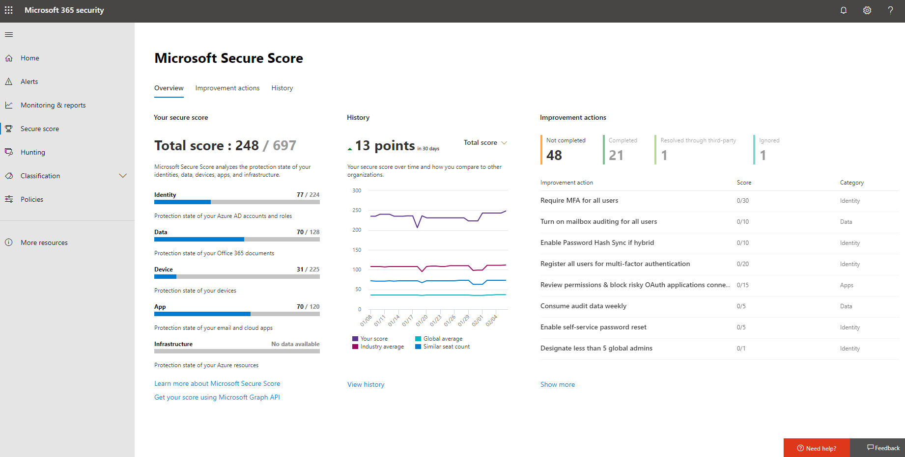

# Microsoft 安全分數

Microsoft 安全分數是具有較高的數字，表示所採取的多個改進動作的組織的安全性狀態，度量單位。 下列建議的安全分數可以防止潛在威脅組織。 從 Microsoft 365 安全性中心集中式儀表板，組織可以監視，並在其 Microsoft 365 身分識別、 資料、 app、 裝置和基礎結構的安全性上運作。

安全分數可幫助組織：

* 在組織的安全性狀態的目前狀態報告。
* 提供可測知性、 可見性、 指導以及控制項，以提高其安全性狀態。  
* 比較基準，並建立關鍵效能指標 (Kpi)。

組織存取的評量和趨勢，與其他 Microsoft 產品整合、 分數比較與類似的組織，以及執行更多功能強大的視覺效果。 分數也可反映協力廠商解決方案時解決建議的動作。

此外，您可以存取您的建議，以及分數透過[Microsoft Graph API](https://www.microsoft.com/security/partnerships/graph-security-api)。 了解[安全分數資源類型](https://go.microsoft.com/fwlink/?linkid=2092996)。

## 運作方式

您所設定的特定點建議的安全性功能，執行與安全性相關的工作 （例如檢視報表），或解決與協力廠商應用程式或軟體的改進巨集指令。 一些改進動作只提供點完全完成時，和某些授與部分點為單位，如果他們使用某些裝置或使用者完成。 安全性應取得平衡與可用性，並不是每個建議才能為您的環境。

您的分數會更新以反映視覺效果和改進動作頁面中所呈現的資訊的即時。 安全分數也每天同步處理以接收關於每個動作您達成點為單位的系統資料。

### 如何改進動作，就會獲得

二進位的方式，就會獲得最-如果您實作的改進巨集指令，如建立新的原則，或開啟的特定設定，您會收到的資料點的 100%。 其他改進的動作，點都指定的百分比的總組態。 例如，如果改進巨集指令會指出您取得 30 點保護您的所有使用者以多重要素驗證和您只需要 100 個受保護的總使用者 5，會提供您大約 2 點的部分分數 (受保護的 5 / 100 總 * 30 的最大點數 = 2 點數部分分數)。

### 安全分數中包含的產品

目前有 Office 365 （包括 SharePoint Online、 Exchange Online、 OneDrive for Business、 Microsoft 資訊保護和更多），建議 Azure AD，Intune 和 Cloud App Security。 建議的其他安全性產品，例如 Azure ATP 和 Microsoft Defender ATP 即將推出。 建議將涵蓋每個產品相關聯的所有受攻擊面，但它們是不錯的比較基準。 您也可以將標示改進動作為所涵蓋的協力廠商。

## 必要的權限

若要存取 Microsoft 安全分數的權限，您必須獲指派其中一個 Azure Active Directory 中的下列角色。

### 讀取和寫入角色

讀取與寫入權限，您可以進行的變更，並直接互動安全分數。 您也可以指派給其他使用者的唯讀權限。

* CompanyAdministrator
* SecurityAdministrator
* ExchangeAdmin
* SharePointAdmin

### 唯讀的角色

具有唯讀存取權，您不能編輯狀態] 或 [備忘稿改進巨集指令、 編輯分數區域，或編輯自訂比較。

* HelpdeskAdmin
* UserAccountAdmin
* ServiceSupportAdmin
* SecurityReader
* SecurityOperator
* GlobalReader

### Graph API

若要存取 Graph API，您需要有下列其中一個角色除了下列範圍：

* SecurityEvents.Read.All （適用於唯讀角色）
* SecurityEvents.ReadWrite.All (針對讀取和寫入角色)

## 取得您的安全性狀態的可視性

為了協助您更快速地需要的資訊，Microsoft 改進動作會組織成群組：

* 身分識別 （Azure AD 帳戶 & 角色與 Azure ATP 即將推出）
* 資料 (Microsoft Information Protection)
* 裝置 （Microsoft Defender ATP 裝置，即將推出）
* 應用程式 （電子郵件和雲端應用程式，包括 Office 365 和 Microsoft Cloud App Security）
* 基礎結構 （Azure 的資源）

在 [Microsoft 安全分數概觀] 頁面中，您可以看到點分割的方式這些群組與何種點可用之間。 [概觀] 頁面上也是以取得總分基準比較，與您安全分數的歷史趨勢的全面檢視的位置，並可以採取來改善您的分數的改進動作的優先順序。

*圖 1: Microsoft 安全分數概觀] 頁面上*

## 採取動作來改善您的分數

改進動作] 索引標籤列出的安全性建議該位址可能受攻擊面，以及其狀態 （完成、 沒有完成、 解析透過協力廠商，而且會略過）。 您可以搜尋、 篩選和群組改進的所有動作。

### 排名

排名根據由左到達成，實作困難，使用者的影響和複雜性的其餘點的數目。 最高排名的改進動作有大量的剩餘低困難、 使用者的影響，與複雜性的點。

### 動作

標示為 [不計分] 動作並不會追蹤由 Microsoft 安全分數。 您仍然可以採取的動作，但完成它們不會影響您的分數。 如果巨集指令會變成在未來追蹤由 Microsoft 安全分數，而且您已經完成它，您的安全分數會自動反映出變更。

當您選取特定的改進巨集指令時，會出現飛入]。 若要完成此動作，您有幾個選項：

1. 選取 [**檢視設定**回到 [設定] 畫面，並進行變更。 然後，您會取得的動作是值得，可見的飛出視窗頂端的點。點可能需要 24 小時的時間來更新。

2. 因為由協力廠商應用程式或軟體已處理過的改進巨集指令，請選取 [**解決透過協力廠商**]。 讓您安全分數更妥善地反映您的整體安全性狀態，您會獲得值得了巨集指令的點。 如果協力廠商不再涵蓋控制項，您可以將標示為未完成的改進巨集指令。 請記住，Microsoft 已不可見性是否分數需求已符合如果改進巨集指令會標示為透過協力廠商解決。

3. 因為您已決定要接受的風險，並不制訂的改進巨集指令，請選取 [**略過**]。 一旦您略過改進巨集指令，總數安全分數點就能得到會減少。 您可以檢視歷程記錄中的此巨集指令或復原在任何時間。

4. 因為改進巨集指令會要求您定期檢閱您的環境以取得，並保留點的一部分，請選取 [**檢閱**]。 例如，信箱轉寄規則應檢閱以確定資料尚未進行挾帶出去，從您的網路以每週為基礎。 您不需要進行任何變更，但需要要執行巨集指令。 若您定期檢閱規則時，您會收到資料點。 如果不是，減少分數。

 

*圖表 2 & 3： 改進巨集指令延伸顯示*

## 經過一段時間的監視器增強功能

您可以檢視圖表，貴組織的分數經過一段時間**歷程記錄**中的圖形下方] 索引標籤所採取的所選的時間範圍和其屬性，例如產生點及類別中的所有動作的清單。 您可以依類別自訂日期範圍與篩選器。

## 風險認知

Microsoft 安全分數是數字摘要根據系統設定、 使用者行為及其他安全性相關的度量值; 您安全性狀態。它不是絕對的度量單位的方式可能會破壞您的系統或資料。 相反地，它表示要採用的安全性控制 Microsoft 環境中可協助位移正在外洩的風險的程度。 沒有線上服務已完全免於安全性弱點，以及安全分數不應該解譯成保證郵件可以針對任何方式的安全性漏洞。

## 下來什麼？

若要讓 Microsoft 安全分數較佳的安全性狀態代表並改善可用性，我們會在不久的將來進行一些變更。 您的成績和最大可能分數會變更。 不過，這並不表示您的安全性狀態變更。

### 移除 「 不計分 」 和 「 檢閱 」 改進動作

之一的安全分數原則是分數應依照標準化預定且更容易與相關。 具有不是可以測量或可採取行動的改進動作具有已造成混淆。 一個 Microsoft 安全分數僅合理時的每個建議有清除影響分數。 不計分的改進動作不是可以測量的並檢閱動作不會測量為其他改進動作的同一個標準的改進。  

基於這些理由，將會暫時移除所有已不會被記錄或需要檢閱頻率的改進動作。 在您的組件上不需要採取任何動作。

### 簡化的點系統

若要跨多個體驗標準化點，每個安全分數改進巨集指令點總計會更新為 10 點值得或更少。 視需要在我們今天有的安全性控制和我們將在未來新增的探索寬口氣是更一致。 雖然這是重大變更，您會看到以點合計放置會有不會變更您的安全性狀態。  

### 預覽功能

預覽版本中，將會包含下列功能：

* 首席資訊安全長的所有新評量和趨勢檢視，而且會導致層級的討論區
* 追蹤及基準測試您的分數的新方法
* 更有效率的追蹤和監控分數衰退
* 篩選、 標記、 搜尋及群組改進動作
* 管理向您未來的目標，使用分數估算和計劃的動作
* 還有更多 ！

## 我們想要從您聽到

如果您有任何問題，請讓我們知道[安全性、 隱私權 & 合規性](https://techcommunity.microsoft.com/t5/Security-Privacy-Compliance/bd-p/security_privacy)社群中的張貼。 我們正在監視社群，並將提供的說明。
