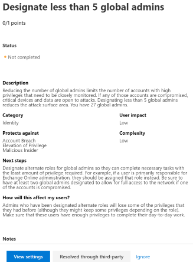

# Microsoft 安全分數Microsoft Secure Score

Microsoft Secure 得分是組織的安全性狀況度量，具有較高的數目，表示執行的改善動作越多。Microsoft Secure Score is a measurement of an organization's security posture, with a higher number indicating more improvement actions taken. 遵循安全性分數建議可保護您的組織免受威脅。Following the Security Score recommendations can protect your organization from threats. 透過 Microsoft 365 security center 中的集中式儀表板，組織可以監視及處理其 Microsoft 365 身分識別、資料、應用程式、裝置和基礎結構的安全性。From a centralized dashboard in the Microsoft 365 security center, organizations can monitor and work on the security of their Microsoft 365 identities, data, apps, devices, and infrastructure.

安全分數可協助組織：Secure Score helps organizations:

* 報告組織安全狀況的目前狀態。Report on the current state of the organization's security posture.
* 提供探索性、可見度、指導方針和控制，以提升安全性狀況。Improve their security posture by providing discoverability, visibility, guidance, and control.  
* 與基準進行比較，並建立關鍵效能指標（KPIs）。Compare with benchmarks and establish key performance indicators (KPIs).

組織可以存取穩定的衡量方式和趨勢、與其他 Microsoft 產品的整合、與類似組織的分數比較，以及更多。Organizations gain access to robust visualizations of metrics and trends, integration with other Microsoft products, score comparison with similar organizations, and much more. 分數也可以反映協力廠商的解決方案如何解決建議的動作。The score can also reflect when third-party solutions have addressed recommended actions.

此外，您可以透過[Microsoft GRAPH API](https://www.microsoft.com/security/partnerships/graph-security-api)來存取您的建議和評分。Additionally, you can access your recommendations and score through the [Microsoft Graph API](https://www.microsoft.com/security/partnerships/graph-security-api). 深入瞭解[安全分數資源類型](https://go.microsoft.com/fwlink/?linkid=2092996)。Learn about the [Secure Score resource type](https://go.microsoft.com/fwlink/?linkid=2092996).

## 運作方式How it works

您可以在設定建議的安全性功能、執行安全性相關工作（如查看報告），或使用協力廠商應用程式或軟體解決改進動作的情況下，取得點數。You are given points for configuring recommended security features, performing security-related tasks (such as viewing reports), or addressing the improvement action with a third-party application or software. 有些改進動作只會在完全完成時給予點，有些的動作會在某些裝置或使用者完成時提供部分分數。Some improvement actions only give points when fully completed, and some give partial points if they are completed for some devices or users.

不管授權為何，我們都會向您顯示一組完整的可能改進功能，讓您瞭解安全性的最佳作法，並提升您的分數。We show you the full set of possible improvements, regardless of license, so you can understand security best practices and improve your score. 您的絕對安全性狀態是以安全分數表示，不論貴組織擁有的產品授權為何都會保持不變。Your absolute security posture is represented by Secure Score, which stays the same no matter what product licenses your organization owns. 請記住，安全性應該與可用性進行平衡，而不是每個建議都適用于您的環境。Keep in mind that security should be balanced with usability, and not every recommendation can work for your environment.

您的分數會即時更新，以反映 [視覺化效果] 和 [改進動作] 頁面中顯示的資訊。Your score is updated in real time to reflect the information presented in the visualizations and improvement action pages. 安全分數也會每天同步處理每個動作的取得點數的系統資料。Secure Score also syncs daily to receive system data about your achieved points for each action.

### 如何計分改進動作How improvement actions are scored

大多數會以二進位方式計分：若您執行改進動作（如建立新原則或開啟特定設定），您會收到100% 的點數。Most are scored in a binary fashion — if you implement the improvement action, like create a new policy or turn on a specific setting, you get 100% of the points. 在其他改進動作中，點會指定為總設定的百分比。For other improvement actions, points are given as a percentage of the total configuration. 例如，如果改進的動作指出您使用多重要素驗證來保護所有使用者時取得30點，而且您只會保護 100 5% 以上的使用者，則會得到大約2點的部分分數（5個 protected/100 總計 \* 30 最大值 = 2 pt 部分分數）。For example, if the improvement action states you get 30 points by protecting all your users with multi-factor authentication and you only have 5 of 100 total users protected, you would be given a partial score of around 2 points (5 protected / 100 total \* 30 max pts = 2 pts partial score).

### 安全分數中包含的產品Products included in Secure Score

目前有一些建議包括 SharePoint Online、Exchange Online、商務 OneDrive、Microsoft 資訊保護等等）、Azure AD 和 Cloud App Security。Currently there are recommendations for including SharePoint Online, Exchange Online, OneDrive for Business, Microsoft Information Protection, and more), Azure AD, and Cloud App Security. 即將推出其他安全性產品（如 Azure ATP 和 Microsoft Defender ATP）的建議。Recommendations for other security products, like Azure ATP and Microsoft Defender ATP, are coming soon. 建議不會涵蓋與各項產品相關聯的所有攻擊面，但也是一個很好的基準。The recommendations will not cover all the attack surfaces associated with each product, but they are a good baseline. 您也可以將改進動作標示為協力廠商所涵蓋的範圍。You can also mark the improvement actions as covered by a third party.

## 必要的權限Required permissions

若要具有存取 Microsoft Secure 得分的許可權，您必須在 Azure Active Directory 中為下列其中一個角色指派。To have permission to access Microsoft Secure Score, you must be assigned one of the following roles in Azure Active Directory.

### 讀取和寫入角色Read and write roles

透過讀取和寫入權限，您可以進行變更，並直接與安全分數互動。With read and write access, you can make changes and directly interact with Secure Score. 您也可以將唯讀許可權指派給其他使用者。You can also assign read-only access to other users.

* 全域管理員Global administrator
* 安全性系統管理員Security administrator
* Exchange 系統管理員Exchange administrator
* SharePoint 系統管理員SharePoint administrator

### 唯讀角色Read-only roles

若具有唯讀許可權，您就無法編輯 [改進動作]、[編輯計分區域] 或 [編輯自訂比較] 的狀態或附注。With read-only access, you are not able to edit status or notes for an improvement action, edit score zones, or edit custom comparisons.

* 説明台管理員Helpdesk administrator
* 使用者管理員User administrator
* 服務管理員Service administrator
* 安全性讀取者Security reader
* 安全性操作員Security operator
* 全域讀取者Global reader

### 圖形 APIGraph API

若要存取 Graph API，除了 role 之外，您還必須具有下列其中一個範圍：To access the Graph API, you need to have one of the following scopes in addition to a role:

* SecurityEvents Read。 All （唯讀角色）SecurityEvents.Read.All (for read-only role)
* ReadWrite SecurityEvents （適用于讀取和寫入角色）SecurityEvents.ReadWrite.All (for read and write role)

## 深入瞭解您的安全性狀況Gain visibility into your security posture

為了協助您更快速地取得所需資訊，Microsoft 改進的動作會組織成群組：To help you the information you need more quickly, Microsoft improvement actions are organized into groups:

* Identity （Azure AD 帳戶 & 角色）Identity (Azure AD accounts & roles)
* 資料（Microsoft 資訊保護）Data  (Microsoft Information Protection)
* 裝置（現在沒有任何改進動作）Device (no improvement actions for now)
* 應用程式（電子郵件和雲端應用程式，包括 Office 365 和 Microsoft Cloud App Security）App (email and cloud apps, including Office 365 and Microsoft Cloud App Security)
* 基礎結構（現在沒有任何改進動作）Infrastructure (no improvement actions for now)

在 [Microsoft Secure 得分一覽] 頁面中，您可以看到各群組之間的點數如何分割，以及哪些點可供使用。In the Microsoft Secure Score overview page, you can see how points are split between these groups and what points are available. [一覽表] 頁面也是取得整體總分、您的安全分數與基準比較之歷史趨勢的完整視圖，以及可以採取以改善評分的優先改進動作的位置。The overview page is also the place to get an all-up view of the total score, historical trend of your secure score with benchmark comparisons, and prioritized improvement actions that can be taken to improve your score.

*圖1： Microsoft Secure 得分一覽頁面*
*Figure 1: Microsoft Secure Score overview page*

## 採取動作以提升您的分數Take action to improve your score

[改進動作] 索引標籤會列出解決可能攻擊面的安全性建議，及其狀態（已完成，尚未完成，已透過協力廠商解決，且被忽略）。The improvement actions tab lists the security recommendations that address possible attack surfaces, along with their status (completed, not completed, resolved through third party, and ignored). 您可以搜尋、篩選和群組所有的「改進」動作。You can search, filter, and group all the improvement actions.

### 排名Ranking

排名是根據剩下的剩餘點數、實施難度、使用者影響和複雜性而定。Ranking is based on the number of remaining points left to achieve, implementation difficulty, user impact, and complexity. 最高排名的「改進」動作具有很大的分數，但有低難度、使用者影響和複雜性。The highest ranked improvement actions have a large number of points remaining with low difficulty, user impact, and complexity.

### 動作Actions

標為 [未評分] 的動作不會由 Microsoft 安全分數追蹤。Actions labeled as [Not Scored] are not tracked by Microsoft Secure Score. 您仍然可以採取動作，但完成這些動作不會影響您的分數。You can still take action but completing them will not affect your score. 如果您未來的動作成為 Microsoft 安全得分，而且您已完成，您的安全分數會自動反映變更。If an action becomes tracked by Microsoft Secure Score in the future and you have already completed it, your secure score will automatically reflect the change.

當您選取特定的 [改進] 動作時，會出現 [飛出]。When you select a specific improvement action, a fly out appears. 若要完成此動作，您有幾個選項：To complete the action, you have a few options:

1. 選取 [**查看設定**] 以進入設定畫面，然後進行變更。Select **View settings** to go the configuration screen and make the change. 然後，您可以在飛出的最上方看到所要採取動作的點。最多可能需要24小時才能更新點數。You then gain the points that the action is worth, visible at the top of the fly out. Points may take up to 24 hours to update.

2. 選取 [**透過協力廠商解決**]，因為改進動作已經由協力廠商應用程式或軟體所定址。Select **Resolve through third party** because the improvement action has already been addressed by a third-party application or software. 您可以取得行動的價值，讓您的安全分數更好地反映整體的安全性狀況。You gain the points that the action is worth, so your secure score better reflects your overall security posture. 如果協力廠商不再涵蓋該控制項，您可以將 [改進] 動作標示為 [未完成]。If a third party no longer covers the control, you can mark the improvement action as not complete. 請記住，如果改進動作標示為透過協力廠商解決，則 Microsoft 無法查看是否符合評分需求。Keep in mind, Microsoft has no visibility into whether the score requirements have been met if the improvement action is marked as resolved through third party.

3. 選取 [**略**過]，因為您已決定接受風險，而不會制定「改進」動作。Select **Ignore** because you have decided to accept the risk and not enact the improvement action. 一旦您忽略 [改進] 動作，您可以達到的安全分數點總數即會減少。Once you ignore an improvement action, the total number of secure score points you can achieve is reduced. 您可以在歷史記錄中查看此動作，也可以隨時復原。You can view this action in history or undo it at any time.

*圖 2 & 3：改善動作 flyouts**Figures 2 & 3: Improvement action flyouts*

## 監視隨時間的改進Monitor improvements over time

您可以在 [**記錄**] 索引標籤中，在一段時間內，查看組織的分數圖表。在圖形下方會列出所選取時間範圍內所執行的所有動作，以及其屬性，例如結果點和類別。You can view a graph of your organization's score over time in the **History** tab. Below the graph is a list of all the actions taken in the selected time range and their attributes, such as resulting points and category. 您可以自訂日期範圍及依類別篩選。You can customize a date range and filter by category.

## 風險認知Risk awareness

Microsoft Secure 得分是根據系統設定、使用者行為和其他安全性相關度量的安全性狀態的數值摘要;這不是系統或資料被破壞的可能性的絕對度量。Microsoft Secure Score is a numerical summary of your security posture based on system configurations, user behavior and other security-related measurements; it is not an absolute measurement of how likely your system or data will be breached. 相反地，它代表您已在 Microsoft 環境中採用安全性控制的程度，可協助抵消遭破壞的風險。Rather, it represents the extent to which you have adopted security controls in your Microsoft environment which can help offset the risk of being breached. 沒有任何線上服務完全避免安全缺口，安全分數不得以任何方式轉譯為保證安全性破壞。No online service is completely immune from security breaches, and secure score should not be interpreted as a guarantee against security breach in any manner.

## 新功能What's new?

若要讓 Microsoft 安全評分為您安全性狀況的更好代表，我們進行了一些變更。To make Microsoft Secure Score a better representative of your security posture we have made some changes. 若要深入瞭解規劃的變更，請參閱[Microsoft Secure 得分中的內容？](microsoft-secure-score-whats-coming.md)To learn about planned changes, see [What's coming in Microsoft Secure Score?](microsoft-secure-score-whats-coming.md)

### 2020年4月21日April 21st 2020

#### 移除不符合可靠度量期望的改進動作，或不提供安全狀況的有用標記法Removing improvement actions that don't meet expectations for reliable measurement or don't provide a useful representation of security posture

為了確保 Microsoft 安全分數有意義，且每個改進動作都有意義且可靠，我們正在移除下列改進動作。To ensure that the Microsoft Secure Score is meaningful and that every improvement action is measurable and reliable, we are removing the following improvement actions.

- 將 IRM 保護套用至檔Apply IRM protections to documents
- 套用資料遺失防護原則Apply Data Loss Prevention policies

### 一月份-2020 年3月January - March 2020

#### 支援 Azure AD 改進動作的安全性預設值Supporting security defaults for Azure AD improvement actions

Microsoft Secure 得分會更新改進動作，以支援[AZURE AD 中的安全性預設值](https://docs.microsoft.com/azure/active-directory/fundamentals/concept-fundamentals-security-defaults)，如此可讓您的組織使用預先設定的常見攻擊安全性設定，以協助保護您的組織。Microsoft Secure Score will be updating improvement actions to support [security defaults in Azure AD](https://docs.microsoft.com/azure/active-directory/fundamentals/concept-fundamentals-security-defaults), which make it easier to help protect your organization with pre-configured security settings for common attacks.

這會影響下列改進動作：It will affect the following improvement actions:

- 確定所有使用者均可完成安全存取的多重要素驗證Ensure all users can complete multi-factor authentication for secure access
- 需要對管理角色進行 MFARequire MFA for administrative roles
- 啟用原則以封鎖舊版驗證Enable policy to block legacy authentication

#### 移除不符合可靠度量期望的改進動作，或沒有提供安全狀況的有用標記法Removed improvement actions that don't meet expectations for reliable measurement or don't provide a useful representation of security posture

為了確保 Microsoft 安全分數有意義，且每個改進動作都有意義且可靠，我們正在移除下列改進動作。To ensure that the Microsoft Secure Score is meaningful and that every improvement action is measurable and reliable, we are removing the following improvement actions.

- 將使用者檔儲存在商務 OneDrive 中Store user documents in OneDrive for Business
- 設定 Office 365 ATP 安全附件原則Set up Office 365 ATP Safe Attachment policies
- 設定 Office 365 安全連結以驗證 URLsSet up Office 365 Safe Links to verify URLs
- 不允許信箱委派Do not allow mailbox delegation
- 允許網站和檔的匿名來賓共用連結Allow anonymous guest sharing links for sites and docs
- 開啟 Cloud App Security 主控台Turn on Cloud App Security Console
- 設定外部共用連結的到期時間Configure expiration time for external sharing links
- 開啟審計資料記錄Turn on audit data recording
- 探索危險且不相容的陰影 IT 應用程式Discover risky and non-compliant shadow IT applications
- 檢查許可權 & 會封鎖連接至您環境的危險 OAuth 應用程式Review permissions & block risky OAuth applications connected to your environment
- 設定 SharePoint 線上文件庫的版本設定Set up versioning on SharePoint online document libraries
- 刪除/封鎖過去30天內未使用的帳戶Delete/block accounts not used in last 30 days
- 指定少於5個全域系統管理員Designate fewer than 5 global admins

#### 移除「未計分」的改進動作Removed "not scored" improvement actions

安全分數的原則之一是，分數應該是標準化的，且與的功能非常輕鬆。One of the principles of Secure Score is that the score should be standardized and easy to relate to. 具有不具可度量或具可操作性的改進動作已導致混淆。Having improvement actions that are not measurable or actionable has been causing confusion. 只有在每個建議都會對分數有明確影響時，Microsoft 安全評分才有意義。Microsoft Secure Score only makes sense when every recommendation can have a clear effect on the score. 不計分的改善動作不可度量。Not scored improvement actions are not measurable.  

基於這些原因，已移除所有未計分的改善動作。For these reasons, all improvement actions that were not scored have been removed. 您的元件不需要任何動作。No action is needed on your part.

#### 移除裝置改進動作Removed device improvement actions

評估 [改進動作] 的 Microsoft Secure 得分裝置類別之後，它決定這些動作目前評估原則狀態，而不是裝置的設定狀態。After an evaluation of the Microsoft Secure Score device category of improvement actions, it was determined that those actions currently assess the policy state and not the configuration state of devices. 因為設定會直接與安全性狀況相關聯，所以現有的裝置動作決定不完全代表組織狀況。Since configuration is directly tied to security posture, the existing device actions were determined to not fully represent organizational posture.  當我們運作時，將會移除裝置類別中目前的動作，以提供一組建議，以直接使用診斷資料，以更完整地代表裝置安全狀況。We will be removing the current actions in the device category as we work to provide a set of recommendations which directly use diagnostic data to more fully represent device security posture.

已移除下列改進動作：The following improvement actions have been removed:

- 啟用 Microsoft Intune 行動裝置管理Enable Microsoft Intune Mobile Device Management
- 建立適用于 Android 的 Microsoft Intune 符合性原則Create a Microsoft Intune Compliance Policy for Android
- 建立適用于 Android 的 Microsoft Intune 符合性原則Create a Microsoft Intune Compliance Policy for Android for Work
- 建立適用于 Android 的 Microsoft Intune 應用程式保護原則Create a Microsoft Intune App Protection Policy for Android
- 為 iOS 建立 Microsoft Intune 應用程式保護原則Create a Microsoft Intune App Protection Policy for iOS
- 標示未指派為不相容的 Microsoft Intune 符合性原則的裝置Mark devices with no Microsoft Intune Compliance Policy assigned as not compliant
- 為 iOS 建立 Microsoft Intune 符合性原則Create a Microsoft Intune Compliance Policy for iOS
- 為 macOS 建立 Microsoft Intune 符合性原則Create a Microsoft Intune Compliance Policy for macOS
- 建立適用于 Windows 的 Microsoft Intune 符合性原則Create a Microsoft Intune Compliance Policy for Windows
- 建立適用于 Android 的 Microsoft Intune 設定檔Create a Microsoft Intune Configuration Profile for Android
- 建立適用于 Android 的 Microsoft Intune 設定檔Create a Microsoft Intune Configuration Profile for Android for Work
- 為 macOS 建立 Microsoft Intune 設定檔Create a Microsoft Intune Configuration Profile for macOS
- 為 iOS 建立 Microsoft Intune 設定檔Create a Microsoft Intune Configuration Profile for iOS
- 建立 Windows 的 Microsoft Intune 設定檔Create a Microsoft Intune Configuration Profile for Windows
- 在 Microsoft Intune 中啟用增強型 jailbreak 偵測Enable enhanced jailbreak detection in Microsoft Intune
- 需要修補所有裝置，並已啟用防病毒及防火牆Require all devices to be patched, have anti-virus, and firewalls enabled
- 啟用 Windows Defender ATP 整合至 Microsoft IntuneEnable Windows Defender ATP integration into Microsoft Intune
- 建立 Microsoft Intune Windows 資訊保護原則Create a Microsoft Intune Windows Information Protection Policy
- 要求所有裝置都具有高級安全性設定Require all devices to have advanced security configurations
- 每週複查封鎖的裝置報告Review blocked devices report weekly

#### MFA 改進動作更新MFA improvement action updates

為了反映公司在套用與業務搭配運作的原則時，是否需要確保 upmost 安全性，Microsoft 安全分數已移除三個改進動作（圍繞多重要素驗證），並新增兩個動作。To reflect the need for businesses to ensure the upmost security while applying policies that work with their business, Microsoft Secure Score has removed three improvement actions centered around multi-factor authentication, and added two.

已移除改進動作：Removed improvement actions:

- 為多重要素驗證註冊所有使用者Register all users for multi-factor authentication
- 需要對所有使用者進行 MFARequire MFA for all users
- Azure AD 特權角色需要 MFARequire MFA for Azure AD privileged roles

新增改進動作：Added improvement actions:

- 確定所有使用者均可完成安全存取的多重要素驗證Ensure all users can complete multi-factor authentication for secure access
- 需要對管理角色進行 MFARequire MFA for administrative roles

 這些新的改進動作需要在您的目錄上登錄使用者或系統管理員以進行多重要素驗證（MFA），並建立符合組織需求的適當原則集合。These new improvement actions require registering your users or admins for multi-factor authentication (MFA) across your directory and establishing the right set of policies that fit your organizational needs. 主要目標具有彈性，可確保所有使用者和系統管理員都能使用多個因素或以風險為基礎的身分識別驗證提示進行驗證。The main goal is have flexibility while ensuring all your users and admins can authenticate with multiple factors or risk-based identity verification prompts. 這可以採取多種原則套用範圍決策，或設定安全性預設值（即將推出3月16日），讓 Microsoft 決定何時對使用者進行 MFA 的質詢。That can take the form of having multiple policies that apply scoped decisions, or setting security defaults (coming March 16th) that let Microsoft decide when to challenge users for MFA.

#### 已移除「複查」改進動作Removed "review" improvement actions

安全分數的原則之一是，分數應該是標準化的，且與的功能非常輕鬆。One of the principles of Secure Score is that the score should be standardized and easy to relate to. 具有不具可度量或具可操作性的改進動作已導致混淆。Having improvement actions that are not measurable or actionable has been causing confusion. 只有在每個建議都會對分數有明確影響時，其中一個 Microsoft 安全評分才有意義。One Microsoft Secure Score only makes sense when every recommendation can have a clear effect on the score. 「審閱改進」動作與其他 [改進動作] 的標準不是度量。Review improvement actions are not measured to the same standard as other improvement actions.  

基於這些原因，所有需要審閱節奏的改進動作都會暫時移除。For these reasons, all improvement actions that required a review cadence have been temporarily removed. 您的元件不需要任何動作。No action is needed on your part.

### 預覽功能Preview features

[預覽版本](microsoft-secure-score-preview.md)中會包含下列功能：The following features will be included in the [preview release](microsoft-secure-score-preview.md):

* CISO 和潛在客戶層級討論的所有新的計量和趨勢視圖All new metrics and trends views for CISO and lead level discussions
* 追蹤和基準成績的新方法New ways to track and benchmark your score
* 更好地追蹤和監控分數回歸Better tracking and monitoring for score regressions
* 篩選、標記、搜尋及群組您的改善動作Filter, tag, search, and group your improvement actions
* 使用分數預測和規劃的動作來管理您的未來目標Manage towards your future goals using score projections and planned actions
* 簡化點數系統Simplification of the points system
* 還有更多！And more!

## 我們想要聽到您的來信We want to hear from you

如果您有任何問題，請在[安全性、隱私權 & 合規性](https://techcommunity.microsoft.com/t5/Security-Privacy-Compliance/bd-p/security_privacy)社區中公佈，以告知我們。If you have any issues, please let us know by posting in the [Security, Privacy & Compliance](https://techcommunity.microsoft.com/t5/Security-Privacy-Compliance/bd-p/security_privacy) community. 我們正在監視社區，並會提供協助。We're monitoring the community and will provide help.
