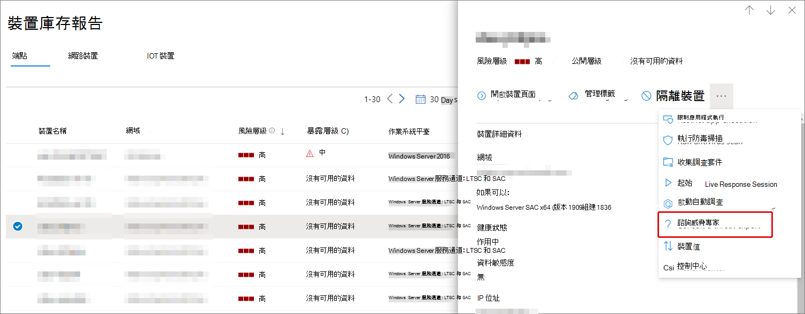

# Microsoft 365 概覽中的 Microsoft 威脅專家Microsoft Threat Experts in Microsoft 365 overview

[!INCLUDE [Microsoft 365 Defender rebranding](../includes/microsoft-defender.md)]

**適用於：****Applies to:**

- [Microsoft 365 DefenderMicrosoft 365 Defender](https://go.microsoft.com/fwlink/?linkid=2118804)
- [適用於端點的 Microsoft DefenderMicrosoft Defender for Endpoint](https://go.microsoft.com/fwlink/p/?linkid=2154037)

[!INCLUDE [Prerelease](../includes/prerelease.md)]

Microsoft 威脅專家目標攻擊通知是受管理的威脅搜尋服務。Microsoft Threat Experts - Targeted Attack Notifications is a managed threat hunting service. 一旦您套用並接受，您將會收到來自 Microsoft 威脅專家的目標攻擊通知，所以您不會錯過環境面臨的重大威脅。Once you apply and are accepted, you'll receive targeted attack notifications from Microsoft threat experts, so you won't miss critical threats to your environment. 這些通知可協助您保護組織的端點、電子郵件和身分識別。These notifications will help you protect your organization's endpoints, email, and identities.
Microsoft 威脅專家–依需求的專家可讓您取得組織面臨之威脅的專家建議。Microsoft Threat Experts – Experts on Demand lets you get expert advice about threats your organization is facing. 您可以取得組織面臨之威脅的相關協助。You can reach out for help on threats your organization is facing. 它可以做為訂閱服務。It's available as a subscription service.

## 適用于 Microsoft 威脅專家–目標的攻擊通知Apply for Microsoft Threat Experts – Targeted Attack Notifications

> [!IMPORTANT]
> 在您套用之前，請務必與您的 Microsoft 技術服務提供者及客戶團隊討論 Microsoft 威脅專家目標攻擊通知的資格需求。Before you apply, make sure to discuss the eligibility requirements for Microsoft Threat Experts – Targeted Attack Notifications  with your Microsoft Technical Service provider and account team.

如果您已有 Microsoft defender for Endpoint 和 Microsoft 365 defender，您可以透過其 Microsoft 365 Defender 入口網站來套用 Microsoft 威脅專家目標攻擊通知。If you already have Microsoft Defender for Endpoint and Microsoft 365 Defender, you can apply for Microsoft Threat Experts – Targeted Attack Notifications through their Microsoft 365 Defender portal. 移至 **設定 > 端點 > 一般 > 高級功能 > Microsoft 威脅專家的目標攻擊通知**，並選取 **Apply**。Go to **Settings > Endpoints > General > Advanced features > Microsoft Threat Experts – Targeted Attack Notifications**, and select **Apply**. 如需詳細描述，請參閱[設定 Microsoft 威脅專家功能](./configure-microsoft-threat-experts.md)。See [Configure Microsoft Threat Experts capabilities](./configure-microsoft-threat-experts.md) for a full description.

當您的應用程式得到核准後，每當威脅專家偵測到您的環境威脅時，您就會開始接收已設定目標的攻擊通知。Once your application is approved, you'll start receiving targeted attack notifications whenever Threat Experts detect a threat to your environment.

## 訂閱 Microsoft 威脅專家-依需求的專家Subscribe to Microsoft Threat Experts - Experts on Demand

請與您的 Microsoft 代表聯繫，以根據需要訂閱專家。Contact your Microsoft representative to subscribe to Experts on Demand.  請參閱設定完整詳細資料的[Microsoft 威脅專家功能](./configure-microsoft-threat-experts.md)。See [Configure Microsoft Threat Experts capabilities](./configure-microsoft-threat-experts.md) for full details.

## 接收目標攻擊通知Receive targeted attack notification

Microsoft 威脅專家的目標攻擊通知功能可為您的網路最重要的威脅提供主動的搜尋。The Microsoft Threat Experts – Targeted Attack Notification capability provides proactive hunting for the most important threats to your network. 我們的威脅專家會搜尋人體敵人入侵、鍵盤攻擊和高級攻擊（如 cyberespionage）。Our threat experts hunt for human adversary intrusions, hands-on-keyboard attacks, and advanced attacks, such as cyberespionage. 這些通知會顯示為新的警示。These notifications will show up as a new alert. 受管理的搜尋服務包括：The managed hunting service includes:

- 威脅監控和分析，縮短停留時間和您的業務風險Threat monitoring and analysis, reducing dwell time and the risk to your business
- Hunter-訓練有素的人工情報，以探索及同時瞄準已知的攻擊和新興威脅Hunter-trained artificial intelligence to discover and target both known attacks and emerging threats
- 識別最相關的風險，以協助 SOCs 最大化其效能Identification of the most pertinent risks, helping SOCs maximize their effectiveness
- 協助範圍受到影響，並提供盡可能快速傳遞的內容，以啟用 swift SOC 回應。Help scoping compromises and providing as much context as can be quickly delivered to enable a swift SOC response.

## 在需要時與專家共同作業Collaborate with experts on demand

您也可以直接與 Microsoft 威脅專家聯繫 Microsoft 365 的安全性入口網站，以取得 swift 且準確的威脅回應。You can also contact Microsoft threat experts from directly inside the Microsoft 365 security portal, for a swift and accurate threat response.  專家可提供深入瞭解您的組織可能面臨的複雜威脅。Experts can provide insight to better understand the complex threats your organization may face.  諮詢專家以：Consult an expert to:

- 收集有關警示和事件的其他資訊，包括根本原因及範圍Gather additional information on alerts and incidents, including root causes and scope
- 在面臨的可疑裝置、警示或事件中取得清晰性，並在面臨高級攻擊者的情況下進行後續步驟Gain clarity into suspicious devices, alerts, or incidents and get next steps if faced with an advanced attacker
- 決定與威脅演員、活動或新興攻擊者技術相關的風險和可用保護Determine risks and available protections related to threat actors, campaigns, or emerging attacker techniques

您可以在整個入口網站中的數個地方取得 **威脅專家** 的選項：The option to **Consult a threat expert** is available in several places throughout the portal:

- <i>**裝置頁面動作功能表**</i><i>**Device page actions menu**</i> 

- <i>**裝置庫存頁面彈出功能表**</i><i>**Device inventory page flyout menu**</i> 

- <i>**提醒頁面彈出功能表**</i><i>**Alerts page flyout menu**</i> 

- <i>**事件頁面動作功能表**</i><i>**Incidents page actions menu**</i> 
![[事件] 頁面上 MTE-EOD 功能表選項的螢幕擷取畫面](../../media/mte/incidents-action-mte-highlighted.png)

- <i>**事件庫存頁面**</i><i>**Incidents inventory page**</i> 
![[事件庫存] 頁面上 MTE-EOD 功能表選項的螢幕擷取畫面](../../media/mte/incidents-inventory-mte-highlighted.png)

> [!NOTE]
> 如果您已將 Premier Support 訂閱對應至您的 microsoft Defender Office 365 授權，您可以透過 Microsoft Services Hub 追蹤您的專家在需求案例中的狀態。If you have Premier Support subscription mapped to your Microsoft Defender for Office 365 license, you can track the status of your Experts on Demand cases through Microsoft Services Hub.

觀賞這段影片，以快速流覽 Microsoft Services 中樞。Watch this video for a quick overview of the Microsoft Services Hub.

> [!VIDEO https://www.microsoft.com/videoplayer/embed/RE4pk9f]

## 另請參閱See also

- [設定 Microsoft 威脅專家功能Configure Microsoft Threat Experts capabilities](./configure-microsoft-threat-experts.md)
