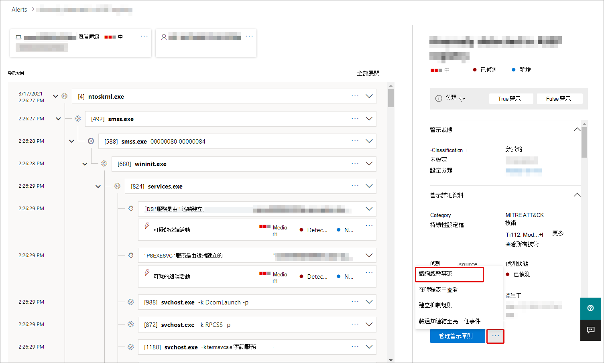

# Microsoft 365 中的 microsoft 威脅專家概述

[!INCLUDE [Microsoft 365 Defender rebranding](../includes/microsoft-defender.md)]

**適用於：**

- [Microsoft 365 Defender](https://go.microsoft.com/fwlink/?linkid=2118804)
- [適用於端點的 Microsoft Defender](https://go.microsoft.com/fwlink/p/?linkid=2146631)

[!INCLUDE [Prerelease](../includes/prerelease.md)]

Microsoft 威脅專家對目標的攻擊通知是受管理的威脅搜尋服務。 一旦您套用並接受，您將會收到來自 Microsoft 威脅專家的目標攻擊通知，所以您不會錯過環境面臨的重大威脅。 這些通知可協助您保護組織的端點、電子郵件和身分識別。
Microsoft 威脅專家-點播的專家可讓您取得組織面臨之威脅的專家建議。 您可以取得組織面臨之威脅的相關協助。 它可以做為訂閱服務。

## 適用于 Microsoft 威脅專家–目標攻擊通知

> [!IMPORTANT]
> 在您套用之前，請務必與您的 Microsoft 技術服務提供者及客戶團隊討論 Microsoft 威脅專家的資格需求–目標攻擊通知。

如果您已有 Microsoft Defender for Endpoint 和 Microsoft 365 Defender，您可以套用 microsoft 威脅專家–透過其 Microsoft 365 Defender 入口網站的目標攻擊通知。 移至 **[設定] > 端點 > 一般 > 高級功能 > Microsoft 威脅專家–目標攻擊通知**，並選取 **Apply**。 如需完整說明，請參閱 [設定 Microsoft 威脅專家功能](./configure-microsoft-threat-experts.md) 。

當您的應用程式得到核准後，每當威脅專家偵測到您的環境威脅時，您就會開始接收已設定目標的攻擊通知。

## 訂閱 Microsoft 威脅專家-點播的專家

請與您的 Microsoft 代表聯繫，以根據需要訂閱專家。  如需完整詳細資料，請參閱 [設定 Microsoft 威脅專家功能](./configure-microsoft-threat-experts.md) 。

## 接收目標攻擊通知

Microsoft 威脅專家–目標攻擊通知功能可為您的網路最重要的威脅提供主動的搜尋。 我們的威脅專家會搜尋人體敵人入侵、鍵盤攻擊和高級攻擊（如 cyberespionage）。 這些通知會顯示為新的警示。 受管理的搜尋服務包括：

- 威脅監控和分析，縮短停留時間和您的業務風險
- Hunter-訓練有素的人工情報，以探索及同時瞄準已知的攻擊和新興威脅
- 識別最相關的風險，以協助 SOCs 最大化其效能
- 協助範圍受到影響，並提供盡可能快速傳遞的內容，以啟用 swift SOC 回應。

## 在需要時與專家共同作業

您也可以直接在 Microsoft 365 安全性入口網站中與 Microsoft 威脅專家聯繫，以取得快速且準確的威脅回應。  專家可提供深入瞭解您的組織可能面臨的複雜威脅。  諮詢專家以：

- 收集有關警示和事件的其他資訊，包括根本原因及範圍
- 在面臨的可疑裝置、警示或事件中取得清晰性，並在面臨高級攻擊者的情況下進行後續步驟
- 決定與威脅演員、活動或新興攻擊者技術相關的風險和可用保護

您可以在整個入口網站中的數個地方取得 **威脅專家** 的選項：

- <i>**裝置頁面動作功能表**</i> 

- <i>**裝置庫存頁面彈出功能表**</i> 

- <i>**提醒頁面彈出功能表**</i> 

- <i>**事件頁面動作功能表**</i> 
![[事件] 頁面上 MTE-EOD 功能表選項的螢幕擷取畫面](../../media/mte/incidents-action-mte-highlighted.png)

- <i>**事件庫存頁面**</i> 
![[事件庫存] 頁面上 MTE-EOD 功能表選項的螢幕擷取畫面](../../media/mte/incidents-inventory-mte-highlighted.png)

> [!NOTE]
> 如果您已將 Premier Support 訂閱對應至您的 Microsoft Defender for Office 365 授權，您可以透過 Microsoft Services Hub 追蹤您的專家在需求案例中的狀態。

觀賞這段影片，以快速流覽 Microsoft Services 中樞。

> [!VIDEO https://www.microsoft.com/videoplayer/embed/RE4pk9f]

## 另請參閱

- [設定 Microsoft 威脅專家功能](./configure-microsoft-threat-experts.md)
