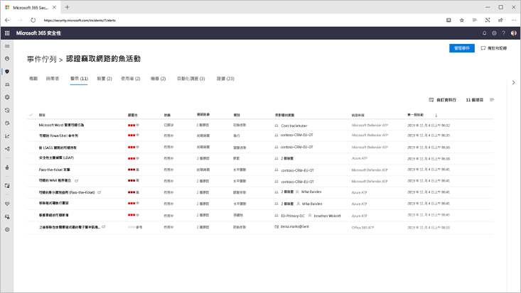
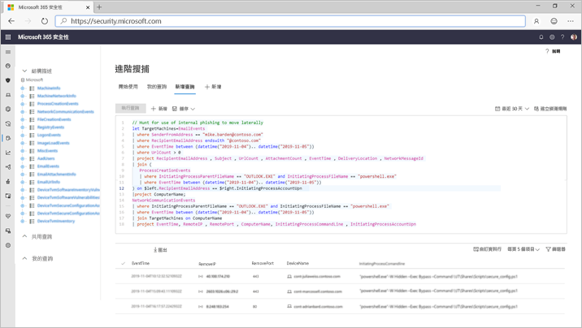

# Microsoft 威脅防護

適用於：****
- Microsoft 威脅防護

[!INCLUDE [Prerelease information](../includes/prerelease.md)]

Microsoft 威脅防護是整合的預先和文章外洩企業國防版套件的原生整合跨端點、 身分識別、 電子郵件和應用程式，以偵測、 防止、 調查及自動回應縝密的攻擊。  

整合的 Microsoft 威脅防護解決方案，與安全性專業人員可以鏡頭組合在同威脅訊號每項產品接收，並判斷的完整範圍和威脅; 的影響如何輸入它的環境，它是什麼影響，且會它如何目前會影響組織。 Microsoft 威脅防護會採用自動巨集指令，防止或停止攻擊和 self-heal 受影響信箱、 端點及使用者身分識別。  

Microsoft 威脅防護套件會保護： 
- **端點 Microsoft Defender ATP 與**Microsoft Defender ATP 是為預防性的保護、 後的資料外洩偵測、 自動化的調查及回應的統一的端點平台。 
- **電子郵件和 Office 365 ATP 與共同作業**-Office 365 ATP 會保護您的組織抵禦惡意電子郵件、 連結 (Url) 及共同作業工具所造成的威脅。 
- **身分識別與 Azure ATP 和 Azure AD Identity Protection** Azure ATP 會使用 Active Directory 訊號，來識別、 偵測及調查進階的威脅、 遭入侵的身分識別，並導入在貴組織的惡意測試人員動作。 
- **使用 Microsoft Cloud App security 的應用程式**-Microsoft 雲端 App 安全性是帶深層可見性、 強式資料控制項及增強的威脅保護您的雲端應用程式來完整跨 SaaS 解決方案。 

Microsoft 威脅防護的唯一的跨產品層加強個別的套件元件：
- 協助防範攻擊，並防禦回應協調透過訊號共用和自動化的動作的套件
- 跨產品提醒、 行為及內容安全性小組旁白攻擊的完整本文藉由加入提醒、 可疑事件及受影響的資產 '事件' 上的資料
- 自動化回應所觸發自我修復受影響的資產，透過自動化修復的危害
- 啟用安全性小組合作，跨端點和 Office 資料執行詳細且有效威脅狩獵

![事件概觀] 頁面的影像](../images/overview-incident.png)  
跨產品事件 （概觀）

 
所有相關提醒的相互關聯一起成單一事件 （[提醒] 檢視） 套件產品

 
查詢型電子郵件和端點的未經處理資料搜尋

Microsoft 威脅防護跨產品功能包括： 
- **派對杯的跨產品單一窗格**-管理中心檢視所有資訊偵測，受影響的資產，都自動採取行動，和相關的單一佇列中的辨識項和[security.microsoft.com](https://security.microsoft.com)中的單一窗格。 
- **組合事件佇列**-為了安全專業人員著重於什麼是藉由確保完整攻擊範圍，嚴重影響資產和自動化的修復動作是群組在一起，並且及時呈現。 
- **威脅的自動回覆**嚴重威脅資訊以協助停止的攻擊進展 Microsoft Threat Protection 產品之間的即時共用。 例如，如果由 Microsoft Defender ATP 保護端點上偵測到惡意檔案時，它會指示 Office 365 ATP 掃描，並從所有電子郵件訊息中移除檔案。 封鎖的檔案將會是上目視整個 Microsoft 365 安全性套件。
- **自我修復的危害的裝置、 使用者身分識別和信箱**-Microsoft 威脅保護使用 AI 提供自動的動作，並以修復受影響的資產 playbooks 回到安全的狀態。 請儘可能，會自動修復 Microsoft 威脅保護利用自動修復功能套件產品以確保所有受影響的資產相關事件。
- **跨產品威脅狩獵**-安全性小組可以利用其組織的唯一知識，可以建立自己自訂的查詢，透過各種保護產品所收集的未經處理資料搜尋的危害。 Microsoft 威脅防護提供查詢為基礎的歷史原始的訊號和警示資料 30 天存取跨端點和 Office 365 ATP 資料。 

<h2>Microsoft 威脅防護服務
</h2>
<table><tr><td>
<b><a href="https://docs.microsoft.com/windows/security/threat-protection/microsoft-defender-atp/microsoft-defender-advanced-threat-protection"><b>Microsoft Defender 進階威脅防護</b>
</a></td>
<td>
<b><a href="https://docs.microsoft.com/office365/securitycompliance/office-365-atp"><b>Office 365 進階的威脅防護</b>
</a></td>
<td>
<b><a href="https://docs.microsoft.com/azure-advanced-threat-protection/"><b>Azure 的進階的威脅防護</b></a>
</td>
<td>
<b><a href="https://docs.microsoft.com/cloud-app-security/"><b>Microsoft Cloud App Security</b></a>
</td>
</tr>
</table>
 

## 開始使用
擁有 Microsoft 365 E5 或同等授權的客戶可以使用 Microsoft 威脅防護。 若要開始，請啟用[security.microsoft.com](https://security.microsoft.com)在 Microsoft 365 安全性中心中的服務。 如需詳細資訊，請閱讀：
- [授權需求](prerequisites.md#licensing-requirements)
- [開啟 Microsoft 威脅防護](mtp-enable.md)
