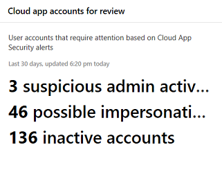

# Microsoft 365 security center 中的應用程式監視與報告

這些報告可進一步深入瞭解您組織中的雲端應用程式使用方式，包括哪些類型的應用程式、其風險層級及警示。

## 監視有風險的電子郵件帳戶

**電子郵件保護**顯示電子郵件帳戶面臨危險。 您可以按一下帳戶，以在 Microsoft Defender Security Center 中進一步調查。

## 監視使用者所授與的應用程式許可權

**Cloud App security-OAuth app**列出已由使用者授與許可權的 Cloud App Security 所探索的應用程式。 Cloud App Security 的風險目錄包含16000個應用程式，使用超過70的風險因素進行評估。

風險因素是從一般資訊（例如，應用程式發行者）開始，指向安全性措施和控制項，例如應用程式是否支援在靜止加密或提供使用者活動的審計記錄。

## 監視 cloud app 使用者帳戶

**雲端應用程式帳戶以供審查**清單可能需要注意的帳戶。

## 瞭解使用的雲端應用程式

「已**探索的雲端應用程式（類別）** 」顯示您的組織中使用的應用程式類型，以及 Cloud App Security 中的雲端探索儀表板連結。 如需詳細資訊，請參閱[快速入門：使用已探索的應用程式](https://docs.microsoft.com/cloud-app-security/discovered-apps)。  

## 監視使用者存取雲端 app 的位置

**雲端應用程式活動位置**顯示使用者存取雲端 app 的位置。

## 監視基礎結構工作負載的健康情況

**基礎結構健康情況**會顯示 Azure Security Center 中基礎結構工作負載的健康狀態警示。

Azure 安全性中心可提供跨內部部署和雲端工作負載的整合安全性管理和高級威脅防護。 您可以收集、搜尋及分析各種來源的安全性資料，包括防火牆和其他合作夥伴解決方案。

如需詳細資訊，請參閱[Azure Security Center 檔](https://docs.microsoft.com/azure/security-center/)。

