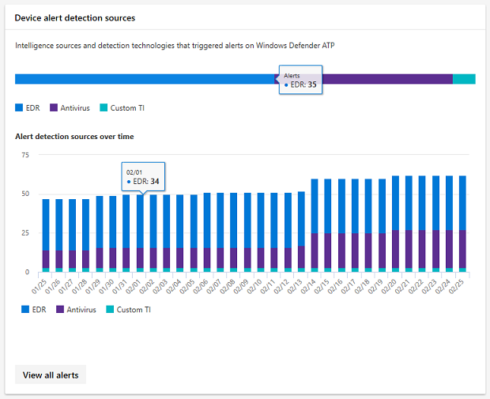

# <a name="device-monitoring-and-reporting-in-the-microsoft-365-security-center"></a>Microsoft 365 security center 中的裝置監控與報告

在 Microsoft 365 的安全性中心，讓您的裝置具有安全、最新和潛在的潛在威脅。

## <a name="view-device-alerts"></a>View device alerts

從 Microsoft Defender ATP 取得裝置上的侵犯行為和其他威脅的最新警示（適用于 E5 授權）。 Microsoft 365 的安全性中心會使用您偏好的工作流程，以較高的層次來監視這些警示。

### <a name="monitor-high-impact-alerts"></a>監視高影響警示

每個 Microsoft Defender ATP 警示都有對應的嚴重性（高、中、低或資訊），指出其對您的網路的潛在影響（如果您無法自行進行）。  

使用**裝置警示嚴重性**卡片，特別針對較嚴重的提醒，而且可能需要立即回應。 您可以從這張卡片中查看 Microsoft Defender 安全中心入口網站的詳細資訊。


### <a name="understand-sources-of-alerts"></a>瞭解警示來源

Microsoft Defender ATP 利用各種安全性感應器和智慧來源中的資料來產生警示。 例如，它可以使用來自 Windows Defender 防病毒和協力廠商反惡意軟體的偵測資訊，以及您自己的自訂威脅情報（透過 web 服務 API 提供）。

**裝置警示偵測**"來源卡] 顯示依來源散佈的報警。 這張卡片可協助您追蹤與特定來源相關的活動，尤其是自訂來源。 您也可以使用此功能，專注于來自未設定為自動封鎖惡意活動或元件的感應器的警示。



您可以從這張卡片中查看 Microsoft Defender 安全中心入口網站的詳細資訊。

### <a name="understand-the-types-of-threats-that-trigger-alerts"></a>瞭解觸發警示的威脅類型

Microsoft Defender ATP 會將每個警示排序為代表攻擊鏈中某一階段或威脅元件類型的類別。 例如，偵測到的威脅活動可能會分類為「橫向移動」，以指出嘗試到達網路上的其他裝置。 攻擊者取得初始 foothold 後，也可能會發生該活動。 當偵測到威脅元件時，可能會廣泛歸類為惡意程式碼，或更特別是間諜軟體、認證偷竊或其他類型的惡意或不需要的軟體。

**裝置威脅類別**卡片顯示這些類別的警示散佈。 您可以使用此資訊來識別威脅行為（例如認證盜竊企圖）相對於社交工程嘗試的影響是否較高。 您也可以使用此資訊來監視與勒索軟體類似的潛在破壞性威脅。


### <a name="monitor-active-alerts"></a>監視主動警示

**裝置警示狀態**卡片會指出尚未解決而且可能需要注意的警示數目。 您可以從這張卡片中查看 Microsoft Defender 安全中心入口網站的詳細資訊。


### <a name="monitor-classification-of-resolved-alerts"></a>監視已解析之警示的分類

當您解決 Microsoft Defender ATP 警示時，您的安全性人員可以指定警示是否已驗證為：

* 可識別實際違規活動或威脅元件的真正警示
* 偵測到正常活動的錯誤警示

**裝置警示分類**卡會顯示您已解決的警示是否已分類為 true 或 false 警示。 您可以從這張卡片中查看 Microsoft Defender 安全中心入口網站的詳細資訊。

附注：在某些情況下，無法使用特定警示的分類資訊。


### <a name="monitor-determination-of-resolved-alerts"></a>監視已解決之警示的決定

除了分類決策過程中的警示是否為 true 或 false 之外，您的安全性人員可提供判斷，指出在驗證提醒時所找到的一般或惡意活動類型。

**裝置警示決定**卡片顯示針對每個警示所提供的決定。

* **APT**： advanced persistent 威脅，表示偵測到的活動或威脅元件屬於複雜的破壞性之一，其設計目的是在受影響的網路中取得 foothold  
* **惡意**代碼：惡意檔或程式碼
* **安全性人員**：安全性人員所執行的一般活動
* **安全性測試**：設計用來模擬實際威脅的活動或元件，以及預期觸發安全性感應器及產生警示
* 不**需要的軟體**：不會被視為惡意的應用程式和其他軟體，但也違反原則或可接受的使用標準
* **其他**：不屬於所提供類型的任何其他決定

您可以從此卡片中查看 Microsoft Defender Security Center 中的詳細資訊。


### <a name="understand-which-devices-are-at-risk"></a>瞭解哪些裝置面臨危險

**裝置保護**顯示裝置的風險層級。 風險層級是以裝置的警示類型和嚴重性等因素為基礎。


## <a name="monitor-and-report-status-of-intune-managed-devices"></a>監視及報告 Intune 管理裝置的狀態

下列報告包含在 Intune 中註冊裝置的資料。 不包含 unenrolled 裝置中的資料。 只有全域系統管理員可以查看這些卡片。

Intune 註冊的裝置資料包括：

* 裝置合規性
* 具有主動惡意程式碼的裝置
* 裝置上的惡意程式碼類型
* 裝置上的惡意程式碼
* 具有惡意程式碼偵測的裝置
* 具有惡意程式碼偵測的使用者

### <a name="monitor-device-compliance"></a>監視裝置合規性

**裝置合規性**顯示在 Intune 中註冊的裝置數目遵循設定原則。


### <a name="discover-devices-with-malware-detections"></a>探索惡意程式碼偵測裝置

**裝置惡意**代碼偵測提供 Intune 註冊裝置的數目，其中包含尚未完全解決的惡意程式碼。 這可能是因為擱置的動作、重新開機、完整掃描、手動使用者動作，或修復動作未順利完成。


### <a name="understand-the-types-of-malware-detected"></a>瞭解偵測到的惡意程式碼類型

**裝置上的惡意程式碼類型**顯示在已登記 Intune 之裝置上偵測到的不同類型惡意程式碼。 您可以在 Microsoft 365 的安全性中心調查每一種類型。


### <a name="understand-the-specific-malware-detected-on-your-devices"></a>瞭解裝置上偵測到的特定惡意程式碼

**裝置上的惡意**代碼會提供裝置上偵測到的特定惡意軟體清單。


### <a name="understand-which-devices-have-the-most-malware"></a>瞭解哪些裝置具有最多惡意程式碼

**含惡意軟體**偵測的裝置會顯示哪些裝置具有最多惡意程式碼偵測。 在 Microsoft 365 的安全性中心，您可以調查惡意程式碼是作用中、使用裝置的使用者，以及其在 Intune 中的管理狀態。


### <a name="understand-which-users-have-devices-with-the-most-malware"></a>瞭解哪些使用者具有最具惡意程式碼的裝置

**使用惡意軟體**偵測的使用者，可顯示具有最多惡意程式碼偵測裝置的使用者。 在 Microsoft 365 的 [安全性中心] 中，您可以查看每位使用者指派多少裝置，以及每個裝置和惡意程式碼類型的相關詳細資訊。


## <a name="monitor-and-manage-asr-rule-deployment-and-detections"></a>監視及管理 ASR 規則的部署和偵測

[攻擊面降減（ASR）規則](https://docs.microsoft.com/windows/security/threat-protection/microsoft-defender-atp/attack-surface-reduction)可協助避免使用漏洞搜尋惡意軟體感染裝置時一般使用的動作和應用程式。 這些規則會控制可執行檔的執行時間和方式。 例如，您可以防止 JavaScript 或 VBScript 啟動已下載的可執行檔、封鎖 Office 巨集中的 WIN32 API 呼叫，或封鎖從 USB 磁碟碟執行的程序。


**受攻擊面縮小規則**卡提供在您的裝置之間部署規則的概觀。

卡片上的頂端列顯示在下列部署模式中的裝置總數：

* **封鎖模式**：已設定至少一個規則的裝置，以封鎖偵測到的活動
* **稽核模式**：沒有設定規則的裝置封鎖偵測活動，但至少有一個規則集來審核偵測到的活動  
* **Off**：關閉所有 ASR 規則的裝置

這個卡片的下半部會依每個裝置的規則來顯示設定。 每個列都代表已設定為封鎖或稽核偵測，或已完全關閉規則的裝置數量。

### <a name="view-asr-detections"></a>查看 ASR 偵測

若要查看您網路中的 ASR 規則偵測的詳細資訊，請選取 [在**攻擊面減少規則**卡片上**查看**偵測]。 將會**開啟 [詳細報告] 頁面**中的 [偵測到] 索引標籤。

![偵測] 索引標籤](../../media/detections-tab.png)

頁面頂端的圖表會顯示已封鎖或已審核之時間堆疊偵測偵測的偵測結果。 底部的資料表列出最近的偵測。 使用資料表上的下列資訊以了解偵測的性質：

* 偵測**到**檔案：檔案（通常是腳本或檔），其內容會觸發可疑的攻擊活動
* **規則**：名稱描述規則所設計的攻擊活動。 閱讀現有的 ASR 規則
* **來源應用**程式：載入或執行的內容，會觸發可疑的攻擊活動。 這可能是合法的應用程式，例如網頁瀏覽器、Office 應用程式或類似 PowerShell 的系統工具
* **發行者**：發行來源應用程式的廠商

### <a name="review-device-asr-rule-settings"></a>複查裝置 ASR 規則設定

在 [**攻擊面減少規則****報告] 頁面**中，移至 [設定] 索引標籤，以查看個別裝置的規則設定。 選取裝置以取得每個規則是否為封鎖模式、稽核模式或完全關閉的詳細資訊。

![設定] 索引標籤](../../media/configuration-tab.png)

Microsoft Intune 提供您之 ASR 規則的管理功能。 如果您想要更新您的設定，請在 [**設定裝置**] 索引標籤中選取 [**啟動**]，以在 Intune 上開啟裝置管理。

### <a name="exclude-files-from-asr-rules"></a>排除來自 ASR 規則的檔案

Microsoft 365 security center 會從偵測中收集[您可能想](https://docs.microsoft.com/windows/security/threat-protection/microsoft-defender-atp/enable-attack-surface-reduction#exclude-files-and-folders-from-asr-rules)要從偵測中排除的檔案名稱。 透過排除檔案，您可以減少誤報的錯誤偵測，並更自信地在封鎖模式中部署攻擊面降低規則。

排除專案是在 Microsoft Intune 上進行管理，但 Microsoft 365 的安全性中心提供分析工具，可協助您瞭解檔案。 若要開始收集排除的檔案，請移至**攻擊面減少規則**報告頁面中的 [**新增排除**] 索引標籤。

>[!NOTE]  
>工具會依據所有攻擊面降低規則來分析偵測，但[只有某些規則支援排除](https://docs.microsoft.com/windows/security/threat-protection/microsoft-defender-atp/troubleshoot-asr)。

![新增排除] 索引標籤](../../media/add-exclusions-tab.png)

該表會列出攻擊面降低規則所偵測到的所有檔案名。 您可以選取檔案，以查看排除這些檔案的影響：

* 偵測數目越少
* 數量較少的裝置報告偵測

若要取得選取檔案的完整路徑，以供排除的清單，請選取 [**取得排除路徑**]。

**從 Windows local security 機關子系統（lsass.exe）偷竊之 ASR 規則封鎖認證**的記錄，會將來源應用程式**lsass**（如偵測的檔案）捕獲為一般的系統檔案。 因此，產生的排除路徑清單會包含此檔案。 若要排除觸發此規則的檔案，而不是**lsass.exe**，請使用來源應用程式的路徑，而非偵測到的檔案。

若要尋找來源應用程式，請針對此特定規則執行下列[高級搜尋查詢](https://docs.microsoft.com/windows/security/threat-protection/microsoft-defender-atp/advanced-hunting)（由規則 ID 9e6c4e1f-7d60-472f-ba1a-a39ef669e4b2 識別）：

```kusto
DeviceEvents
| where Timestamp > ago(7d)
| where ActionType startswith "Asr"
| where AdditionalFields contains "9e6c4e1f-7d60-472f-ba1a-a39ef669e4b2"
| project InitiatingProcessFolderPath, InitiatingProcessFileName
```

#### <a name="check-files-for-exclusion"></a>檢查檔案的排除

在從 ASR 排除檔案之前，我們建議您檢查檔案，以判斷該檔案是否確實不是惡意檔。

若要查看檔案，請使用 Microsoft Defender Security Center 上的 [檔案[資訊] 頁面](https://docs.microsoft.com/windows/security/threat-protection/microsoft-defender-atp/investigate-files)。 此頁面提供傳播資訊以及 VirusTotal 防病毒偵測率。 您也可以使用頁面提交檔案進行深層分析。

若要在 Microsoft Defender Security Center 中尋找偵測到的檔案，請使用下列高級搜尋查詢搜尋所有 ASR 偵測：

```kusto
MiscEvents
| where EventTime > ago(7d)
| where ActionType startswith "Asr"
| project FolderPath, FileName, SHA1, InitiatingProcessFolderPath, InitiatingProcessFileName, InitiatingProcessSHA1
```

使用結果中的**SHA1**或**InitiatingProcessSHA1** ，以在 Microsoft Defender Security Center 中使用通用搜尋列來搜尋檔案。
