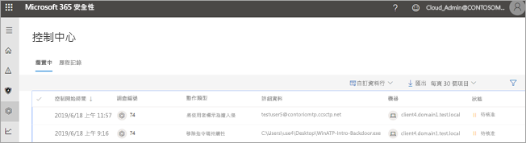
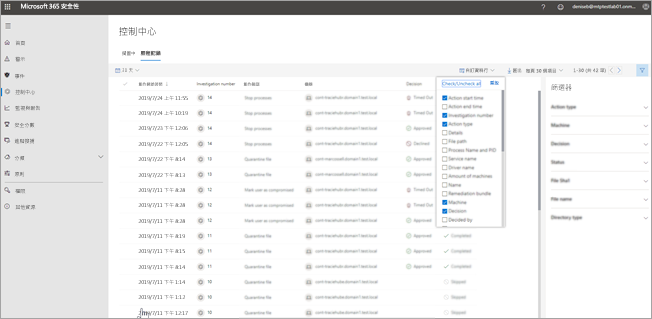

# 移至重要訊息中心檢視補救動作

**適用於：**
- Microsoft 威脅防護

[!INCLUDE [Prerelease information](../includes/prerelease.md)]

## 「單一玻璃窗」體驗

使用重要訊息中心查看組織的裝置和信箱目前和過去的調查結果。 根據威脅類型和[產生的結果](mtp-autoir-results.md#remediation-actions-following-automated-investigation)，補救動作會自動進行，或由貴組織的安全性作業小組核准進行。 所有補救動作 (無論是等待核准或已核准) 皆合併在重要訊息中心。 

重要訊息中心提供工作的「單一玻璃窗」體驗，例如：
- 核准擱置的補救動作；
- 檢視已核准的補救動作的稽核記錄；以及
- 檢閱已完成的補救動作。

由於重要訊息中心可在工作中提供全面檢視 Microsoft 威脅防護，因此您的安全性作業小組可以更有效率地運作。

## 補救動作

下表列出重要訊息中心目前支援的補救動作： 

|端點補救動作  |電子郵件補救動作  |
|---------|---------|
|隔離的檔案 移除登錄機碼 刪除處理序  停止服務  移除登錄機碼  停用驅動程式  移除排程工作      |虛刪除電子郵件訊息或群集 封鎖 URL (點擊時) 關閉外部郵件轉寄          |

## 移至重要訊息中心

1. 移至 [https://security.microsoft.com](https://security.microsoft.com) 並登入。 

2. 在功能窗格中，選擇 **[重要訊息中心]**。 

3. 您會在重要訊息中心看到兩個索引標籤：**[擱置中]** 和 **[歷史記錄]**。

    - **[擱置中]** 索引標籤會列出安全作業小組人員需要檢閱及核准才能繼續的調查。 請務必檢閱您在這裡看到的擱置中項目並採取行動。

    - **[歷史記錄]** 索引標籤會列出過去所做的調查和補救動作。 您可以檢視過去一天、一周、一個月或六個月的資料。

4. 若只要顯示需要查看的欄，請選取 **[自訂欄]**。 

5. 選取清單中的項目以檢視更多有關某調查的詳細資料。 調查詳細資料檢視隨即開啟。 

    - 如果調查與電子郵件內容相關 (例如，實體為信箱)，便會在 Office 365 安全性與合規性中心 ([https://protection.office.com/threatinvestigation](https://protection.office.com/threatinvestigation)) 開啟調查詳細資料。 

    - 如果調查涉及裝置，便會在安全中心 ([https://security.microsoft.com](https://security.microsoft.com)) 開啟調查詳細資料。 

## 重要訊息中心的必要權限

若要核准或拒絕重要訊息中心的擱置中動作，您必須具有下表所列的權限：

|補救動作 |必要角色和權限 |
|--|----|
|Microsoft Defender ATP 補救 (裝置) |在 Azure Active Directory ([https://portal.azure.com](https://portal.azure.com)) 或 Microsoft 365 系統管理中心 ([https://admin.microsoft.com](https://admin.microsoft.com)) 指派**安全性系統管理員**角色 --- 或 --- 在 Microsoft Defender ATP 中指派**作用中補救動作**角色     若要深入了解，請參閱下列資源：  - [Azure Active Directory 中的系統管理員角色權限](https://docs.microsoft.com/azure/active-directory/users-groups-roles/directory-assign-admin-roles) - [建立及管理角色型存取控制的角色 (Microsoft Defender ATP)](https://docs.microsoft.com/windows/security/threat-protection/microsoft-defender-atp/user-roles)  |
|Office 365 ATP 補救 (Office 內容和電子郵件)  |在 Azure Active Directory ([https://portal.azure.com](https://portal.azure.com)) 或 Microsoft 365 系統管理中心 ([https://admin.microsoft.com](https://admin.microsoft.com)) 指派**安全性系統管理員**角色 --- 且 ---  在 Office 365 安全性與合規性中心指派 ([https://protection.office.com](https://protection.office.com)) **搜尋和清除**角色   **重要**：如果您只在 Office 365 安全性與合規性中心指派安全性系統管理員角色，便無法存取重要訊息中心或 Microsoft 威脅防護功能。 您必須在 Azure Active Directory 或 Microsoft 365 系統管理中心指派安全性系統管理員角色。   若要深入了解，請參閱下列資源：  - [Azure Active Directory 中的系統管理員角色權限](https://docs.microsoft.com/azure/active-directory/users-groups-roles/directory-assign-admin-roles) - [Office 365 安全性與合規性中心中的權限](https://docs.microsoft.com/microsoft-365/security/office-365-security/permissions-in-the-security-and-compliance-center) |

> [!NOTE]
> 在 Azure Active Directory 中指派為**全域管理員**角色的使用者可核准或拒絕重要訊息中心的任何擱置中動作。 不過，最佳做法是貴組織限制指派為全域管理員角色的人員人數。 我們建議您針對重要訊息中心權限使用**安全性系統管理員**、**作用中補救動作**，以及上述 **「搜尋」和「清除」角色**。

## 後續步驟 

- [深入了解 Microsoft 威脅防護中的事件](incidents-overview.md)
- [檢視自動調查的結果](mtp-autoir-results.md)
- [深入了解 Microsoft 威脅防護中的搜捕](advanced-hunting-overview.md)

