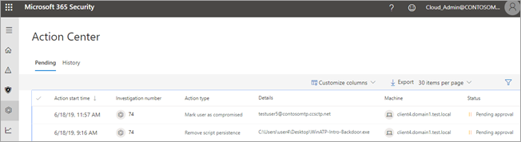
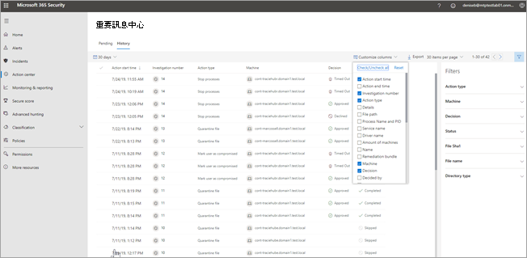

# 重要訊息中心The Action center

[!INCLUDE [Microsoft 365 Defender rebranding](../includes/microsoft-defender.md)]

**適用於：****Applies to:**
- Microsoft 威脅防護Microsoft Threat Protection

使用重要訊息中心查看組織的裝置和信箱目前和過去的調查結果。Use the Action center to see the results of current and past investigations across your organization's devices and mailboxes. 根據威脅類型和產生的判定，您的組織的安全性運作小組會自動或核准執行 [修正動作](https://docs.microsoft.com/microsoft-365/security/mtp/mtp-remediation-actions) 。Depending on the type of threat and resulting verdict, [remediation actions](https://docs.microsoft.com/microsoft-365/security/mtp/mtp-remediation-actions) occur automatically or upon approval by your organization's security operations team. 所有補救動作 (無論是等待核准或已核准) 皆合併在重要訊息中心。All remediation actions, whether they are pending approval or were already approved, are consolidated in the Action center. 

## 「單一玻璃窗」體驗A "single pane of glass" experience

重要訊息中心提供工作的「單一玻璃窗」體驗，例如：The Action center provides a "single pane of glass" experience for tasks, such as:
- 核准擱置的補救動作；Approving pending remediation actions;
- 檢視已核准的補救動作的稽核記錄；以及Viewing an audit log of already approved remediation actions; and
- 檢閱已完成的補救動作。Reviewing completed remediation actions.

由於重要訊息中心可在工作中提供全面檢視 Microsoft 威脅防護，因此您的安全性作業小組可以更有效率地運作。Your security operations team can operate more effectively and efficiently, because the Action center provides a comprehensive view of Microsoft Threat Protection at work.

## 移至重要訊息中心Go to the Action center

1. 移至 [https://security.microsoft.com](https://security.microsoft.com) 並登入。Go to [https://security.microsoft.com](https://security.microsoft.com) and sign in. 

2. 在功能窗格中，選擇 [控制中心]\*\*\*\*。In the navigation pane, choose **Action center**. 

3. 在 [操作中心] 中，您會看到兩個索引標籤： **擱置** 和 **記錄**。In the Action center, you'll see two tabs: **Pending** and **History**.

    - **[擱置中]** 索引標籤會列出安全作業小組人員需要檢閱及核准才能繼續的調查。The **Pending** tab lists investigations that require review and approval by someone in your security operations team to continue. 請務必檢閱您在這裡看到的擱置中項目並採取行動。Make sure to review and take action on pending items you see here.

    - **[歷史記錄]** 索引標籤會列出過去所做的調查和補救動作。The **History** tab lists past investigations and remediation actions that were taken automatically. 您可以檢視過去一天、一周、一個月或六個月的資料。You can view data for the past day, week, month, or six months.

4. 若只要顯示需要查看的欄，請選取 **[自訂欄]**。To show only the columns you want to see, select **Customize columns**. 

5. 選取清單中的項目以檢視更多有關某調查的詳細資料。Select an item in the list to view more details about an investigation. 調查詳細資料檢視隨即開啟。The investigation details view opens. 

    - 如果調查與電子郵件內容相關 (例如，實體為信箱) ，在安全性 & 規範中心中開啟調查詳細資料 ([https://protection.office.com/threatinvestigation](https://protection.office.com/threatinvestigation)) 。If the investigation pertains to email content (such as, the entity is a mailbox), investigation details open in the Security & Compliance Center ([https://protection.office.com/threatinvestigation](https://protection.office.com/threatinvestigation)). 

    - 如果調查涉及裝置，便會在安全中心 ([https://security.microsoft.com](https://security.microsoft.com)) 開啟調查詳細資料。If the investigation involves a device, investigation details open in the security center ([https://security.microsoft.com](https://security.microsoft.com)). 

> [!TIP]
> 如果您認為 Microsoft 威脅防護中的自動調查和回應功能已錯過或錯誤地偵測到某項功能，請告訴我們！If you think something was missed or wrongly detected by automated investigation and response features in Microsoft Threat Protection, let us know! 請參閱 how [to (AIR) Microsoft 威脅防護中的功能，以自動化調查和回應報告誤報的誤報/負片](mtp-autoir-report-false-positives-negatives.md)。See [How to report false positives/negatives in automated investigation and response (AIR) capabilities in Microsoft Threat Protection](mtp-autoir-report-false-positives-negatives.md).

## 可用動作Available actions

採取補救措施時，這些動作會列在重要訊息中心的 [記錄] 索引標籤上。As remediation actions are taken, they're listed on the History tab in the Action center. 這類動作包括下列各項：Such actions include the following:

- 收集調查套件Collect investigation package 
- 隔離裝置 (此動作可復原) Isolate device (this action can be undone) 
- 下架機Offboard machine 
- 發行程式碼執行Release code execution 
- 從隔離區發行Release from quarantine 
- 要求範例Request sample 
- 限制程式碼執行 (可以復原此動作) Restrict code execution (this action can be undone) 
- 執行防病毒掃描Run antivirus scan 
- 停止和隔離Stop and quarantine 

## 重要訊息中心的必要權限Required permissions for Action center tasks

若要核准或拒絕重要訊息中心的擱置中動作，您必須具有下表所列的權限：To approve or reject pending actions in the Action center, you must have permissions assigned as listed in the following table:

|補救動作Remediation action |必要角色和權限Required roles and permissions |
|--|----|
|Microsoft Defender ATP 補救 (裝置)Microsoft Defender ATP remediation (devices) |在 Azure Active Directory ([https://portal.azure.com](https://portal.azure.com)) 或 Microsoft 365 系統管理中心 ([https://admin.microsoft.com](https://admin.microsoft.com)) 指派安全性系統管理員角色Security Administrator role assigned in either Azure Active Directory ([https://portal.azure.com](https://portal.azure.com)) or the Microsoft 365 admin center ([https://admin.microsoft.com](https://admin.microsoft.com)) --- 或 ------ or --- 在 Microsoft Defender ATP 中指派作用中補救動作角色Active remediation actions role assigned in Microsoft Defender ATP     若要深入了解，請參閱下列資源：To learn more, see the following resources:  - [Azure Active Directory 中的系統管理員角色權限](https://docs.microsoft.com/azure/active-directory/users-groups-roles/directory-assign-admin-roles)- [Administrator role permissions in Azure Active Directory](https://docs.microsoft.com/azure/active-directory/users-groups-roles/directory-assign-admin-roles) - [建立及管理角色型存取控制的角色 (Microsoft Defender ATP)](https://docs.microsoft.com/windows/security/threat-protection/microsoft-defender-atp/user-roles)- [Create and manage roles for role-based access control (Microsoft Defender ATP)](https://docs.microsoft.com/windows/security/threat-protection/microsoft-defender-atp/user-roles)  |
|Office 365 ATP 補救 (Office 內容和電子郵件)Office 365 ATP remediation (Office content and email)  |在 Azure Active Directory ([https://portal.azure.com](https://portal.azure.com)) 或 Microsoft 365 系統管理中心 ([https://admin.microsoft.com](https://admin.microsoft.com)) 指派安全性系統管理員角色Security Administrator role assigned in either Azure Active Directory ([https://portal.azure.com](https://portal.azure.com)) or the Microsoft 365 admin center ([https://admin.microsoft.com](https://admin.microsoft.com)) --- 且 ------ and ---  搜尋及清除已指派安全性 & 規範中心 (的角色 [https://protection.office.com](https://protection.office.com)) Search and Purge role assigned the Security & Compliance Center ([https://protection.office.com](https://protection.office.com))   **重要**：如果您已將安全性系統管理員角色指派給安全性 & 合規性中心，您將無法存取「行動中心」或「Microsoft 威脅防護」功能。**IMPORTANT**: If you have the Security Administrator role assigned only in the Security & Compliance Center, you will not be able to access the Action center or Microsoft Threat Protection capabilities. 您必須在 Azure Active Directory 或 Microsoft 365 系統管理中心指派安全性系統管理員角色。You must have the Security Administrator role assigned in Azure Active Directory or the Microsoft 365 admin center.   若要深入了解，請參閱下列資源：To learn more, see the following resources:  - [Azure Active Directory 中的系統管理員角色權限](https://docs.microsoft.com/azure/active-directory/users-groups-roles/directory-assign-admin-roles)- [Administrator role permissions in Azure Active Directory](https://docs.microsoft.com/azure/active-directory/users-groups-roles/directory-assign-admin-roles) - [安全性 & 規範中心的許可權](https://docs.microsoft.com/microsoft-365/security/office-365-security/permissions-in-the-security-and-compliance-center)- [Permissions in the Security & Compliance Center](https://docs.microsoft.com/microsoft-365/security/office-365-security/permissions-in-the-security-and-compliance-center) |

> [!NOTE]
> 在 Azure Active Directory 中指派為全域管理員角色的使用者可核准或拒絕重要訊息中心的任何擱置中動作。Users who have the Global Administrator role assigned in Azure Active Directory can approve or reject any pending action in the Action center. 不過，最佳做法是貴組織限制指派為全域管理員角色的人員人數。However, as a best practice, your organization should limit the number of people who have the Global Administrator role assigned. 我們建議您針對重要訊息中心權限使用安全性系統管理員、作用中補救動作，以及上述「搜尋」和「清除」角色。We recommend using the Security Administrator, Active remediation actions, and Search and Purge roles listed above for Action center permissions.

## 後續步驟Next steps 

- [自動調查後核准或拒絕擱置的動作Approve or reject pending actions following an automated investigation](mtp-autoir-actions.md)
- [檢視自動調查的結果View the results of an automated investigation](mtp-autoir-results.md)

