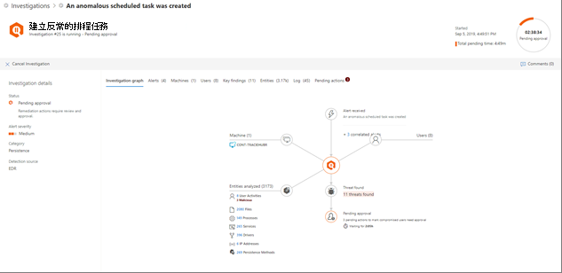

# 重要訊息中心

[!INCLUDE [Microsoft 365 Defender rebranding](../includes/microsoft-defender.md)]

**適用於：**
- Microsoft 365 Defender

使用控制中心 () 來查看貴組織裝置和信箱目前和過去 [https://security.microsoft.com/action-center](https://security.microsoft.com/action-center) 調查的結果。 視威脅類型及產生的效果不同，補救動作可能會自動進行，或經過貴組織安全性作業小組的核准。 所有補救動作 (無論是等待核准或已核准) 皆合併在重要訊息中心。 

## 「單一玻璃窗」體驗

重要訊息中心提供工作的「單一玻璃窗」體驗，例如：
- 核准擱置的補救動作；
- 檢視已核准的補救動作的稽核記錄；以及
- 檢閱已完成的補救動作。

您的安全性作業小組可以更有效且有效率地運作，因為控制中心提供工作中的 Microsoft 365 Defender 全面觀點。

## 移至重要訊息中心

1. 移至 [https://security.microsoft.com](https://security.microsoft.com) 並登入。 

2. 在功能窗格中，選擇 [控制中心]。 

3. 在控制中心中，您會看到兩個按鈕：擱置 **和****記錄**。

    - **[擱置中]** 索引標籤會列出安全作業小組人員需要檢閱及核准才能繼續的調查。 請務必檢閱您在這裡看到的擱置中項目並採取行動。

    - **[歷史記錄]** 索引標籤會列出過去所做的調查和補救動作。 您可以檢視過去一天、一周、一個月或六個月的資料。

4. 若只要顯示需要查看的欄，請選取 **[自訂欄]**。 

5. 選取清單中的項目以檢視更多有關某調查的詳細資料。 調查詳細資料檢視隨即開啟。 

    - 如果調查與電子郵件內容有關，例如， (是信箱) ，在安全性&中心開啟調查詳細資料 [https://protection.office.com/threatinvestigation](https://protection.office.com/threatinvestigation) () 。 

    - 如果調查涉及裝置，便會在安全中心 ([https://security.microsoft.com](https://security.microsoft.com)) 開啟調查詳細資料。 

> [!TIP]
> 如果您認為 Microsoft 365 Defender 中的自動化調查及回應功能偵測到遺漏或錯誤，請告訴我們！ 瞭解如何 [在 Microsoft 365 Defender](mtp-autoir-report-false-positives-negatives.md)的 AIR (自動化調查及回應中) 誤報/負數。

## 可用的動作

採取補救動作時，這些動作會列在控制中心的歷程記錄上。 這類動作包括下列各項：

- 收集調查套件 
- 隔離裝置 (此動作可以復原)  
- 登出電腦 
- 發行代碼執行 
- 從隔離中釋出 
- 要求範例 
- 限制程式碼 (此動作可以復原)  
- 執行防毒掃描 
- 停止和隔離 

> [!NOTE]
> 除了自動採取的補救動作，您的安全性作業小組也可以採取手動動作，解決偵測到的威脅。 有關自動和手動修復動作詳細資訊，請參閱 [補救動作](mtp-remediation-actions.md)。

## 動作來源

 (新功能！) 您應該知道，Microsoft 365 Defender 結合多項服務的自動化調查及回應功能，例如[適用于端點](https://docs.microsoft.com/windows/security/threat-protection/microsoft-defender-atp/microsoft-defender-advanced-threat-protection)的 Microsoft Defender 和[適用于 Office 365](https://docs.microsoft.com/microsoft-365/security/office-365-security/office-365-atp)的 Microsoft Defender。 新的及改良的控制中心現在包含一個 **動作** 來源欄，告訴您每個補救動作的來源。 

下表說明可能的 **動作來源** 值：

| 動作來源值 | 說明 |
|:-----|:---|
| **手動裝置動作** | 在裝置上手動執行的動作。 範例包括 [裝置隔離](https://docs.microsoft.com/windows/security/threat-protection/microsoft-defender-atp/respond-machine-alerts#isolate-devices-from-the-network) 或 [檔案隔離](https://docs.microsoft.com/windows/security/threat-protection/microsoft-defender-atp/respond-file-alerts#stop-and-quarantine-files)。 |
| **手動電子郵件動作** | 對電子郵件手動執行的動作。 例如，包括柔刪除電子郵件訊息或 [修復電子郵件訊息](https://docs.microsoft.com/microsoft-365/security/office-365-security/remediate-malicious-email-delivered-office-365)。 |
| **自動化裝置動作** | 對實體採取的動作，例如檔案或程式。 自動化動作的範例包括將檔案傳送至隔離、停止程式，以及移除註冊表機鍵。  ([Microsoft Defender 中端點 .) ](https://docs.microsoft.com/windows/security/threat-protection/microsoft-defender-atp/manage-auto-investigation#remediation-actions) |
| **自動電子郵件動作** | 對電子郵件內容採取自動動作，例如電子郵件訊息、附件或 URL。 自動動作的範例包括自動刪除電子郵件訊息、封鎖 URL，以及關閉外部郵件轉寄。  (Microsoft [Defender for Office 365 .) 中的](https://docs.microsoft.com/microsoft-365/security/office-365-security/air-remediation-actions)補救動作 |
| **進位搜尋動作** | 對裝置或電子郵件採取的動作，具有 [進一步搜尋功能](https://docs.microsoft.com/microsoft-365/security/mtp/advanced-hunting-overview)。 |
| **Explorer 動作** | 使用 Explorer 對電子郵件內容 [採取的動作](https://docs.microsoft.com/microsoft-365/security/office-365-security/threat-explorer)。 |
| **手動即時回應動作** | 以即時回應在裝置 [上採取的動作](https://docs.microsoft.com/windows/security/threat-protection/microsoft-defender-atp/live-response)。 範例包括刪除檔案、停止程式，以及移除已排程的工作。 |
| **即時回應動作** | 使用 Microsoft Defender for [Endpoint API 對裝置執行的動作](https://docs.microsoft.com/windows/security/threat-protection/microsoft-defender-atp/management-apis#microsoft-defender-for-endpoint-apis)。 動作的範例包括隔離裝置、執行防毒掃描，以及取得檔案相關資訊。 |

## 重要訊息中心的必要權限

若要核准或拒絕重要訊息中心的擱置中動作，您必須具有下表所列的權限：

|補救動作 |必要角色和權限 |
|--|----|
|Microsoft Defender 針對裝置 (修復)  |在 Azure Active Directory ([https://portal.azure.com](https://portal.azure.com)) 或 Microsoft 365 系統管理中心 ([https://admin.microsoft.com](https://admin.microsoft.com)) 指派安全性系統管理員角色 --- 或 --- 在 Microsoft Defender for Endpoint 中指派的作用中補救動作角色     若要深入了解，請參閱下列資源：  - [Azure Active Directory 中的系統管理員角色權限](https://docs.microsoft.com/azure/active-directory/users-groups-roles/directory-assign-admin-roles) - [在 Microsoft Defender for Endpoint (建立及管理角色型存取控制) ](https://docs.microsoft.com/windows/security/threat-protection/microsoft-defender-atp/user-roles)  |
|Microsoft Defender for Office 365 修復 (Office 內容和電子郵件)   |在 Azure Active Directory ([https://portal.azure.com](https://portal.azure.com)) 或 Microsoft 365 系統管理中心 ([https://admin.microsoft.com](https://admin.microsoft.com)) 指派安全性系統管理員角色 --- 且 ---  已指派安全性與合規性中心&搜尋和清除 [https://protection.office.com](https://protection.office.com) ()    **重要**：如果您只在安全性&規範中心指派了安全性系統管理員角色，將無法存取控制中心或 Microsoft 365 Defender 功能。 您必須在 Azure Active Directory 或 Microsoft 365 系統管理中心指派安全性系統管理員角色。   若要深入了解，請參閱下列資源：  - [Azure Active Directory 中的系統管理員角色權限](https://docs.microsoft.com/azure/active-directory/users-groups-roles/directory-assign-admin-roles) - [安全性與合規性&許可權](https://docs.microsoft.com/microsoft-365/security/office-365-security/permissions-in-the-security-and-compliance-center) |

> [!NOTE]
> 在 Azure Active Directory 中指派為全域管理員角色的使用者可核准或拒絕重要訊息中心的任何擱置中動作。 不過，最佳做法是貴組織限制指派為全域管理員角色的人員人數。 我們建議您針對重要訊息中心權限使用安全性系統管理員、作用中補救動作，以及上述「搜尋」和「清除」角色。

## 後續步驟 

- [核准或拒絕自動調查後擱置的動作](mtp-autoir-actions.md)
- [檢視自動調查的結果](mtp-autoir-results.md)

