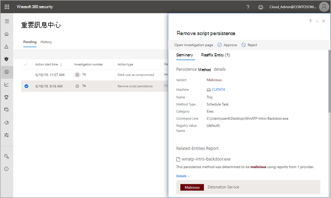
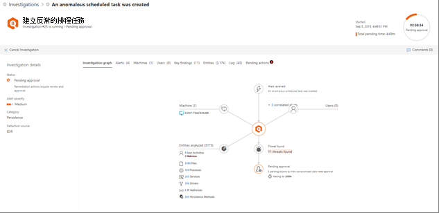

# 核准或拒絕自動調查後擱置的動作

[!INCLUDE [Microsoft 365 Defender rebranding](../includes/microsoft-defender.md)]

**適用於：**
- Microsoft 365 Defender

當自動化調查執行時，可能會導致需要核准才能繼續的一或多個[補救動作](https://docs.microsoft.com/microsoft-365/security/mtp/mtp-remediation-actions)。 例如，可能需要刪除一組電子郵件訊息，或可能需要移除隔離的檔案。 務必盡快核准 (或拒絕) 擱置中的動作，這樣您的自動化調查才能及時進行和完成。 

> [!TIP]
> 如果您認為 Microsoft 365 Defender 中的自動化調查及回應功能偵測到遺漏或錯誤，請告訴我們！ 瞭解如何 [在 Microsoft 365 Defender](mtp-autoir-report-false-positives-negatives.md)的 AIR (自動化調查及回應中) 誤報/負數。

您可以使用控制中心或調查詳細資料檢視來審查及核准[擱置](#review-a-pending-action-in-the-action-center)[中的動作](#review-a-pending-action-in-the-investigation-details-view)。

> [!NOTE]
> 您必須具備[適當的權限](mtp-action-center.md#required-permissions-for-action-center-tasks)，才能核准或拒絕補救動作。 詳細資訊請參閱 Microsoft [365 Defender 中自動化調查及回應的先決條件](mtp-configure-auto-investigation-response.md#prerequisites-for-automated-investigation-and-response-in-microsoft-365-defender)。

## 在重要訊息中心檢閱擱置中的動作

1. 移至 [https://security.microsoft.com](https://security.microsoft.com) 並登入。 

2. 在功能窗格中，選擇 [重要訊息中心]。 

3. 在重要訊息中心的 [擱置中] 索引標籤上，選取清單中的一個項目。 

    - 如果您選取 [調查編號] 資料行中的項目，調查詳細資料頁面會隨即開啟。 您可以在該處檢視調查結果，然後核准或拒絕建議的動作。
 
    - 如果您選取清單中的資料列，就會開啟飛出視窗，您可以在此檢視該項目的相關資訊。   使用連結來檢視相關聯的警示或調查，並核准或拒絕動作。

## 在調查詳細資料檢視中檢閱擱置中的動作

1. 在 [調查詳細資料] 頁面上，選取 [擱置中的動作] (或 [動作]) 索引標籤。此處會列出核准擱置中的項目。

2. 選取清單中的項目，然後選擇 [核准] 或 [拒絕]。

## 復原已完成的動作

如果您確定裝置或檔案並非威脅，您可以復原已採取的補救動作，不論這些動作是自動或手動執行。 在控制中心的歷程記錄上，您可以復原下列任何動作：  

| 動作來源 | 支援的動作 |
|:---|:---|
| - 自動化調查  - Microsoft Defender 防毒軟體  - 手動回應動作 | - 隔離裝置  - 限制程式碼執行  - 隔離檔案  - 移除註冊表鍵  - 停止服務  - 停用驅動程式  - 移除排程任務 |

### 復原補救動作

1. 請前往控制中心 [https://security.microsoft.com/action-center](https://security.microsoft.com/action-center) () 並登出。

2. 在歷程 **記錄上** ，選取要復原的動作。

3. 在畫面右側窗格中，選取 **復原。**

### 若要從跨多部裝置隔離移除檔案 

1. 請前往控制中心 [https://security.microsoft.com/action-center](https://security.microsoft.com/action-center) () 並登出。

2. 在歷程 **記錄 Tab** 上，選取具有動作類型 **隔離檔案的檔案**。

3. 在畫面右邊的窗格中，選取此檔案的更多X 個實例，然後 **選取復原。**

## 後續步驟

- [檢視自動調查的詳細資料和結果](mtp-autoir-results.md)
- [在自動化調查與回應功能中處理誤對/負數](mtp-autoir-report-false-positives-negatives.md)
