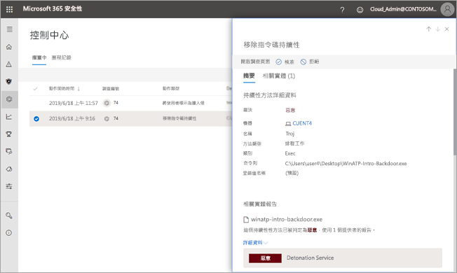

# 核准或拒絕來自自動化調查的擱置中的動作Approve or reject pending actions from automated investigations

**適用於：****Applies to:**
- Microsoft 威脅防護Microsoft Threat Protection

[!INCLUDE [Prerelease information](../includes/prerelease.md)]

當自動化調查執行時，可能會導致需要核准才能繼續的一或多個[補救動作](mtp-action-center.md#remediation-actions)。When an automated investigation runs, it can result in one or more [remediation actions](mtp-action-center.md#remediation-actions) that require approval to proceed. 例如，可能需要刪除一組電子郵件訊息，或可能需要移除隔離的檔案。For example, a cluster of email messages might need to be deleted, or a quarantined file might need to be removed. 務必盡快核准 (或拒絕) 擱置中的動作，這樣您的自動化調查才能及時進行和完成。It's important to approve (or reject) pending actions as soon as possible so that your automated investigations can proceed and complete in a timely manner. 

> [!TIP]
> 如果您認為某個項目已未接或錯誤偵測到的自動化的調查和 Microsoft 威脅防護中的回應功能，讓我們知道 ！If you think something was missed or wrongly detected by automated investigation and response features in Microsoft Threat Protection, let us know! 請參閱[How to 報告中自動進行調查並 Microsoft 威脅防護中的回應 （空調） 功能，則為 false positive/負號](mtp-autoir-report-false-positives-negatives.md)。See [How to report false positives/negatives in automated investigation and response (AIR) capabilities in Microsoft Threat Protection](mtp-autoir-report-false-positives-negatives.md).

使用以下數個方法中的一個可檢閱和核准擱置中的動作：Pending actions can be reviewed and approved by using one of several methods:
- [使用重要訊息中心Use the Action center](#review-a-pending-action-in-the-action-center)
- [使用調查詳細資料檢視Use the investigation details view](#review-a-pending-action-in-the-investigation-details-view)

> [!NOTE]
> 您必須具備[適當的權限](mtp-action-center.md#required-permissions-for-action-center-tasks)，才能核准或拒絕補救動作。You must have [appropriate permissions](mtp-action-center.md#required-permissions-for-action-center-tasks) to approve or reject remediation actions.

## 在重要訊息中心檢閱擱置中的動作Review a pending action in the Action center

1. 移至 [https://security.microsoft.com](https://security.microsoft.com) 並登入。Go to [https://security.microsoft.com](https://security.microsoft.com) and sign in. 

2. 在功能窗格中，選擇 [重要訊息中心]\*\*\*\*。In the navigation pane, choose **Action center**. 

3. 在重要訊息中心的 [擱置中]\*\*\*\* 索引標籤上，選取清單中的一個項目。In the Action Center, on the **Pending** tab, select an item in the list. 

    - 如果您選取 [調查編號]\*\*\*\* 資料行中的項目，調查詳細資料頁面會隨即開啟。If you select an item in the **Investigation number** column, the investigation details page opens. 您可以在該處檢視調查結果，然後核准或拒絕建議的動作。There, you can view the results of the investigation, and then either approve or reject the recommended action.
 
    - 如果您選取清單中的資料列，就會開啟飛出視窗，您可以在此檢視該項目的相關資訊。If you select a row in the list, a flyout opens, where you can view information about that item.   使用連結來檢視相關聯的警示或調查，並核准或拒絕動作。Use the links to view an associated alert or an investigation, and approve or reject the action.

## 在調查詳細資料檢視中檢閱擱置中的動作Review a pending action in the investigation details view

1. 在 [調查詳細資料] 頁面上，選取 [擱置中的動作]\*\*\*\* (或 [動作]\*\*\*\*) 索引標籤。此處會列出核准擱置中的項目。On an [investigation details](mtp-autoir-results.md) page, select the **Pending actions** (or **Actions**) tab. Items that are pending approval are listed here.

2. 選取清單中的項目，然後選擇 [核准]\*\*\*\* 或 [拒絕]\*\*\*\*。Select an item in the list, and then choose **Approve** or **Reject**.

## 後續步驟Next steps

- [深入了解重要訊息中心Learn more about the Action center](mtp-action-center.md)
- [深入了解事件Learn more about incidents](incidents-overview.md)
- [了解搜捕Learn about hunting](advanced-hunting-overview.md)
