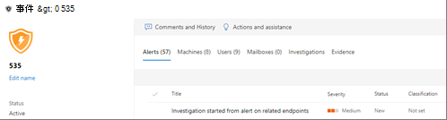

# 自動化調查詳細資料與結果Details and results of an automated investigation

[!INCLUDE [Microsoft 365 Defender rebranding](../includes/microsoft-defender.md)]

適用於：**Applies to:**
- Microsoft 365 DefenderMicrosoft 365 Defender

當 Microsoft 365 Defender 進行自動化調查時，可在自動化調查程式期間及之後獲得該調查的詳細資訊。When an automated investigation occurs in Microsoft 365 Defender, details about that investigation are available during and after the automated investigation process. 如果您擁有[必要權限](mtp-action-center.md#required-permissions-for-action-center-tasks)，您可以在調查詳細資料檢視中查看這些詳細資料。If you have the [necessary permissions](mtp-action-center.md#required-permissions-for-action-center-tasks), you can view those details in an investigation details view. 調查詳細資料檢視可提供您最新的狀態，以及核准任何待核准動作的能力。The investigation details view provides you with up-to-date status and the ability to approve any pending actions. 

## 開啟調查詳細資料檢視Open the investigation details view

您可以使用下列其中一種方法開啟調查詳細資料檢視：You can open the investigation details view by using one of the following methods:
- [選取 [控制中心] 中的項目](#select-an-item-in-the-action-center)[Select an item in the Action center](#select-an-item-in-the-action-center)
- [從事件詳細資料頁面中選取調查Select an investigation from an incident details page](#open-an-investigation-from-an-incident-details-page)

### 選取 [控制中心] 中的項目Select an item in the Action center

使用 [控制中心] 查看處於待核准狀態 (在 [待核准] 索引標籤上) 或已核准 (在 [歷史記錄] 索引標籤上) 的動作。Use the Action center to view actions that are either pending approval (on the **Pending** tab) or were already approved (on the **History** tab). 

1. 移至 [https://security.microsoft.com](https://security.microsoft.com) 並登入。Go to [https://security.microsoft.com](https://security.microsoft.com) and sign in. 

2. 在功能窗格中，選擇 [控制中心]。In the navigation pane, choose **Action center**. 

3. 在 [待核准] 或 [歷史記錄] 索引標籤上，選取一個項目。On either the **Pending** or **History** tab, select an item. 如果您擁有[必要權限](mtp-action-center.md#required-permissions-for-action-center-tasks)，您可以核准 (或拒絕) 待核准的動作。If you have the [necessary permissions](mtp-action-center.md#required-permissions-for-action-center-tasks), you can approve (or reject) pending actions.

### 從事件詳細資料頁面開啟調查Open an investigation from an incident details page

使用事件詳細資料頁面來查看事件的詳細資訊，包括觸發任何受影響裝置、使用者帳戶或信箱之資訊的警示。Use an incident details page to view detailed information about an incident, including alerts that were triggered information about any affected devices, user accounts, or mailboxes.

1. 移至 [https://security.microsoft.com](https://security.microsoft.com) 並登入。Go to [https://security.microsoft.com](https://security.microsoft.com) and sign in. 

2. 在功能窗格中，選擇 [事件]。In the navigation pane, choose **Incidents**. 

3. 選取清單中的項目以開啟事件詳細資料檢視。Select an item in the list to open the incident details view. 

4. 在 [調查] 索引標籤上，選取清單中的調查。On the **Investigations** tab, select an investigation in the list.

## 調查詳細資料Investigation details

使用調查詳細資料檢視，查看與調查相關的過去、目前和待核准的活動。Use the investigation details view to see past, current, and pending activity pertaining to an investigation. 調查詳細資料檢視類似以下影像：The investigation details view resembles the following image:

在調查詳細資料檢視中，您可以在 [調查圖表]、[警示]、[裝置]、[身分識別]、[重要結果]、[實體]、**[記錄]**，以及 [待核准的動作] 索引標籤上查看資訊，如下表所述。In the Investigation details view, you can see information on the **Investigation graph**, **Alerts**, **Devices**, **Identities**, **Key findings**, **Entities**, **Log**, and **Pending actions** tabs, described in the following table.

| 索引標籤Tab | 描述Description |
|--------|--------|
| **調查圖表****Investigation graph**   | 提供調查的視覺呈現。Provides a visual representation of the investigation. 描述實體並列出發現的威脅和警示，以及是否有任何待核准的動作。Depicts entities and lists threats found, along with alerts and whether any actions are awaiting approval. 您可以按一下圖表上的項目來查看更多詳細資料。You can click an item on the graph to view more details. 例如，按一下 [找到的威脅] 圖示會帶您移至 [重要結果] 索引標籤。For example, clicking the **Threats found** icon takes you to the **Key findings** tab. |
| **提醒****Alerts**    | 列出與調查相關聯的警示。Lists alerts associated with the investigation. 警示可能來自使用者電腦上、Office 應用程式、雲端 App 安全性和其他 Microsoft 365 Defender 功能的威脅防護功能。Alerts can come from threat protection features on a user's machine, in Office apps, Cloud App Security, and other Microsoft 365 Defender features.|
| **裝置****Devices** | 列出調查中包含的電腦及其修正等級。Lists machines included in the investigation along with remediation level.|
| **重要結果****Key findings**  | 列出調查結果，以及狀態和已執行或待核准的動作。Lists results from the investigation along with status and actions taken or pending. 您可以在這個索引標籤上核准裝置和身分識別的待核准動作。You can approve pending actions for devices and identities in on this tab.|
| **Entities****Entities**  | 列出與調查相關聯的使用者活動、檔案、處理程序、服務、驅動程式、IP 位址和持續性方法，以及狀態和採取的動作。Lists user activities, files, processes, services, drivers, IP addresses, and persistence methods associated with the investigation, along with status and actions taken.|
|**Log****Log**    | 提供調查過程中所有步驟的詳細資訊，以及狀態。Provides a detailed view of all steps taken during the investigation, along with status.|
| **待核准的動作****Pending actions** | 列出需要核准才能繼續的項目。Lists items that require approval to proceed.|

## 後續步驟Next steps

- [與自動化調查及回應相關的核准或拒絕動作Approve or reject actions related to automated investigation and response](mtp-autoir-actions.md)
- [審查補救動作Review remediation actions](mtp-remediation-actions.md)
