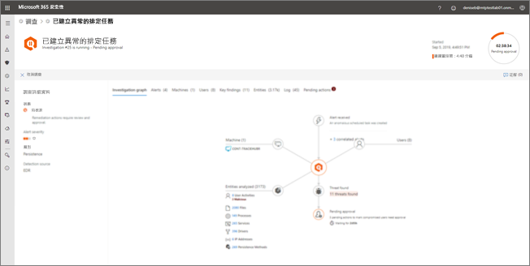
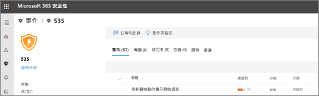

# 檢視自動調查的詳細資料和結果

適用於：****
- Microsoft 威脅防護

[!INCLUDE [Prerelease information](../includes/prerelease.md)]

當您在 Microsoft 威脅防護中進行自動調查時，可在與自動調查處理期間以及處理完成後取得該調查的詳細資料。 如果您擁有[必要權限](mtp-action-center.md#required-permissions-for-action-center-tasks)，您可以在調查詳細資料檢視中查看這些詳細資料。 調查詳細資料檢視可提供您最新的狀態，以及核准任何待核准動作的能力。 

## 開啟調查詳細資料檢視

您可以使用下列其中一種方法開啟調查詳細資料檢視：
- [選取 [控制中心] 中的項目](#select-an-item-in-the-action-center)
- [從事件詳細資料頁面中選取調查](#open-an-investigation-from-an-incident-details-page)

### 選取 [控制中心] 中的項目

使用 [控制中心] 查看處於待核准狀態 (在 [待核准]**** 索引標籤上) 或已核准 (在 [歷史記錄]**** 索引標籤上) 的動作。 

1. 移至 [https://security.microsoft.com](https://security.microsoft.com) 並登入。 

2. 在功能窗格中，選擇 [控制中心]****。 

3. 在 [待核准]**** 或 [歷史記錄]**** 索引標籤上，選取一個項目。 如果您擁有[必要權限](mtp-action-center.md#required-permissions-for-action-center-tasks)，您可以核准 (或拒絕) 待核准的動作。

### 從事件詳細資料頁面開啟調查

使用事件詳細資料頁面來查看事件的詳細資訊，包括觸發任何受影響裝置、使用者帳戶或信箱之資訊的警示。

1. 移至 [https://security.microsoft.com](https://security.microsoft.com) 並登入。 

2. 在功能窗格中，選擇 [事件]****。 

3. 選取清單中的項目以開啟事件詳細資料檢視。 

4. 在 [調查]**** 索引標籤上，選取清單中的調查。

## 調查詳細資料

使用調查詳細資料檢視，查看與調查相關的過去、目前和待核准的活動。 調查詳細資料檢視類似以下影像：

在調查詳細資料檢視中，您可以在 [調查圖表]****、[警示]****、[裝置]****、[身分識別]****、[重要結果]****、[實體]****、**[記錄]**，以及 [待核准的動作]**** 索引標籤上查看資訊，如下表所述。

|索引標籤    |描述 |
|--------|--------|
|調查圖表    |提供調查的視覺呈現。 描述實體並列出發現的威脅和警示，以及是否有任何待核准的動作。 您可以按一下圖表上的項目來查看更多詳細資料。 例如，按一下 [找到的威脅] **** 圖示會帶您移至 [重要結果]**** 索引標籤。 |
|警示 |列出與調查相關聯的警示。 警示可能來自使用者電腦上的威脅防護功能、Office 應用程式、雲端 App 安全性及其他 Microsoft 365 威脅防護功能。|
|裝置|列出調查中包含的電腦及其修正等級。|
|重要結果   |列出調查結果，以及狀態和已執行或待核准的動作。 您可以在這個索引標籤上核准裝置和身分識別的待核准動作。|
|實體   |列出與調查相關聯的使用者活動、檔案、處理程序、服務、驅動程式、IP 位址和持續性方法，以及狀態和採取的動作。|
|記錄    |提供調查過程中所有步驟的詳細資訊，以及狀態。|
|待核准的動作    |列出需要核准才能繼續的項目。|

## 自動調查後的修正動作

當自動調查完成後，會對所涉及的每個證據做出裁決，並確定修正動作。 在某些情況下，系統會自動進行修正動作；在其他情況下，修正動作需要核准。 下表列出可能的裁決和結果：

|裁決    |範圍   |結果|
|------|------|------|
|惡意  |裝置 (端點)    |自動採取修正動作|
|惡意  |電子郵件內容 (URL 或附件) | 建議的修正動作待核准|
|可疑 |裝置或電子郵件內容 |建議的修正動作待核准|
|無害  |裝置或電子郵件內容   |不需要修正動作|

[在控制中心檢閱待核准的動作](mtp-autoir-actions.md#review-a-pending-action-in-the-action-center)

> [!TIP]
> 如果您認為某個項目已未接或錯誤偵測到的自動化的調查和 Microsoft 威脅防護中的回應功能，讓我們知道 ！ 請參閱[How to 報告中自動進行調查並 Microsoft 威脅防護中的回應 （空調） 功能，則為 false positive/負號](mtp-autoir-report-false-positives-negatives.md)。

## 後續步驟

- [取得 [控制中心] 權限的概況](mtp-action-center.md#required-permissions-for-action-center-tasks)
- [核准或拒絕與自動化調查相關的動作並回應](mtp-autoir-actions.md)

