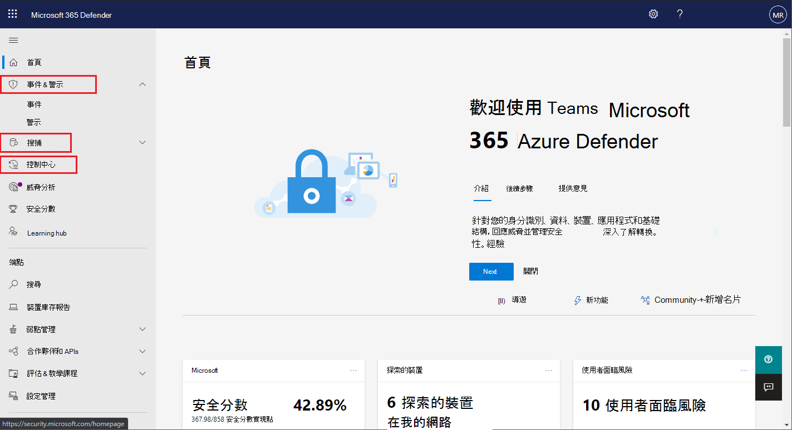

# 開啟 Microsoft 365 DefenderTurn on Microsoft 365 Defender

[!INCLUDE [Microsoft 365 Defender rebranding](../includes/microsoft-defender.md)]

**適用於：****Applies to:**
- Microsoft 365 DefenderMicrosoft 365 Defender

[Microsoft 365 Defender](microsoft-threat-protection.md) 整合您的事件回應程式，方法是在 microsoft Defender for Endpoint、microsoft Defender for Office 365、Microsoft Cloud App Security 和 microsoft Defender for Identity 中整合重要功能。[Microsoft 365 Defender](microsoft-threat-protection.md) unifies your incident response process by integrating key capabilities across Microsoft Defender for Endpoint, Microsoft Defender for Office 365, Microsoft Cloud App Security, and Microsoft Defender for Identity. 此整合體驗會新增您可以在 Microsoft 365 安全性中心存取的強大功能。This unified experience adds powerful features you can access in the Microsoft 365 security center.

Microsoft 365 Defender 會在具備必要許可權的合格客戶造訪 Microsoft 365 的安全性中心時自動開啟。Microsoft 365 Defender automatically turns on when eligible customers with the required permissions visit Microsoft 365 security center. 請閱讀本文以瞭解各種必要條件，以及如何布建 Microsoft 365 Defender。Read this article to understand various prerequisites and how Microsoft 365 Defender is provisioned.

## 檢查授權資格和必要許可權Check license eligibility and required permissions
Microsoft 365 安全性產品的授權一般會使您在 Microsoft 365 的安全性中心使用 Microsoft 365 Defender，而不需要額外授權成本。A license to a Microsoft 365 security product generally entitles you to use Microsoft 365 Defender in Microsoft 365 security center without additional licensing cost. 我們建議您取得 Microsoft 365 E5、E5 或 A5 安全授權或有效的授權組合，以提供所有支援服務的存取權。We do recommend getting a Microsoft 365 E5, E5 Security, A5, or A5 Security license or a valid combination of licenses that provides access to all supported services.

如需詳細的授權資訊，請 [閱讀授權要求](prerequisites.md#licensing-requirements)。For detailed licensing information, [read the licensing requirements](prerequisites.md#licensing-requirements).

### 檢查您的角色Check your role
您必須是 **全域系統管理員** 或 Azure Active Directory 中的 **安全性系統管理員** ，才可開啟 Microsoft 365 Defender。You must be a **global administrator** or a **security administrator** in Azure Active Directory to turn on Microsoft 365 Defender. [在 Azure AD 中查看您的角色View your roles in Azure AD](https://docs.microsoft.com//azure/active-directory/users-groups-roles/directory-manage-roles-portal)

## 支援的服務Supported services
Microsoft 365 Defender 會匯總您已部署之各種支援服務的資料。Microsoft 365 Defender aggregates data from the various supported services that you've already deployed. 它會集中處理及儲存資料，以識別新的洞察力，並可讓集中式回應工作流程成為可能。It will process and store data centrally to identify new insights and make centralized response workflows possible. 這樣做不會影響現有的部署、設定或與整合服務相關聯的資料。It does this without affecting existing deployments, settings, or data associated with the integrated services.

若要取得最佳保護，並優化 Microsoft 365 Defender，我們建議在您的網路上部署所有適用的受支援服務。To get the best protection and optimize Microsoft 365 Defender, we recommend deploying all applicable supported services on your network. 如需詳細資訊，請 [參閱部署支援的服務](deploy-supported-services.md)。For more information, [read about deploying supported services](deploy-supported-services.md).

## 啟動服務之前Before starting the service
在您開啟服務之前，Microsoft 365 security center ( [security.microsoft.com](https://security.microsoft.com)) 會在您從功能窗格中選取 [ **事件** ]、[ **動作中心** ] 或 [ **搜尋** ] 時，顯示 [microsoft 365 Defender 設定] 頁面。Before you turn on the service, the Microsoft 365 security center ( [security.microsoft.com](https://security.microsoft.com)) shows the Microsoft 365 Defender settings page when you select **Incidents** , **Action center** , or **Hunting** from the navigation pane. 如果您不具備使用 Microsoft 365 Defender 的資格，就不會顯示這些流覽專案。These navigation items are not shown if you are not eligible to use Microsoft 365 Defender.

 *365 security center 中開啟 Microsoft 365 defender 設定* 時所顯示之 microsoft 365 defender 設定頁面的圖像
*Microsoft 365 Defender settings in Microsoft 365 security center*

## 啟動服務Starting the service
若要開啟 Microsoft 365 Defender，只要選取 [ **開啟 microsoft 365 defender** ] 並套用變更。To turn on Microsoft 365 Defender, simply select **Turn on Microsoft 365 Defender** and apply the change. 您也可以在功能窗格中選取 [ ( [security.microsoft.com/settings](https://security.microsoft.com/settings)) **設定** ]，然後選取 [ **microsoft 365 Defender** ]，即可存取此選項。You can also access this option by selecting **Settings** ( [security.microsoft.com/settings](https://security.microsoft.com/settings)) in the navigation pane and then selecting **Microsoft 365 Defender**.

>[!NOTE]
>如果您在功能窗格中看不到 **設定** 或無法存取頁面，請檢查您的許可權和授權。If you don't see **Settings** in the navigation pane or couldn't access the page, check your permissions and licenses.

### 資料中心位置Data center location
Microsoft 365 Defender 會將資料儲存並處理于 [Microsoft Defender For Endpoint 所使用的相同位置](https://docs.microsoft.com/windows/security/threat-protection/microsoft-defender-atp/data-storage-privacy)。Microsoft 365 Defender will store and process data in the [same location used by Microsoft Defender for Endpoint](https://docs.microsoft.com/windows/security/threat-protection/microsoft-defender-atp/data-storage-privacy). 如果您沒有 Microsoft Defender for Endpoint，會根據使用中 Microsoft 365 安全性服務的位置，自動選取新的資料中心位置。If you don't have Microsoft Defender for Endpoint, a new data center location is automatically selected based on the location of active Microsoft 365 security services. 選取的資料中心位置會顯示在螢幕上。The selected data center location is shown in the screen. 

在 Microsoft 365 的安全性中心中，選取 [ **需要協助** ]，以與 microsoft 支援部門聯繫，以在不同的資料中心位置布建 Microsoft 365 Defender。Select **Need help?** in the Microsoft 365 security center to contact Microsoft support about provisioning Microsoft 365 Defender in a different data center location. 

>[!NOTE]
>Microsoft Defender for Endpoint 會在歐盟 (歐盟透過 Azure Defender 開啟時) 資料中心。Microsoft Defender for Endpoint automatically provisions in European Union (EU) data centers when turned on through Azure Defender. Microsoft 365 Defender 會在相同的歐盟資料中心，針對以這種方式布建 Defender 的客戶自動布建。Microsoft 365 Defender will automatically provision in the same EU data center for customers who have provisioned Defender for Endpoint in this manner. 

### 確認服務已開啟Confirm that the service is on
服務一旦佈建，它會新增：Once the service is provisioned, it adds:

- [事件管理Incidents management](incidents-overview.md)
- 用於管理[自動化調查和回應](mtp-autoir.md)的重要訊息中心An action center for managing [automated investigation and response](mtp-autoir.md)
- [高級搜尋](advanced-hunting-overview.md) 功能[Advanced hunting](advanced-hunting-overview.md) capabilities

 *microsoft 365 security center with 事件管理和其他 Microsoft 365 Defender 功能*
*Microsoft 365 security center with incidents management and other Microsoft 365 Defender capabilities*

### 取得 Microsoft Defender 的身分識別資料Getting Microsoft Defender for Identity data
若要使用 Microsoft 365 Defender 共用 Microsoft Defender 的身分識別資料，請確定 Microsoft Cloud App Security 和 Microsoft Defender for Identity integration 已開啟。To share Microsoft Defender for Identity data with Microsoft 365 Defender, ensure that Microsoft Cloud App Security and Microsoft Defender for Identity integration is turned on. [深入了解此整合Learn more about this integration](https://docs.microsoft.com/cloud-app-security/aatp-integration)

## 關閉 Microsoft 365 DefenderTurn off Microsoft 365 Defender
若要停止使用 microsoft 365 defender，請 **Settings** 移至 microsoft  >  365 security center 中的設定 **Microsoft 365 Defender**  >  **加入宣告/自願退出** 。To stop using Microsoft 365 Defender, go to **Settings** > **Microsoft 365 Defender** > **Opt-in / Opt-out** in the Microsoft 365 security center. 取消選取 [ **開啟 Microsoft 365 Defender** ] 並套用變更。Unselect **Turn on Microsoft 365 Defender** and apply the changes.

對應的功能將會從 Microsoft 365 的安全性中心移除。Corresponding features will be removed from the Microsoft 365 security center.

## 取得協助Get assistance

若要取得有關開啟 Microsoft 365 Defender 的最常見問題的答案，請 [參閱常見問題](mtp-enable-faq.md)。To get answers to the most commonly asked questions about turning on Microsoft 365 Defender, [read the FAQ](mtp-enable-faq.md).

Microsoft 支援人員可協助您布建或取消設定租使用者上的服務和相關資源。Microsoft support staff can help provision or deprovision the service and related resources on your tenant. 如需協助，請選取 [Microsoft 365 security center] 中的 [ **需要協助？** ]。For assistance, select **Need help?** in the Microsoft 365 security center. 當您聯繫支援時，請提及 Microsoft 365 Defender。When contacting support, mention Microsoft 365 Defender.

## 相關主題Related topics

- [常見問題集Frequently asked questions](mtp-enable-faq.md)
- [授權需求和其他必要條件Licensing requirements and other prerequisites](prerequisites.md)
- [部署支援服務Deploy supported services](deploy-supported-services.md)
- [Microsoft 365 Defender 概述Microsoft 365 Defender overview](microsoft-threat-protection.md)
- [Microsoft Defender for Endpoint 簡介Microsoft Defender for Endpoint overview](https://docs.microsoft.com/windows/security/threat-protection/microsoft-defender-atp/microsoft-defender-advanced-threat-protection)
- [適用于 Office 的 Defender 365 簡介Defender for Office 365 overview](../office-365-security/office-365-atp.md)
- [Microsoft Cloud App Security 概觀Microsoft Cloud App Security overview](https://docs.microsoft.com/cloud-app-security/what-is-cloud-app-security)
- [Microsoft Defender 身分識別概述Microsoft Defender for Identity overview](https://docs.microsoft.com/azure-advanced-threat-protection/what-is-atp)
- [Microsoft Defender for Endpoint data storageMicrosoft Defender for Endpoint data storage](https://docs.microsoft.com/windows/security/threat-protection/microsoft-defender-atp/data-storage-privacy)
