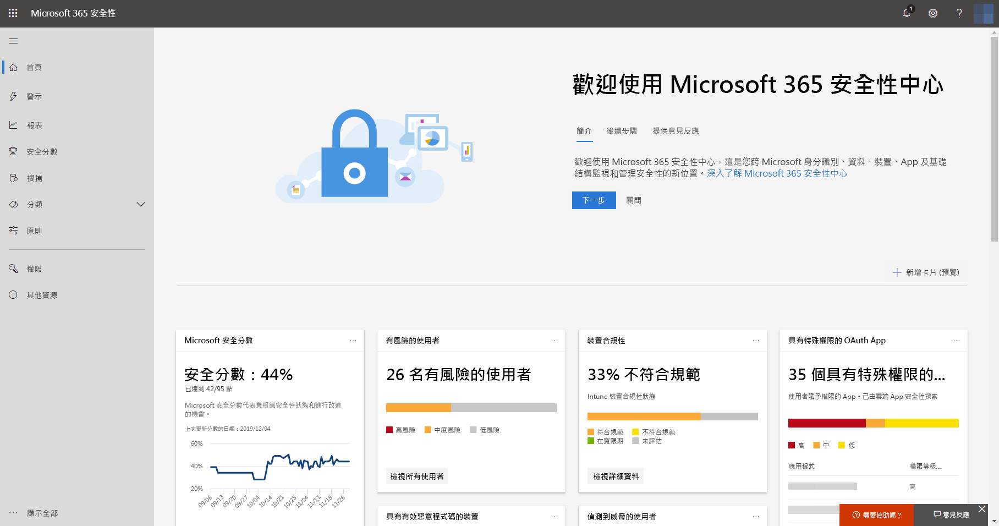

# 開啟 Microsoft 威脅防護

**適用於：**
- Microsoft 威脅防護

[!INCLUDE [Prerelease information](../includes/prerelease.md)]

Microsoft 威脅防護整合了您的事件回應流程，方法是整合跨 Microsoft Defender 進階威脅防護 (ATP)、Office 365 ATP、Microsoft Cloud App Security 和 Azure ATP 的重要功能。 此整合體驗會新增您可以在 Microsoft 365 安全性中心存取的強大功能。

## 檢查您的資格
擁有 Microsoft 365 E5 或同等授權的客戶可以使用 Microsoft 威脅防護。 如需詳細資訊，請[閱讀授權需求](prerequisites.md#licensing-requirements)。

## 開始使用服務
開啟 Microsoft 威脅防護服務會彙總來自各種整合服務的資料。 系統將處理資料並集中儲存，以找出新的深入資訊，並使得集中式回應工作流程變得可能。

在您開啟服務前，Microsoft 365 安全性中心 ([security.microsoft.com](https://security.microsoft.com)) 不會在功能表上顯示 [事件]**** 和 [重要訊息中心]**** 選項。

*已關閉 Microsoft 威脅防護的 Microsoft 365 安全性中心*

若要開啟 Microsoft 威脅防護服務，請移至 Microsoft 365 安全性中心的 [設定]****  >  [Microsoft 威脅防護]****  >  [選擇加入/選擇退出]****。 若要執行此工作，您必須是 [Azure Active Directory](https://docs.microsoft.com/azure/active-directory/users-groups-roles/directory-assign-admin-roles#available-roles) 中的全域系統管理員或安全性系統管理員。

如果已為您的組織佈建 Microsoft Defender ATP，則資料將會儲存在為[您的 Microsoft Defender ATP 資料](https://docs.microsoft.com/windows/security/threat-protection/microsoft-defender-atp/data-storage-privacy)選取的相同資料中心位置中。 如果您沒有 Microsoft Defender ATP，系統會要求您選擇專用於 Microsoft 威脅防護的新資料中心位置。 在服務之間共用資料與彙總之前，您必須先提供同意。

### 確認服務已開啟
服務一旦佈建，它會新增：

- [事件管理](incidents-overview.md)
- 用於管理[自動化調查和回應](mtp-autoir.md)的重要訊息中心
- 現有 [搜捕]**** 頁面的[進階搜捕](advanced-hunting-overview.md)功能

*具有事件管理和其他 Microsoft 威脅防護功能的 Microsoft 365 安全性中心*

### 取得 Azure ATP 資料
若要使用 Microsoft 威脅防護共用 Azure ATP 資料，請確認已開啟 Microsoft Cloud App Security 和 Azure ATP 整合。 [深入了解此整合](https://docs.microsoft.com/cloud-app-security/aatp-integration)

## 關閉 Microsoft 威脅防護
若要停止使用 Microsoft 威脅防護，請移至 Microsoft 365 安全性中心的 [設定]****  >  [Microsoft 威脅防護]****  >  [選擇加入/選擇退出]****。 取消選取 [開啟 Microsoft 威脅防護]**** 並儲存變更。

系統將會永久刪除資料，且將對應的功能從 Microsoft 365 安全性中心中移除。

## 取得協助

Microsoft 人員可協助您佈建或取消佈建您租用戶上的服務與相關資源。 如需協助，請[連絡頂級支援](https://go.microsoft.com/fwlink/?LinkID=733758)。

## 相關主題

- [Microsoft 威脅防護更新概觀](microsoft-threat-protection.md)
- [授權需求和其他必要條件](prerequisites.md)
- [Microsoft Defender ATP 概觀](https://docs.microsoft.com/windows/security/threat-protection/microsoft-defender-atp/microsoft-defender-advanced-threat-protection)
- [Office 365 ATP 概觀](../office-365-security/office-365-atp.md)
- [Microsoft Cloud App Security 概觀](https://docs.microsoft.com/cloud-app-security/what-is-cloud-app-security)
- [Azure ATP 概觀](https://docs.microsoft.com/azure-advanced-threat-protection/what-is-atp)
- [Microsoft Defender ATP 資料儲存](https://docs.microsoft.com/windows/security/threat-protection/microsoft-defender-atp/data-storage-privacy)
