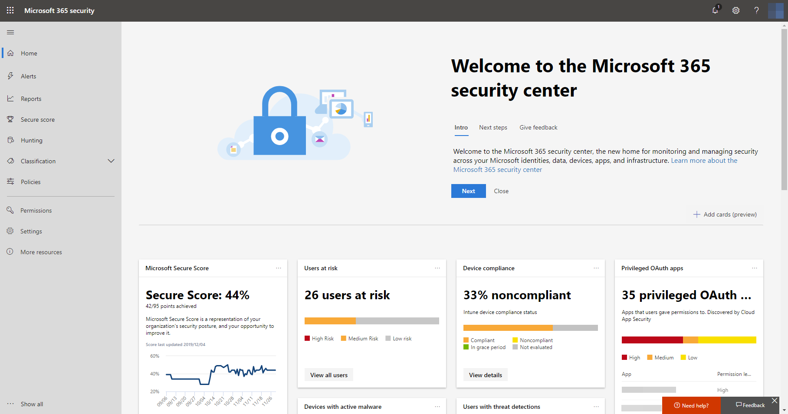

# 開啟 Microsoft 威脅防護Turn on Microsoft Threat Protection

**適用於：****Applies to:**
- Microsoft 威脅防護Microsoft Threat Protection

Microsoft 威脅防護整合了您的事件回應流程，方法是整合跨 Microsoft Defender 進階威脅防護 (ATP)、Office 365 ATP、Microsoft Cloud App Security 和 Azure ATP 的重要功能。Microsoft Threat Protection unifies your incident response process by integrating key capabilities across Microsoft Defender Advanced Threat Protection (ATP), Office 365 ATP, Microsoft Cloud App Security, and Azure ATP. 此整合體驗會新增您可以在 Microsoft 365 安全性中心存取的強大功能。This unified experience adds powerful features you can access in the Microsoft 365 security center.

## 請檢查授權資格及必要的權限Check license eligibility and required permissions
使用 Microsoft 365 E5、 Microsoft 365 E5 安全性或對等組合的授權的客戶可以使用 Microsoft Threat Protection。Customers with Microsoft 365 E5, Microsoft 365 E5 Security, or an equivalent combination of licenses can use Microsoft Threat Protection. 如需詳細資訊，請[閱讀授權需求](prerequisites.md#licensing-requirements)。For more information, [read the licensing requirements](prerequisites.md#licensing-requirements).

您必須是**全域系統管理員**或[Azure Active Directory](https://docs.microsoft.com/azure/active-directory/users-groups-roles/directory-assign-admin-roles#available-roles)以開啟 [Microsoft 威脅防護中的**安全性系統管理員**。You must be a **global administrator** or a **security administrator** in [Azure Active Directory](https://docs.microsoft.com/azure/active-directory/users-groups-roles/directory-assign-admin-roles#available-roles) to turn on Microsoft Threat Protection.

## 開始使用服務Start using the service
Microsoft 威脅防護彙總資料從各種的整合式服務。Microsoft Threat Protection aggregates data from the various integrated services. 它會處理程序，並儲存資料集中以識別新的深入資訊，並讓集中式的回應系統工作流程。It will process and store data centrally to identify new insights and make centralized response workflows possible.

開啟服務之前，請在 Microsoft 365 安全性中心 ([security.microsoft.com](https://security.microsoft.com)) 不會顯示**事件**和**重要訊息中心**選項功能窗格中。Before you turn on the service, the Microsoft 365 security center ([security.microsoft.com](https://security.microsoft.com)) doesn't show the **Incidents** and the **Action center** options in the navigation pane.

*Microsoft 365 安全中心與 Microsoft Threat Protection 關閉*
*Microsoft 365 security center with Microsoft Threat Protection turned off*

若要開啟 Microsoft 威脅防護，請選取 [在功能窗格中的**設定**。To turn on Microsoft Threat Protection, select **Settings** in the navigation pane. 在**[設定] 頁面](https://security.microsoft.com/settings)** 上，移至**Microsoft 威脅防護** > **加入 / 退出**。In the **[Settings page](https://security.microsoft.com/settings)**, go to **Microsoft Threat Protection** > **Opt-in / Opt-out**.

>[!NOTE]
>如果您沒有看到**設定**功能窗格中，或無法存取] 頁面上，檢查您的權限和授權。If you don't see **Settings** in the navigation pane or couldn't access the page, check your permissions and licenses.

### 選取的資料中心位置Select data center location
如果已為您的組織佈建 Microsoft Defender ATP，則資料將會儲存在為[您的 Microsoft Defender ATP 資料](https://docs.microsoft.com/windows/security/threat-protection/microsoft-defender-atp/data-storage-privacy)選取的相同資料中心位置中。If Microsoft Defender ATP has been provisioned for your organization, data will be stored and processed in the same data center location you have selected for [your Microsoft Defender ATP data](https://docs.microsoft.com/windows/security/threat-protection/microsoft-defender-atp/data-storage-privacy). 如果您沒有 Microsoft Defender ATP，系統會要求您選擇專用於 Microsoft 威脅防護的新資料中心位置。If you don't have Microsoft Defender ATP, you will be asked to choose a new data center location specifically for Microsoft Threat Protection. 

您必須提供同意才能服務之間共用和彙總資料。You need to provide consent before data is shared between services and aggregated.

### 確認服務已開啟Confirm that the service is on
服務一旦佈建，它會新增：Once the service is provisioned, it adds:

- [事件管理Incidents management](incidents-overview.md)
- 用於管理[自動化調查和回應](mtp-autoir.md)的重要訊息中心An action center for managing [automated investigation and response](mtp-autoir.md)
- 現有 [搜捕]\*\*\*\* 頁面的[進階搜捕](advanced-hunting-overview.md)功能[Advanced hunting](advanced-hunting-overview.md) capabilities to the existing **Hunting** page

*Microsoft 365 安全性中心事件管理和其他 Microsoft 威脅防護功能*
*Microsoft 365 security center with incidents management and other Microsoft Threat Protection capabilities*

### 取得 Azure ATP 資料Getting Azure ATP data
若要使用 Microsoft 威脅防護共用 Azure ATP 資料，請確認已開啟 Microsoft Cloud App Security 和 Azure ATP 整合。To share Azure ATP data with Microsoft Threat Protection, ensure that Microsoft Cloud App Security and Azure ATP integration is turned on. [深入了解此整合Learn more about this integration](https://docs.microsoft.com/cloud-app-security/aatp-integration)

## 關閉 Microsoft 威脅防護Turn off Microsoft Threat Protection
若要停止使用 Microsoft 威脅防護，請移至 Microsoft 365 安全性中心的 [設定]\*\*\*\*  >  [Microsoft 威脅防護]\*\*\*\*  >  [選擇加入/選擇退出]\*\*\*\*。To stop using Microsoft Threat Protection, go to **Settings** > **Microsoft Threat Protection** > **Opt-in / Opt-out** in the Microsoft 365 security center. 取消選取 [開啟 Microsoft 威脅防護]\*\*\*\* 並儲存變更。Unselect **Turn on Microsoft Threat Protection** and save the changes.

資料將會永久刪除和對應的功能將會移除在 Microsoft 365 安全性中心。Data will be permanently deleted and corresponding features will be removed from the Microsoft 365 security center.

## 取得協助Get assistance

Microsoft 支援人員可以幫助佈建或 deprovision 之服務與相關的資源上您的租用戶。Microsoft support staff can help provision or deprovision the service and related resources on your tenant. 如需協助，請選取 [**需要協助嗎？** Microsoft 365 安全性中心。For assistance, select **Need help?** in the Microsoft 365 security center. 連絡支援時, 提及 Microsoft Threat Protection。When contacting support, mention Microsoft Threat Protection.

## 相關主題Related topics

- [Microsoft 威脅防護更新概觀Microsoft Threat Protection overview](microsoft-threat-protection.md)
- [授權需求和其他必要條件Licensing requirements and other prerequisites](prerequisites.md)
- [Microsoft Defender ATP 概觀Microsoft Defender ATP overview](https://docs.microsoft.com/windows/security/threat-protection/microsoft-defender-atp/microsoft-defender-advanced-threat-protection)
- [Office 365 ATP 概觀Office 365 ATP overview](../office-365-security/office-365-atp.md)
- [Microsoft Cloud App Security 概觀Microsoft Cloud App Security overview](https://docs.microsoft.com/cloud-app-security/what-is-cloud-app-security)
- [Azure ATP 概觀Azure ATP overview](https://docs.microsoft.com/azure-advanced-threat-protection/what-is-atp)
- [Microsoft Defender ATP 資料儲存Microsoft Defender ATP data storage](https://docs.microsoft.com/windows/security/threat-protection/microsoft-defender-atp/data-storage-privacy)
