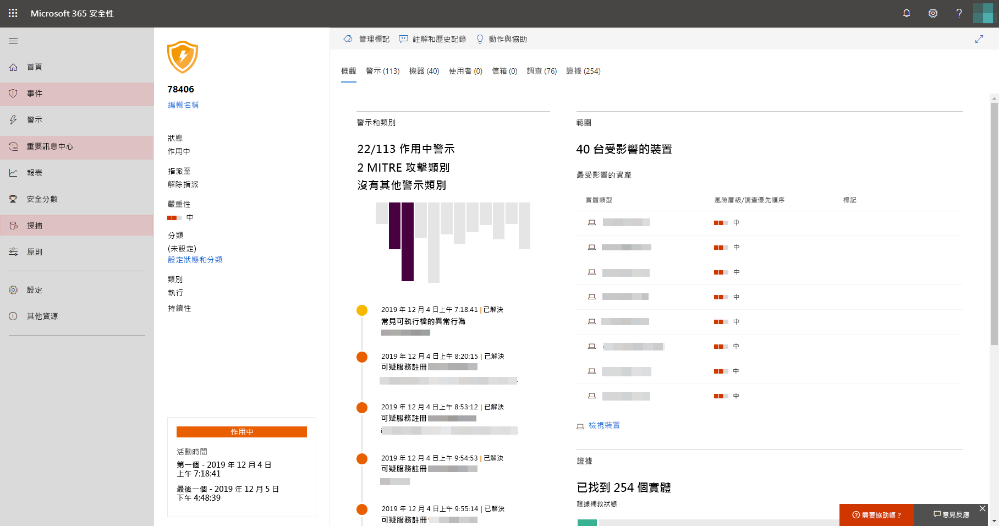

# 開啟 Microsoft 威脅防護Turn on Microsoft Threat Protection

**適用於：****Applies to:**
- Microsoft 威脅防護Microsoft Threat Protection

Microsoft 威脅防護整合了您的事件回應流程，方法是整合跨 Microsoft Defender 進階威脅防護 (ATP)、Office 365 ATP、Microsoft Cloud App Security 和 Azure ATP 的重要功能。Microsoft Threat Protection unifies your incident response process by integrating key capabilities across Microsoft Defender Advanced Threat Protection (ATP), Office 365 ATP, Microsoft Cloud App Security, and Azure ATP. 此整合體驗會新增您可以在 Microsoft 365 安全性中心存取的強大功能。This unified experience adds powerful features you can access in the Microsoft 365 security center.

若要取得最佳保護，並優化 Microsoft 威脅防護，我們建議您在網路上部署所有適用的受支援服務。To get the best protection and optimize Microsoft Threat Protection, we recommend deploying all applicable supported services on your network. 如需詳細資訊，請[參閱部署支援的服務](deploy-supported-services.md)。For more information, [read about deploying supported services](deploy-supported-services.md).

## 檢查授權資格和必要許可權Check license eligibility and required permissions
Microsoft 365 E5，E5 Security，or A5 授權或有效的授權組合，可提供支援服務的存取權，並可讓您在 Microsoft 365 安全性中心使用 Microsoft 威脅防護。A Microsoft 365 E5, E5 Security, or A5 license or a valid combination of licenses provides access to supported services and entitles you to use Microsoft Threat Protection in Microsoft 365 security center.

如需詳細的授權資訊，請[閱讀授權要求](prerequisites.md#licensing-requirements)。For detailed licensing information, [read the licensing requirements](prerequisites.md#licensing-requirements).

### 檢查您的角色Check your role
您必須是**全域系統管理員**或 Azure Active Directory 中的**安全性系統管理員**，才可開啟 Microsoft 威脅防護。You must be a **global administrator** or a **security administrator** in Azure Active Directory to turn on Microsoft Threat Protection. [在 Azure AD 中查看您的角色View your roles in Azure AD](https://docs.microsoft.com//azure/active-directory/users-groups-roles/directory-manage-roles-portal)

## 開始使用服務Start using the service
Microsoft 威脅防護會匯總各種整合服務中的資料。Microsoft Threat Protection aggregates data from the various integrated services. 它會集中處理及儲存資料，以識別新的洞察力，並可讓集中式回應工作流程成為可能。It will process and store data centrally to identify new insights and make centralized response workflows possible.

在您開啟服務之前，當您從功能窗格中選取 [**事件**]、[**動作中心**] 或 [**搜尋**] 時，microsoft 365 安全中心（[security.microsoft.com](https://security.microsoft.com)）會顯示 microsoft 威脅防護歡迎頁面。Before you turn on the service, the Microsoft 365 security center ([security.microsoft.com](https://security.microsoft.com)) shows the Microsoft Threat Protection welcome page when you select **Incidents**, **Action center**, or **Hunting** from the navigation pane. 如果您不具備使用 Microsoft 威脅防護的資格，就不會顯示這些流覽選項。These navigation options are not shown if you are not eligible to use Microsoft Threat Protection.

*365 security center 中*microsoft 威脅防護歡迎頁面上的 microsoft 威脅防護功能，顯示 microsoft 威脅防護歡迎頁面的圖像
*Microsoft Threat Protection welcome page in Microsoft 365 security center*

若要開啟 Microsoft 威脅防護，只需從歡迎頁面完成此程式。To turn on Microsoft Threat Protection, simply complete the process from the welcome page. 您也可以在功能窗格中存取**設定**（[security.microsoft.com/settings](https://security.microsoft.com/settings)），並選取 [ **microsoft 威脅防護**]，以開啟 microsoft 威脅防護。You can also turn on Microsoft Threat Protection by accessing **Settings** ([security.microsoft.com/settings](https://security.microsoft.com/settings)) in the navigation pane and selecting **Microsoft Threat Protection**.

>[!NOTE]
>如果您在功能窗格中看不到**設定**或無法存取頁面，請檢查您的許可權和授權。If you don't see **Settings** in the navigation pane or couldn't access the page, check your permissions and licenses.

### 選取資料中心位置Select data center location
如果已為您的組織佈建 Microsoft Defender ATP，則資料將會儲存在為[您的 Microsoft Defender ATP 資料](https://docs.microsoft.com/windows/security/threat-protection/microsoft-defender-atp/data-storage-privacy)選取的相同資料中心位置中。If Microsoft Defender ATP has been provisioned for your organization, data will be stored and processed in the same data center location you have selected for [your Microsoft Defender ATP data](https://docs.microsoft.com/windows/security/threat-protection/microsoft-defender-atp/data-storage-privacy). 如果您沒有 Microsoft Defender ATP，系統會要求您選擇專用於 Microsoft 威脅防護的新資料中心位置。If you don't have Microsoft Defender ATP, you will be asked to choose a new data center location specifically for Microsoft Threat Protection. 

您必須先提供同意，才可在服務和匯總間共用資料。You need to provide consent before data is shared between services and aggregated.

### 確認服務已開啟Confirm that the service is on
服務一旦佈建，它會新增：Once the service is provisioned, it adds:

- [事件管理Incidents management](incidents-overview.md)
- 用於管理[自動化調查和回應](mtp-autoir.md)的重要訊息中心An action center for managing [automated investigation and response](mtp-autoir.md)
- [高級搜尋](advanced-hunting-overview.md)功能[Advanced hunting](advanced-hunting-overview.md) capabilities

*microsoft 365 security center with 事件管理和其他 Microsoft 威脅防護功能*
*Microsoft 365 security center with incidents management and other Microsoft Threat Protection capabilities*

### 取得 Azure ATP 資料Getting Azure ATP data
若要使用 Microsoft 威脅防護共用 Azure ATP 資料，請確認已開啟 Microsoft Cloud App Security 和 Azure ATP 整合。To share Azure ATP data with Microsoft Threat Protection, ensure that Microsoft Cloud App Security and Azure ATP integration is turned on. [深入了解此整合Learn more about this integration](https://docs.microsoft.com/cloud-app-security/aatp-integration)

## 關閉 Microsoft 威脅防護Turn off Microsoft Threat Protection
若要停止使用 Microsoft 威脅防護，請移至 Microsoft 365 安全性中心的 [設定]\*\*\*\*  >  [Microsoft 威脅防護]\*\*\*\*  >  [選擇加入/選擇退出]\*\*\*\*。To stop using Microsoft Threat Protection, go to **Settings** > **Microsoft Threat Protection** > **Opt-in / Opt-out** in the Microsoft 365 security center. 取消選取 [開啟 Microsoft 威脅防護]\*\*\*\* 並儲存變更。Unselect **Turn on Microsoft Threat Protection** and save the changes.

對應的功能將會從 Microsoft 365 的安全性中心移除。Corresponding features will be removed from the Microsoft 365 security center.

## 取得協助Get assistance

Microsoft 支援人員可協助您布建或取消設定租使用者上的服務和相關資源。Microsoft support staff can help provision or deprovision the service and related resources on your tenant. 如需協助，請選取 [Microsoft 365 security center] 中的 [**需要協助？** ]。For assistance, select **Need help?** in the Microsoft 365 security center. 當您聯繫支援時，請提及 Microsoft 威脅防護。When contacting support, mention Microsoft Threat Protection.

## 相關主題Related topics

- [Microsoft 威脅防護更新概觀Microsoft Threat Protection overview](microsoft-threat-protection.md)
- [授權需求和其他必要條件Licensing requirements and other prerequisites](prerequisites.md)
- [部署支援服務Deploy supported services](deploy-supported-services.md)
- [Microsoft Defender ATP 概觀Microsoft Defender ATP overview](https://docs.microsoft.com/windows/security/threat-protection/microsoft-defender-atp/microsoft-defender-advanced-threat-protection)
- [Office 365 ATP 概觀Office 365 ATP overview](../office-365-security/office-365-atp.md)
- [Microsoft Cloud App Security 概觀Microsoft Cloud App Security overview](https://docs.microsoft.com/cloud-app-security/what-is-cloud-app-security)
- [Azure ATP 概觀Azure ATP overview](https://docs.microsoft.com/azure-advanced-threat-protection/what-is-atp)
- [Microsoft Defender ATP 資料儲存Microsoft Defender ATP data storage](https://docs.microsoft.com/windows/security/threat-protection/microsoft-defender-atp/data-storage-privacy)
