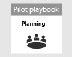

# 關閉及摘要您的 Microsoft 365 Defender 試驗Closing and summarizing your Microsoft 365 Defender pilot  

[!INCLUDE [Microsoft 365 Defender rebranding](../includes/microsoft-defender.md)]

適用於：**Applies to:**
- Microsoft 365 DefenderMicrosoft 365 Defender

| [規劃Planning](mtp-pilot-plan.md) | [製備Preparation](prepare-mtpeval.md) |  [類比攻擊Simulate attack](mtp-pilot-simulate.md) |  結束和摘要Close and summarize|
|--|--|--|--|
|| | |*您在這裡！**You are here!*|

您目前正在結束和摘要階段。You're currently in the closing and summarizing phase.

您已執行的是僅限記憶體的高級攻擊模擬，可在網域控制站上遠端執行程式碼。You’ve just ran an advanced memory-only attack simulation that executed code remotely on a domain controller. 您已瞭解 Microsoft Defender for Endpoint 和 Microsoft Defender for Identity 偵測，以及如何在 stealthy 惡意活動上建立警示。You’ve seen how Microsoft Defender for Endpoint and Microsoft Defender for Identity detect and create alerts on stealthy malicious activity. 您也瞭解如何將不同來源的警示，與其他上下文資訊一起傳遞至 Microsoft 365 安全性中心入口網站中的單一事件。You’ve also seen how alerts from different sources are delivered along with other contextual information into a single incident in the Microsoft 365 Security Center portal. 遇到這類整合，可讓 SOC 分析員調查並採取必要的動作。Experiencing such integration enables SOC analysts to investigate and take necessary action. 您也已經建立高級搜尋查詢，識別輸入電子郵件，使用者已開啟或儲存附件，並根據該查詢建立偵測。You’ve also created an advanced hunting query that will identify inbound emails where the user opened or saved the attachment and created detection based on that query.

所有測試結束之後，您已到達程式的結束。You’ve reached the end of the process after all tests have concluded.

最後一個輸出應該是：The final output should be:

- 完成計分卡A completed scorecard
- 試驗結果的詳細報告A detailed report of the findings of the pilot
- 如何繼續進行決策A decision on how to move forward

從您的最後一個輸出中，向內部的專案關係人呈現報表，以供您在 [準備](./prepare-mtpeval.md) 階段) 和 Microsoft 連絡人中識別 (。Present the reports from your final output to internal stakeholders (which you’ve identified during the [preparation](./prepare-mtpeval.md) phase) and Microsoft contacts. 這類工作可確保任何意見反應都可以用來改善產品及檔。Such an effort ensures that any feedback can be used to improve products and documentation.

我們希望您可以享受這種模擬。We hope you enjoyed this simulation. 開始執行您在組織中較大規模所學的專案，以充分利用整合安全性解決方案。Start implementing what you've learned on a larger scale in your organization to get the most out of the integrated security solution.

## 後續步驟Next step
透過下列互動式指南深入瞭解 Microsoft 365 Defender 支柱：Learn more about the Microsoft 365 Defender pillars through the following interactive guides:
- [使用 Microsoft Defender for Office 365 保護您的組織Safeguard your organization with Microsoft Defender for Office 365](https://aka.ms/O365ATP-Interactive-Guide)
- [使用適用於身分識別的 Microsoft Defender 偵測可疑活動和潛在攻擊Detect suspicious activities and potential attacks with Microsoft Defender for Identity](https://aka.ms/AATP-Interactive-Guide)
- [使用 Microsoft Cloud App Security 偵測威脅及管理提醒Detect threats and manage alerts with Microsoft Cloud App Security](https://aka.ms/DetectThreatsAndAlertsMCAS-InteractiveGuide)
- [使用 Microsoft Defender for Endpoint 調查和修正威脅Investigate and remediate threats with Microsoft Defender for Endpoint](https://aka.ms/MDATP-IR-Interactive-Guide)